.. index:: Additional Settings

Additional Settings
===================

Rsyslog Forwarding
^^^^^^^^^^^^^^^^^^

Rsyslog forwarding can be configured in ``Settings`` > ``System`` >
``Rsyslog``. To add a forwarding configuration for local log
sources, click ``Add Rsyslog Forwarding``.

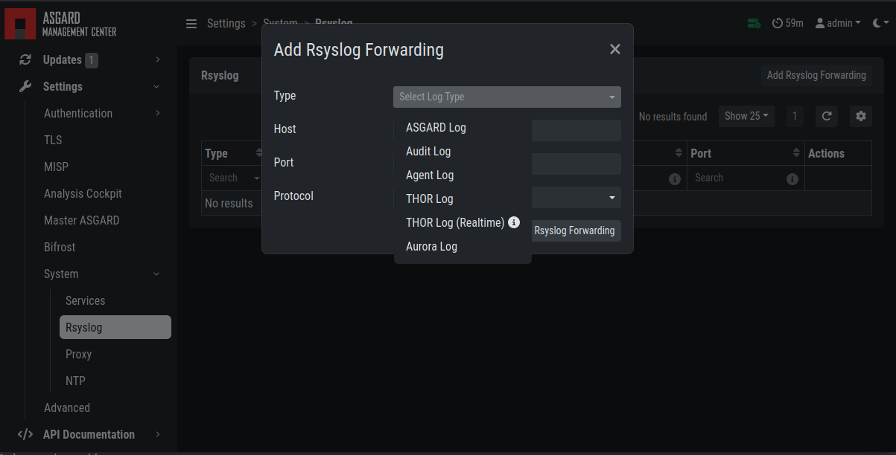

The following log sources can be forwarded individually:

.. list-table:: Available Log Sources 
   :header-rows: 1
   :widths: 25, 75

   * - Log
     - Description
   * - ASGARD Log
     - Everything related to the ASGARD service, processes, task and scan jobs
   * - ASGARD Audit Log
     - Detailed audit log of all user activity within the system
   * - Agent Log
     - All ASGARD agent activities
   * - THOR Log
     - THOR scan results
   * - Thor Log (Realtime)
     - The THOR (Realtime) logs are the same logs as THOR logs,
       except that they are collected via udp syslog instead of
       https. To forward THOR logs in realtime, you have to
       configure your scans to forward syslog to ASGARD, see
       :ref:`administration/syslog:syslog forwarding`). Make
       sure the necessary firewall rules are in place to allow
       the asset to communicate with the ASGARD.
   * - Aurora Log
     - Aurora Logs

TLS Certificate Installation
^^^^^^^^^^^^^^^^^^^^^^^^^^^^

Instead of using the pre-installed self-signed TLS Certificate,
users can upload their own TLS Certificate for ASGARD. 

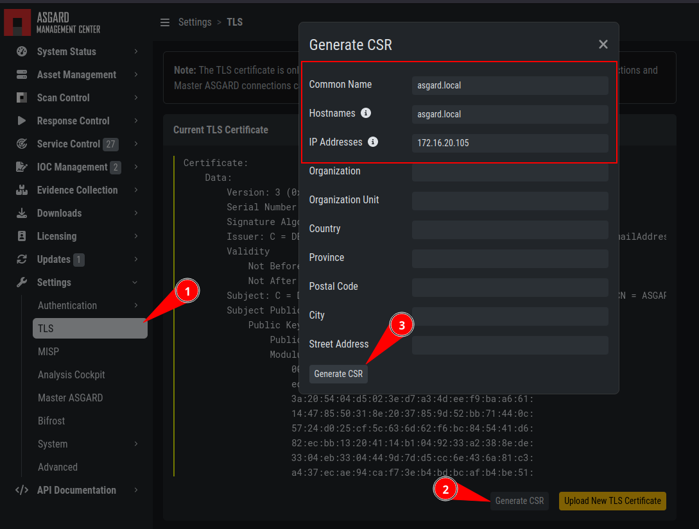

   Generate a Certificate Signing Request (CSR)

In order to achieve the best possible compatibility with the
most common browsers, we recommend using the system's FQDN
in both fields ``Common Name`` AND ``Hostnames``.

Please note that generating a CSR on the command line is not supported.   

The generated CSR can be used to generate a TLS Certificate.
Subsequently, this TLS Certificate can be uploaded in the ``Settings`` > ``TLS`` section.

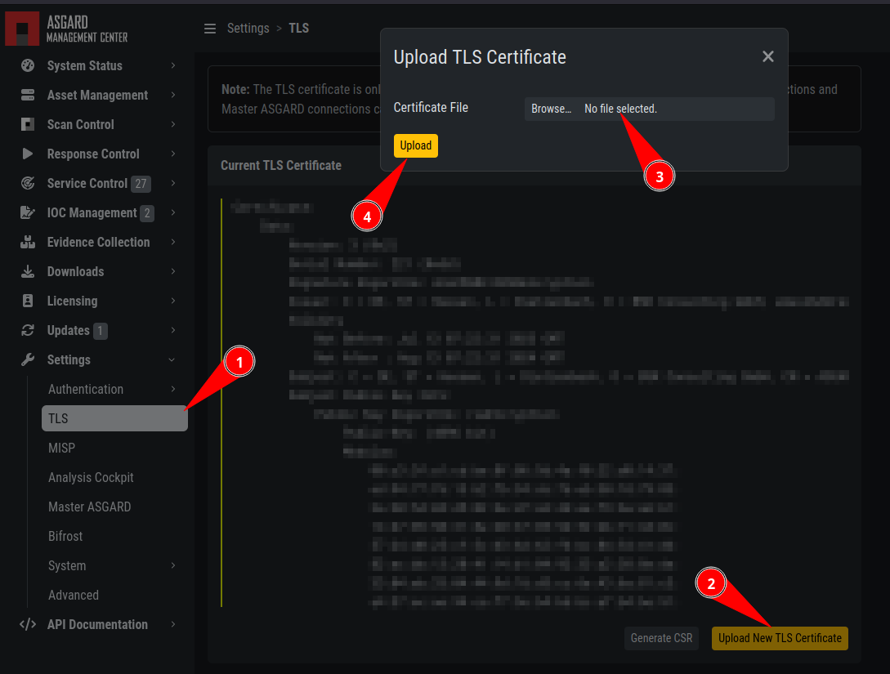

   Upload a TLS Certificate

.. note:: 
   Please see :ref:`appendix/tls:install tls certificates on asgard and master asgard`
   for a guide on how to sign the CSR and install it in your ASGARD.

Manage Services
^^^^^^^^^^^^^^^

The individual ASGARD services can be managed in ``Settings`` >
``System`` > ``Services``. The services can be stopped or restarted
with the respective buttons in the ``Actions`` column. 

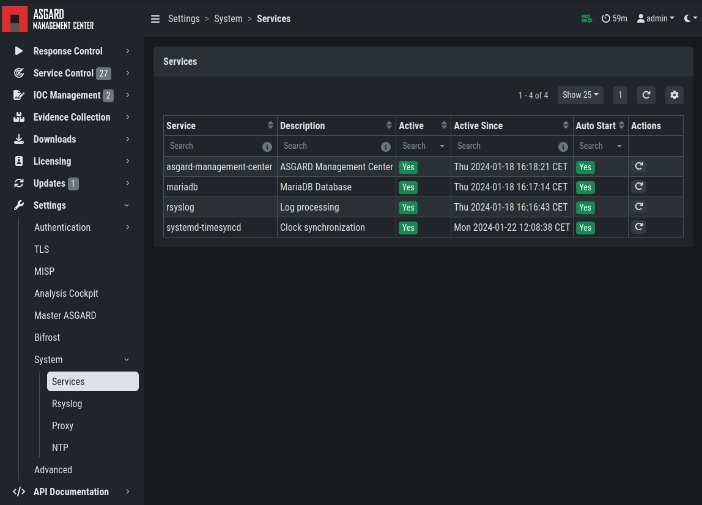

   Manage Services

NTP Configuration
^^^^^^^^^^^^^^^^^

The current NTP configuration can be found ``Settings`` >
``System`` > ``NTP``.

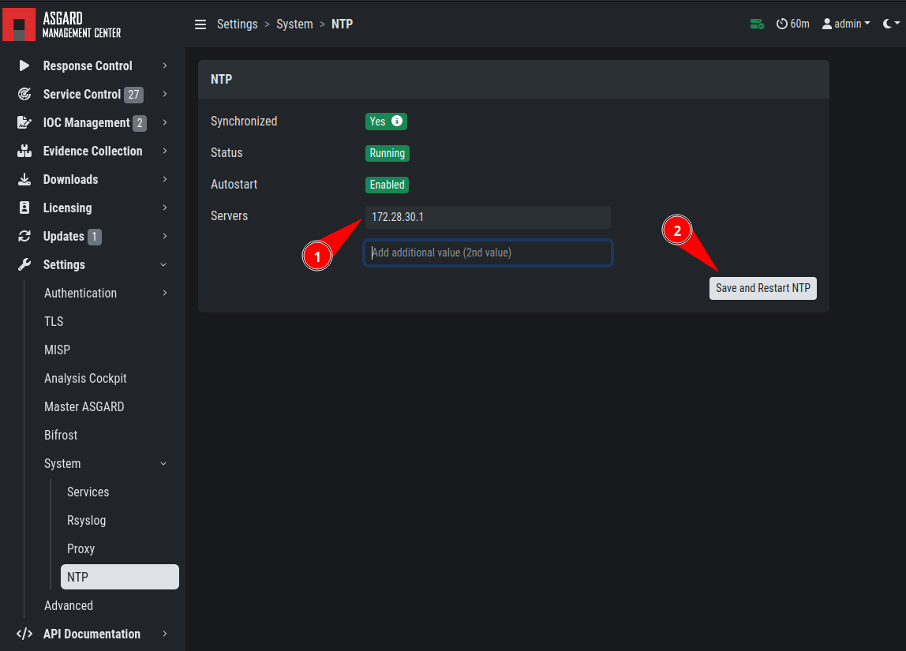

   NTP configuration

You can add or delete NTP servers by adding/changing the values
in the text fields. After you are done with your changes, click
``Save and Restart NTP`` to save your changes.

Settings for Bifrost
^^^^^^^^^^^^^^^^^^^^

Bifrost allows you to automatically upload suspicious files to your
ASGARD during a THOR scan. If an Analysis Cockpit is connected,
these files get automatically forwarded to the Analysis Cockpit
in order to drop them into a connected Sandbox system. However,
the collected files will stay on ASGARD for the amount of time
specified in ``Retention time`` (0 days represent an indefinite amount of time). 

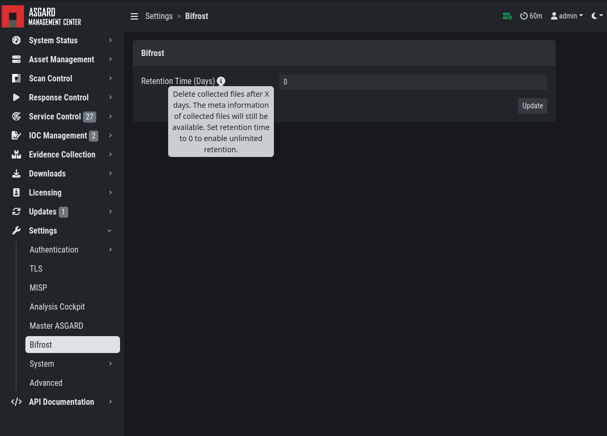

   Settings for Bifrost

The collected files can be downloaded in the ``Evidence Collection``
section. All files are zip archived and password protected with the password ``infected``.

In order to automatically collect suspicious files, you have to
create a scan with Bifrost enabled. Check the ``Send Suspicious Files to ASGARD``
option to send samples to the system set as ``bifrost2Server``. Use the placeholder 
``%asgard-host%`` to use the hostname of you ASGARD instance as the Bifrost server.

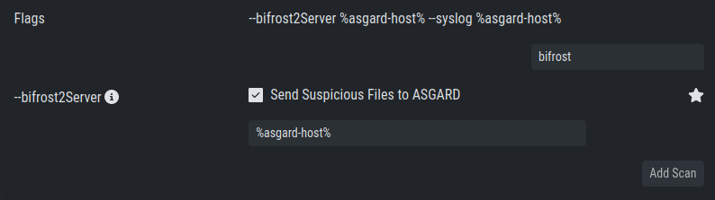

   Scan option for Bifrost 

This will collect all files with a score of 60 or higher and make
them available for download in ASGARDs ``Collected Files`` section.

For Details on how to automatically forward to a sandbox system please
refer to the `Analysis Cockpit Manual <https://analysis-cockpit-manual.nextron-systems.com/en/latest>`_ .

Link Analysis Cockpit
^^^^^^^^^^^^^^^^^^^^^

In order to connect to an Analysis Cockpit, enter the
respective hostname of the Analysis Cockpit (use the same
FQDN used during installation of the Analysis Cockpit) in
the field ``FQDN``, enter the one-time code, choose the
type and click ``Update Analysis Cockpit``. 

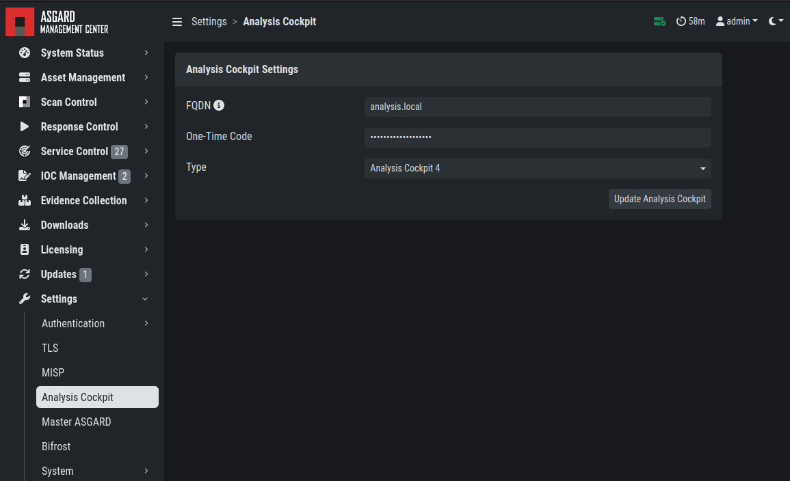

   Linking the Analysis Cockpit 

The Cockpit's API key can be found at ``Settings`` >
``Link Products`` > ``Management Center``.

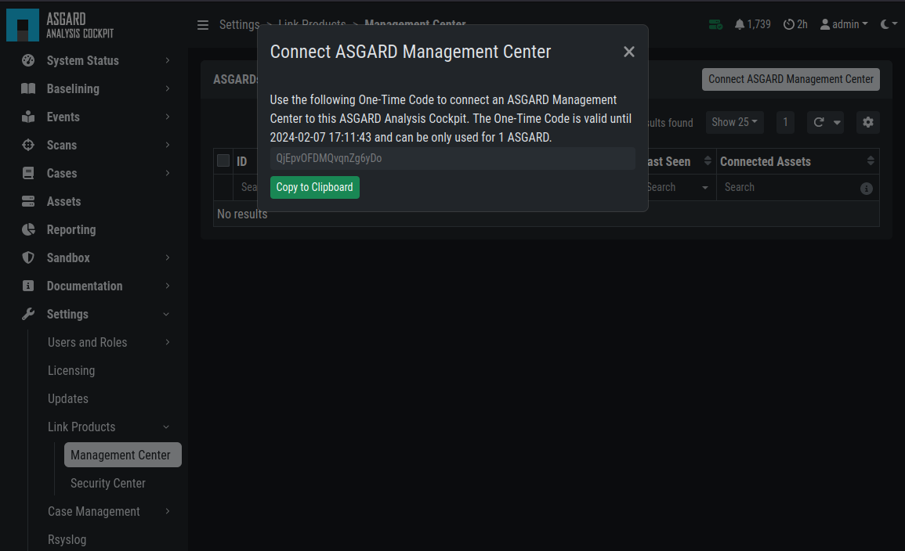

   Analysis Cockpit API Key

ASGARD must be able to connect to the Analysis Cockpit
on port 443/TCP for a successful integration. Once connected,
the Cockpit will show up in ASGARDs ``System Status`` > ``Overview``
section together with the other connectivity tests. 

Please wait up to five minutes for the status to
change on ASGARD's system status page. It will change from ``Not linked`` to ``Online``.

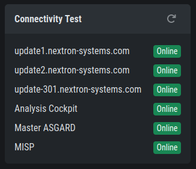

   Connectivity Test

Link MASTER ASGARD
^^^^^^^^^^^^^^^^^^

In order to control your ASGARD with a MASTER ASGARD,
you must generate a One-Time Code and use it in the "Add ASGARD"
dialogue within the MASTER ASGARD frontend. 

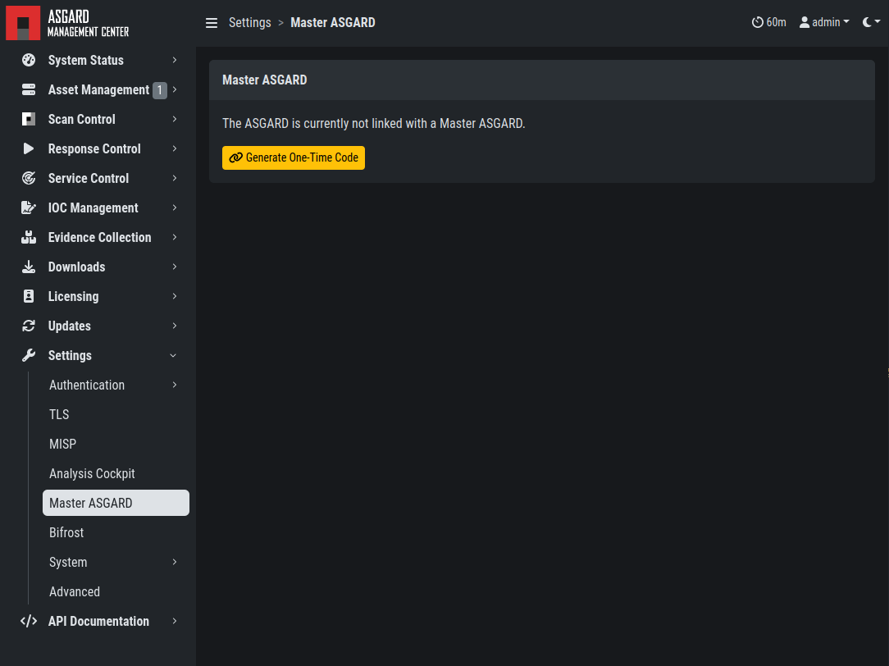

   Link MASTER ASGARD

Please see :ref:`masterasgard/masterasgard:link asgard systems with master asgard`
for more information.

Link MISP
^^^^^^^^^

In order to connect to a MISP with your ASGARD Management Center,
navigate to ``Settings`` > ``MISP``. Insert the MISP's address,
along with the API Key and click ``Test and Link MISP``.

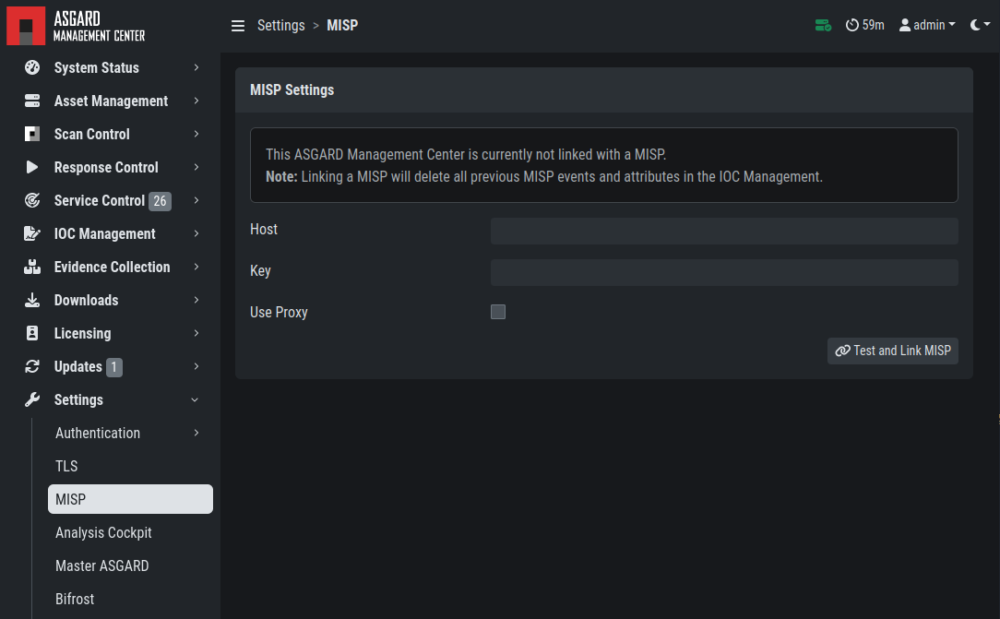

   Linking a MISP to ASGARD

The MISP connectivity status is shown in the ``Overview`` section.
Please allow five minutes for the connection status to indicate the
correct status, and also MISP rules to be downloaded and shown in
``IOC Management`` > ``MISP`` > ``MISP Events``.

   MISP connectivity status

Change Proxy Settings
^^^^^^^^^^^^^^^^^^^^^

.. todo:: verify proxy paths

In this dialogue, you can add or modify ASGARDs proxy
configuration. Please note, you need to restart the ASGARD
service (Tab ``Services``) afterwards. 

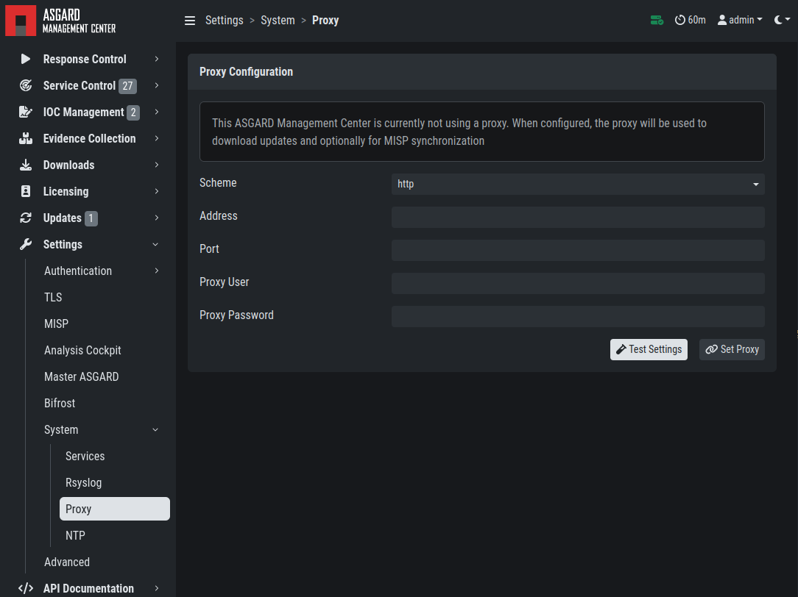

   Change Proxy Settings

.. warning::
   This will also overwrite any changes made to the file
   ``/etc/apt/apt.conf.d/proxy`` on your system. If you
   changed the file before installation of your ASGARD
   services, you can safely go ahead and change your
   proxy settings.
