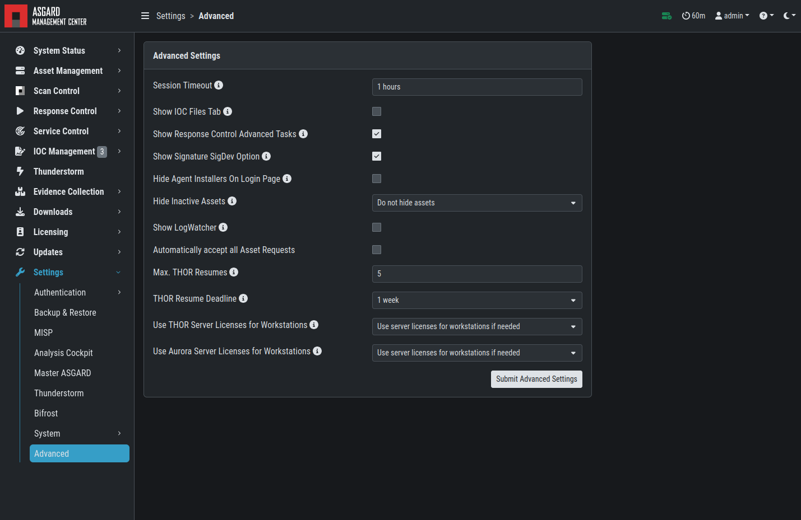
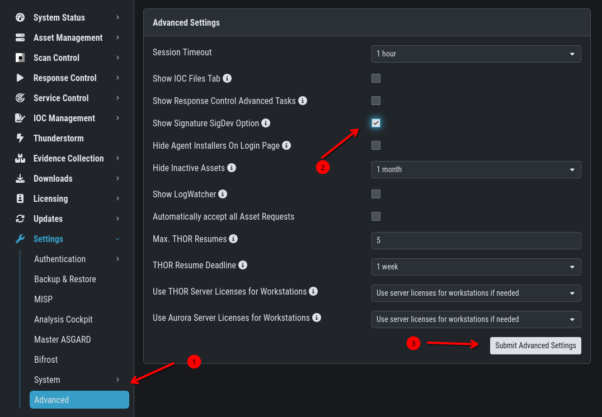
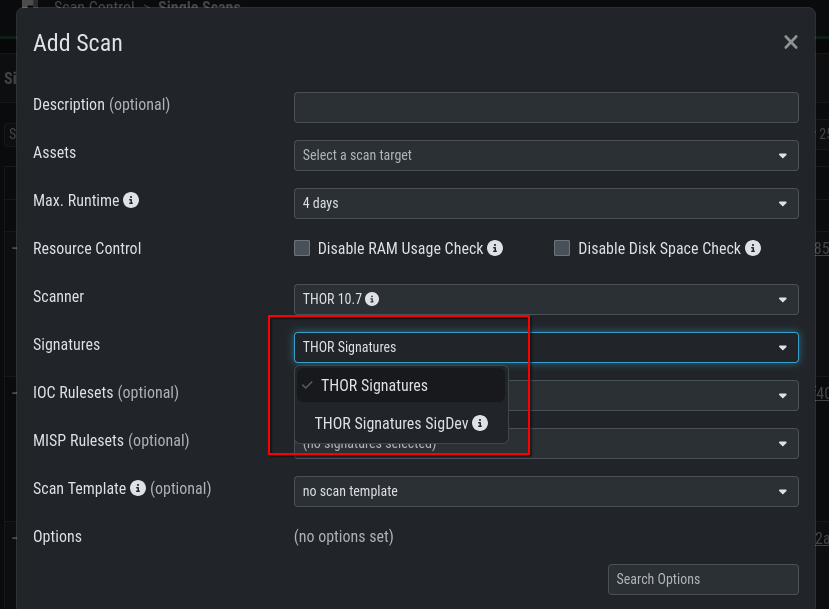

.. index:: Advanced Settings

Advanced Settings
=================

The Advanced tab lets you specify additional global settings.
The session timeout for web-based UI can be configured. Default
is one hour. If ``Show Advanced Tasks`` is set, ASGARD will
show system maintenance jobs (e.g. update ASGARD Agent on endpoints)
within the response control section. 

Inactive assets can be hidden in the Asset Management Section
by setting a suitable threshold for ``Hide inactive Assets``. 

   Advanced Settings

SigDev Signatures
-----------------

We offer a "preview" of our newest signatures, which contains our newest
rules. Those signatures have been processed by our automated pipeline and
passed the quality check - however our manual testing of those new rules
did not take place yet.

We have those signatures to offer the newest rules to our customers in time
critical engagements. You have to carefully consider if the potential higher
rate of false positive warrants the usage of those rules. We generally recommend
to only use those rules if the currently available signatures are a few days old.

To enable the ``SigDev`` / ``Preview`` Signatures, simply activate the checkbox
``Show Signature SigDev Option`` and submit your changes.

   Sigdev / Preview Signatures

Once you enabled the signatures, you can select them when creating a new (Group) Scan:

   Sigdev / Preview Signatures Scanning