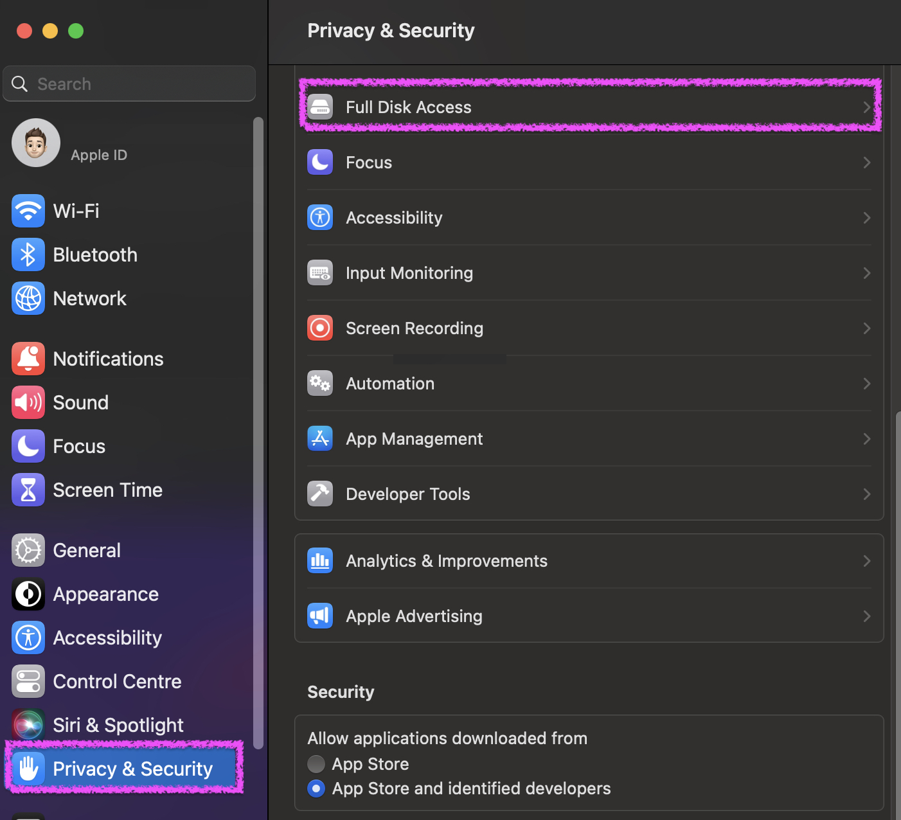

.. index:: ASGARD Agent Deployment

ASGARD Agent Deployment
-----------------------

In order to register a new endpoint to the ASGARD Management Center,
download and install the ASGARD Agent on the system you want to register. 

The ASGARD Agent can be directly downloaded from the Management Center
login screen through the button ``Download Agent Installers``. A list
of available agents for various operating systems appears. 

.. hint::
   You can disable the downloading of agents on the login screen. Please
   see :ref:`administration/advanced:advanced settings`.

   Download Agent Installers from Login Screen

   Agents Overview

After the installation, the endpoints will connect to your Management
Center, register automatically and appear in the Asset Management Section
in the tab ``Asset Requests``. Please allow two or three minutes for systems to show
up. The agents use the FQDN to connect to your Management Center, so ensure that
your endpoints can resolve and reach the Management Center via FQDN.

.. note::
   Full administrative privileges are required for the ASGARD agent
   and THOR to operate properly.

In the requests tab, select the agents you want to allow on your Management
Center to manage and click ``Accept Asset Requests``. After that, the
endpoint shows up in the assets overview and is now ready to be managed and scanned.

.. figure:: ../images/mc_accept-asset-request.png
   :alt: Accepting ASGARD Agent Requests

   Accepting ASGARD Agent Requests

A registered agent will poll the Management Center at a given
interval between 10 seconds and 10 Minutes – depending on the number of
connected endpoints (see :ref:`advanced/performance:performance tuning` for
details). If your Management Center has scheduled a task for the endpoint (for example:
run THOR scan) it will be executed directly after the poll.

Windows Agent Deployment
^^^^^^^^^^^^^^^^^^^^^^^^

Since the Agent Installer for Windows is a normal ``.exe`` file and not a
``.msi`` file, you need to write your own scripts to deploy the agent via
your management system of choice. We have written an example script in 
PowerShell, which should work for most of the tools. Please see the section
:ref:`appendix/scripts:installing asgard agent via powershell script` and
:ref:`appendix/scripts:deploy asgard agents via sccm`.

Alternatively, if you want to deploy the ASGARD Agent manually, you can
just execute the installer by hand.

Linux Agent Deployment
^^^^^^^^^^^^^^^^^^^^^^

To deploy the ASGARD Agent on a linux system, you can use the following
commands:

.. code-block:: console
   :caption: Debian based systems

   user@unix:~/Downloads$ sudo dpkg -i asgard2-agent-linux-amd64.deb

.. code-block:: console
   :caption: RHEL, CentOS and Fedora

   user@unix:~/Downloads$ sudo rpm -i asgard2-agent-linux-amd64.rpm

You will be able to deploy your agents via most of the common linux tools,
just make sure that the installer is being installed with administrative
privileges.

macOS Agent Deployment
^^^^^^^^^^^^^^^^^^^^^^

Starting with macOS Big Sur (v11.0), Apple requires software developers
to notarize applications.

Due to the nature of the ``asgard2-agent`` installer, which is generated
during installation time on your Management Center, and making it unique
for each Management Center installation, it iss currently not possible
to notarize the installer.

This document aims to describe possible workarounds, intended to be a
reference for IT administrators or IT packaging teams to bypass Apple
verifications and install the personalized ``asgard2-agents`` on macOS
Big Sur (or newer) workstations.

.. warning::
   Executing any of the workarounds described in this document puts your
   system at risk for a short period of time. This document will deactivate
   global security mechanisms of the operating system, which are intended to
   protect the integrity of the system. Please make sure to follow the below
   steps carefully and enable those security mechanisms after you are done.

Please always keep in mind to check your system after performing any of
the described actions, to ensure that all security mechanisms are in
place and are re-activated after performing the described actions.

Please follow the below steps to install the ASGARD Agent on macOS.

1. Open a new terminal session

2. Deactivate macOS Gatekeeper

   * ``sudo spctl --master-disable``

3. Close the terminal and open a new terminal session

4. Install the asgard2-agent

   * ``sudo installer -pkg /path/to/asgard2-agent-macos-amd64.pkg -target /``

5. Close the terminal and open a new terminal session

6. Reactivate macOS Gatekeeper

   * ``sudo spctl --master-enable``

.. warning:: 
   Make sure to activate the macOS Gatekeeper once you are done:

   ``sudo spctl --master-enable``

You can verify the state of the macOS Gatekeeper with:

.. code-block:: console

   MacBook-Pro:~ nextron$ spctl --status
   assessments enabled

On a system with activated Gatekeeper, the output has to be ``assessments enabled``.

macOS Full Disk Access
~~~~~~~~~~~~~~~~~~~~~~

Since macOS Ventura (v13.0) the ASGARD Agent needs full disk access
to function properly. After you have deployed the ASGARD Agent, you need
to grant the service the required access permissions. Please keep in mind
that administrative privileges on the machine are needed to perform this
change.

To do this, navigate on your Mac to ``System Settings`` > ``Privacy &
Security`` > ``Full Disk Access``:

You need to enable the ``asgard2-agent-service`` slider:

.. figure:: ../images/macos_full_disk_access.png
   :scale: 40
   :alt: macOS 13 Full Disk Access

.. note:: 
   There is no workaround to this step, since it is an integral
   part of the security design of Apple devices. If you are having trouble
   with THOR scans via ASGARD on macOS, please check if the ``Full Disk
   Access`` permission for the ASGARD agent was granted. Since macOS Mojave
   (v10.14), you need to grant the same permissions to removable volumes,
   if you plan on scanning those.