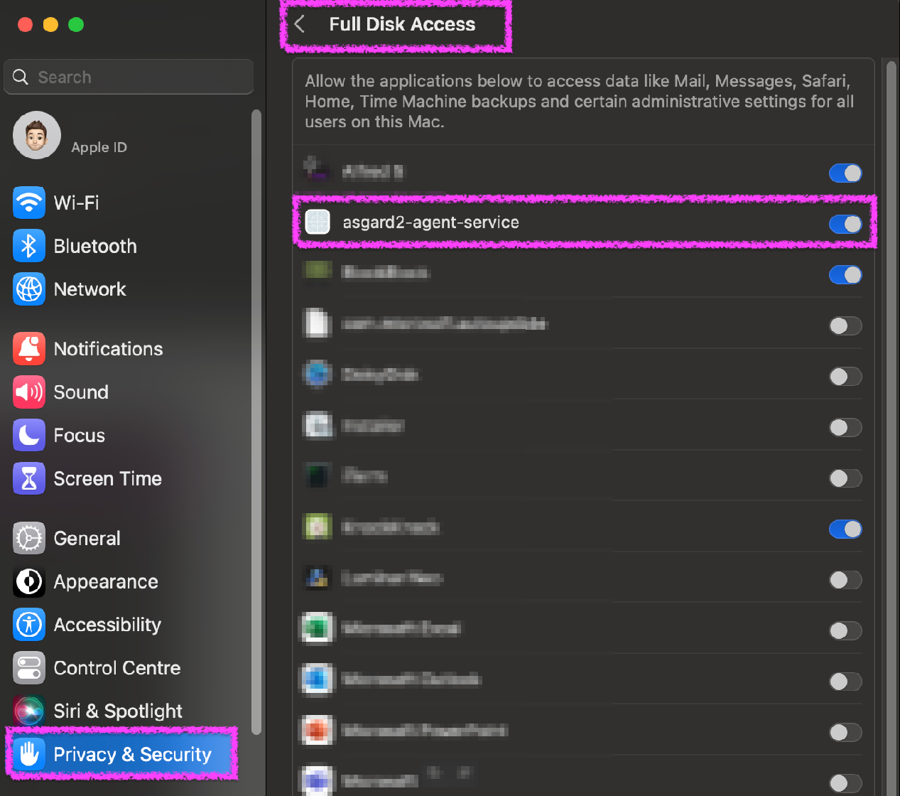

.. index:: ASGARD Agent Deployment

ASGARD Agent Deployment
-----------------------

There are currently two modes of operation for the ASGARD Agent:

- **Normal** - This is the default mode and allows usage of all ASGARD features.
- **Essential** - This is a lightweight mode which only allows THOR scanning
  and Aurora deployment.

Please note that the Agent in Essential Mode is a separate installer and
needs to be created in the :ref:`advanced/custom-agent:creating custom agent installers`.

In order to connect a new endpoint to the ASGARD Management Center,
download and install the ASGARD Agent on the system you want to onboard.

The ASGARD Agent can be directly downloaded from the Management Center
login screen through the button ``Download Agent Installers``. A list
of available agents for various operating systems appears. 

.. hint::
   You can disable the downloading of agents on the login screen. Please
   see :ref:`administration/advanced:advanced settings`.

.. figure:: ../images/mc_login-screen.png
   :alt: Download Agent Installers from Login Screen

   Download Agent Installers from Login Screen

.. figure:: ../images/mc_agents-overview.png
   :alt: Agents Overview

   Agents Overview

After the installation, the endpoints will connect to your Management
Center, register automatically and appear in the Asset Management Section
in the tab ``Asset Requests``. Please allow two or three minutes for systems to show
up. The agents use the FQDN to connect to your Management Center, so ensure that
your endpoints can resolve and reach the Management Center via FQDN.

.. note::
   Full administrative privileges are required for the ASGARD agent
   and THOR to operate properly.

In the requests tab, select the agents you want to allow on your Management
Center to manage and click ``Accept Asset Requests``. After that, the
endpoint shows up in the assets overview and is now ready to be managed and scanned.

   Accepting ASGARD Agent Requests

Windows Agent Deployment
^^^^^^^^^^^^^^^^^^^^^^^^

Since the Agent Installer for Windows is a normal ``.exe`` file and not a
``.msi`` file, you need to write your own scripts to deploy the agent via
your management system of choice. We have written an example script in 
PowerShell, which should work for most of the tools. Please see the section
:ref:`appendix/scripts:installing asgard agent via powershell script` and
:ref:`appendix/scripts:deploy asgard agents via sccm`.

Alternatively, if you want to deploy the ASGARD Agent manually, you can
just execute the installer by hand.

Linux Agent Deployment
^^^^^^^^^^^^^^^^^^^^^^

To deploy the ASGARD Agent on a linux system, you can use the following
commands:

.. code-block:: console
   :caption: Debian based systems

   user@unix:~/Downloads$ sudo dpkg -i asgard2-agent-linux-amd64.deb

.. code-block:: console
   :caption: RHEL, CentOS and Fedora

   user@unix:~/Downloads$ sudo rpm -i asgard2-agent-linux-amd64.rpm

You will be able to deploy your agents via most of the common linux tools,
just make sure that the installer is being installed with administrative
privileges.

macOS Agent Deployment
^^^^^^^^^^^^^^^^^^^^^^

To install the agent on macOS, you can just run the PKG file or execute the following command in terminal:

.. code-block:: console
   
     MacBook-Pro:~ nextron$ sudo installer -pkg /Users/nextron/Downloads/asgard2-agent-macos-arm64.pkg -target /

Starting with macOS Big Sur (v11.0), Apple requires software developers
to notarize applications. Our ``asgard2-agent`` installer is notarized.

You can test it, by executing the following command in Terminal:

.. code-block:: console
   
   MacBook-Pro:~ nextron$  pkgutil --check-signature /Users/nextron/Downloads/asgard2-agent-macos-arm64.pkg
   Package "asgard2-agent-macos-arm64.pkg":
   Status: signed by a developer certificate issued by Apple for distribution
   Notarization: trusted by the Apple notary service
   Signed with a trusted timestamp on: XXXX-XX-XX XX:XX:XX +0000
   ...

If you are facing issues concerning the installation, please have a look in the chapter
:ref:`appendix/gatekeeper:Bypass Apple verification during installation of asgard2-agent`.

macOS Full Disk Access
~~~~~~~~~~~~~~~~~~~~~~

Since macOS Ventura (v13.0) the ASGARD Agent needs full disk access
to function properly. After you have deployed the ASGARD Agent, you need
to grant the service the required access permissions. Please keep in mind
that administrative privileges on the machine are needed to perform the
following tasks.

.. note:: 
   There is no workaround to these steps, since it is an integral
   part of the security design of Apple devices. If you are having trouble
   with THOR scans via ASGARD on macOS, please check if the ``Full Disk
   Access`` permission for the ASGARD agent was granted. Since macOS Mojave
   (v10.14), you need to grant the same permissions to removable volumes,
   if you plan on scanning those.

If you need to grant Full Disk Access via MDM, please have a look at the chapter
:ref:`appendix/mdm-fulldiskaccess:Full Disk Access for macOS asgard2-agent-service via MDM`.

Prior to macos 26
"""""""""""""""""

To do this, navigate on your Mac to ``System Settings`` > ``Privacy &
Security`` > ``Full Disk Access``:

.. figure:: ../images/macos_privacy_and_security.png
   :scale: 36
   :alt: macOS 13 Privacy & Security

You need to enable the ``asgard2-agent-service`` slider:

Starting with macOS 26
""""""""""""""""""""""
Starting with version 26, we noticed that macOS no longer displays the entry ``asgard2-agent-service`` in the Full Disk Access UI.

.. figure:: ../images/macos_missing_asgard2-agent_service.png
   :scale: 40
   :alt: Missing asgard2-agent.service

If you have updated from macOS 15 Sequoia you should check in ASGARD the THOR scan protocol for a warning about Full Disk Access or query your operating system's ``TCC.db`` database.

To query the database, open the Terminal App and perform the following SQL command:

.. code-block:: console
    :emphasize-lines: 2
   
     MacBook-Pro:~ nextron$ sudo sqlite3 /Library/Application\ Support/com.apple.TCC/TCC.db 'select * from access' | grep asgard
     kTCCServiceSystemPolicyAllFiles|/private/var/lib/asgard2-agent/asgard2-agent-service|1|2|4|1|??||0|UNUSED|0|176962327|||UNUSED|0
     MacBook-Pro:~ nextron$

This value section must match:

.. code-block:: console
   
   asgard2-agent-service|1|2|4|1|

If the values do NOT match at this point, or if you originally installed our agent on macOS 26, please proceed with the following instructions.

Temporarily adjust the permissions for the directory /private/var/lib/asgard2-agent via Terminal:

.. code-block:: console
   
   MacBook-Pro:~ nextron$ sudo chmod 777 -R /private/var/lib/asgard2-agent/
   MacBook-Pro:~ nextron$

Open the Full Disk Access UI (``System Settings`` > ``Privacy &
Security`` > ``Full Disk Access``) and click on the ``+ Symbol`` bottom left. Enter the admin credentials.

Open the search window by clicking on ``Command + SHIFT + G`` and enter the path to the service binary, ``/private/var/lib/asgard2-agent``.

.. figure:: ../images/macos_path_asgard2-agent_service.png
   :scale: 45
   :alt: Path to asgard2-agent-service

Choose the ``asgard2-agent-service`` and click ``Open``.

.. figure:: ../images/macos_choose_asgard2-agent_service.png
   :scale: 45
   :alt: Path to asgard2-agent-service

Check that the permissions have now been granted correctly by reopening the Terminal App and executing the following SQL command:

.. code-block:: console
   
     MacBook-Pro:~ nextron$ sudo sqlite3 /Library/Application\ Support/com.apple.TCC/TCC.db 'select * from access' | grep asgard
     kTCCServiceSystemPolicyAllFiles|/private/var/lib/asgard2-agent/asgard2-agent-service|1|2|4|1|??||0|UNUSED|0|176962327|||UNUSED|0
     MacBook-Pro:~ nextron$

Please note that the entry is still not displayed in the UI.

Finally adjust the permissions again:

.. code-block:: console
   
   MacBook-Pro:~ nextron$ sudo chmod 700 -R /private/var/lib/asgard2-agent/
   MacBook-Pro:~ nextron$