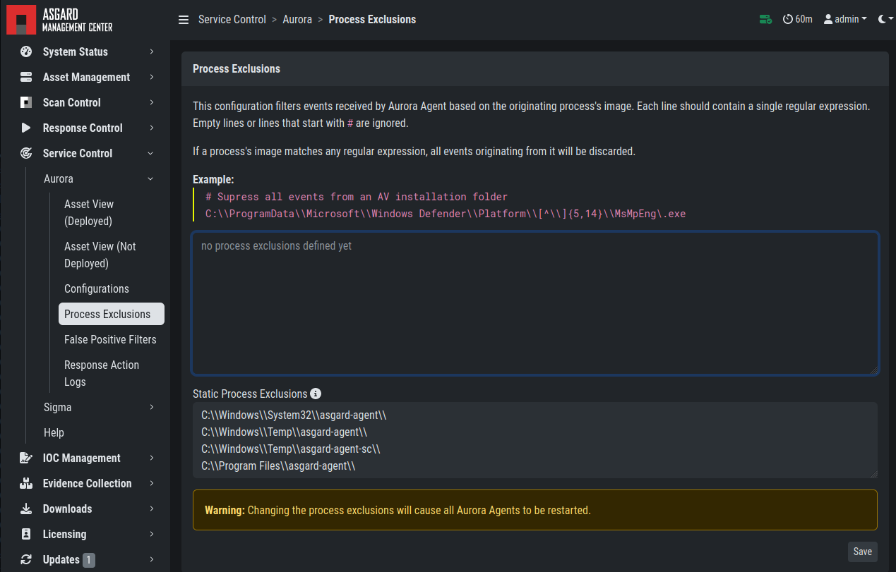

.. index:: Aurora

Aurora
======

- Aurora is a lightweight endpoint agent that applies Sigma rules and IOCs on local event streams.
- It uses Event Tracing for Windows (ETW) to subscribe to certain event channels.
- It extends the Sigma standard with so-called "response actions" that can get executed after a rule match
- It supports multiple output channels: the Windows Eventlog, a log file and remote UDP targets

Its documentation can be found `here <https://aurora-agent-manual.nextron-systems.com/en/latest/index.html>`_.

Aurora Overview
~~~~~~~~~~~~~~~
Under ``Service Control`` > ``Aurora`` > ``Asset View (Deployed)`` the overview
of all assets with installed Aurora is shown. Clicking on the entry opens a
drop-down menu with details and additional information.

   Aurora Asset View

Deploy Aurora on Asset
~~~~~~~~~~~~~~~~~~~~~~

You can als see an overview of all assets without Aurora installed under
``Service Control`` > ``Aurora`` > ``Asset View (Not Deployed)`` and install
Aurora using the ``Deploy Aurora`` button. Those are all the assets which
have the service controller installed, but the Aurora deployment was not done
yet.

Change Service for an Asset
~~~~~~~~~~~~~~~~~~~~~~~~~~~

To change the Aurora configuration of an asset, navigate to ``Service Control``
> ``Aurora`` > ``Asset View (Deployed)``, select the asset's checkbox and choose
> ``Change Aurora Configuration``. Then choose the desired service configuration
> by clicking ``Assign and Restart``.

   Change Aurora Service Configuration

If you want to enable or disable the Aurora service on an or more assets,
select them with the checkbox and use the ``Enable`` or ``Disable`` button.
Alternatively you can use the play or stop action icon on a single asset to
achieve the same.

Create a Custom Aurora Configuration
~~~~~~~~~~~~~~~~~~~~~~~~~~~~~~~~~~~~

Go to ``Service Control`` > ``Aurora`` > ``Configurations`` > ``Add Configuration``,
enter a name and add the rulesets that should apply for this service configuration.
No rulesets is a viable option, if you only want to use the non-sigma matching modules.
You don't need to edit any other option as sane defaults are given.

   Create a Custom Aurora Configuration

Process Excludes
~~~~~~~~~~~~~~~~~~

If Aurora uses too much CPU cycles, the most common reason is a heavy event
producer on the system (e.g. anti virus or communication software). In order
to analyze the issue and define process exclusions, go to ``Service Control`` >
``Aurora`` > ``Process Exclusions``

   Define Aurora Process Exclusion

An overview over the top event producing processes is given on the bottom
of the section. Another possibility is to download a
:ref:`troubleshooting/agent-debugging:aurora diagnostics pack`
and look in the ``status.txt`` at the event statistics by process.

False Positive Filters
~~~~~~~~~~~~~~~~~~~~~~
If needed, false positives can be globally defined on all Aurora agents
at ``Service Control`` > ``Aurora`` > ``False Positive Filters``. It is
recommended to filter false positives at ``Service Control`` > ``Sigma`` >
``Rules`` and filter the false positives on a rule level using the "edit false
positive" action (funnel icon). For more details see
:ref:`administration/sigma:false positive tuning of sigma rules`. If this is
not possible, because you need a quick fix and multiple rules are affected,
the global false positive filter can help.

   Define Global Aurora False Positive Filters

.. warning::
   A too permissive filter will greatly reduce Aurora's detection
   and response capabilities.

Response Action Logs
~~~~~~~~~~~~~~~~~~~~
You can view an overview and the logs of the Aurora response and simulated
response actions under ``Service Control`` > ``Aurora`` > ``Response Action Logs``.

   Aurora Response Action Logs

Best Practices for Managing Aurora
~~~~~~~~~~~~~~~~~~~~~~~~~~~~~~~~~~

1. Install the ASGARD agent on the asset (see :ref:`administration/agent:asgard agent deployment`)
2. Install the ASGARD service controller on the asset (see :ref:`administration/service-control:service controller installation`)
3. Deploy the Aurora Service on the asset using the ``[Default] Standard configuration with critical and high Sigma rules``
4. configuration (see :ref:`administration/aurora:deploy aurora on asset`)

   Aurora Service Successfully Deployed

If you want to enable the blocking capabilities of Aurora, we suggest
to enable our included responses:

1. See the overview at ``Service Control`` > ``Aurora`` > ``Configurations``.
   The ``Effective Rules and Response`` row shows how many responses are active.
   By default no responses are active. See :ref:`administration/sigma:how to activate responses`.
2. Do not directly activate the responses in production environments. Monitor
   your environment for at least a month with simulated responses to verify
   that no false positive matches occur.
3. In larger environments use different configurations and rulesets for different
   environments. As an example you can test changes to the configuration in a
   test environment, before adapting the changes for the production environment.

You can test the response functionality by entering the command

.. code-block:: doscon

   C:\Users\user>rundll32.exe AuroraFunctionTest.dll StartW

on the command line of an asset. As a result you should see following
message in the ``Service Control`` > ``Aurora`` > ``Response Action Logs``:

   Aurora Simulated Response Action 

More tests are available from the
`Function Tests section of the Aurora manual <https://aurora-agent-manual.nextron-systems.com/en/latest/usage/function-tests.html>`_.
Those tests only generate detection events but no responses. If your ASGARD Management
Center is connected to an Analysis Cockpit, you can see the detection events at ``Events`` >
``Aurora Events`` or in the Windows EventLog of the asset.