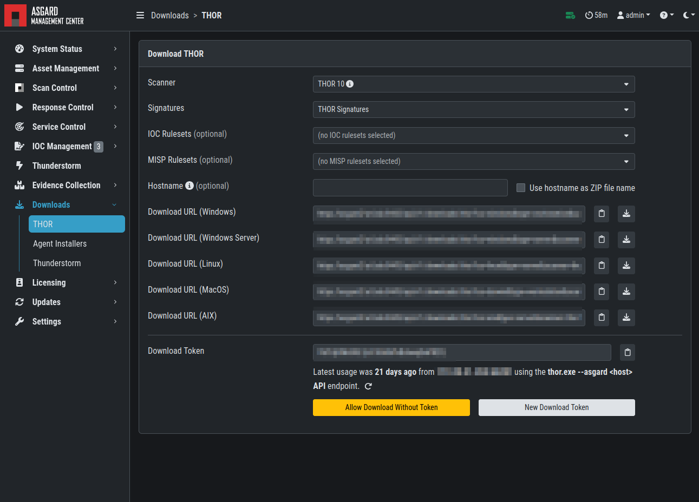

.. index:: Download Links

Download Links
==============

The ``Downloads`` section lets you create and download a full
THOR package including scanner, custom IOCs and MISP rulesets
along with a valid license for a specific host. This package can
then be used for systems that cannot be equipped with an ASGARD
agent for some reason. For example, this can be used on air gapped
networks. Copy the package to a flash drive or CD ROM and use it
where needed.

You can choose to disable the download token altogether using
``Disable Download Token``. If disabled, anyone with network
access can download and issue licenses, which may lead to
unwanted exhaustion of the ASGARD license pool. You can reset
the download token by disabling and then re-enabling it using ``New Download Token``.

   Download THOR package and license workstation named 'WIN-CLI-DE-1234'

While selecting different options in the form, the download link changes.

After you have generated a download token and have selected the
correct scanner, operating system and target hostname (not FQDN),
you can copy the download link and use it to retrieve a full
scanner package including a license file for that host. These download
links can be sent to administrators or team members that don't have
access to ASGARD management center. Remember that the recipients of
that link still need to be able to reach ASGARD's web server port
(443/tcp). The token can be used to download THOR or a THOR license
without an ASGARD account. Attention: If you disable the token,
anybody can download THOR from this ASGARD or can generate licenses.

.. note::
   The scanner package will not contain a license file if you don't
   set a hostname in the ``Target Hostname`` field. If you have an
   Incident Response license, you must provide it separately.

Use Case 1 - Share th URL without Hostname
^^^^^^^^^^^^^^^^^^^^^^^^^^^^^^^^^^^^^^^^^^

You can generate download links without an included license by
leaving the `hostname` field empty. A valid license (e.g. "Incident Response")
must be  placed in the program folder after the download and extraction. 

Use Case 2 - Share th URL with Hostname
^^^^^^^^^^^^^^^^^^^^^^^^^^^^^^^^^^^^^^^

By including the hostname in the form, a license will be generated
and included in the download package You can copy the final download
link and send it to anyone, who can use this link to download a
package and run scans on a host with that name.

You or the recipient can change the name in that URL to make it
usable on other systems.

Note that you may have to adjust the `type` field to get the correct
license type (`client` for workstations, `server` for servers) and
the THOR version (`win`, `linux`, `osx`) to generate a correct URL. 

.. code-block:: none
   
   .../thor?os=windows&type=server&scanner=thor10%40latest&hostname=mywinserver...
   .../thor?os=windows&type=workstation&scanner=thor10%40latest&hostname=mywinwks1...
   .../thor?os=linux&type=server&scanner=thor10%40latest&hostname=mylinuxsrv1...

Use Case 3 - Use the URL in Scripts
^^^^^^^^^^^^^^^^^^^^^^^^^^^^^^^^^^^

By default, the generated download link is protected with a
token that makes it impossible to download a package or
generate a license without knowing that token. This token
is specific to every ASGARD instance.  

You can use that URL in Bash or PowerShell scripts to automate
scans on systems without an installed ASGARD agent. 

.. code-block:: powershell 

   $Type = "server"
   $Download_Url = "https://asgard2.nextron:8443/api/v1/downloads/thor?os=windows&type=$($Type)&scanner=thor10%4010.6&signatures=signatures&hostname=$($Hostname)&token=$($Token)"
