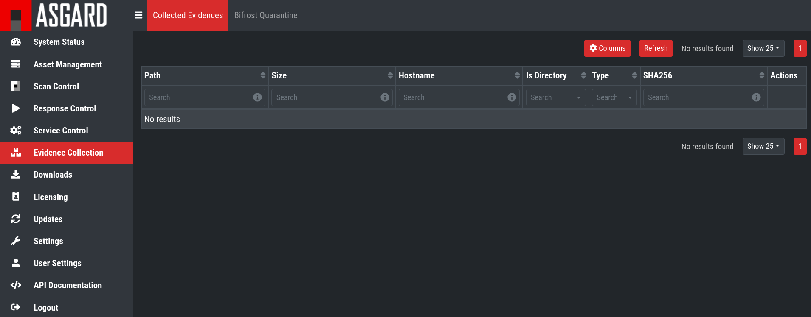
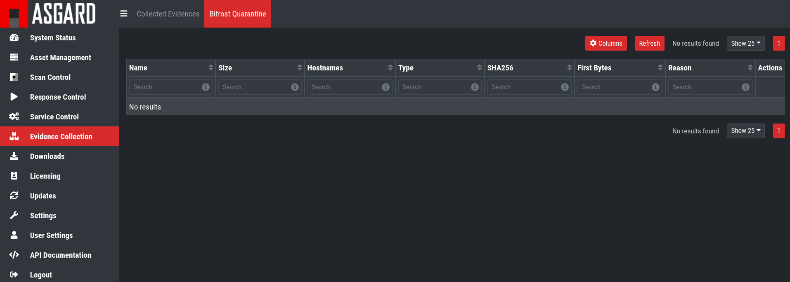

.. index:: Evidence Collection

Evidence Collection 
===================

Collected Evidences
^^^^^^^^^^^^^^^^^^^

ASGARD provides two forms of collected evidence: 

1. Playbook output (file or memory collection, command output)
2. Sample quarantine (sent by THOR via Bifrost protocol during the scan)

All collected evidence can be downloaded in the ``Collected Evidence`` section.

   Collected Evidence List

Bifrost Quarantine
^^^^^^^^^^^^^^^^^^

If Bifrost is used with your THOR scans, all collected samples show up here.
You will need the "ResponseControl" permission in order to view or download
the samples. See section :ref:`administration/users:roles` and
:ref:`administration/users:rights` for details.

   Bifrost Collections