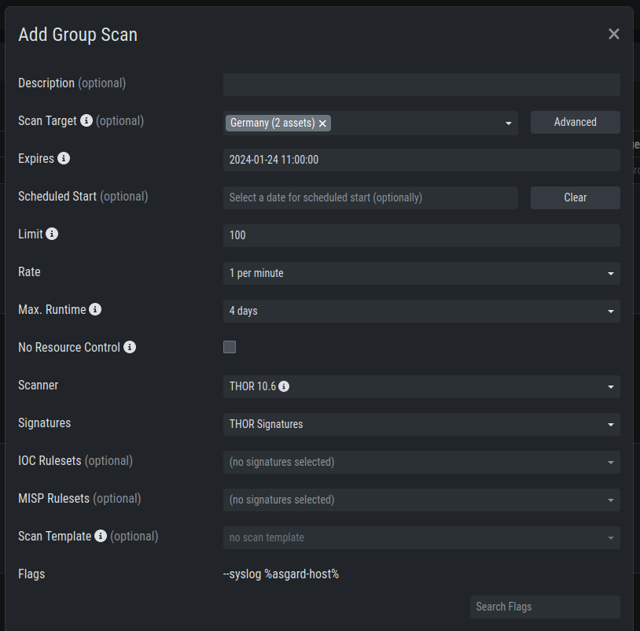
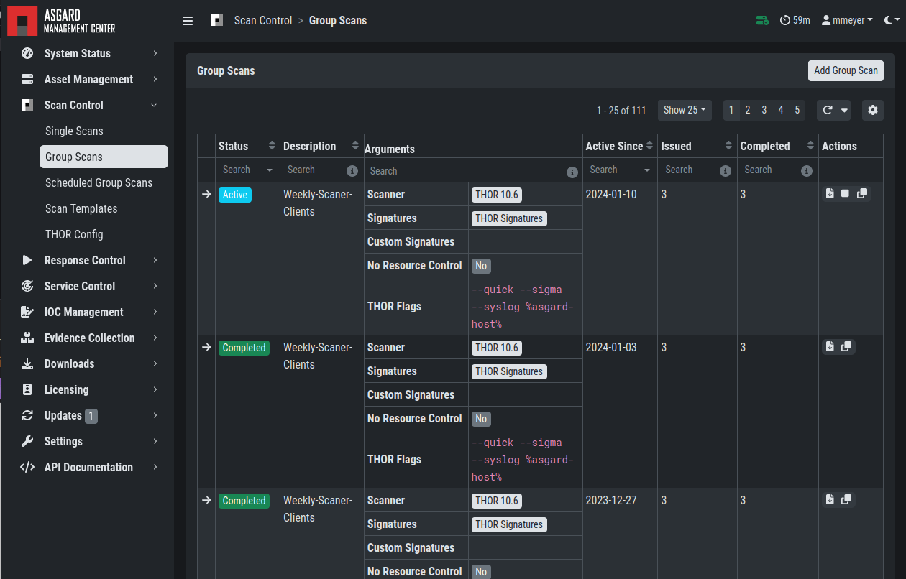

.. index:: Group Scan

Scan a Group of Systems
=======================

A group scan is a scan task which is assigned to one or
more asset. You define conditions, which can either be labels
or the ASGARD Search Query, to specify which assets should be
scanned. Group scans are used to assign identical scans (in terms
of settings and configuration) to multiple assets.

Create Group Scans
~~~~~~~~~~~~~~~~~~

A scan for a group of systems can be created in the ``Scan Control`` > ``Group Scans``
tab. Click the ``Add Group Scan`` button in the upper right corner.

   Scan Control – Create Group Scan

As with the single scans, various parameters can be set. Aside from the already
mentioned parameters, you can also configure the following:

.. list-table::
   :header-rows: 1
   :widths: 25 75

   * - Parameter
     - Value
   * - **Description**
     - Freely selectable and optional name for the group scan
   * - **Scan Target**
     - Define which assets should be scanned with this group scan.
       You can either use the ``Simple`` target option, which uses labels,
       or you can use the ``Advanced`` target options, which makes use of
       labels or the ASGARD Search Query. Leaving this option empty will scan all assets.
   * - **Expires**
     - After this time frame, no scan orders will be issued to the connected agents. 
   * - **Scheduled Start**
     - Select a date for a scheduled start of the scan.
   * - **Limit**
     - This specifies the maximum scans this group scan is assigning. Once the
       limit is reached, no more scans will be issued. Therefore you need to set
       a limit higher than the number of hosts you want to scan or enter ``0`` for
       no limit. If you are using MASTER ASGARD, this limit is applied on each single
       selected ASGARD.
   * - **Rate**
     - The rate at which new scans are being issued by the ASGARD. You can control
       network load with this option, since a scan also means that the asset needs to
       download THOR from the ASGARD. We recommend to use this parameter in virtualized
       and oversubscribed environments in order to limit the number of parallel scans
       on your endpoints.
   * - **Max. Concurrent Scans**
     - Limits the number of concurrent scans running at once. When the limit is reached,
       no new scans will be started until one of the running scans is completed or failed.
   * - **Max. Runtime**
     - A started scan is cancelled after exceeding the maximum runtime. This is used
       to stop any hanging/unresponsive scans.

Once you are done configuring your group scan, you can either **Add the Group Scan** or
**Add and Activate the Group Scan**. Only adding the group scan without activating it
will "park" it until it has been activated - at which point scans will be issued.

List of all Group Scans
~~~~~~~~~~~~~~~~~~~~~~~

The list of all group scans contains, among other items, the unique Scan-ID and the name.

   Scan Control – Group Scans – List

In addition, information can be found about the chosen scanner, the chosen parameters,
the start and completion times and the affected assets (defined by labels).
Additional columns can be added by clicking on "Column Visibility".

The Status field can have the following values:

.. list-table::
   :header-rows: 1
   :widths: 20, 80

   * - Status
     - Value
   * - **Paused**
     - The group scan has not yet started. Either click play or wait
       for the scheduled start date (the job will start in a 5 minute window around the scheduled time).
   * - **Active**
     - Scan is started, ASGARD will issue scans with the given parameters.
   * - **Inactive**
     - No additional scan jobs are being issued. All single scans that are currently running will continue to do so.
   * - **Completed**
     - The group scan is completed. No further scan jobs will be issued.

Starting a Group Scan
~~~~~~~~~~~~~~~~~~~~~

A group scan can be started by clicking on the "play" button in the
"Actions" column of a group scan. Subsequently, the scan will be listed as "Started".

Details of a Group Scan
~~~~~~~~~~~~~~~~~~~~~~~

Further information about a group scan can be observed from the detail
side bar of the group scan. Click the arrow in the left column of
the group scan you are interested in and the details section will appear
on the right side of the window.

.. figure:: ../images/mc_group-scan-details.png
   :alt: Scan Control – Group Scans – Details

   Scan Control – Group Scans – Details

Aside from information about the group scan in the "Details" tab, there
is a graph that shows the number of assets started and how many assets
have already completed the scan in the "Charts" tab. In the "Tasks"
tab you get information about the scanned assets.