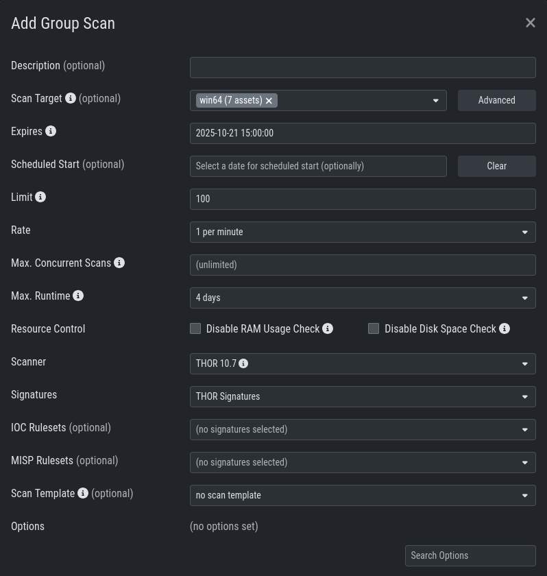
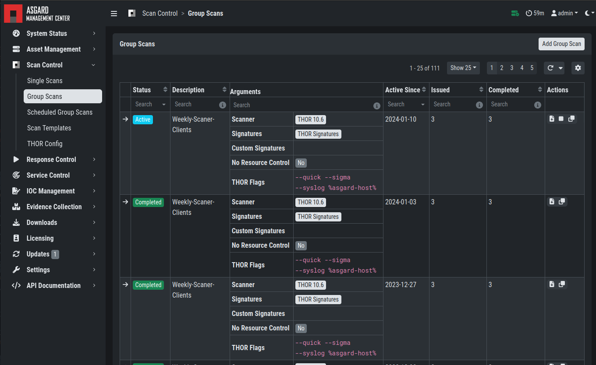
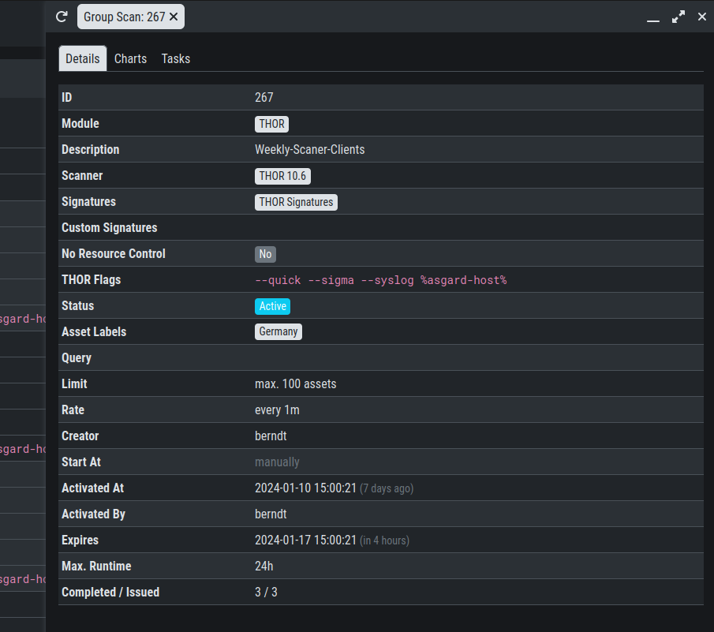

.. index:: Group Scan

Scan a Group of Systems
=======================

A group scan is a scan task which is assigned to one or
more asset **condition**. Those conditions can either be labels
or the ASGARD Search Query. This is meant to be used if you want to
scan a large group of assets with one scan configuration.

Create Group Scans
~~~~~~~~~~~~~~~~~~

A scan for a group of systems can be created in the ``Scan Control`` > ``Group Scans``
tab. Click the ``Add Group Scan`` button in the upper right corner.

   Scan Control – Create Group Scan

As with the single scans, various parameters can be set. Aside from the already
mentioned parameters, the following parameters can be set:

.. list-table::
   :header-rows: 1
   :widths: 20, 80

   * - Parameter
     - Value
   * - **Description**
     - Freely selectable name for the group scan.
   * - **Scan Target**
     - Here you can define which assets will be assigned the group scan.
       You can either use the ``Simple`` target option, which uses labels,
       or you can use the ``Advanced`` target options, which makes use of
       labels or the ASGARD Search Query. Leaving this option empty will scan all assets.
   * - **Limit**
     - ASGARD will not send additional scans to the agents when the client
       limit is reached. Therefore you need to set a limit higher than the
       number of hosts you want to scan or enter ``0`` for no limit. If
       you are using MASTER ASGARD, this limit is applied on each single selected ASGARD.
   * - **Rate**
     - The number of scans per minute that are issued by ASGARD. This is
       where the network load can be controlled. Additionally, it is recommended
       to use this parameter in virtualized and oversubscribed environments in
       order to limit the number of parallel scans on your endpoints.
   * - **Expires**
     - After this time frame, no scan orders will be issued to the connected agents. 
   * - **Scheduled Start**
     - Select a date for a scheduled start of the scan.

After the group scan has been ``Saved`` or ``Saved and Started``, you will
automatically be forwarded to the list of grouped scans. 

List of all Group Scans
~~~~~~~~~~~~~~~~~~~~~~~

The list of all group scans contains, among other items, the unique Scan-ID and the name.

   Scan Control – Group Scans – List

In addition, information can be found about the chosen scanner, the chosen parameters,
the start and completion times and the affected assets (defined by labels).
Additional columns can be added by clicking on "Column Visibility".

The Status field can have the following values:

.. list-table::
   :header-rows: 1
   :widths: 20, 80

   * - Status
     - Value
   * - **Paused**
     - The group scan has not yet started. Either click play or wait
       for the scheduled start date (the job will start in a 5 minute window around the scheduled time).
   * - **Active**
     - Scan is started, ASGARD will issue scans with the given parameters.
   * - **Inactive**
     - No additional scan jobs are being issued. All single scans that are currently running will continue to do so.
   * - **Completed**
     - The group scan is completed. No further scan jobs will be issued.

Starting a Group Scan
~~~~~~~~~~~~~~~~~~~~~

A group scan can be started by clicking on the "play" button in the
"Actions" column of a group scan. Subsequently, the scan will be listed as "Started".

Details of a Group Scan
~~~~~~~~~~~~~~~~~~~~~~~

Further information about a group scan can be observed from the detail
side bar of the group scan. Click the arrow in the left column of
the group scan you are interested in and the details section will appear
on the right side of the window.

   Scan Control – Group Scans – Details

Aside from information about the group scan in the "Details" tab, there
is a graph that shows the number of assets started and how many assets
have already completed the scan in the "Charts" tab. In the "Tasks"
tab you get information about the scanned assets.