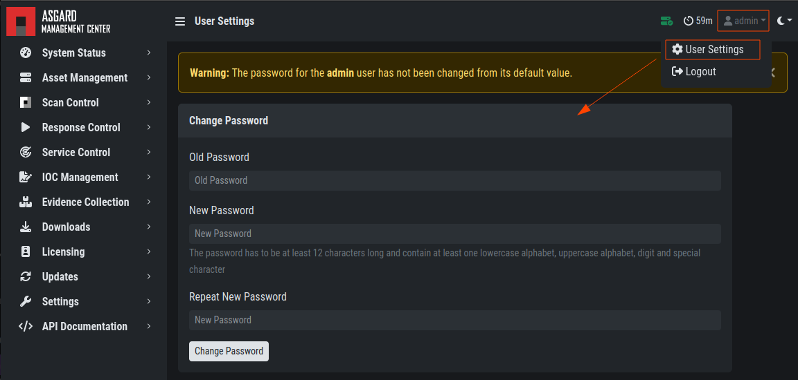
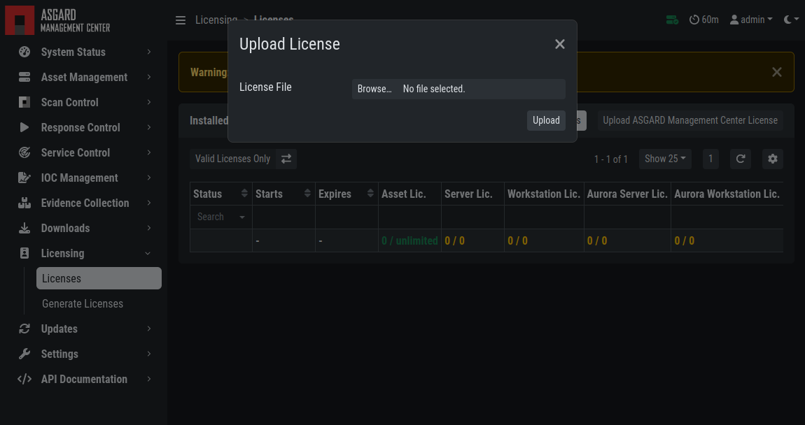

.. Index:: Initial Configuration

Initial Tasks
=============

The following tasks will ensure that your Management Center
is functional and ready to deploy THOR scans on your agents.

Change the Admin Password
-------------------------

Log into the Management Center web interface with the user
``admin`` and password ``admin``.

.. figure:: ../images/mc_login-screen.png
   :alt: Login Screen

   Login Screen

After logging in to the Management Center for the first time,
you will have to change the default password.

Click the username ``admin`` in the top right corner. This will open
a dropdown menu. Click ``User Settings`` to see user specific settings.
Here you can change the default password of the admin user.

   Changing the Password

License Installation
--------------------

Login to the Management Center, navigate to ``Licensing``, click 
``Upload ASGARD Management Center License`` and upload a valid license. 

   Install a license

After uploading your license, the license details are displayed.
