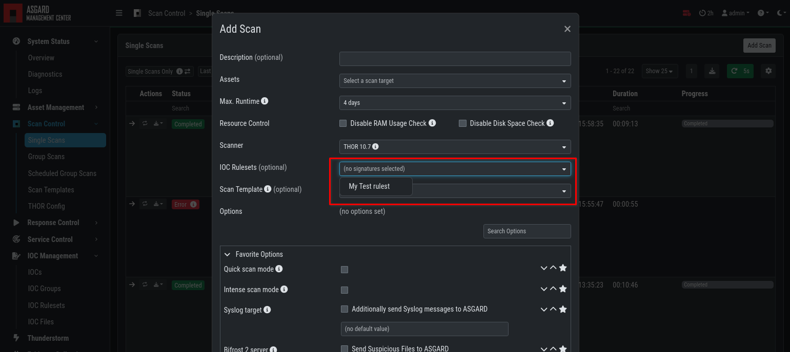
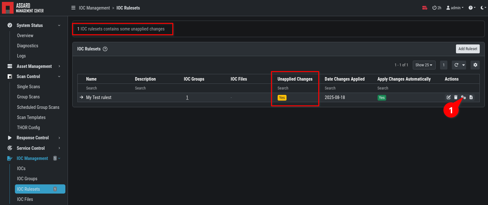

.. index:: IOC Management

IOC Management
==============

The ASGARD Management Center allows you to create and manage your own IOCs.
Those IOCs can be used with THOR and Aurora.

What's the difference between IOCs, IOC Groups, IOC Rulesets, and IOC Files?

- IOCs: Define specific indicators that represent potential threats. Supports different
  types of IOC detection, such as filenames like “some_malware.exe”, hashes like "4fef5e34…”,
  YARA and Sigma rules, etc.

- IOC Groups: Organise related individual IOCs into easily manageable groups. For example,
  you can group various individual IOCs related to a "Mimikatz" attack (such as an IOC
  that detects the presence of a file called “mm64c.exe”) under a single category.

- IOC Rulesets: IOC Rulesets combines multiple IOC Groups into a comprehensive set of rules.
  With this, you can assemble a set of indicator groups to represent a specific threat
  scenario. You can also apply your changes to your rulesets for streamlined and efficient threat detection.

- IOC Files: Upload files containing your own IOCs that you can later use to add them
  onto your own IOC Rulesets.

Integrating Custom IOCs
^^^^^^^^^^^^^^^^^^^^^^^

The menu ``IOC Management`` gives you the opportunity to easily integrate custom signatures into your scans. 

In order to create your own custom IOC Group, navigate to ``IOC Management`` > ``IOCs``
and click ``Add IOC`` in the upper right corner. Select a name and optionally a description for your IOC Group.
This will open a dialog which guides you through the creation of IOCs.

Every IOC has to belong to one IOC Group. One IOC Group can contain multiple IOCs. And finally,
one IOC Ruleset can contain many IOC Groups.

After you are finished with the creation of your IOCs, you will have to apply the
changes to the IOC Ruleset. You can do so by checking the box towards the end
of the dialog ("Apply changes on all affected rulesets immediately"), or by
setting the IOC Ruleset to "autocompile" (this can also be done during the dialog,
if you create a new IOC Ruleset).

Once you created a IOC Ruleset which contains IOCs, it can be used for scanning with THOR.

   IOC Ruleset in THOR Scan

Anytime you add, remove or change IOCs within one of your IOC Groups,
you have to recompile the IOC Ruleset. To do this, navigate to the
``IOC Rulesets`` page and click the "gear" icon (1) in the Ruleset's row.
You can optionally set IOS Rulesets to "Autocompile".

   Compile IOC Ruleset

Scan only with Custom IOCs
^^^^^^^^^^^^^^^^^^^^^^^^^^

Those rulesets can be selected in the "IOC Rulesets" field while
creating a new scan job. If a ruleset is selected, the scan will
include all custom IOCs included in IOC Groups which have been
added to this ruleset. You can also select more than one ruleset.

The THOR scan would be performed with the default settings and the
custom ruleset, the default signatures would not be applied.

   Select Ruleset while creating a scan job

.. note::
   To scan exclusively with the custom ruleset, the flag 
   ``--customonly`` must be set (1,2). Please see
   `THOR Flags <https://thor-manual.nextron-systems.com/en/latest/usage/flags.html#feature-extras>`_
   for more information.

Integrating IOCs through MISP
^^^^^^^^^^^^^^^^^^^^^^^^^^^^^

.. note::
   In order to use MISP events and their IOCs for scanning, you
   need to link your ASGARD with a MISP first. Please see
   :ref:`administration/additional:link misp` for reference.

ASGARD provides an easy to use interface for integrating IOCs from
a connected MISP into THOR scans. In order to add rules from a MISP,
navigate to ``IOC Management`` > ``MISP`` > ``MISP Events``, select
the IOCs and add them to the desired ruleset by using the button in
the upper right corner. 

There is no default ruleset for MISP. You must create at least one
ruleset (see tab "MISP Rulesets") before you can add MISP rules.

.. figure:: ../images/mc_misp-events.png
   :alt: MISP events

   MISP events 

To create a new ruleset, click ``Add MISP Ruleset`` in the
``IOC Management`` > ``MISP`` > ``MISP Rulesets`` tab. Select a name
and the type of IOCs you want to use in this ruleset. By default, all
types are selected, but there may be reasons for deselecting certain
categories. For example, filename IOCs tend to cause false positives
and may be deselected for that reason. The picture below shows the
dialogue for adding a MISP ruleset. Enable ``Apply Changes Automatically`` in order
to compile new MISP events into the ruleset, when they arrive.

   Adding a new MISP ruleset

In order to use a MISP ruleset in a scan, add the ruleset in the
``MISP Signatures`` field when creating your scan.

   Scanning with MISP Ruleset

MISP Attributes used by ASGARD
~~~~~~~~~~~~~~~~~~~~~~~~~~~~~~

Since not all the information and attributes in a MISP event are
relevant to ASGARD and the THOR scanner, we provide a list of
attributes which will be used by ASGARD:

   * hostname
   * ip-dst
   * domain
   * domain-ip>hostname
   * domain-ip>ip-dst
   * domain-ip>domain
   * filename
   * filepath
   * file>filename
   * file>filepath
   * file>md5
   * file>sha1
   * file>sha256
   * md5
   * sha1
   * sha256
   * yara
   * yara>yara
   * sigma

.. warning:: 
   Only attributes with the flag ``IDS`` set to ``true`` will be used
   by ASGARD. Please make sure that the flag is set if you are
   intending to use certain events/attributes.