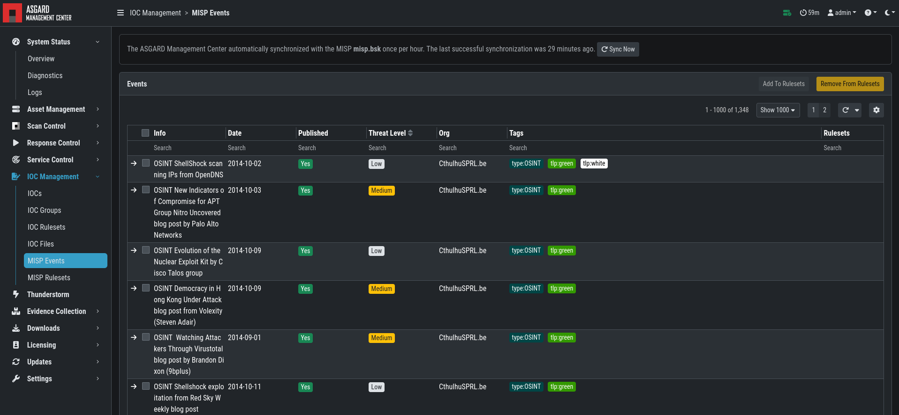

.. index:: IOC Management

IOC Management
==============

Integrating Custom IOCs
^^^^^^^^^^^^^^^^^^^^^^^

The menu ``IOC Management`` gives you the opportunity to easily integrate custom signatures into your scans. 

In order to create your own custom IOC Group, navigate to ``IOC Management`` > ``IOCs``
and click ``Add IOC Group`` in the upper right corner. Select a name and optionally a description for your IOC Group.

.. figure:: ../images/mc_add-ioc-group.png
   :alt: Add IOC Group

   Add IOC Group

To add IOCs to this group, use the ``Show and edit IOCs in this IOC group``
action. A side pane opens where you can click the ``Import IOCs`` button
to import your own signatures in any of THOR's IOC formats as files (e.g.
files for keyword IOCs, YARA files and SIGMA files). Refer to the  
`THOR manual (custom signatures) <https://thor-manual.nextron-systems.com/en/latest/usage/custom-signatures.html>`_
for a complete list and file formats. Browse to the file you want
to add and click upload. This adds your IOC file to the default ruleset. 

.. figure:: ../images/mc_import-iocs.png
   :alt: Imported IOCs Overview

   Imported IOCs Overview

However, you can also click the ``Add IOC(s)`` button to add some IOCs
interactively. Select the type, score and description, enter some values
and click the ``Add IOC`` button.

.. figure:: ../images/mc_add-iocs.png
   :alt: Add IOCs

   Add IOCs

You can add those IOC Groups to IOC Rulesets which can be created in
the ``IOC Management`` > ``IOC Rulesets`` tab by clicking the  ``Add Ruleset``
button in the upper right corner. Select name and description and click the 
``Add Ruleset`` button.

.. figure:: ../images/mc_add-ioc-ruleset.png
   :alt: Add Ruleset

   Add Ruleset

After that, click on an entry in the table to expand it. There you
get information about all IOC Groups which have been added to this
ruleset. Additionally you can add or remove selected IOC Groups in
``IOC Management: IOCs`` by clicking one of the three buttons shown below.

.. figure:: ../images/mc_add-remove-ioc-group.png
   :alt: Buttons to Add/Remove IOC Groups

   Buttons to Add/Remove IOC Groups

You can now add your IOC Group to the newly created IOC Ruleset.

.. figure:: ../images/mc_add-ioc-group-to-ruleset.png
   :alt: Add IOC Group to Ruleset

   Add IOC Group to Ruleset

This Ruleset can now be used in THOR scans.

.. figure:: ../images/mc_ioc-ruleset-thor-scan.png
   :alt: IOC Ruleset in THOR Scan

   IOC Ruleset in THOR Scan

Anytime you add, remove or change IOCs within one of your IOC Groups,
you have to recompile the IOC Ruleset. To do this, navigate to the
``IOC Rulesets`` page and click the "geard" icon in the Ruleset's row

.. figure:: ../images/mc_compile-ioc-ruleset.png
   :alt: Compile IOC Ruleset

   Compile IOC Ruleset

Scan only with Custom IOCs
^^^^^^^^^^^^^^^^^^^^^^^^^^

Those rulesets can be selected in the "IOC Rulesets" field while
creating a new scan job. If a ruleset is selected, the scan will
include all custom IOCs included in IOC Groups which have been
added to this ruleset. You can also select more than one ruleset.

The THOR scan would be performed with the default settings and the
custom ruleset, the default signatures would not be applied.

.. figure:: ../images/mc_ioc-ruleset-selection.png
   :alt: Select Ruleset while creating a scan job

   Select Ruleset while creating a scan job

.. note::
   To scan exclusively with the custom ruleset, the flag 
   ``--customonly`` must be set. Please see
   `THOR Flags <https://thor-manual.nextron-systems.com/en/latest/usage/flags.html#feature-extras>`_
   for more information.

Integrating IOCs through MISP
^^^^^^^^^^^^^^^^^^^^^^^^^^^^^

.. note::
   In order to use MISP events and their IOCs for scanning, you
   need to link your ASGARD with a MISP first. Please see
   :ref:`administration/additional:link misp` for reference.

ASGARD provides an easy to use interface for integrating IOCs from
a connected MISP into THOR scans. In order to add rules from a MISP,
navigate to ``IOC Management`` > ``MISP`` > ``MISP Events``, select
the IOCs and add them to the desired ruleset by using the button in
the upper right corner. 

There is no default ruleset for MISP. You must create at least one
ruleset (see tab "MISP Rulesets") before you can add MISP rules.

   MISP events 

To create a new ruleset, click ``Add MISP Ruleset`` in the
``IOC Management`` > ``MISP`` > ``MISP Rulesets`` tab. Select a name
and the type of IOCs you want to use in this ruleset. By default, all
types are selected, but there may be reasons for deselecting certain
categories. For example, filename IOCs tend to cause false positives
and may be deselected for that reason. The picture below shows the
dialogue for adding a MISP ruleset. Enable ``Auto Compile`` in order
to automatically compile new MISP events into the ruleset, when they arrive.

.. figure:: ../images/mc_new-misp-ruleset.png
   :alt: Adding a new MISP ruleset

   Adding a new MISP ruleset

In order to use a MISP ruleset in a scan, add the ruleset in the
``MISP Signatures`` field when creating your scan.

.. figure:: ../images/mc_scanning-with-misp-ruleset.png
   :alt: Scanning with MISP Ruleset

   Scanning with MISP Ruleset

MISP Attributes used by ASGARD
~~~~~~~~~~~~~~~~~~~~~~~~~~~~~~

Since not all the information and attributes in a MISP event are
relevant to ASGARD and the THOR scanner, we provide a list of
attributes which will be used by ASGARD:

   * hostname
   * ip-dst
   * domain
   * domain-ip>hostname
   * domain-ip>ip-dst
   * domain-ip>domain
   * filename
   * filepath
   * file>filename
   * file>filepath
   * file>md5
   * file>sha1
   * file>sha256
   * md5
   * sha1
   * sha256
   * yara
   * yara>yara
   * sigma

.. warning:: 
   Only attributes with the flag ``IDS`` set to ``true`` will be used
   by ASGARD. Please make sure that the flag is set if you are
   intending to use certain events/attributes.