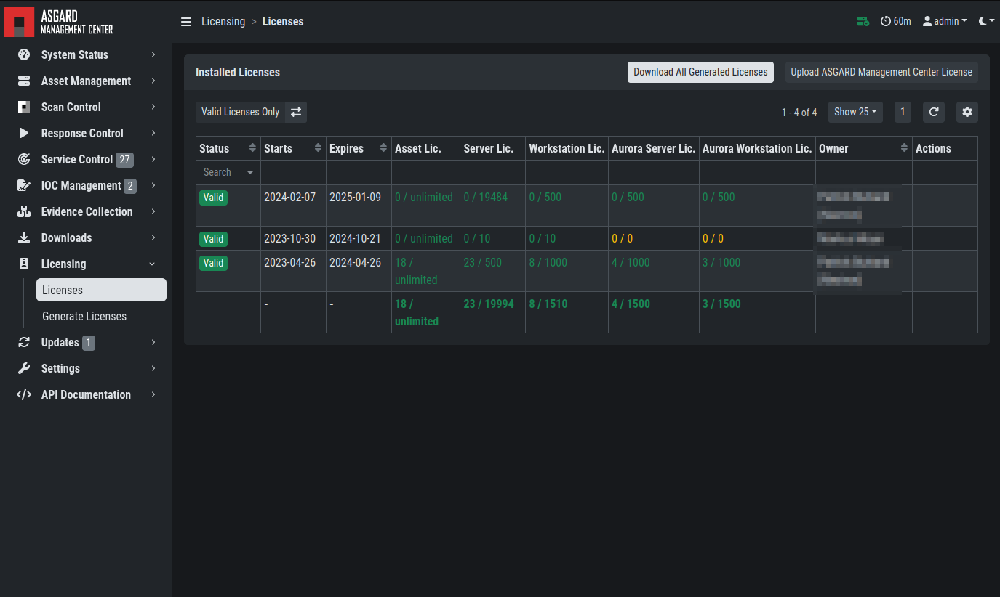
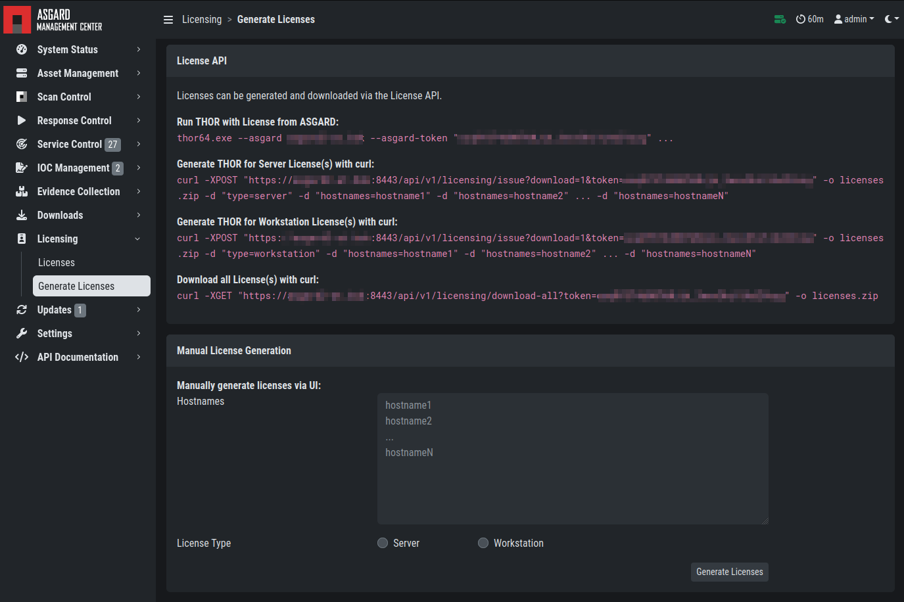

.. index:: Licensing

Licensing
=========

ASGARD requires an Issuer-License in order to scan systems.
The Issuer-License contains the number of asset-, server- and
workstation systems that can be scanned with ASGARD Management
Center as well as the Aurora service licenses.

ASGARD will automatically issue a valid single-license for a
particular system during its initial THOR scan. 

The screenshot below shows the licensing section of an ASGARD.

   ASGARD licensing

In addition, ASGARD can create single-licenses that can be used
for agent-less scanning. In this case the license is generated
and downloaded through the Web frontend. 

   Generate licenses

The following systems require a workstation license in order to be scanned: 

* Windows 7 / 8 / 10 / 11
* Mac OS

The following systems require a server license in order to be scanned:

* All Microsoft Windows server systems
* All Linux systems

The licenses are hostname based except for asset licenses. Asset
licenses are issued for each accepted asset as soon as a response
action is performed (playbook or remote console access).