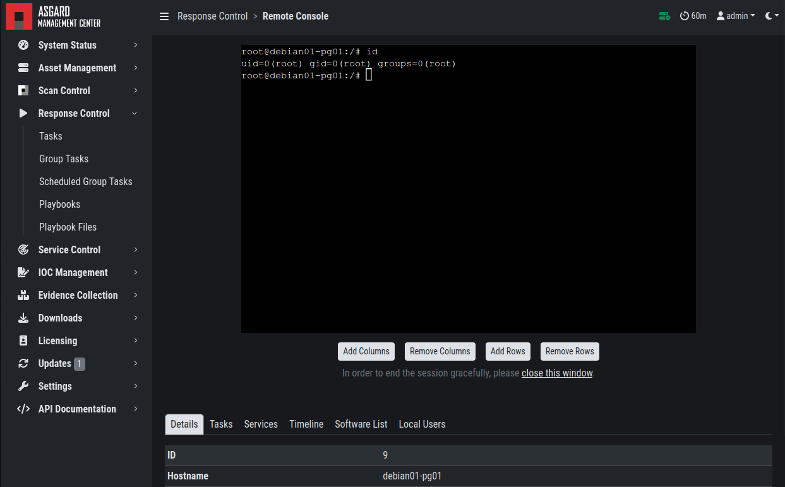

.. index:: Response Control

Response Control
================

The Response Control is used to execute tasks on your agents. Those
tasks can be:

* Run Playbook (pre-defined or custom)
* Run Interrogate (collect system information)
* Open Remote Console
* Maintenance

  - Upgrade Agent
  - Upgrade Service Controller
  - Configure the asset's proxy
  - Move asset to another ASGARD

There are several other tasks which will appear in the Response Control
section, those include:

* Directory Listing (Browse the file system)
* Log (view the ASGARD Agent Log)
* System Stats (view the system load)

Those tasks can only be started from the Details view of an asset,
but appear here for audit purposes.

Opening a Remote Console on an endpoint
^^^^^^^^^^^^^^^^^^^^^^^^^^^^^^^^^^^^^^^

In order to open a remote console on an endpoint, open the Asset
Management section and click the "command line" button in the Actions column.

.. figure:: ../images/mc_remote-console.png
   :alt: Opening a Remote Console from the Asset View

   Opening a Remote Console from the Asset View

Please note that all actions within the remote console are recorded and
can be audited. All consoles open with root or system privileges.

   Remote Shell

In order to replay a remote console session, navigate to ``Response Control``,
expand the task that represents your session by clicking the arrow to the left
in the tasks row. Select the ``Console Log`` tab and click the play button in
the bottom row.

   Replay Remote Shell Session

ASGARD users can only see their own remote console session. Only users with
the ``View Remote Console Log`` permission are able to replay all sessions from
all users.

.. note::
   The permission ``View Remote Console Log`` requires the ``Response Control``
   permission.

Response Control with Pre-Defined Playbooks
^^^^^^^^^^^^^^^^^^^^^^^^^^^^^^^^^^^^^^^^^^^

In addition to controlling THOR scans, the Management Center contains
extensive response functions. Through your Management Center, you can
start or stop processes, modify and delete files or registry entries,
quarantine endpoints, collect triage packages and execute literally
any command on connected systems. All with one click and executed on
one or multiple endpoints at once.

It is also possible to download specific suspicious files. You can transfer
a suspicious file to the ASGARD Management Center and further analyze
offline.

   Built-in Playbooks

To execute a predefined response action one or more endpoints, navigate
to the Assets view and either click the "play" button in the Actions
Column, or selected multiple assets and press the "Add Task" button in
the top right corner. This will lead you to a dialogue where you can
select the desired action.

   Execute Playbook on Endpoints

In this example, we collect the ASGARD Agent Logs.

ASGARD ships with pre-defined playbooks for the following tasks:

* Collect ASGARD Agent Log
* Create and Collect Aurora Agent Diagnostics Pack (Windows only)
* Collect full triage pack (Windows only)
* Isolate endpoint (Windows only)
* Collect system memory
* Collect file / directory
* Collect directory
* Collect Aurora diagnostics pack
* Execute command and collect stdout and stderr

.. warning::
    The collection of memory can set the systems under high load and
    impacts the systems response times during the transmission of
    collected files. Consider all settings carefully! Also be aware
    that memory dumps may fail due to kernel incompatibilities or
    conflicting security mechanisms. Memory dumps have been successfully
    tested on all supported Windows operating systems with various patch
    levels. The memory collection on Linux systems depends on kernel
    settings and loaded modules, thus we cannot guarantee a successful
    collection. Additionally, memory dumps require temporary free
    disk space on the system drive and consume a significant amount
    of disk space  on ASGARD as well. The ASGARD agent checks if there
    is enough memory on the  system drive and adds a 50% safety buffer.
    If there is not enough free disk  space, the memory dump will fail.  

Response Control for Groups of Systems
^^^^^^^^^^^^^^^^^^^^^^^^^^^^^^^^^^^^^^

Response functions for groups of systems can be defined in the ``Group Tasks``
tab or the ``New Scheduled Group Task`` tab.

   Execute Playbook on Group of Endpoints

This view should look already familiar, since it is similar to the
Group Scan view. You can select the targets by either specifying
one or more labels or by making use of the ASGARD Search Query.

Response Control with Custom Playbooks
^^^^^^^^^^^^^^^^^^^^^^^^^^^^^^^^^^^^^^

You can add your own custom playbook by clicking the ``Add Playbook`` button in the 
``Response Control`` > ``Playbooks`` tab. 

   Add Custom Playbook

This lets you define a name and a description for your playbook. After clicking
the ``Add Playbook`` button, click on the ``Edit steps of this playbook`` action. 

   Playbook Action Items

This opens the side pane in which single playbook steps
can be added using the ``Add Step`` button.

   Add Playbook Entry

You can do create the following type of Playbook Steps:

- Run Command Line on Endsystem
- Upload File to ASGARD Management Center
- Download File from ASGARD Management Center

This allows you to download files from the Management Center
to your endpoint and vice versa. This way you can directly
collect evidence from your endpoints.

If you need custom files for your playbook (scripts, configurations, binaries, etc.)
you can do so by selecting ``Upload New File`` when setting the type to ``Download File
from ASGARD Management Center`` during the creation of the playbook step. Alternatively
you upload (and manage) new files at ``Response Control`` > ``Playbook Files``.

   Manage Playbook Files

You can have up to 16 steps in each playbook, which are executed sequentially.
If you execute a command the **stdout** and **stderr** can be reported back as
well if you wish to do so.

Change the Asset(s) Proxy
^^^^^^^^^^^^^^^^^^^^^^^^^

You can change the Proxy Settings on your Assets via the Response Control.
To do this, select the asset(s) and click ``Add Task`` in the top right corner.
Next, set the Module to ``Maintenance`` and the Maintenance Type to
``Configure the asset's proxy``. You can now set your proxy. Multiple proxies
can be set, though only one FQDN/IP-Address per field can be set.

   Change/Set an assets Proxy