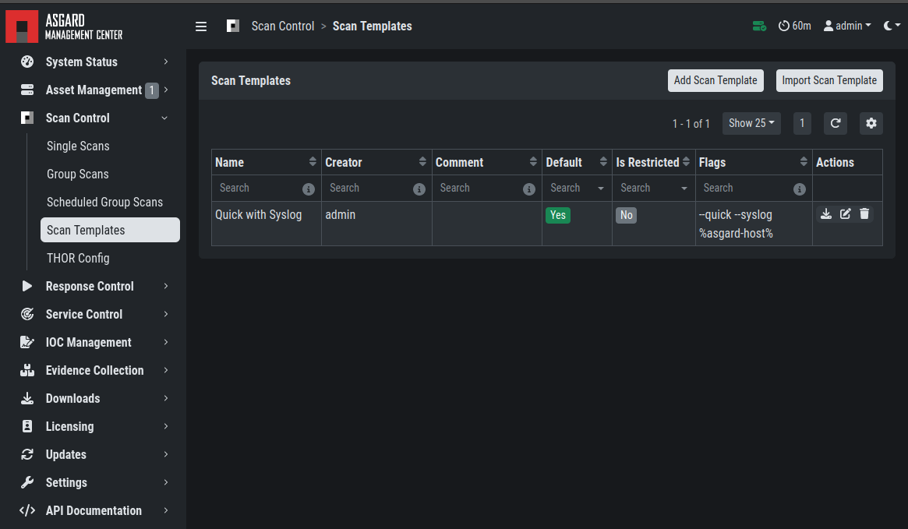
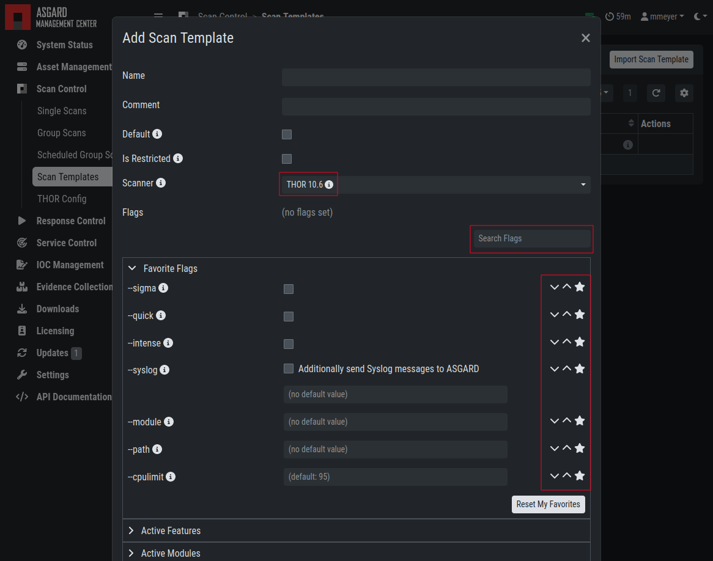
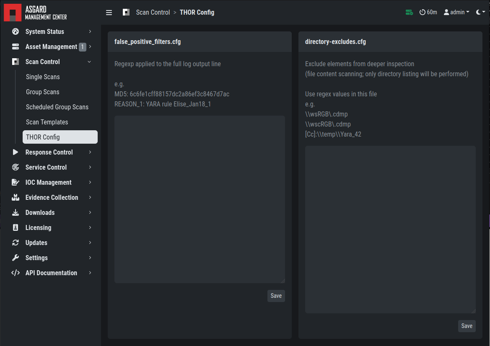

.. index:: Scan Control

Scan Control
------------

The Scan Control in your Management Center allows you to run different kind of
scans on one or multiple assets. Additionally, you can create ``Scan Templates``
to use with new scans, so all your default options won't need to be configured
for every new scan. You can also use ``Scan Templates`` to only allow certain
users to execute new scans with them. ``False-Positive Filters`` can be set to
exclude certain files from scan results, or even whole directories.

Your Management Center will also take care of THOR scans which stopped (e.g.
the asset rebooted or lost connection to your Management Center during a scan), so that
a scan will not fail if the asset is temporarily offline.

.. warning::
   When creating a scan job, the Management Center offers almost all possible scan
   options that can be used with THOR. Please consider their use with care as there
   are options that may lead to incompatibilities, failing scans, or errors.
 
- Example 1: A combination of ``--truncate 0`` and ``--allreasons`` may lead to
  very long THOR event log lines (> 64 KB), which `cannot be processed by the Analysis
  Cockpit properly <https://analysis-cockpit-manual.nextron-systems.com/latest/issues/issues.html#aac-002-scan-stuck-at-status-unknown>`_.
 
- Example 2: The use of the ``--processdump`` flag will create files on endpoints
  that are **not** automatically cleaned up.
 
All options can be used in certain scenarios, but they have to be chosen with care.

Managing Scan Templates
^^^^^^^^^^^^^^^^^^^^^^^

Scan templates are the most convenient way to make use of THOR's rich set of
scan options. It is possible to define scan parameters for THOR 10 and store
them in different templates for later use in single scans and grouped scans.
The scan templates are also very helpful if you want to automate scanning via
the API, as you don't have to specify all the options, but rather only the
template. This also means you don't have to change your API request, but only
the template.

Imagine you want to use dedicated scan options for different system groups (e.g.
Linux Servers, Domain Controllers, Workstations, etc.) and make sure to use exactly
the same set of scan options every time you scan a particular group of systems.
With your Management Center you can now add a scan template for every group.

A popular use case for scan templates is providing additional resource control – for
example telling THOR to set the lowest process priority for itself and never
use more than 50% of CPU.

Please keep in mind, that we have already optimized THOR to use the most relevant
scan options for a particular system (based on type, numbers of CPUs, and system
resources) and a comprehensive resource control is enabled by default. 

For more details please refer to the `THOR manual <https://thor-manual.nextron-systems.com>`_.
Only use the scan templates if you want to deviate from the default.

Scan templates are protected from being modified by users without the
``Manage Scan Templates``-permission, and can also be restricted from being used
by users in case the flag ``Force Scan Template`` is set for this user.
(See section :ref:`administration/users:restrictions` for details).

By clicking the ``Import Scan Template`` button you can import a previously
exported scan template.

   Scan Templates Overview

In order to create a scan template, navigate to ``Scan Control`` > ``Scan Templates``
and click the ``Add Scan Template`` button. The ``Add Scan Template`` dialogue appears.
The current THOR scanner version is chosen for you by default but can be changed if needed.

After choosing or changing a scanner you will find the most frequently used options on
the top of this page in the "Favorite Flags" category. View all THOR options by
clicking on the other categories or quickly search for known flags in the search bar.
By clicking on the star symbols you can also edit your personal favorites. 

   Scan Flags

By checking the "Default" box, you can make this scan template the default template
for every new scan. There can only be one default template at a time and selecting
the box will uncheck a previous default, if set.
Checking the "Restricted" flag will make the template restricted, meaning only a
restricted set of users can use the template for scans. The set of users consists
of all users who do not have the "Force Scan Template" restriction set (by default
those are all users who are not a member of the group "Operator Level 1").

THOR Excludes and False-Positive Filters
^^^^^^^^^^^^^^^^^^^^^^^^^^^^^^^^^^^^^^^^

In THOR you can define `directory and file excludes <https://thor-manual.nextron-systems.com/latest/usage/configuration.html#files-and-directories>`_
and `false positive filters <https://thor-manual.nextron-systems.com/latest/usage/configuration.html#false-positives>`_.
These features can be globally defined in ASGARD at ``Scan Control`` > ``THOR Config``.

   Scan Control - Global Directory Exclude and FP Filtering

.. warning::
   Be careful and do not use too broad filters or excludes, as this might
   reduce THOR's detection capabilities, if done incorrectly.