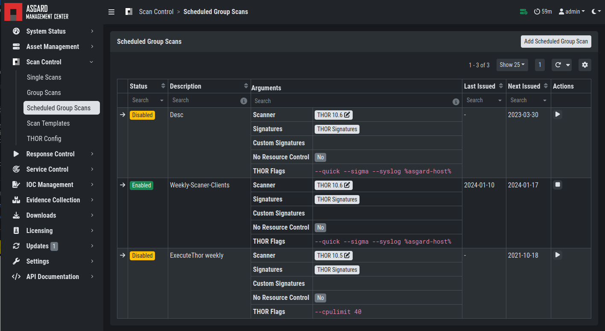
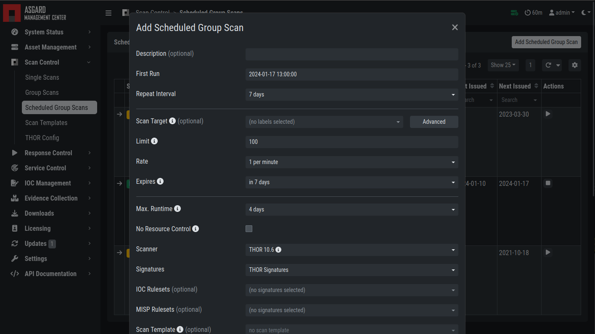

.. index:: Scheduled Scan

Scheduled Group Scan
====================

The Scheduled Group Scan section shows all scans that are to run on a
frequent basis along with their periodicity. All group scans that have
been started through the scheduler will show up on top of the Group Scan
section the moment they are started. New scheduled tasks can be created
by clicking the ``Add Scheduled Group Scan`` button.

   Scan Control – Scheduled Group Scan 

   Scan Control – New Scheduled Group Scan 
