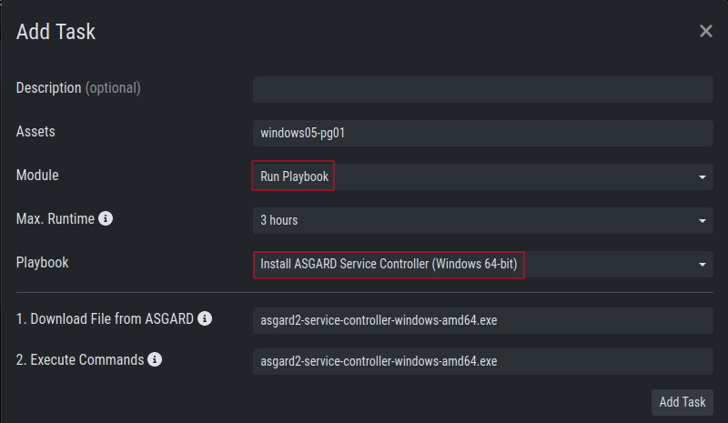
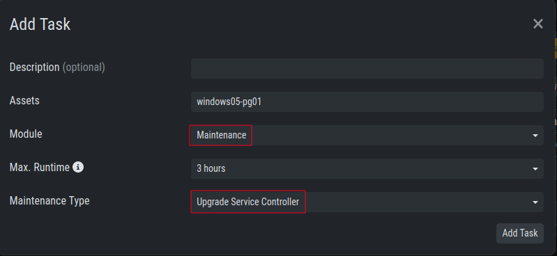

.. index:: Service Control

Service Control
===============

Service Control is ASGARD's way of deploying real-time services on endpoints.
Currently there only exist the Aurora service. To use Aurora, the service
controller has to be installed on an asset.

Service Controller Installation
^^^^^^^^^^^^^^^^^^^^^^^^^^^^^^^

To install the ASGARD Service Controller on an asset, you need to install the ASGARD Agent
first. If you already have installed the ASGARD Agent and accepted the asset in your Management
Center, you can use the **"Install ASGARD Service Controller"** playbook to deploy the service
controller on an asset. Optionally you can manually download and execute the ``asgard2-service-controller``
installer from the ASGARD downloads page.

   Install Service Controller

Service Controller Update
^^^^^^^^^^^^^^^^^^^^^^^^^

If an ASGARD update comes with a new service controller version, you need to update
the service controller on the already rolled-out assets. You can do this using an
"Update Agent" task. You can do that by either selecting one or multiple assets in the
``Assets`` view, or by creating a (scheduled) Group Task.

   Update Service Controller

.. note::
    If you don't see the **Update Agent** module, you need to enable **Show Advanced Tasks** in ``Settings`` > ``Advanced``
