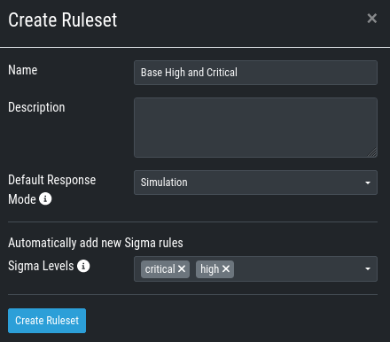
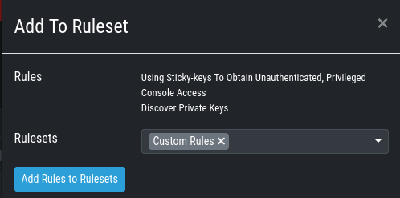

.. index:: Sigma

Sigma
=====

Aurora is using Sigma in order to define detections.

What is Sigma
~~~~~~~~~~~~~

From the `project website <https://github.com/SigmaHQ/sigma>`_:

.. highlights::

   `Sigma is a generic and open signature format that allows you to
   describe relevant log events in a straightforward manner. The rule
   format is very flexible, easy to write and applicable to any type
   of log file. The main purpose of this project is to provide a
   structured form in which researchers or analysts can describe their
   once developed detection methods and make them shareable with others.`

   `Sigma is for log files what` `Snort <https://www.snort.org/>`_ `is for network traffic and`
   `YARA <https://github.com/VirusTotal/yara>`_ `is for files.`

Creating a Ruleset
~~~~~~~~~~~~~~~~~~

Rulesets are used to group rules to manageable units. As an asset
can only have one service configuration, rulesets are used to determine
which rules are used in which service configuration. There exist default
rulesets for high and critical Sigma rules. If you want to create a
custom ruleset go to ``Service Control`` > ``Sigma`` > ``Rulesets`` > ``Create Ruleset``.

   Create a Ruleset

If you have chosen that new Sigma rules should be added automatically
they are added now. If you didn't you now need to add the desired rules
manually by going to ``Service Control`` > ``Sigma`` > ``Rules``. Choose
the rules that should be added to this ruleset by selecting the checkboxes
and then ``Add to Ruleset``. A rule can be assigned to multiple rulesets.

   Add a Rule to Rulesets

.. note::
    You need to commit and push your changes after editing a ruleset.
    ASGARD has to restart the service controller to read new configurations.
    In order to prevent multiple restarts in the case of a user performing
    several configuration changes in succession, the user has to initiate
    the reloading of the new configuration by going to ``Service Control`` >
    ``Sigma`` > ``Rulesets`` and performing the **Compile ruleset** action
    (gear wheels). The need for compiling is indicated in the *Uncompiled Changes* column.

    .. figure:: ../images/sc-uncommitted-changes.png
       :alt: Uncompiled Changes Indicator
    
       Uncompiled Changes Indicator

Choosing which Rules to activate
~~~~~~~~~~~~~~~~~~~~~~~~~~~~~~~~

It is not advised to enable all available rules on an asset. We suggest
to start with all "critical" and then advance to all "high" rules. We
already provide a default ruleset for those two levels for you to use.
"Medium" rules should not be enabled in bulk or "low"/"informational"
at all . Single medium rules, which increase an organization's detection
coverage and do not trigger a bigger number of false positives can be added
to the active configuration, but should be tested rule by rule.

In order to easily add rules to a ruleset you can use the column filters
to select the desired rules and add the bulk to a ruleset. As an example
you can add all rules of level "critical" to a ruleset:

    .. figure:: ../images/sc-choose-rules1.png
       :alt: Add all critical rules to a ruleset
    
       Add All Critical Rules to a Ruleset

Another great way to pivot the Sigma rule database is the usage of MITRE ATT&CK® IDs.

    .. figure:: ../images/sc-choose-rules2.png
       :alt: Search by MITRE ATT&CK® ID
    
       Search by MITRE ATT&CK® ID

Or you can just search the title or description field of the rules. You can also search
the rule itself using the "Rule" column. (the "Rule" column is not shown by default and
has to be added using the gear wheel button).

    .. figure:: ../images/sc-choose-rules3.png
       :alt: Search by Rule Title or Description
    
       Search by Rule Title or Description

False Positive Tuning of Sigma Rules
~~~~~~~~~~~~~~~~~~~~~~~~~~~~~~~~~~~~

Not every environment is the same. It is expected that some rules will trigger false
positive matches in your environment. You have
multiple options to tackle that issue.

1. If it is a general false positive, probably not only occurring in your environment,
   consider reporting it at as a `Github issue <https://github.com/SigmaHQ/sigma/issues>`_
   or `e-mail to us (rules@nextron-systems.com) <mailto:rules@nextron-systems.com>`_. We
   will take care of the tuning for you and your peers.
2. If the false positive is specific to your environment you can tune single Sigma rules
   at ``Service Control`` > ``Sigma`` > ``Rules``, filter for the rule in question and
   choose the "Edit false positive filters of this rule" action. Here you can do simple
   rule tunings on your own. By clicking the ``Add False Positive Filter`` button you can
   add single lines that filter the event for false positives (i.e. they are OR-connected
   meaning: "Do not match the event if any of those lines matches). They are applied on top
   of the rule logic and persist automatic rule updates.

    .. figure:: ../images/sigma-rules-fp-tuning.png
       :alt: Example of the false positive tuning of a Sigma rule
    
       Example of the false positive tuning of a Sigma rule

    To see the resulting rule you can click the "Show Preview" button or look at the
    "Compiled Rule" row in the rule's drop down menu.

    If you want to review the tuned rules: To filter for all rules containing a custom
    false positive tuning, you have to add the "Filters" column to your view (gear wheels
    icon) and show all non-empty rows by using the ``NOT -`` column filter.

3. If the rule is adding too much noise and tuning is not sensible, you can remove the
   rule from the ruleset for a subset of your machines (maybe you need to define and use
   a separate ruleset for that use-case) or you can disable the rule altogether. This
   is done using the ``Disable this rule`` action of the rule. Disabling the rule affects the rule in all rulesets.

After tuning a rule, the rulesets using that rule have to be re-compiled at ``Service Control`` > ``Sigma`` > ``Rulesets``.
       
Adding Custom Rules
~~~~~~~~~~~~~~~~~~~

Custom rules can be added using the sigma format complying with the
`specification <https://github.com/SigmaHQ/sigma/wiki/Specification>`_. You can
upload single files or a ZIP compressed archive. This can be done at
``Service Control`` > ``Sigma`` > ``Rules`` > ``Upload Rules``.

    .. figure:: ../images/sc-custom-rule.png
       :alt: Adding Custom Rules
    
       Adding Custom Rules

Rule and Response Updates
~~~~~~~~~~~~~~~~~~~~~~~~~

If new rules or rule updates are provides by the Aurora signatures, the updates
have to be applied by the user manually in order to be affecting Aurora agents
managed by ASGARD. An indicator is shown in the WebUI and the rules changes can
be reviewed and applied at ``Service Control`` > ``Sigma`` > ``Rule Updates``. 

    .. figure:: ../images/sigma-rule-updates.png
       :alt: Sigma Rule Updates for Aurora
    
       Sigma Rule Updates for Aurora

Clicking on the ``Update`` button in the "Update Available" column opens a diff
view in which the changes are shown and where the user can apply or discard the
changes. If you do not need to review each single change, you can apply all
changes using the ``Update All Rules`` button.

Analogous the updates of response actions can be viewed and applied at
``Service Control`` > ``Sigma`` > ``Response Updates``.

How to activate Responses
~~~~~~~~~~~~~~~~~~~~~~~~~
As a fail safe and for administration purposes, responses are generally
only simulated if not explicitly set to active.
This has to be done on different levels:

- Service configuration level
- Ruleset configuration level (on updates)
- Ruleset rule level

If on one level a rule is simulated, it will not execute the response
actions but only generate a log line that describes the action that
would have been performed. You can see an overview of the state of all
responses in the ``Service Control`` > ``Aurora`` > ``Configurations`` menu.

    .. figure:: ../images/sc-aurora-configuration-response-overview.png
       :alt: Aurora Configuration Response Action Overview
    
       Aurora Configuration Response Action Overview

(1) indicates whether responses are activated on configuration level. Edit the configuration to change it.
(2) indicates how many rules are only simulated in that ruleset (or in sum).
(3) indicates  how many rules have active responses in that ruleset (or in sum)

To change the status of a response in the ruleset click the ruleset link.
You can view all simulated or all active responses. Use the checkbox and
the button in the upper right to switch the response status of the rules
between active and simulated.

    .. figure:: ../images/sc-aurora-ruleset-responses.png
       :alt: Response Configuration in Rulesets
    
       Response Configuration in Rulesets

In addition the default response mode of a ruleset is important for the
behavior of response updates. It can be seen at ``Service Control`` >
``Sigma`` > ``Rulesets`` in the "Default Response Mode" column.

    .. figure:: ../images/sigma-ruleset-default-response-mode.png
       :alt: Ruleset Default Response Mode
    
       Ruleset Default Response Mode

If "Simulation" is selected, response actions of new and updated rules
will be put in simulation mode. If "Active" is selected, new rules will
automatically be put in active mode and updated rules will not change
their current response mode.