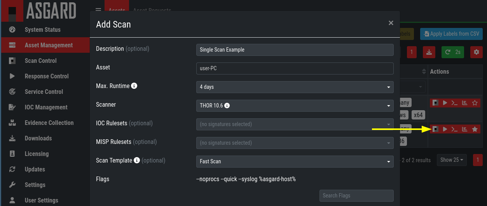
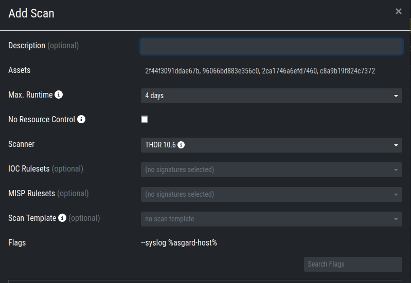
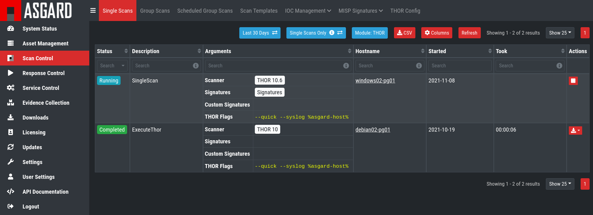
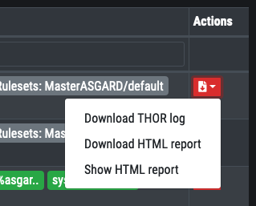

.. index:: Single Scan

Scan a Single System
====================

A single scan or standalone scan is a scan task which is
assigned directly to one asset. This is meant to be used
if you only want to scan one asset with a specific scan
configuration.

Create a Single Scan
~~~~~~~~~~~~~~~~~~~~

The creation of a scan is performed within the Asset Management. There is a
button for each asset to create a new scan and to show all past scans. 

Click on the "THOR" button in the Action column in the Asset Management view.

   Scan Control - Scan Creation

Within this form, you can choose the maximum runtime, module, scanner, scan flags,
signatures and template can be selected.

After the desired parameters have been set, the scan can be started by clicking the ``Add Scan`` button.

Create a Single Scan for multiple Assets
~~~~~~~~~~~~~~~~~~~~~~~~~~~~~~~~~~~~~~~~

If you want to run a Single Scan - instead of a Group Scan - on multiple Assets,
you can do this by navigating to the ``Asset Management`` View and select the
assets you want to scan.

Click the ``Add Scan`` button in the top right corner and fill in the scan options.
This will create a Single Scan for each asset.

   Scan Control - Multiple Single Scans

Stopping a Single Scan
~~~~~~~~~~~~~~~~~~~~~~

To stop a single scan, navigate to the "Single Scans" tab in Scan Control
section and click the "stop" (square) button for the scan you want to stop.

   Stopping a Single Scan

Download Scan Results 
~~~~~~~~~~~~~~~~~~~~~

After the scan completion, you can download the scan results via the
download button in the actions column.

The download button has the following options: 

* Download Scan Result as TXT (the THOR text log file)
* Download Scan Result as JSON (only available if it was started with the ``--json`` flag)
* Download HTML Report (as \*.gz compressed file; available for successful scans only)
* Show HTML Report (opens another tab with the HTML report)

   Scan Control - Download Scan Results