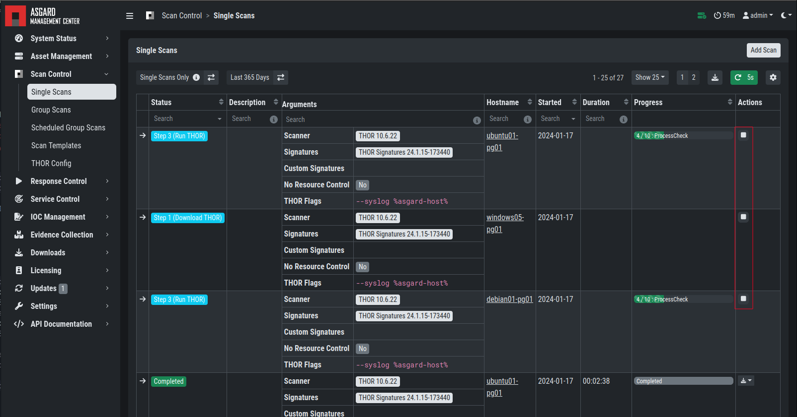

.. index:: Single Scan

Scan a Single System
====================

A single scan or standalone scan is a scan task which is
assigned directly to one or more assets. This is meant to
be used as a one time scan for a handful of assets.

Create a Single Scan
~~~~~~~~~~~~~~~~~~~~

The creation of a scan is performed within the ``Assets`` view. There is a
button for each asset to create a new scan and to show all past scans. You
can also assign a single scan to multiple assets. To do this, select your
assets and click the ``Add Scan`` button in the top right corner.

Click on the "THOR" button in the Action column in the Asset Management view.

   Scan Control - Scan Creation

Within this form, you can choose the maximum runtime, module, scanner, scan flags,
signatures or a template can also be selected.

After the desired parameters have been set, the scan can be started by
clicking the ``Add Scan`` button.

.. note::
   If the scan is interrupted due to an unplanned restart of the asset or by THOR or the ASGARD Agent due to lack of resources,
   the Agent resumes the scan from where it left off as soon as the asset is available again by adding the "--resume" flag. 
   By default, this happens a maximum of five times (``Max. THOR Resumes``) within of one week (``THOR Resume Deadline``).

   The default values for ``Max. THOR Resumes`` and ``THOR Resume Deadline``  can be modified in the :ref:`administration/advanced:advanced settings`.

   Manually setting the "--resume" flag has no effect when scanning via ASGARD.

Stopping a Single Scan
~~~~~~~~~~~~~~~~~~~~~~

To stop a single scan, navigate to the "Single Scans" tab in Scan Control
section and click the "stop" (square) button for the scan you want to stop.

   Stopping a Single Scan

Download Scan Results 
~~~~~~~~~~~~~~~~~~~~~

After the scan completion, you can download the scan results via the
download button in the actions column.

The download button has the following options: 

* Download Scan Result as TXT (the THOR text log file)
* Download Scan Result as JSON (only available if it was started with the ``--json`` flag)
* Download HTML Report (as \*.gz compressed file; available for successful scans only)
* Show HTML Report (opens another tab with the HTML report)

   Scan Control - Download Scan Results