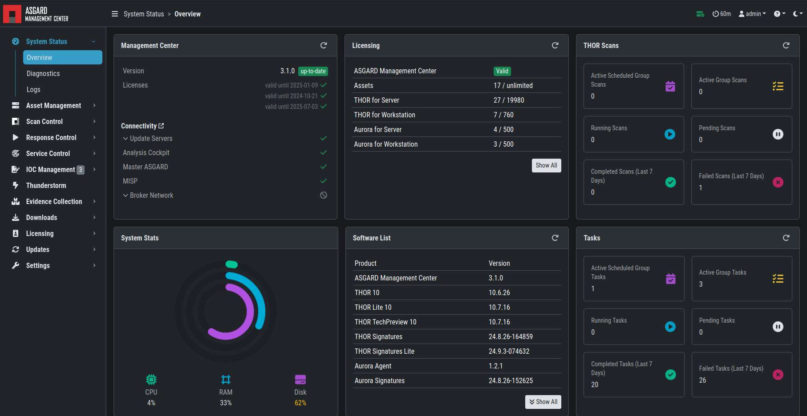

.. index:: System Status

System Status
=============

Status Overview
^^^^^^^^^^^^^^^

The initial system status page provides a summary of the
most important system components. 

It also includes the current resource consumption (disk,
CPU and memory) and lists the currently installed Management
Center software version, along with available versions of THOR.
The connection status to the update servers, Master ASGARD
and Cockpit are shown as well as multiple graphs which show asset
connections and asset streams.

.. note::
   The THOR version numbers may be missing in a new installation.
   THOR is **not** included in the installed packages and has to be
   downloaded first. The download is starting automatically after
   the installation, not later than one hour after installation.

   Overview Top Half

   Overview Bottom Half

Diagnostics
^^^^^^^^^^^

The diagnostics sub menu shows the periodically performed checks
and their status. Clicking the magnifying glass icon shows details
of the performed check. If a check failed it gives a detailed error
message and hints on which steps typically help in resolving the issue.

   Overview Over Periodic Diagnostic Checks

The indicator on the top right always shows if any of those checks
failed by showing a warning or error (i.e. yellow or red icon). You
can click the icon to view the diagnostics page as a pop-up.

Logs
^^^^

The logs section shows the latest and most relevant logs.
Complete logs can be found at ``/var/lib/asgard-management-center/log``.
You can also download the selected log type directly.

.. figure:: ../images/mc_logs-section.png
   :alt: Logs Section

   Logs Section

Available logs and their content:

.. list-table::
   :header-rows: 1
   :widths: 40,60

   * - Log Type
     - Explanation
   * - ASGARD Management Center
     - Overall status of the Management Center, general errors and warnings
   * - Audit
     - Containing user login/logout and changes done over the UI
   * - ASGARD Agent
     - Status of the agents deployed on assets
   * - ASGARD Agent Access Log
     - Logs of agents communicating with the Management Center
   * - THOR via Syslog
     - Received syslog events of THOR scans. Partial results if a scan did not complete
   * - THOR via Syslog (Scan Start, Licensing, Completion only)
     - As the name suggest, only those three event types
   * - Aurora
     - All Aurora events
   * - Aurora Event Producers
     - The top 10 event producing processes per endpoint
   * - Aurora Response Actions
     - Only response action events of Aurora
   * - Aurora Simulated Response Actions
     - Only simulated response action events of Aurora
   * - Diagnostic Pack
     - Button for generating and downloading a diagnostic pack that may be asked for by support
   * - Backup & Restore
     - Logs related to Backup & Restore activities
   * - Thunderstorm
     - Full Log output of the Thunderstorm service, including matches