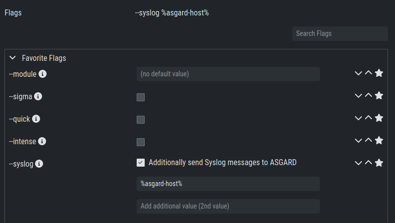

.. index:: Syslog Forwarding

Syslog Forwarding
=================

Syslog Forwarding is selected by default, with the ``%asgard-host%``
target, if you create a new THOR scan task. This is a new feature
in ASGARD which has a few advantages and why you should consider
using it:

* You see live statistics of your THOR scans
* You see at which stage the THOR scan is
* You can see which module is being executed
* You will see the last scanned element (helpful if a scan is stuck)
* If a scan is being stopped by an outside process, no logs are
  available (more information further down)
* You can use :ref:`administration/additional:rsyslog forwarding` to forward
  log lines immediately to the Cockpit/your SIEM

A normal flow of information for a THOR scan looks like this:

* New scan is being created on the ASGARD
* Agent checks in a asks if any tasks are available
* ASGARD assigns the newly created THOR scan task to the asset
* Asset is downloading THOR from the ASGARD and starts scanning
* THOR finished the scan and the Asset is forwarding the scan result
  as a whole to the ASGARD

This means that your scan results take a while until you see them
in your ASGARD, since the results will be uploaded to the ASGARD
**after** the scan has finished. This also means if an outside process
(e.g. Antivirus or EDR) killed THOR during the scan, you will not have
any results in your ASGARD and have to troubleshoot why the scan failed,
mainly by running THOR in debugging mode manually on the endpoint.

To configure syslog forwarding of logs, you can set the ``--syslog`` flag
during scans. You have multiple options as to where you can send the logs.

The ``--syslog`` value is constructed of the following arguments. Please
keep in mind that the fields need to be in the correct order. Values are
separated with the colon sign ``:``

.. list-table::
   :header-rows: 1

   * - Pos.
     - Field
     - Description
     - Possible Values
   * - 1
     - Server
     - The receiving server, ``%asgard-host%`` is the ASGARD which issued the Scan for the Agent
     - FQDN or IP of remote host
   * - 2
     - Port
     - The listening port on the remote system - **optional**, default is ``514``
     - 1 - 65535
   * - 3
     - Format
     - The log format - **optional**, default is ``DEFAULT``
     - \- DEFAULT [1]_
     
       \- CEF
       
       \- JSON
       
       \- SYSLOGJSON
       
       \- SYSLOGKV
   * - 4
     - Socket
     - The socket type - **optional**, default is ``UDP``
     - \- UDP

       \- TCP

       \- TCPTLS

.. [1] This is the default log format of THOR.

.. hint:: 
   The syslog listener on the ASGARD is running on port UDP/514.

Examples:

* ``172.16.20.10:514:SYSLOGKV:TCP``
* ``rsyslog-forwarder.dom.int:514:JSON:TCP``
* ``arcsight.dom.int:514:CEF:UDP``

If you choose to use the ``--syslog`` flag, please make sure that the
necessary ports are allowed within your network/firewall. If you decide
to forward your logs via ASGARD to a SIEM, please have a look at
:ref:`administration/additional:rsyslog forwarding`.