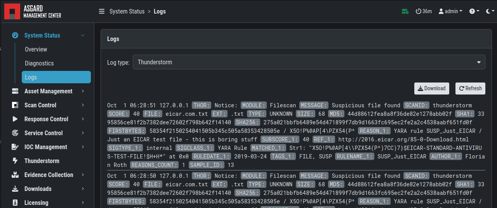

.. index:: THOR Thunderstorm

Thunderstorm
============

Since version 3.1 of the ASGARD Management Center, you can
enable THOR Thunderstorm directly on your ASGARD system.
This allows you to scan many unsupported endpoints with THOR
Thunderstorm. Please note that you need a valid THOR Thunderstorm
license to use this feature. The license has to be issued to
the same hostname as the ASGARD Management Center, since the
license is still host-based.

For usage of Thunderstorm Collectors, please refer to ``Downloads`` >
``Thunderstorm``.

.. figure:: ../images/mc_thunderstorm.png
   :alt: Thunderstorm Overview Page

   Thunderstorm Overview Page

The Thunderstorm Service listens only locally (127.0.0.1). Your
ASGARD Management Center is acting as a reverse proxy for the
Thunderstorm service. To see which ports are being used,
please have a look at the :ref:`requirements/network:Thunderstorm (optional)`
section.

This also means you will see logs similar to the one below:

.. code-block:: none

   Sep 30 12:57:28 asgard3.local THOR: Info: MODULE: Thunderstorm MESSAGE: Web service started at http://127.0.0.1:45329/ SCANID: thunderstorm

This is normal behavior and does not indicate a problem.

.. hint::
   The Thunderstorm API uses the same certificate as the
   ASGARD Management Center Web UI (port 8443). Please see
   :ref:`administration/additional:tls certificate installation`
   for more information.

Thunderstorm License
--------------------

To use Thunderstorm, you need a valid Thunderstorm license.
You can upload your license in the ``Licensing`` > ``Licenses``
section of the ASGARD Management Center (``Upload License`` button).

   Thunderstorm License

.. hint::
   When you install a license for the first time, Thunderstorm
   will start automatically. If you upload a new license, you
   have to restart Thunderstorm manually.

Thunderstorm Logs
-----------------

The Thunderstorm service is meant to forward any findings to
the ASGARD Analysis Cockpit. If you want to inspect the findings
directly on the ASGARD Management Center, you can do so by
navigating to ``System Status`` > ``Logs`` > ``Thunderstorm``.

   Thunderstorm Logs

Thunderstorm configuration
--------------------------

You can change certain settings for Thunderstorm in the
the Thunderstorm overview page. Click the cog icon in the
top right corner to open the settings page.

   Thunderstorm Configuration

You can also stop and start the Thunderstorm service from
settings modal.