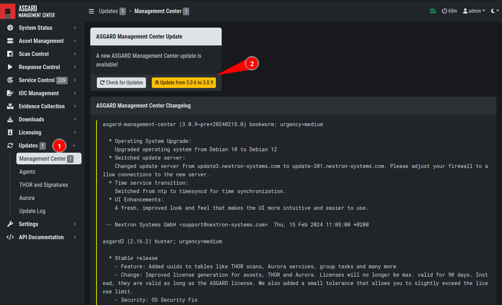
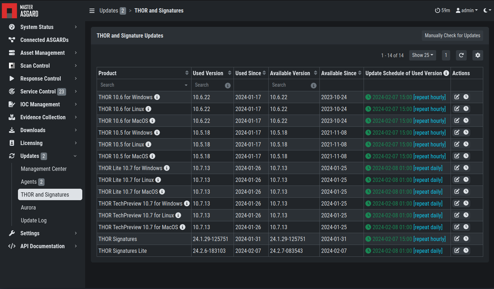
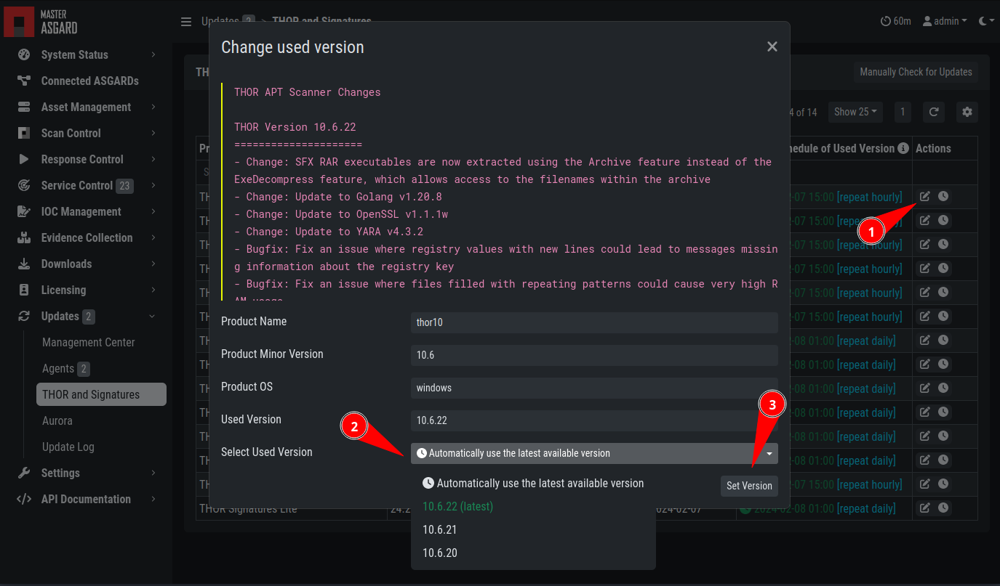

.. index:: Updates

Updates
=======

ASGARD Updates
^^^^^^^^^^^^^^

ASGARD will search for ASGARD updates on a daily basis. Available
updates will automatically be shown in the section ``Updates``. 

As soon as an ASGARD update is available, a button ``Upgrade from ... to ...``
appears. Clicking this button will start the update process. The
ASGARD service will be restarted and the user will be forced to
re-login. Generally update MASTER ASGARD before the connected ASGARDs.

   Updating ASGARD

Updates of THOR and THOR Signatures
^^^^^^^^^^^^^^^^^^^^^^^^^^^^^^^^^^^

By default, ASGARD will search for signature updates and THOR
updates on an hourly basis. These updates will be set to active
automatically. Therefore, a triggered scan will always employ the
current THOR version and current signature version. You may disable
or modify the automatic THOR and Signature updates by deleting or
modifying the entries in this section.

   Automatic Scanner and Signature Updates

It is possible to intentionally scan with an old scanner version by
clicking on the pencil icon and selecting the respective version
from the drop-down menu. 

Please be aware, that this is a global setting and will affect all scans!

   Selecting a Scanner Version manually

.. hint:: 
   You can trigger a Manual Check and download new THOR packages by clicking
   ``Manually Check for Updates``. This can also be used in new ASGARD 
   installations, as sometimes it takes a while until ASGARD does this automatically.

Agent Updates
^^^^^^^^^^^^^

If an asset or an agent can be update, there will be a notice
shown in the ``Updates`` > ``Agents`` tab.

.. figure:: ../images/update-agent.png
   :alt: Update Agent

   Update Agent
