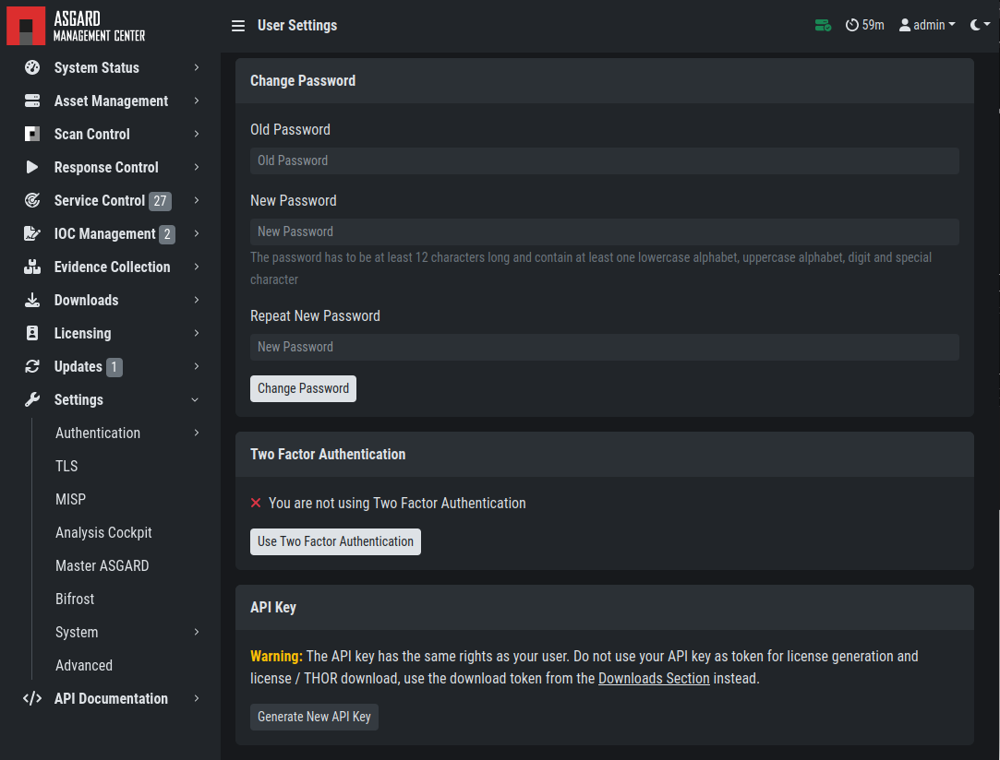
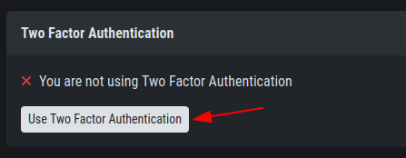
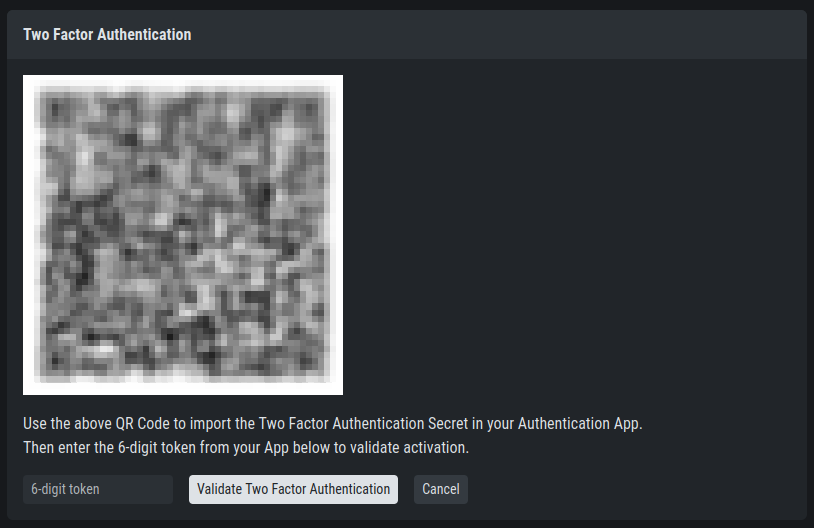
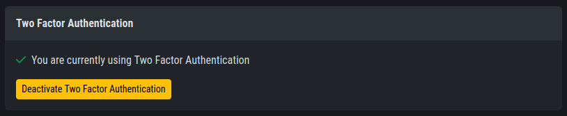

.. index:: User Settings

User Settings
=============

The following settings will only affect the currently logged in user.

Changing your password
^^^^^^^^^^^^^^^^^^^^^^

To change your password, click your username in the top right
corner and click ``User Settings``. This will lead you to the
personal user settings.

   Changing your password

Two Factor Authentication
^^^^^^^^^^^^^^^^^^^^^^^^^

We are currently using the ``Time-based One-time Password (TOTP)``
algorithm for two factor authentication. We recommend
one of the following mobile apps for 2FA:

   - Google Authenticator
   - Microsoft Authenticator
   - Twilio Authy
   - iOS built-in Password Manager (iOS 15 or newer)

Enable Two Factor Authentication
~~~~~~~~~~~~~~~~~~~~~~~~~~~~~~~~

To enable Two Factor Authentication, click ``Use Two Factor Authentication``
in your User Settings and follow the instructions on the screen.

After clicking the button, you will be presented with a QR
code for your authenticator app of your choice.
Alternatively, you can use the secret key. You will need
to verify the 6-digit token and click ``Validate Two Factor Authentication``
to enable 2FA.

.. note:: 
   You will be logged out of your current session if the validation was successful.

Disable Two Factor Authentication
~~~~~~~~~~~~~~~~~~~~~~~~~~~~~~~~~

To disable 2FA, navigate to ``User Settings`` > ``Two Factor Authentication``
and click ``Deactivate Two Factor Authentication``.

.. note:: 
   If a user is unable to log into ASGARD to disable their own 2FA,
   follow the instructions at :ref:`troubleshooting/2fa:resetting two factor authentication`

API Key
^^^^^^^

To generate an API Key, navigate to ``User Settings`` > ``API Key``.

This page allows you to set an API key. If an API key was previously set,
a new key will be generated. You will only be able to see your new API key
once after it has been generated.

.. note:: 
   Currently an API key always has the access rights of the
   user context in which it has been generated. If you want to create a
   restricted API key, add a new restricted user and generate an API key
   in the new user's context.

.. warning:: 
   The API key has the same rights as your user. Do not use your
   API key as token for license generation and license / THOR download.
   Instead, use the download token from the ``Downloads`` menu
   (:ref:`administration/download:download links`).
