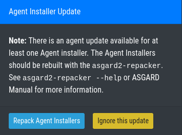

.. index:: Agent and Agent Installer Update

Agent and Agent Installer Update
================================

When ASGARD has a new agent version available you can see an indicator
on the ``Update`` menu item as well as on the sub menu ``Update`` > ``Agents``.
There are two tasks to perform, updating the agents on your assets and
updating the agent installer for all future asset deployments.

Agent Update
^^^^^^^^^^^^

If this is the first agent update performed on this ASGARD you might need
to enable the ``Update Agent`` module under ``Settings`` > ``Advanced`` > ``Show Advanced Tasks``.

Then you need to run the ``Update Agent`` module. You can do this on a per
asset basis by running a playbook from ``Asset Management`` or create a
``New Group Task`` from ``Response Control``, which is the preferred way.
You can roll-out the update in batches by providing labels for each stage
or not select any label to perform the update on all assets.

.. figure:: ../images/mc_agent-update-group-task.png
   :alt: Example Group Task for Agent Update

   Example Group Task for Agent Update

.. note::
   The ``Update Agent`` module is not shown by default under (Group)
   Tasks. To show the group task or single tasks (also inside the group task)
   you need to select the ``Update Agent`` module from the ``Module``
   column. You may need to select the ``Module`` column from ``Column visibility``
   first, if not shown.

.. todo:: verify since it might be outdated

Agent Installer Update
^^^^^^^^^^^^^^^^^^^^^^

You need to update the agent installer as well, so that newly added
assets will directly use the current agent version. This is a manual
task as you might have customized your installers. If this is the case
you have to repack the agent installers as explained
in :ref:`advanced/custom-agent:creating custom agent installer`.

If you use the default installer without any modifications you can run
the following command to update the agent installers:

.. code-block:: console

   nextron@asgard:~$ sudo asgard2-repacker

Or you can execute the agent installer update from within the WebUI at
``Updates`` > ``Agents`` > ``Repack Agent Installers`` at the bottom.

   Execute asgard2-repacker from the WebUI