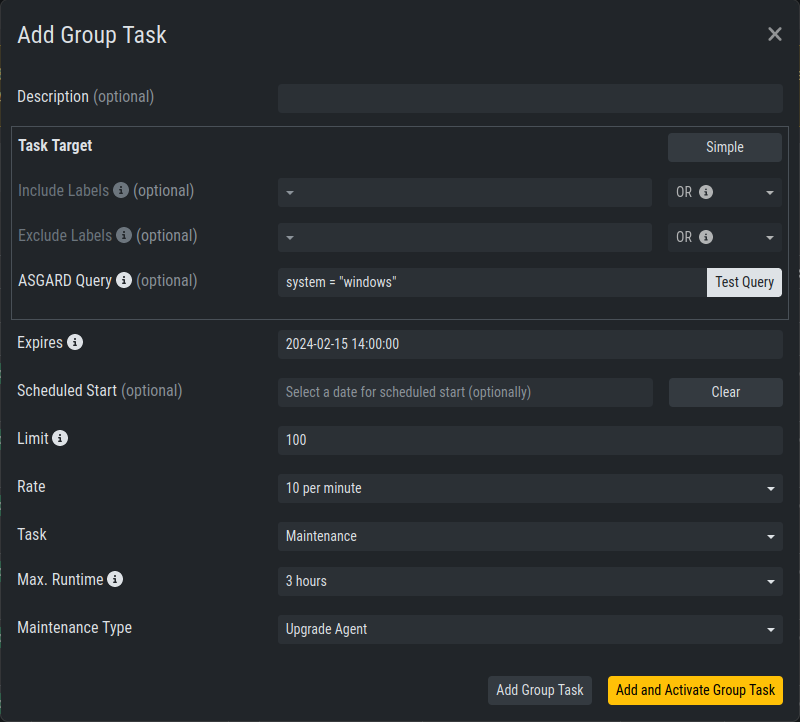
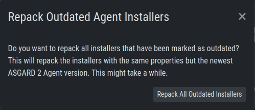

.. index:: Agent and Agent Installer Update

Agent and Agent Installer Update
================================

When ASGARD has a new agent version available you can see an indicator
on the ``Update`` menu item as well as on the sub menu ``Update`` > ``Agents``.
There are two tasks to perform, updating the agents on your assets and
updating the agent installer for all future asset deployments.

Agent Update
^^^^^^^^^^^^

If this is the first agent update performed on this ASGARD you might need
to enable the ``Update Agent`` module under ``Settings`` > ``Advanced`` > ``Show Advanced Tasks``.

Then you need to run the ``Update Agent`` module. You can do this on a per
asset basis by running a playbook from ``Asset Management`` or create a
``New Group Task`` from ``Response Control``, which is the preferred way.
You can roll-out the update in batches by providing labels for each stage
or not select any label to perform the update on all assets.

   Example Group Task for Agent Update

.. note::
   The ``Update Agent`` module is not shown by default under (Group)
   Tasks. To show the group task or single tasks (also inside the group task)
   you need to select the ``Update Agent`` module from the ``Module``
   column. You may need to select the ``Module`` column from ``Column visibility``
   first, if not shown.

Agent Installer Update
^^^^^^^^^^^^^^^^^^^^^^

You need to update the agent installer as well, so that newly added
assets will directly use the current agent version. This is a manual
task you have to perform once a new version is available. Navigate
to ``Downloads`` > ``Agent Installers`` and click ``Repack Outdated
Agent Installers``. Please note that this process might take a while
to finish.

   Repack Agent Installers