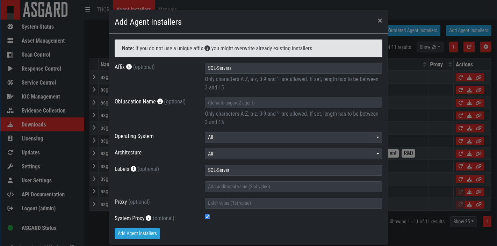

.. index:: Creating Custom Agent Installer

Creating Custom Agent Installer
===============================

ASGARD supports creation of custom installers. Custom installers can be
configured in a way that agents show up with a preset label or with a
preset proxy configuration.

Creating Custom Agent Installer From GUI
^^^^^^^^^^^^^^^^^^^^^^^^^^^^^^^^^^^^^^^^

Go to ``Downloads`` > ``Agent Installers`` > ``Add Agent Installer``.
Edit the properties of the desired installer and generate the installer
by clicking ``Add Agent Installers``. The installers are available at the
downloads page besides the default installers, so best use an affix as distinction.

   Custom Agent Installer from the WebUI

You can also delete old Agent Installers which are not needed anymore. Just
select the Installer(s) and Click the ``Delete`` button in the top right corner.

Creating Custom Agent Installer From CLI (deprecated)
^^^^^^^^^^^^^^^^^^^^^^^^^^^^^^^^^^^^^^^^^^^^^^^^^^^^^

In order to create your custom ASGARD agent, save the current agents stored in
``/var/lib/nextron/asgard2/installer/`` to a directory of your choosing and run
``sudo asgard2-repacker`` with one or more of the following flags:

``-labels string``

Add initial labels to clients comma separated list, e.g. ``[label1,label2,label3]``

``-proxies string``

Proxies to be used by agents comma separated list, e.g. ``[proxy1.nextron:3128,proxy2.nextron:3128]``

Example: In order to create an installer for servers that initially show up in
ASGARD with the label ``SQL-Servers`` use:

.. code-block:: console

   nextron@asgard:~$ sudo asgard2-repacker -label SQL-Servers

Your newly generated agents will show up in ``/var/lib/nextron/asgard2/installer``
and will immediately be available for download from the login page. You can store
multiple custom agents under ``/var/lib/nextron/asgard2/installer/``. In this case
all agents will be available for download from ASGARDs login page.

You can obfuscate the default asgard2-agent name with a custom one. The chosen name
will generate new agents which can be deployed to the endpoints. These agents will
create a service with the chosen name and will have no reference to ASGARD.

``-name string``

.. code-block:: console

   nextron@asgard:~$ sudo asgard2-repacker -name javax

This command will create a new agent for all operating systems.
This is specially designed for cases where an agent obfuscation is required.

An installed agent with the name "javax" would look like this:

.. code-block:: console

   nextron@asgard:~$ systemctl status javax
   javax.service
   Loaded: loaded (/etc/systemd/system/javax.service; enabled; vendor preset: enabled)
   Active: active (running) since Thu 2020-xx-xx 16:47:22 CET; 5s ago
   Main PID: 20048 (javax-service)
      Tasks: 7 (limit: 4915)
   Memory: 4.7M
   CGroup: /system.slice/javax.service
           20048 /usr/sbin/javax-serviceMar 26 16:47:22 asgard2-dev systemd[1]: Started javax.service.