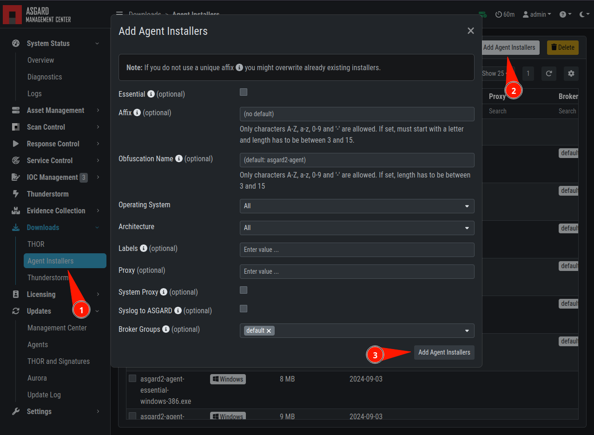

.. index:: Creating Custom Agent Installer

Creating Custom Agent Installer
===============================

ASGARD supports creation of custom installers. Custom installers can be
configured in a way so that agents show up with a preset label or with a
preset proxy configuration.

Go to ``Downloads`` > ``Agent Installers`` > ``Add Agent Installer``.
Edit the properties of the desired installer and generate the installer
by clicking ``Add Agent Installers``. The installers are available at the
downloads page besides the default installers, so best use an affix as distinction.

   Custom Agent Installer from the WebUI

.. note::
   If a new version of the agent installer is available, you will see a notice
   that agent installers need repacking. You can press the ``Repack Outdated
   Agent Installers`` button and wait for the process to finish. This guarantees
   that newly downloaded installers use the newest version.