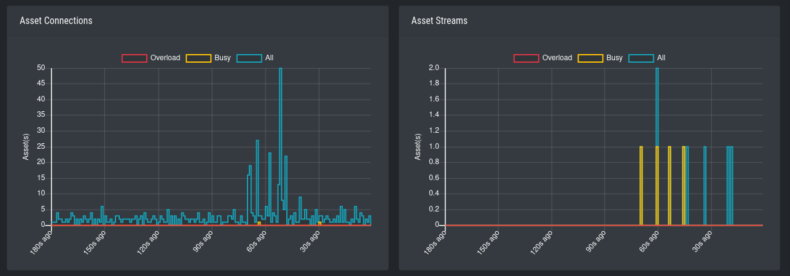
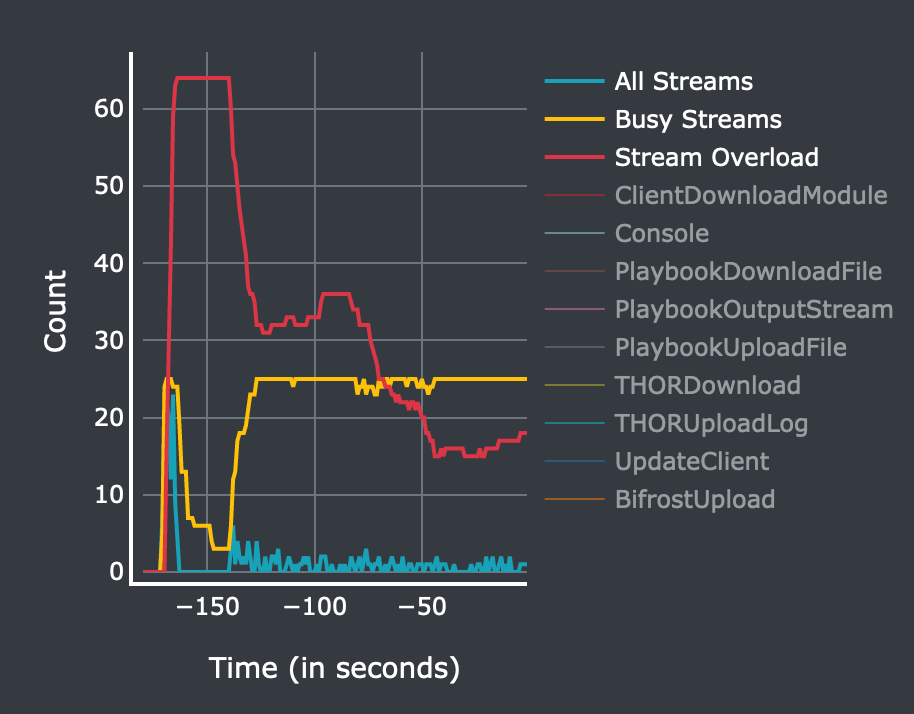

.. index:: Performance Tuning

Performance Tuning
==================

The ASGARD agents poll the Management Server server frequently for new tasks to execute.
The default polling interval depends on the number of connected endpoints. In
larger environments the polling interval increases dynamically up to 10 minutes
for a configuration with 25.000 endpoints connected to a single ASGARD. 

Additionally, ASGARD is configured to serve a maximum of 100 concurrent asset
connections and 25 concurrent asset streams. Asset connections are short polls
from the agent such as answering the question "do you have a new task for me?".
Asset streams are intense polls such as downloading THOR to the agent or
uploading scan results back to ASGARD. 

Requests that exceed the limits will receive an answer from ASGARD to repeat the
request after N seconds, where N is calculated based on the current load.

This factory preset behavior insures your ASGARD stays stable and responsive even if your
ASGARD's system resources are limited. Furthermore, you most likely can't overload your
network or firewalls with high numbers of requests or downloads.

In order to modify ASGARDs performance settings edit ``/etc/asgard-management-center/asgard.conf``
and restart the ASGARD service.

The default values are: 

.. list-table::
   :header-rows: 1
   :widths: 35, 65

   * - Value
     - Description
   * - LoadConnMax=100
     - Max. concurrent „Busy Connections"
   * - LoadStreamMax=25
     - Max. concurrent „Busy Streams"
   * - PingRateMin=10
     - Polling Rate with 0 connected Assets (seconds)
   * - PingRateMax=600
     - Polling Rate with 25000 connected Assets (seconds)
   * - PingRateFast=5
     - Polling Rate for Assets in Fast Ping Mode (seconds)

These values should work fine in most scenarios – regardless of the size
of the installation. However, you may want to decrease PingRateMax
in order to achieve a better responsiveness of your ASGARD infrastructure. 

Overloading ASGARD
^^^^^^^^^^^^^^^^^^

While temporary stream overloads are quite normal, connection overloads
should not happen. If they do, either adjust your PingRateMax, your LoadConnMax or both. 

ASGARD will indicate an overload with the "Connection Overload line"
and the "Stream Overload line" within the graphs in the overview
section (see picture below). If an ASGARD is in an overload situation
it will postpone connections and streams but will not lose or drop
tasks or be harmed in any way. ASGARD will recover to normal load automatically.

   Asset Connections and Asset Streams 

Stream overloads can happen temporarily (e.g. if you schedule a grouped
scan or grouped task with an unlimited rate). The picture below
shows such a normal overload situation that was caused by starting
a grouped scan with an unlimited rate. This is the expected behavior.
ASGARD will manage the load automatically and postpone streams until
the load has returned to normal.

   Asset Streams in an overload situation

The "Busy Streams" line indicates the number of streams currently active. 
s you might have guessed, the picture above was taken on an ASGARD in
default configuration where the number of concurrent streams is set
to the default value of 25.