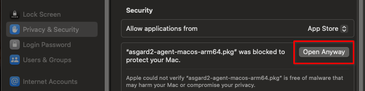

.. index:: Bypass Apple verification during installation of asgard2-agent

Bypass Apple verification during installation of asgard2-agent
==============================================================

This section aims to describe possible workarounds, intended to be a
reference for IT administrators or IT packaging teams to bypass Apple
verifications and install the personalized ``asgard2-agents`` on macOS
Big Sur (or newer) workstations.

Starting with macOS 15
~~~~~~~~~~~~~~~~~~~~~~~

**Option 1: Remove the quarantine flag from the ASGARD Agent installer via terminal session**

.. code-block:: console

   MacBook-Pro:~ nextron$ sudo xattr -rd com.apple.quarantine /Users/nextron/Downloads/asgard2-agent-macos-arm64.pkg

**Option 2: Unblock the installer via the Security Settings**

1. Navigate to ``System Settings`` > ``Privacy & Security`` > ``Security``
2. Click on button ``Open anyway`` next to ``asgard2-agent-macos-arm64.pkg ...``

Before macOS 15
~~~~~~~~~~~~~~~
.. warning::
   Executing this workaround puts your system at risk for a short period of time. 
   It will deactivate global security mechanisms of the operating system, which are intended to
   protect the integrity of the system. Please make sure to follow the below
   steps carefully and enable those security mechanisms after you are done.

Please always keep in mind to check your system after performing any of
the described actions, to ensure that all security mechanisms are in
place and are re-activated after performing the described actions.

Please follow the below steps to install the ASGARD Agent on macOS.

1. Open a new terminal session

2. Deactivate macOS Gatekeeper

   * ``sudo spctl --master-disable``

3. Close the terminal and open a new terminal session

4. Install the asgard2-agent

   * ``sudo installer -pkg /path/to/asgard2-agent-macos-amd64.pkg -target /``

5. Close the terminal and open a new terminal session

6. Reactivate macOS Gatekeeper

   * ``sudo spctl --master-enable``

.. warning:: 
   Make sure to activate the macOS Gatekeeper once you are done:
   
   ``sudo spctl --master-enable``

You can verify the state of the macOS Gatekeeper with:

.. code-block:: console

   MacBook-Pro:~ nextron$ spctl --status
   assessments enabled

On a system with activated Gatekeeper, the output has to be ``assessments enabled``.