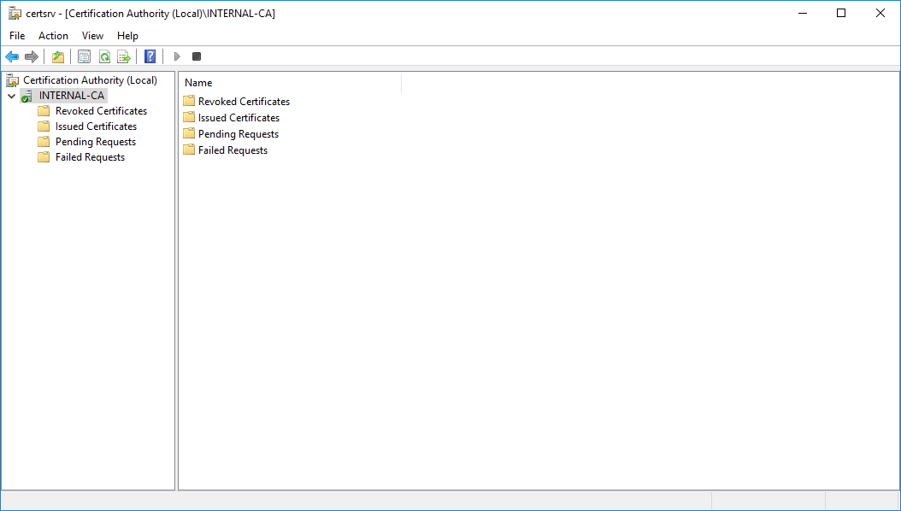
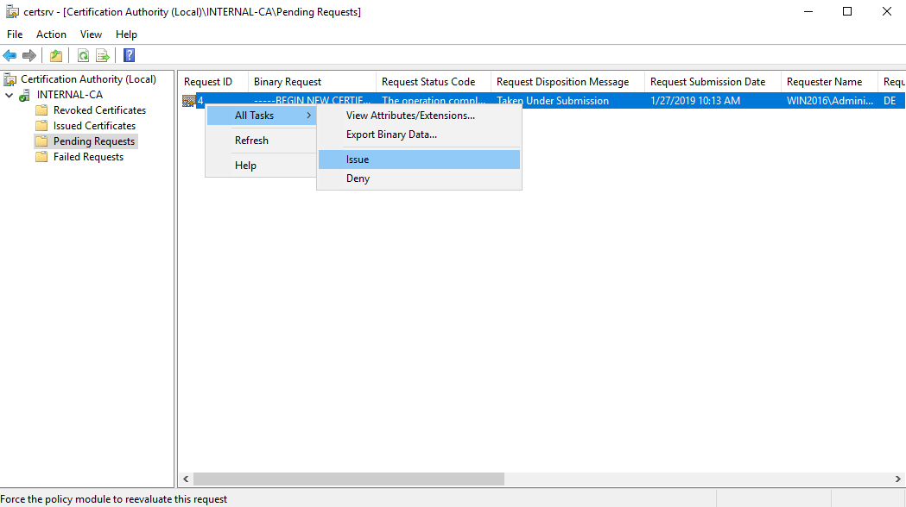
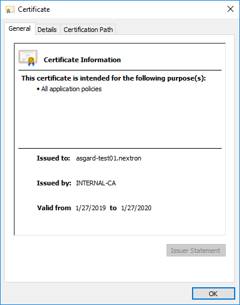
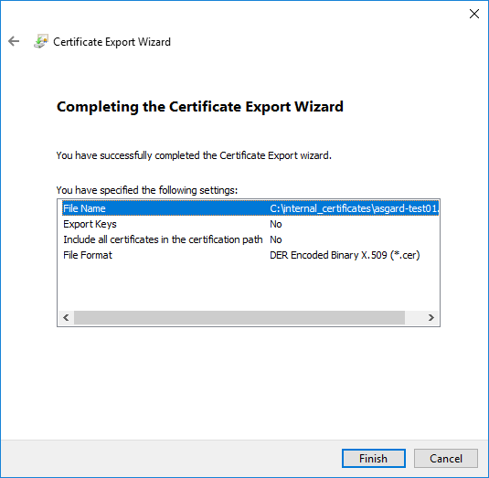
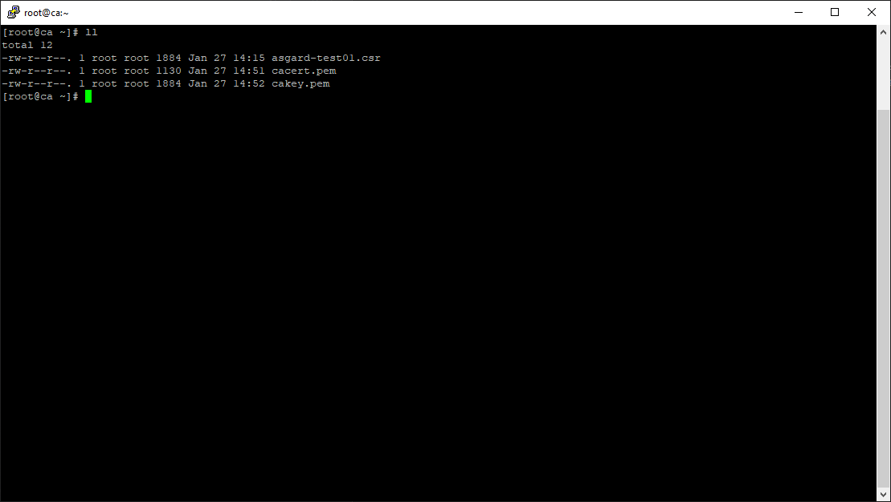
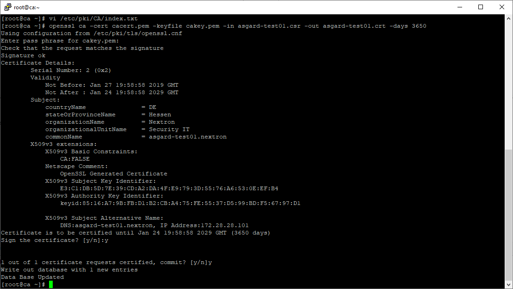
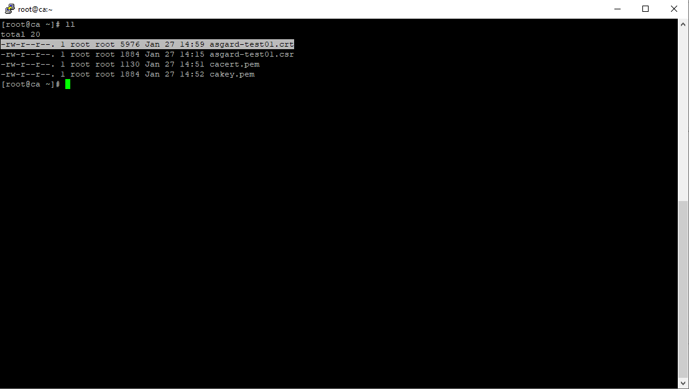

.. index:: Install TLS certificates on ASGARD and MASTER ASGARD

Install TLS certificates on ASGARD and MASTER ASGARD
====================================================

There are several methods to sign the ASGARD generated CSR
request. This section describes the two most common procedures.

Use Case 1 - CSR Signing with a Microsoft Based CA
^^^^^^^^^^^^^^^^^^^^^^^^^^^^^^^^^^^^^^^^^^^^^^^^^^

Open the Certificate Authority snap-in within Windows Server

   certsrv – Microsoft Certification Authority Main Page

Right click your CA >> All Tasks >> Submit new request

.. figure:: ../images/certsrv2.png
   :alt: certsrv – Submit new request

   certsrv – Submit new request 

Locate and open the signing request file we've saved in previous steps

.. figure:: ../images/certsrv3.png
   :alt: certsrv – Locate the CSR to be signed

   certsrv – Locate the CSR to be signed

Navigate to the "Pending Requests" within your CA snap-in and right
click the imported CSR >> All Tasks >> Issue

   certsrv – Issue the certificate

Once the certificate has been issued, it will be located under "Issued Certificates"

.. figure:: ../images/certsrv5.png
   :alt: certsrv – Locate issued certificate

   certsrv – Locate issued certificate

Right click on the issued certificate and click open

.. figure:: ../images/certsrv6.png
   :alt: certsrv – Export certificate

   certsrv – Export certificate

Inspect the information of the Certificate and continue to the next step, if the presented data is correct.

   certsrv – Export certificate

Check that the generated certificate has a status of OK

.. figure:: ../images/certsrv8.png
   :alt: certsrv – Export certificate

   certsrv – Export certificate

Navigate to the Details tab and click "Copy to File…"

.. figure:: ../images/certsrv9.png
   :alt: certsrv – Export certificate

   certsrv – Export certificate

On the Certificate Export Wizard – click Next 

.. figure:: ../images/certsrv10.png
   :alt: certsrv – Export certificate

   certsrv – Export certificate

Select Base-64 encoded X.509(.CER) and click Next

.. figure:: ../images/certsrv11.png
   :alt: certsrv – Export certificate

   certsrv – Export certificate

Choose an output location and click Next

.. figure:: ../images/certsrv12.png
   :alt: certsrv – Export certificate

   certsrv – Export certificate

Click Finish - Once the confirmation message box pops up, click OK

   certsrv – Export certificate

Navigate to Settings >> TLS.

On the bottom of the page click ``Upload TLS Certificate`` and select the
exported certificate from the previous step.

.. figure:: ../images/mc_upload-tls-cert.png
   :alt: ASGARD Certificate Import

   ASGARD Certificate Import

If all steps were followed, a message box should pop up indicating
that the certificate was successfully installed.

Navigate to Settings >> Services and restart the ``ASGARD 2 Service`` by clicking ``Restart`` button.
                                
.. figure:: ../images/asgard-service-restart.png
   :alt: ASGARD service restart

   ASGARD service restart

Please take into consideration that it could take a few minutes until the ASGARD Service is restarted successfully.

After the service has been successfully restarted, the installed certificate is shown in the browser.

.. figure:: ../images/asgard-cert-check.png
   :alt: ASGARD certificate installation check

   ASGARD certificate installation check

Use Case 2 - CSR Signing with an OpenSSL Based CA
^^^^^^^^^^^^^^^^^^^^^^^^^^^^^^^^^^^^^^^^^^^^^^^^^

.. warning:: 
   In order to avoid security warnings [1]_ on some browsers, the CA signing
   process needs to ensure to copy all Subject Alternative Name (SAN) from the CSR to the signed Certificate.

.. [1]
   These security warnings are a result of an incomplete signing process,
   where requested attributes from the CSR are not included in the signed certificates
   (subjectAltName).

There are two ways of doing this while singing the CSR via openssl. 

**The first method** of including all extensions from the CSR to the new certificate,
is via the ``openssl.cnf`` file, by uncommenting the ``copy_extensions`` attribute.

The location of the ``openssl.cnf`` file depends on your system. On our test system, this
file was located at ``/etc/pki/tls/openssl.cnf``.

.. warning:: 
   Please make sure to comment the line out again once you are done with singing
   your CSR.

Example:

.. code-block:: none
   :lineno-start: 80
   :linenos:
   :emphasize-lines: 27

   ####################################################################
    [ CA_default ]

    dir             = ./demoCA                # Where everything is kept
    certs           = $dir/certs              # Where the issued certs are kept
    crl_dir         = $dir/crl                # Where the issued crl are kept
    database        = $dir/index.txt          # database index file.
    #unique_subject = no                      # Set to 'no' to allow creation of
                                              # several certs with same subject.
    new_certs_dir   = $dir/newcerts           # default place for new certs.

    certificate     = $dir/cacert.pem         # The CA certificate
    serial          = $dir/serial             # The current serial number
    crlnumber       = $dir/crlnumber          # the current crl number
                                              # must be commented out to leave a V1 CRL
    crl             = $dir/crl.pem            # The current CRL
    private_key     = $dir/private/cakey.pem  # The private key

    x509_extensions = usr_cert                # The extensions to add to the cert

    # Comment out the following two lines for the "traditional"
    # (and highly broken) format.
    name_opt        = ca_default              # Subject Name options
    cert_opt        = ca_default              # Certificate field options

    # Extension copying option: use with caution.
    copy_extensions = copy

    [...]

**The second method** of including all extensions from the CSR to the new certificate,
is via an extension file (for example ``asgard-test01.ext``) containing all your subjectAltName entries.
This tells openssl to use a extension for signing the CSR. In our case the extension contains a list of
``subjectAltName`` values.

To do this, place a file with your subjectAltName entries in the same folder of your CSR. The contents of this file
look something like the following example. Values after ``subjectAltName =`` should be equal to the
values of your CSR:

.. code-block:: console

   root@ca:~# cat asgard-test01.ext
   subjectAltName = DNS:asgard-test01.nextron, IP Address:172.28.28.101

The content should be identical to the values you set in your CSR. You can
inspect those with the following command:

.. code-block:: console
   :emphasize-lines: 17

   root@ca:~# openssl req -in asgard-test01.csr -noout -text                                                                                                                [31/146]
   Certificate Request:                                                                                                                                                                          
    Data:                                                                                                                                                                                     
        Version: 1 (0x0)                                                                                                                                                                      
        Subject: C = DE, ST = Hesse, O = Nextron, OU = Security IT, CN = asgard-test01.nextron                                                                                                                                            
        Subject Public Key Info:                                                                                                                                                              
            Public Key Algorithm: rsaEncryption                                                                                                                                               
                Public-Key: (4096 bit)                                                                                                                                                        
                Modulus:                                                                                                                                                                      
                    00:cb:74:c9:ed:4e:4d:db:39:7b:e0:dc:bb:55:d6:                                                                                                                             
                    [...]
                    c2:9f:69
                Exponent: 65537 (0x10001)
        Attributes:
            Requested Extensions:
                X509v3 Subject Alternative Name: 
                    DNS:asgard-test01.nextron, IP Address:172.28.28.101

Prepare the CA certificate, CA private key and the certificate signing request (and optionally your extension
file, if you chose method 2).

   CSR and signing Certificates preparation

Execute/adapt the following command depending on the method you chose before:

**First method**:

.. code-block:: console

   root@ca:~# openssl ca -cert cacert.pem -keyfile cakey.pem -in asgard-test01.csr -out asgard-test01.crt -days 3650
   Using configuration from /etc/pki/tls/openssl.conf
   Enter pass phrase for cakey.pem:

.. figure:: ../images/csr2.png
   :alt: Certificate signing command

   Certificate signing command

**Second method**:

.. code-block:: console
   :emphasize-lines: 19

   root@ca:~# openssl ca -cert cacert.pem -keyfile cakey.pem -in asgard-test01.csr -out asgard-test01.crt -days 3650 -extfile asgard-test01.ext
   Using configuration from /etc/pki/tls/openssl.conf
   Enter pass phrase for cakey.pem:
   Check that the request matches the signature
   Signature ok
   Certificate Details:
           Serial Number: 1 (0x1)
           Validity
               Not Before: Feb 23 09:58:10 2023 GMT
               Not After : Feb 20 09:58:10 2033 GMT
           Subject:
               countryName               = DE
               stateOrProvinceName       = Hesse
               organizationName          = Nextron
               organizationalUnitName    = Security IT
               commonName                = asgard-test01.nextron
           X509v3 extensions:
               X509v3 Subject Alternative Name: 
                   DNS:asgard-test01.nextron IP Address:172.28.28.101
   Certificate is to be certified until Feb 20 09:58:10 2033 GMT (3650 days)

Enter the passphrase for your CA's private key

.. figure:: ../images/csr3.png
   :alt: Signing procedure

   Signing procedure

Confirm that the data contained in the CSR is accurate and confirm the signing of the request to the CA.

.. figure:: ../images/csr4.png
   :alt: Signing procedure – Checking data is accurate

   Signing procedure – Checking data is accurate

Once confirmed commit the changes to your local DB.

   Signing procedure – Committing changes

As a result, the signed certificate will be available with the indicated filename.

   Signing procedure – Locating the generated certificate

As a last step, the generated certificate can be imported
following the :ref:`administration/additional:tls certificate installation` steps.
