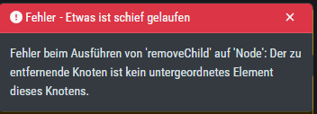

Known Issues
============

AMC#006: THOR License not valid yet (timezone difference)
---------------------------------------------------------

.. list-table::
    :header-rows: 1
    :widths: 50, 50

    * - Introduced Version
      - Fixed Version
    * - <= 2.16.3
      - N/A

There is currently a bug in the ASGARD Management Center which
can can cause problems during THOR license generation. This happens
if the following conditions are given:

-  An asset which is located in a different timezone to your ASGARD Management
   Center

- The difference between the two timezones is greater than 8 hours.

If this is the case for a few assets of yours, you will encounter
the following error in your THOR scan:

.. code-block:: none

   REASON: license not valid yet

AMC#006: Workaround
~~~~~~~~~~~~~~~~~~~

The current workaround is to avoid issuing THOR licenses on your
ASGARD Management Center during a specific time window. We take
the time difference between your asset and your Management Center
and subtract 8 hours. The resulting time is the time window,
beginning at 00:00 AM local time of your Management Center, from
which you should avoid issuing licenses. Below are two examples:

- ASGARD Management Center timezone: UTC +11
- Asset timezone: UTC -3

This results in a time difference of 14 hours. We subtract 8 hours
from that and are left with 6 hours. That means you should avoid
issuing new licenses during the following time:

00:00 AM until 06:00 AM of the ASGARD Management Center local time.

If you have the following scenario, you will not encounter the problem:

- ASGARD Management Center timezone: UTC +2
- Asset timezone: UTC -3

The timezone difference is smaller than 8.

AMC#005: Edge Browser with translation, "removeChild" error
-----------------------------------------------------------

.. list-table::
    :header-rows: 1
    :widths: 50, 50

    * - Introduced Version
      - Fixed Version
    * - N/A 
      - N/A

Microsoft's Edge Browser is changing DOM objects on web pages, when
the translator is activated. This leads to the following error on
some of our pages:

   removeChild Error with Edge translation

Since this is an issue with Microsoft Edge, we can not fix this.
You have to disable the translation tool of Edge to make the
pages functional.

AMC#004: Missing asgard2-agent.yaml
-----------------------------------

.. list-table::
    :header-rows: 1
    :widths: 50, 50

    * - Introduced Version
      - Fixed Version
    * - asgard2-agent (1.6.5)
      - Planned end of April 2023

Due to a bug in the installer of our ASGARD Agent, there is a possibility that
the configuration file (``asgard2-agent.yaml``) gets renamed but not replaced
by a more current version. This usually happens if the agent installer is being
run a second time, after the agent is already installed. In some rare cases this
can also happen when the agent is being updated via your ASGARD. All together,
this leaves the agent in an undesirable state, which will cause no tasks/jobs
to be executed due to the missing config file (task will be in ``Pending`` state
or return an error).

You will find errors in the agent log (``C:\Windows\System32\asgard2-agent\log\agent.log``)
and also observe that the installer directory only contains ``asgard2-agent.yaml.old``
and not the correct ``asgard2-agent.yaml`` config file.

.. code-block:: none
  :caption: Errors in the asgard.log file

   2023/03/29 23:34:26 ASGARD_THOR: Error: could not load config: open C:\Windows\System32\asgard2-agent\asgard2-agent.yaml: The system cannot find the file specified.
   2023/03/29 23:34:26 ASGARD_AGENT: Error: task 1350 done with error: exit status 1

Another indicator is the ``asgard2-agent-install.log`` file located at
``C:\Windows\System32\asgard2-agent\``. This almost always means the installer
was executed multiple times. See the two highlighted lines below, a normal install
would only contain the first line. Re-running the installer will produce lines 2
and 3, which indicate that the agent might be in the faulty state.

.. code-block:: none
  :caption: Errors in the asgard2-agent-install.log file
  :linenos:
  :emphasize-lines: 2-3

  2023/03/30 16:13:14 installer arguments: asgard2-agent.exe -install
  2023/03/30 16:13:14 could not open dst file C:\Windows\System32\asgard2-agent\asgard2-agent-service.exe: open C:\Windows\System32\asgard2-agent\asgard2-agent-service.exe: The process cannot access the file because it is being used by another process.
  2023/03/30 16:13:14 could not copy files from executable path . to install path C:\Windows\System32\asgard2-agent: open C:\Windows\System32\asgard2-agent\asgard2-agent-service.exe: The process cannot access the file because it is being used by another process.

AMC#004: Workaround
~~~~~~~~~~~~~~~~~~~

To get the agent up and running again, you need to rename the config file to its
original name and restart the asgard2-agent service. We wrote a little batch script
you can use, alternatively you can write your own and deploy it. Administrative
rights on the endpoint are needed.

.. code-block:: batch
  :linenos:

  @ECHO OFF

  IF EXIST "C:\Windows\System32\asgard2-agent\asgard2-agent.yaml" GOTO noFix
  IF EXIST "C:\Windows\System32\asgard2-agent\asgard2-agent.yaml.old" GOTO fixConfig

  :noFix
  echo config file exists, nothing to do
  GOTO commonExit

  :fixConfig
  echo stopping asgard2-agent service
  sc stop asgard2-agent
  timeout /t 5

  echo config file in renamed state, fixing
  copy "C:\Windows\System32\asgard2-agent\asgard2-agent.yaml.old" "C:\Windows\System32\asgard2-agent\asgard2-agent.yaml"
  timeout /t 2

  echo starting asgard2-agent service
  sc start asgard2-agent
  timeout /t 5

  echo service should be in state RUNNING
  sc query asgard2-agent | findstr STATE

  GOTO commonExit

  :commonExit
  exit

.. hint:: 
  If you are seeing a second asset with the same hostname in your ASGARD, the issue was
  most likely caused by re-installing the agent over an already installed agent. Try to
  avoid running the installer a second time on systems which already have an agent installed.
  You can find information when the installer was being run in the installer log
  ``C:\Windows\System32\asgard2-agent\asgard2-agent-install.log``.

AMC#003: Context Deadline Exceeded
----------------------------------

.. list-table::
    :header-rows: 1
    :widths: 50, 50

    * - Introduced Version
      - Fixed Version
    * - N/A
      - Ongoing

When debugging GRPC connectivity issues between your components (for example Management
Center to Analysis Cockpit), you might encounter an error similar to the following one:

.. code-block:: json
   :linenos:
   :emphasize-lines: 9

   {
    "LEVEL":"Warning",
    "MESSAGE":"could not dial grpc",
    "MODULE":"api",
    "REQUEST_IP":"172.16.30.20",
    "TIME":"2023-03-06T12:35:37Z",
    "USER":"admin",
    "error":"context deadline exceeded",
    "host":"cockpit3.domain.local:7443"
   }

AMC#003: Workaround
~~~~~~~~~~~~~~~~~~~

There is no workaround for this type of error. The error usually occurs because
one of the following things are preventing proper communication between your
components:

* Firewall is using TLS Inspection
* Proxy is using TLS Inspection
* DNS Issues

.. note::
  Your components expect specific certificates from each other when communicating.
  If a device is trying to inspect TLS traffic, the certificate will change and
  you receive the above error.

To help you figuring out what is causing the problem, you can try the following.
You can use openssl on your source system to see which certificate is presented
by the destination host (change the host and port values as needed).

.. code-block:: console
  :emphasize-lines: 3, 6

  nextron@asgard2:~$ openssl s_client -host cockpit3.domain.local -port 7443
  CONNECTED(00000005)                        
  depth=0 O = Nextron Systems GmbH, CN = cockpit3.domain.local
  verify error:num=20:unable to get local issuer certificate
  verify return:1
  depth=0 O = Nextron Systems GmbH, CN = cockpit3.domain.local
  verify error:num=21:unable to verify the first certificate
  verify return:1
  write W BLOCK
  ---               
  Certificate chain      
   0 s:O = Nextron Systems GmbH, CN = cockpit3.domain.local
     i:O = Nextron Systems GmbH, CN = Analysis Cockpit 3
  ---         
  Server certificate     
  -----BEGIN CERTIFICATE-----

The marked lines show you the certificate which is presented by the destination
host. If this certificate is different from the one you installed, then the problem
might be a device trying to do TLS Inspection.

We are currently working on improving the presented error message, to give
a better understanding what might be the issue at hand.

AMC#002: High number of duplicate assets
----------------------------------------

.. list-table::
    :header-rows: 1
    :widths: 50, 50

    * - Introduced Version
      - Fixed Version
    * - N/A
      - N/A

In some edge cases within restricted endpoint configurations,
you can encounter a problem which causes some agents to send
a lot of asset requests. This is mostly caused by hardened systems,
where the asgard agent is not able to write to its own configuration
file. One example is SELinux prohibiting write access to the needed
YAML file.

AMC#002: Workaround
~~~~~~~~~~~~~~~~~~~

The asgard-agent process needs write access to the configuration file.

Make sure the following condition is present to avoid multiple asset
requests from the same endpoint:

.. list-table::
    :header-rows: 1
    :widths: 40, 44, 16

    * - Process
      - File
      - Permissions
    * - /var/lib/asgard2-agent/asgard2-agent
      - /var/lib/asgard2-agent/asgard2-agent.yaml
      - Read/Write

Make sure to disable ``Automatically accept all Asset Requests`` in
the :ref:`administration/advanced:advanced settings` Settings in the meantime, to
avoid cleaning up after the changes to the endpoints have been made.

AMC#001: Nested LDAP Groups not working
---------------------------------------

.. list-table::
    :header-rows: 1
    :widths: 50, 50
    
    * - Introduced Version
      - Fixed Version
    * - 2.0.0
      - Open

Using nested groups in your LDAP/AD will result in no users because the query will fail.

AMC#001: Workaround
~~~~~~~~~~~~~~~~~~~

Change your LDAP GroupFilter to the following:

.. code-block:: none
    
    (&(objectCategory=group)(objectClass=group)(member:1.2.840.113556.1.4.1941:=%s))
