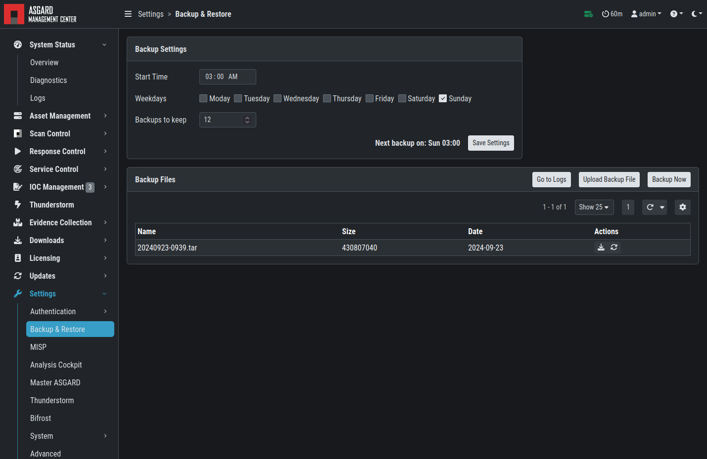

.. index:: Backup & Restore

Backup & Restore
================

You can schedule, create, and restore backups of your ASGARD Management Center
from the ``Settings`` > ``Backup & Restore`` section.

Additionally, if you have old backups which were created via SSH on the system,
you can upload them here as well.

   Backup & Restore

Backups are located at ``/var/lib/asgard-management-center/backups`` on the system.