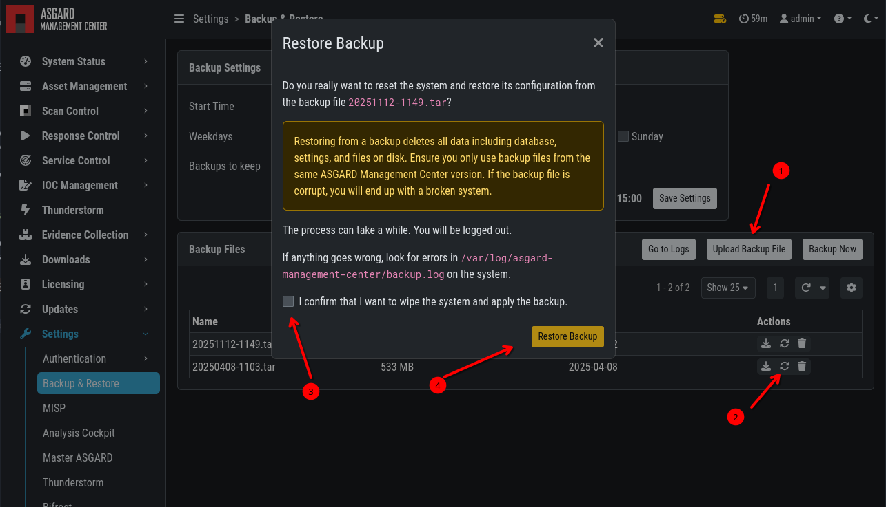

.. index:: Backup & Restore

Backup & Restore
================

You can schedule, create, and restore backups of your ASGARD Management Center
from the ``Settings`` > ``Backup & Restore`` section.

Additionally, if you have old backups which were created via SSH on the system,
you can upload them here as well.

.. figure:: ../images/mc_backup-restore.png
   :alt: Backup & Restore

   Backup & Restore

The backup contains everything necessary to restore a freshly installed Management
Center to the point of when the backup was created. Scan and Playbook results are
not contained in those backups. If you need to store a backup of all the
:ref:`maintenance/logs:scan logs` on a separate server, you can transfer those via
built in tools (like ``rsync``) to a remote system.

Backups are located at ``/var/lib/asgard-management-center/backups`` on the file system.

To restore a backup, you can upload the ``.tar`` file into the ``Backup & Restore``
section of your Management Center and click the restore button.

   Backup & Restore