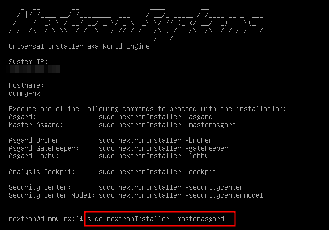

.. index:: Master ASGARD

Installation
------------

Master ASGARD is a single central management console that can control
all of your ASGARD systems. It is meant to centrally manage controlled
scans on all your ASGARD systems. Master ASGARD also provides one central
point of management for your Response Playbooks, Evidence Collection
and IOC Management. A special license for this is needed.

To install a Master ASGARD, you have to choose the command line argument
``-masterasgard`` after the installation from our ISO. This has to be
a new system, you cannot install a Master ASGARD on an existing ASGARD
Management Center.

   Installation of Master ASGARD

After the Master ASGARD and later its license have been installed, many
functions offer additional options. From that moment onwards, your
Master ASGARD can use all endpoints connected to your linked ASGARD systems,
just like a normal ASGARD.

Hardware Requirements for Master ASGARD
---------------------------------------

The Master ASGARD has the following hardware requirements:

.. list-table::
   :header-rows: 1
   :widths: 50, 50

   * - Component
     - Value
   * - System Memory
     - 16 GB
   * - Hard Disk
     - 1 TB
   * - CPU Cores
     - 8

License Management
------------------

Once you connect your ASGARD Management Centers to your Master ASGARD,
the licensing sections on connected ASGARD Management Centers become inactive.
The local ASGARD license will be replaced with the Master ASGARD license.
Every ASGARD can issue scanning licenses to assets as long as the
total number of scanned servers and workstations does not exceed the
number of systems in the Master license.

Setting up Master ASGARD
------------------------

The setup procedure for Master ASGARD is identical to the setup procedure for
ASGARD Management Center, see :ref:`setup/index:setup guide`.

Default Credentials
^^^^^^^^^^^^^^^^^^^

.. list-table::
   :header-rows: 1
   :widths: 25, 25, 50

   * - Interface
     - Username
     - Password
   * - Web UI
     - admin
     - admin
   * - CLI/SSH
     - nextron
     - `manually set during system installation`

Link ASGARD Systems with Master ASGARD 
--------------------------------------

On your ASGARD server, go to ``Settings`` > ``Master ASGARD``, generate a
one-time code and copy it.

.. figure:: ../images/link-master1.png
   :alt: Generate One Time Token

   Generate One Time Token on ASGARD

In Master ASGARD go to ``Connected ASGARDs``, click the ``Add ASGARD``
button in the upper right corner, and use the hostname and one-time token to
connect that ASGARD system. You can use a description to provide more
information on that ASGARD server, e.g. ``DMZ 1`` or ``Region EMEA - HQ 1``. 

.. figure:: ../images/link-asgard-in-master-asgard.png
   :alt: Link ASGARD in Master ASGARD

   Link ASGARD in Master ASGARD

.. note::
   You don't have to provide a port in the hostname field. Don't use a
   URL like ``https://``, just the FQDN. Remember that Master ASGARD
   must be able to reach ASGARD v2 systems on port 5443/tcp and ASGARD
   v1 systems on port 9443/tcp. Also make sure that the Master ASGARD
   system is able to resolve the FQDN of the ASGARD system.

Scan Control
------------

Scan Control in Master ASGARD looks the same as in an ASGARD server.
The only difference is that you can select an ASGARD Server or "All ASGARDs" to run the scans on.  

.. figure:: ../images/scan-control-in-master-asgard-add-group-task.png
   :alt: Master ASGARD Scan Control

   Scan Control in Master ASGARD - Add Group Task

Asset Management
----------------

Asset Management in Master ASGARD is very similar to the asset management in ASGARD. 

The only differences are:

* ASGARD column shows to which ASGARD system the endpoint is connected
* Only CSV export is allowed (asset labeling via CSV import is unavailable)

IOC Management
--------------

On Master ASGARD you can manage IOCs exactly like on ASGARD. The only
limitation is that IOCs in Master ASGARD and ASGARD are isolated. That
means if you want to use the IOCs from Master ASGARD, you need to initiate
the scan from Master ASGARD and if you want to use the IOCs from ASGARD,
you need to initiate the scan from ASGARD. In general we suggest to
manage IOCs in Master ASGARD for maximum flexibility.

Service Control
---------------

Service Control lists the asset with an installed service controller.
An asset is either managed by Master ASGARD or its connected ASGARD, not
by both. If an asset is managed by Master ASGARD it can still be viewed
by the connected ASGARD (and vice versa). If Master ASGARD or ASGARD
edits a configuration of an asset it will take over the "leadership"
over this asset, no matter by which it was managed beforehand.

.. figure:: ../images/master-service-controller.png
   :alt: Example: Service Controller listed in ASGARD but managed by Master ASGARD

   Example: Service Controller listed in ASGARD but managed by Master ASGARD

Evidence Collection 
-------------------

All collected evidence is available in Master ASGARD's ``Evidence Collection`` section. 

Download Section 
----------------

The ``Downloads`` section of Master ASGARD allows to generate and
download Agent Installers on all your connected ASGARDs. This
allows for a central management of the Installers.

.. figure:: ../images/master-asgard-download-section.png
   :alt: Example: Download Section in ASGARD but managed by Master ASGARD

   Example: Download Section in ASGARD but managed by Master ASGARD

Updates
-------

The ``Updates`` section contains a tab in which upgrades for ASGARD can be installed. 

A third tab named ``THOR and Signatures`` gives you an overview of
the used scanner and signature versions on all connected ASGARDs. 

.. figure:: ../images/master-asgard-scanner-updates.png
   :alt: Master ASGARD Scanner Updates

   Master ASGARD Scanner Updates

It is possible to set a certain THOR and Signatures version for each
connected ASGARD. However, if automatic updates are configured, this
setting has only effect until a new version gets downloaded.

Customers use this feature in cases where they want to test a certain
THOR version before using it in production. In this use case the ASGARD
system that runs the test scans is set to automatic updates, while the
ASGARD systems in production use versions that administrators set manually
after successful test runs. 

User Management
---------------

Master ASGARD offers no central user and role management for all connected
ASGARD servers. Since Master ASGARD and ASGARD allow to use LDAP for
authentication, we believe that complex and centralized user management
should be based on LDAP.

Master ASGARD and Analysis Cockpit
----------------------------------

It is not possible to link a Master ASGARD with an Analysis Cockpit and
transmit all scan logs via Master ASGARD to a single Analysis Cockpit
instance. Each ASGARD has to deliver its logs separately to a connected
Analysis Cockpit.

Master ASGARD API
-----------------

The Master ASGARD API is documented in the ``API Documentation``
section and resembles the API in ASGARD systems. 

However, many API endpoints contain a field in which users select the
corresponding ASGARD (via ``ID``) or all ASGARDs (``ID=0``) 

.. figure:: ../images/master-api1.png
   :alt: Master ASGARD API Peculiarity

   Master ASGARD API Peculiarity
