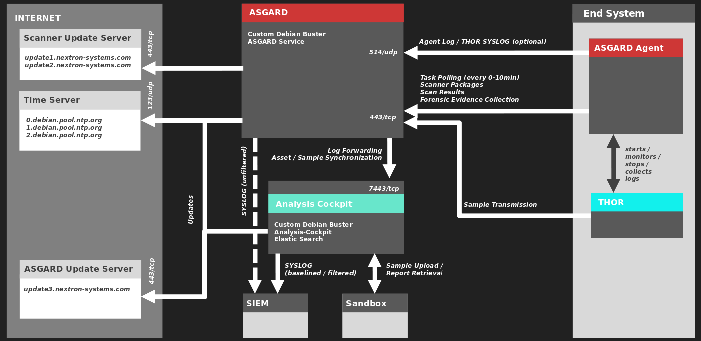

.. index:: Network Requirements

Network Requirements
--------------------

ASGARD and other systems which will have to communicate with each other,
need the following ports opened within the network. For a detailed and up
to date list of our update and licensing servers, please visit https://www.nextron-systems.com/hosts/.

From ASGARD Agent to ASGARD Server
^^^^^^^^^^^^^^^^^^^^^^^^^^^^^^^^^^

.. list-table:: 
   :header-rows: 1
   :widths: 60, 40

   * - Description
     - Ports
   * - Agent / Server communication
     - 443/tcp
   * - Syslog Forwarder (optional)
     - 514/udp [1]_
   * - ASGARD online check (optional)
     - ICMP

The syslog port is optional, since your agents will work fine without it.
Please see :ref:`administration/syslog:syslog forwarding` for more information.

.. hint:: 
  Your ASGARD Agents will check if they can reach your ASGARD
  via HTTPs. ICMP is not necessary, but helps during troubleshooting.

From Management Workstation to ASGARD Server
^^^^^^^^^^^^^^^^^^^^^^^^^^^^^^^^^^^^^^^^^^^^

.. list-table:: 
   :header-rows: 1
   :widths: 60, 40

   * - Description
     - Ports
   * - Administrative web interface
     - 8443/tcp
   * - Command line administration
     - 22/tcp

From ASGARD to SIEM
^^^^^^^^^^^^^^^^^^^

.. list-table:: 
   :header-rows: 1
   :widths: 50, 50

   * - Description
     - Ports
   * - Syslog forwarder
     - 514/udp [1]_

From ASGARD to Analysis Cockpit
^^^^^^^^^^^^^^^^^^^^^^^^^^^^^^^

.. list-table:: 
   :header-rows: 1
   :widths: 70, 30

   * - Description
     - Ports
   * - Asset Synchronization, Log- and Sample forwarding
     - 7443/tcp
   * - Syslog forwarder (optional)
     - 514/udp [1]_

From ASGARD and Master ASGARD to the Internet
^^^^^^^^^^^^^^^^^^^^^^^^^^^^^^^^^^^^^^^^^^^^^

The ASGARD systems are configured to retrieve updates from the
following remote systems via HTTPS on port 443/tcp:

.. list-table:: 
   :header-rows: 1
   :widths: 50, 50

   * - Product
     - Remote Systems
   * - ASGARD packages
     - update-301.nextron-systems.com [2]_
   * - ASGARD packages
     - update3.nextron-systems.com [2]_
   * - THOR updates
     - update1.nextron-systems.com
   * - THOR updates
     - update2.nextron-systems.com

All proxy systems should be configured to allow access to these URLs
without TLS/SSL interception. (ASGARD uses client-side SSL certificates
for authentication). It is possible to configure a proxy server, username
and password during the setup process of the ASGARD platform. Only
BASIC authentication is supported (no NTLM authentication support).

From Master ASGARD to ASGARD
^^^^^^^^^^^^^^^^^^^^^^^^^^^^

.. list-table:: 
   :header-rows: 1
   :widths: 70, 30

   * - Direction
     - Port
   * - From Master ASGARD to ASGARD Management Center
     - 5443/tcp

You cannot manage ASGARD v3 systems from a Master ASGARD v2.

From Management Workstation to Master ASGARD
^^^^^^^^^^^^^^^^^^^^^^^^^^^^^^^^^^^^^^^^^^^^

.. list-table:: 
   :header-rows: 1
   :widths: 70,30

   * - Description
     - Port
   * - Administrative web interface
     - 8443/tcp
   * - Command line administration
     - 22/tcp

Time Synchronization
^^^^^^^^^^^^^^^^^^^^

ASGARD tries to reach the public Debian time servers by default.

.. list-table:: 
   :header-rows: 1
   :widths: 60, 40

   * - Server
     - Port
   * - 0.debian.pool.ntp.org
     - 123/udp
   * - 1.debian.pool.ntp.org
     - 123/udp
   * - 2.debian.pool.ntp.org
     - 123/udp

The NTP server configuration can be changed.

DNS
^^^

ASGARD needs to be able to resolve internal and external IP addresses.

.. warning:: 
  Please make sure that you install your ASGARD with a ``domain name``
  (see :ref:`setup/network:network configuration`). If you do not set the
  Domain Name and install the ASGARD package, your clients won't be able
  to connect to your ASGARD.

  All components you install should have a proper domain name configured
  to avoid issues further during the configuration.

Internet Access during Installation
^^^^^^^^^^^^^^^^^^^^^^^^^^^^^^^^^^^

The Management Center installer requires Internet access during the
setup. The installation process will fail if required packages cannot be
loaded from https://update3.nextron-systems.com [2]_

SSL/TLS Interception
~~~~~~~~~~~~~~~~~~~~

The installation and update processes do not accept an unknown but valid
SSL/TLS certificate presented by an intercepting entity and therefore
don't support SSL/TLS interception.

Since our products are usually used in possibly compromised
environments, the integrity of our software and update packages has
highest priority.

Architecture Overview
^^^^^^^^^^^^^^^^^^^^^

The following image shows an architecture overview with all products and
their communication relationships.

   Full Architecture

.. rubric:: Footnotes

.. [1] You can configure any port and protocol combination for this,
   e.g. 6514/tcp
.. [2] If you are upgrading from Management Center version 2 to version 3,
   you need both update servers reachable from your Management Center. If
   you installed version 3 directly, you only need https://update-301.nextron-systems.com