.. Index:: Install Service

Install the ASGARD Management Center Service
--------------------------------------------

After the ISO installer is finished with the setup,
you will be greeted at the login prompt with the following
message:

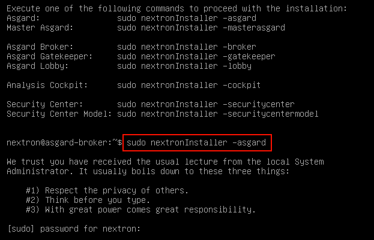

Follow the instructions and navigate to the webpage
displayed on your terminal. You will most likely get
a browser warning when you connect the first time to
the page. This is due to the page using a self signed
certificate, since it will only be used to install the
ASGARD Management Center. You can safely ignore this
warning and proceed to the page.

You will be greeted with a small introduction as to what
the Nextron Universal Installer is and what it does. After
you click ``Next``, you will be presented with the landing
page of the Nextron Universal Installer.

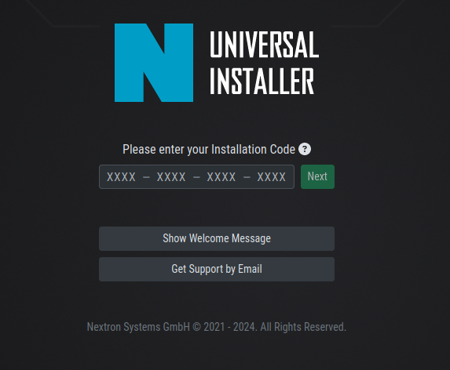

Enter the Installation Code from the terminal and click
``Next``. The Installer will now prompt you to upload your
license for the product you intend to install.

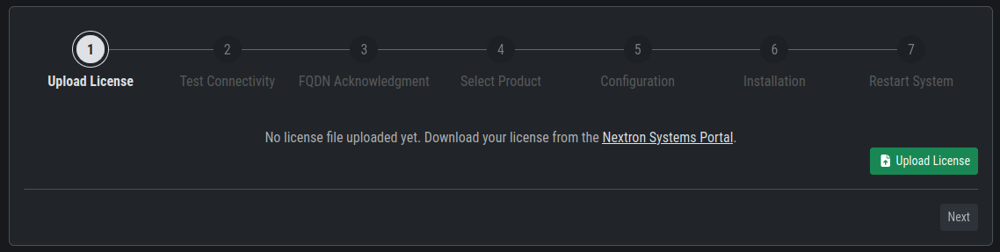

After you have uploaded your license, the Installer will
display informations about the license you uploaded. Verify
the information and click ``Next`` to proceed.

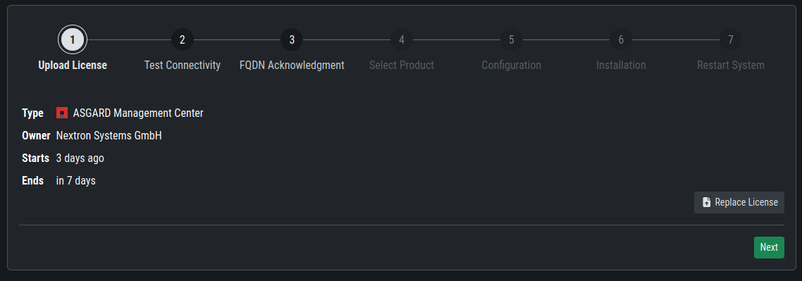

The next step is a connectiviy check. The Installer will
try to connect to our update server in order to download all
the necessary packages once the installation starts. Make sure
you can reach the update servers (see :ref:`requirements/network:internet access during installation`).

Click ``Next`` to proceed.

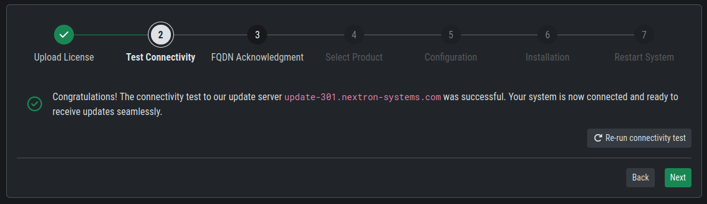

After the connectivity check is completed, the Installer
will prompt you to verify the FQDN which you configured during
the installation of the base system. If the FQDN shown is correct,
type it into the text field for verification and click ``Next``.

If the displayed FQDN is not correct, you can change it by
clicking on the ``View FQDN Change Instructions`` button.
This will open a dialog with instructions on how to change
the FQDN of your server. Once you have changed the FQDN,
you can continue with the installation.

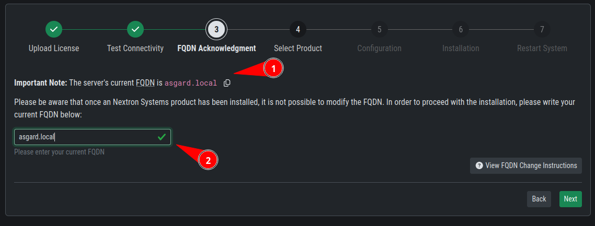

.. danger:: 
   The FQDN verification is a crucial step in the installation
   process. If the FQDN is not correct, you might encounter issues
   when using our product. Make sure to verify the FQDN before
   proceeding.

After the FQDN verification is completed, the Installer will
show you the available products you can install with the
license you uploaded. Select the product you want to install
and click ``Next``.

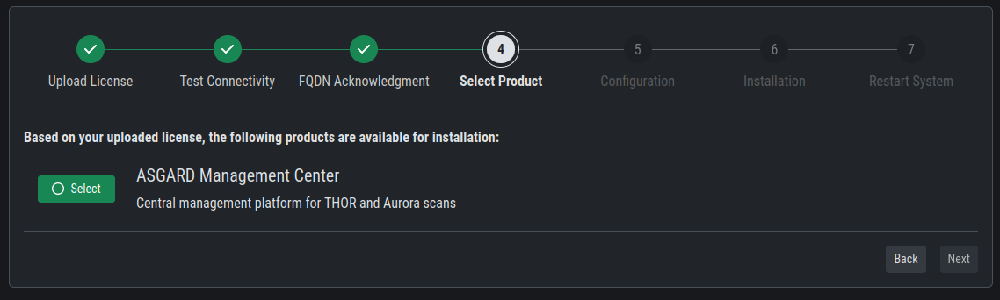

.. note::
   There might be different services you can choose for
   installation, depending on the license you uploaded.

You will now be prompted to configure a password for the
admin user of the ASGARD Management Center. Enter a password
and click ``Submit Configuration``. You can now continue to the
next step by clicking ``Next``.

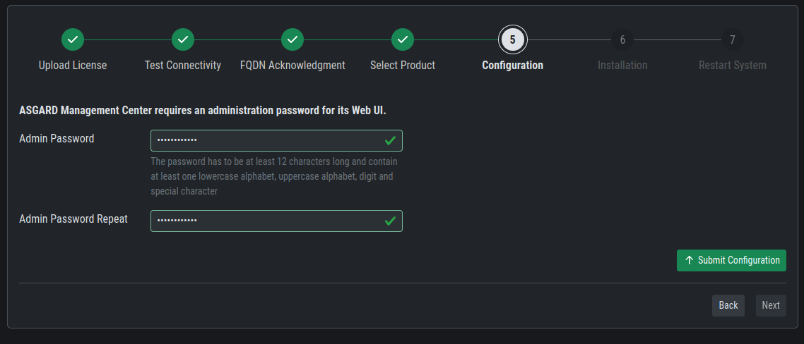

You will now be prompted to start the installation by clicking
the ``Start Installation`` button. The Installer will now
download the necessary packages and install the ASGARD Management
Center. This process can take a few minutes, depending on your
internet connection.

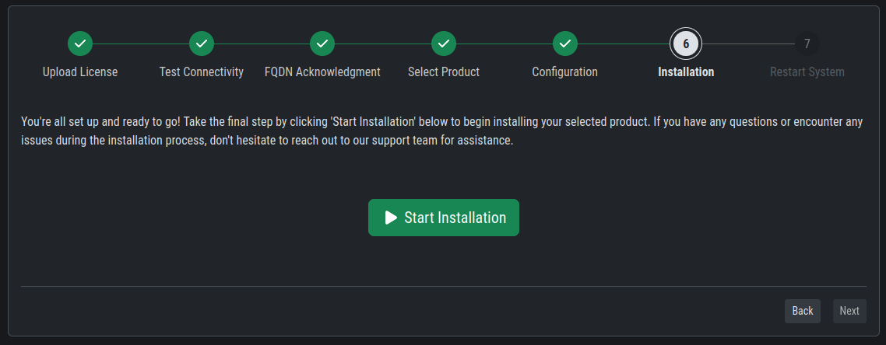

After the installation started, you will see console output
of the installation process and a progress bar below it.

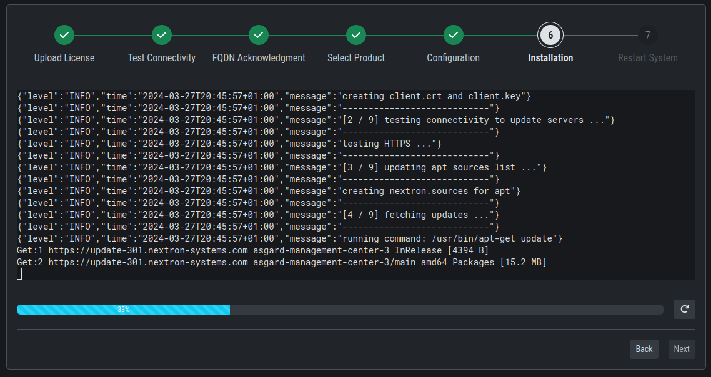

Once the installation is finished, click ``Next``. You will
now be prompted to reboot the system. Click the ``Restart System``
button to reboot the system.

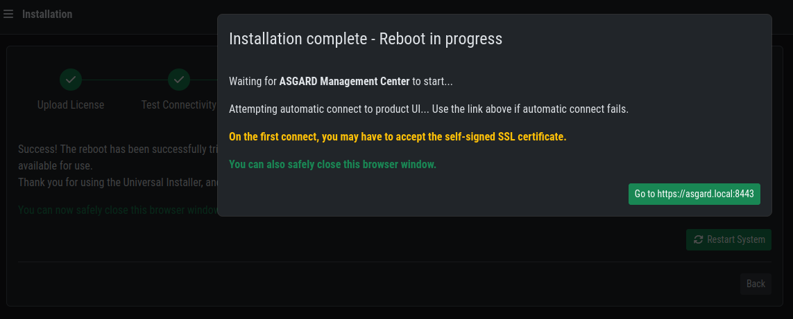

Proxy and NTP Settings
~~~~~~~~~~~~~~~~~~~~~~

If you need to configure a proxy or change the NTP settings
of your system, you can do so by clicking on the ``Settings``
button in the left menu of the Nextron Universal Installer.

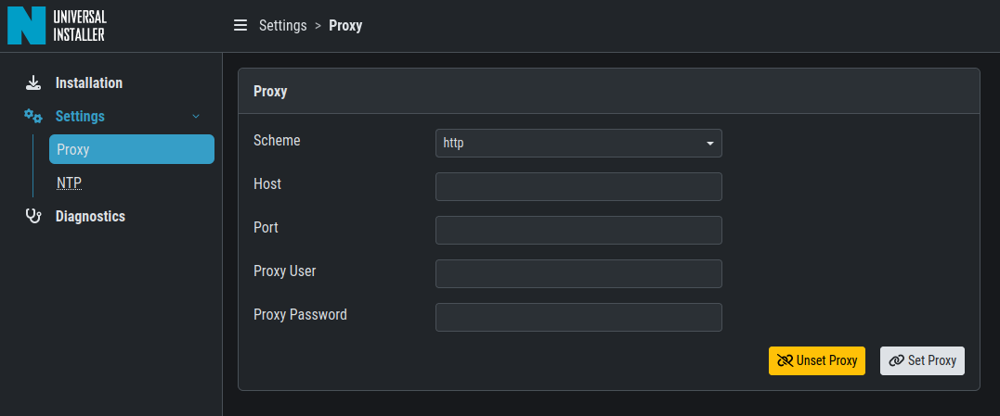

If you configured a proxy during the ISO installation, those
settings will be carried over into the Universal Installer.
The settings will also be carried over into your ASGARD
Management Center. The same goes for NTP.

Diagnostic Pack
~~~~~~~~~~~~~~~

In case of errors or problems during the installation, you can
download a diagnostic pack by navigating to the ``Diagnostics``
tab in the left menu of the Nextron Universal Installer. Click
on the ``Download Diagnostic Pack`` button to download the
diagnostic pack. You can then send the diagnostic pack to our
support team for further analysis.

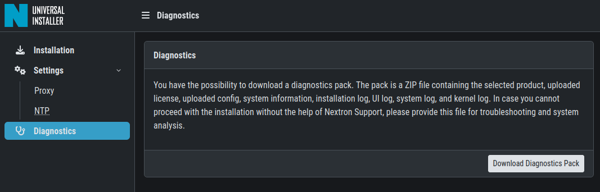