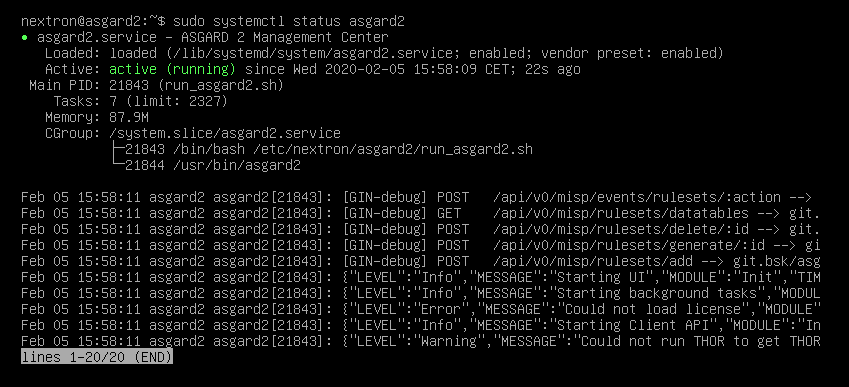

.. Index:: Install Service

Install the ASGARD Management Center Services
---------------------------------------------

Use SSH to connect to the appliance using the user ``nextron`` and the password you
specified during the installation (if you were using an old ISO to install the base
system, the password is ``nextron``). Now you can run the following command: 

``sudo nextronInstaller -asgard`` (caution: upper case “i" in the middle). This will install ASGARD.

.. figure:: ../images/setup_nextronInstaller.png
   :alt: running the nextronInstaller

After installation is complete type ``sudo systemctl status asgard2``. 

The output should look like the screenshot below with status ``Active``.

Installation is complete, you are ready to log into the web-based GUI.
