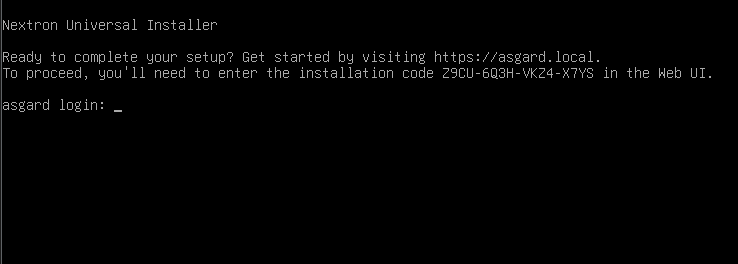

.. Index:: Install Service

Install the ASGARD Management Center Service
--------------------------------------------

The Nextron Universal Installer is a web based installer
which will guide you through the installation of our
ASGARD products. The Nextron Universal Installer will install
**one** of the following products on your server (this manual
focuses on the ``ASGARD Management Center``):

.. hint::

   if you want to install the Master ASGARD, please use
   the correct license and product (``Master ASGARD``)
   in the Nextron Universal Installer.

- ASGARD Management Center; alternatively if your license permits:
  
  * ASGARD Broker
  * ASGARD Gatekeeper
  * ASGARD Lobby

- Master ASGARD

- ASGARD Analysis Cockpit; alternatively:
  
  * Elasticsearch Cluster Node for ASGARD Analysis Cockpit

- ASGARD Security Center, in the following variants:

  * ASGARD Security Center (Backend Only)
  * ASGARD Security Center (Frontend Only)
  * ASGARD Security Center (All-in-one, unrecommended)

.. note::
   You can only install one product on one server, since the
   products are not designed to coexist on the same server.
   The exception being the ASGARD Security Center (All-in-one).

The installation takes roughly between 5-15 minutes, depending
on your internet connection and the server you are installing
the product on.

If you encounter problems during your installation, please see
:ref:`setup/components:diagnostic pack` for further instructions.

Requirements
~~~~~~~~~~~~

The installation of the ASGARD Management Center requires
the following:

- A valid license file for the ASGARD Management Center
- A configured FQDN (with some exceptions, see :ref:`setup/components:valid fqdn`)
- Internet access during installation (see :ref:`setup/components:connectivity check`)

Installation
~~~~~~~~~~~~

After the ISO installer is finished with the setup,
you will be greeted at the console login prompt with
the following message:

Follow the instructions and navigate to the webpage
displayed on your console. You will most likely get
a browser warning when you connect the first time to
the page. This is due to the page using a self signed
certificate, since it will only be used to install the
ASGARD Management Center. You can safely ignore this
warning and proceed to the page.

You will be greeted with a small introduction as to what
the Nextron Universal Installer is and what it does. After
you click ``Next``, you will be presented with the landing
page of the Nextron Universal Installer.

Enter the Installation Code from the terminal and click
``Next``. The Installer will now guide you through the
installation.

Connectivity Check
~~~~~~~~~~~~~~~~~~

The Nextron Universal Installer will try to connect to our
update server in order to download all the necessary packages
once the installation starts. Make sure you can reach the
update servers (see :ref:`requirements/network:internet access during installation`).

Please configure your proxy settings if you are behind a
proxy (see :ref:`setup/components:proxy and ntp settings`).

Valid FQDN
~~~~~~~~~~

The Nextron Universal Installer will prompt you to verify the
FQDN which you configured during the installation of the base
system (see :ref:`setup/network:network configuration`). This
is needed in order for your ASGARD Agents to communicate via
a HTTPs connection with the ASGARD Management Center. The Agents
will use the FQDN to connect to the ASGARD Management Center and
also verify the Common Name of the certificate to verify its
authenticity. If there is a mismatch the Agents will not be able
to connect to the ASGARD Management Center.

If the displayed FQDN is not correct, you can change it by
clicking on the ``View FQDN Change Instructions`` button.
This will open a dialog with instructions on how to change
the FQDN of your server. Once you have changed the FQDN,
you can continue with the installation.

If you are in a time critical engagement and need to proceed
with the installation, you can just confirm the displayed (and
technically invalid) FQDN and change it later (before you deploy
your Agents). To do this, see
:ref:`troubleshooting/certificates:regenerate asgard server certificate agent communication`

Proxy and NTP Settings
~~~~~~~~~~~~~~~~~~~~~~

If you need to configure a proxy or change the NTP settings
of your system, you can do so by clicking on the ``Settings``
button in the left menu of the Nextron Universal Installer.

.. figure:: ../images/setup_nextronInstaller-settings.png
   :alt: Settings of the Universal Installer

If you configured a proxy during the ISO installation, those
settings will be carried over into the Universal Installer.
The settings will also be carried over into your ASGARD
Management Center. The same goes for NTP.

Diagnostic Pack
~~~~~~~~~~~~~~~

In case of errors or problems during the installation, you can
download a diagnostic pack by navigating to the ``Diagnostics``
tab in the left menu of the Nextron Universal Installer. Click
on the ``Download Diagnostic Pack`` button to download the
diagnostic pack. You can then send the diagnostic pack to our
support team for further analysis.

.. figure:: ../images/setup_nextronInstaller-diagnostics.png
   :alt: Diagnostics of the Universal Installer