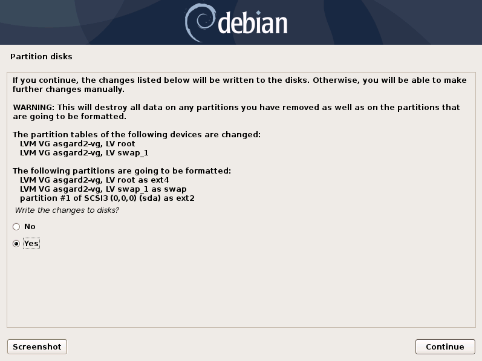

.. Index:: Other Installer Steps

Choosing a password
-------------------

.. figure:: ../images/setup_password.png
   :alt: Set up users and passwords

   Choosing a password for the ``nextron`` user

Partitioning the Hard Disk
--------------------------

.. warning:: 
   ASGARD is intended to be installed with only one disk.
   Do not configure your server with multiple disks.
   The system won't configure additional disks. Make sure
   that your disk has the recommended size. See
   :ref:`requirements/hardware:hardware requirements`
   for more information.

.. figure:: ../images/setup_disks1.png
   :alt: Partition disks

Finally, write your configuration to the disk by selecting "Yes" and clicking "Continue".

Proxy Configuration
-------------------

If you are using a proxy to access the internet, enter the proxy details in the next step.
Please note, ``Internet connectivity is required`` for the next step – the installation of the ASGARD service. 

.. figure:: ../images/setup_proxy.png
   :alt: Finish the installation

The base installation is now complete. In the next step we will install the ASGARD service.
For this step ``Internet connectivity is required``.

SSL Interception
^^^^^^^^^^^^^^^^

Using a web proxy with TLS/SSL interception will break the installation routine and shows this error:

.. code-block:: none

   Certificate verification failed: The certificate is NOT trusted. The certificate issuer is unknown.  Could not handshake: Error in the certificate verification.

Solution: Disable TLS/SSL interception for our update servers. 

- update-301.nextron-systems.com

Used for THOR updates:

- update1.nextron-systems.com
- update2.nextron-systems.com

We do not support setups in which the CA of the intercepting proxy
is used on our ASGARD appliances. 
