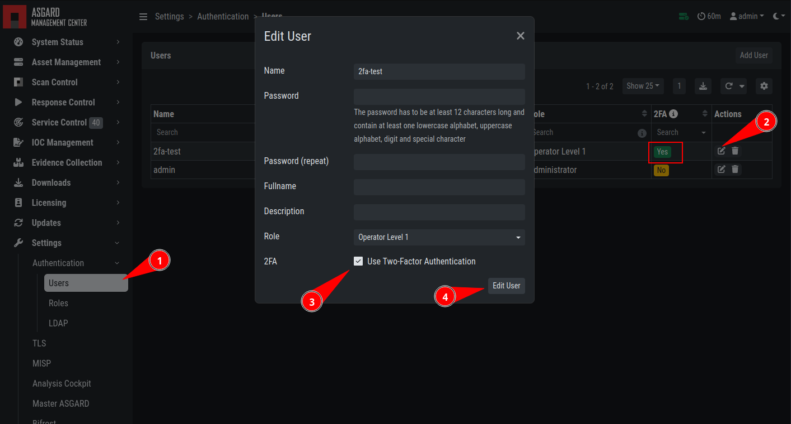

.. index:: Resetting Two Factor Authentication

Resetting Two Factor Authentication
===================================

If you or another user lost their second factor (2FA) to log into the ASGARD Web UI,
you have to reset the users MFA Settings. If you cannot access the Web UI, use
the Command Line method.

There are two possible ways to reset ``Two Factor Authentication`` for a specific user.
We recommend to use the first option via the WebUI.

Using the Web UI
~~~~~~~~~~~~~~~~

Log into ASGARDs Web UI as a user with administrative privileges.

Navigate to ``Settings`` > ``Authentication`` > ``Users`` and edit the user
you want to reset 2FA for. On the bottom of the modal you will see that
the ``2FA`` option is enabled. Disable the option and click ``Edit User``
(Leave everything else as it is; do not fill in a new password if not
necessary).

After you edited the user, the ``Two Factor Authentication`` will be disabled
and the user can log into ASGARD without 2FA.

Using the Command Line Interface
~~~~~~~~~~~~~~~~~~~~~~~~~~~~~~~~

.. note::
   This method needs SSH access to the Management Center.

Log into your ASGARD via SSH. You can reset the users MFA Settings with
the following command (in this example we assume that the user is called ``john``):

.. code-block:: console

   nextron@asgard:~$ sudo mysql asgard-management-center --execute "UPDATE users SET tfa_valid = 0 WHERE name = 'john';"

.. warning:: 
   This will disable the 2FA settings directly in the database. Please make sure
   the command and especially the username is correct.

If you don't know the exact username for a user, you can use the following command
to get all the usernames and the 2FA status from ASGARD (if ``tfa_valid`` has a value
of ``1``, this means the user has Two Factor Authentication enabled).

.. code-block:: console

   nextron@asgard:~$ sudo mysql asgard-management-center --execute "select name,tfa_valid from users;"
   +----------+-----------+
   | name     | tfa_valid |
   +----------+-----------+
   | admin    |         1 |
   | john     |         0 |
   | rickroll |         1 |
   +----------+-----------+

This command will also allow you to verify if the ``UPDATE`` command was successful (``tfa_valid`` should be ``0``).
