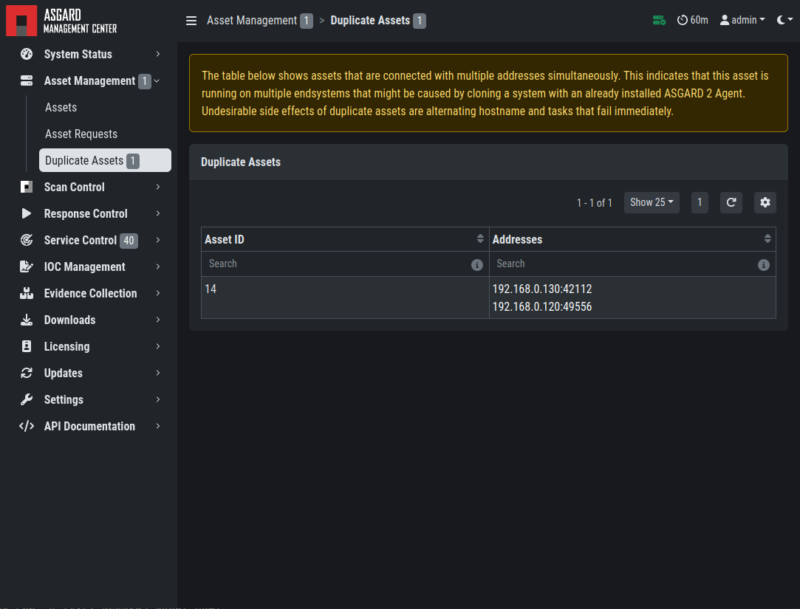

.. index:: Agent Debugging

Agent Debugging
===============

Internal Agent Debugging
~~~~~~~~~~~~~~~~~~~~~~~~

Edit the file ``asgard2-agent.yaml`` and set the value of ``write_log``
to true. The file can be found in ``C:\Windows\System32\asgard2-agent\``
or ``/var/lib/asgard2-agent/`` for Windows and Linux/macOS, respectively.

.. code-block:: none

   write_log: true

After making these changes, restart the ASGARD service. You can then
find log entries and possible error messages in the file ``asgard2-agent.log``
in the same directory as the configuration file.

Note: The value is set to ``false`` by default, because the agent
doesn't rotate or compress these logs. Leaving that value on ``true``
could cause that file to grow very big and use a significant amount
of disk space. We recommend resetting it after the debugging session.

Go Debug Logging
~~~~~~~~~~~~~~~~

On Windows, open the cmd.exe as Administrator. Set some environment variables.

.. code-block:: doscon 

   C:\Windows\system32>set GRPC_GO_LOG_SEVERITY_LEVEL=info
   C:\Windows\system32>set GODEBUG=http2debug=2

Navigate into the agent's program directory and start it to see all output messages.

.. code-block:: doscon 

   C:\Windows\system32>sc stop asgard2-agent
   C:\Windows\system32>cd C:\Windows\system32\asgard2-agent\
   C:\Windows\system32\asgard2-agent>asgard2-agent.exe

Interrupt the agent with ``CTRL+C``. Don't forget to start the Windows service after the debugging session. 

.. code-block:: doscon

   C:\Windows\system32\asgard2-agent>sc start asgard2-agent

On Linux, open a shell as root (sudo). 

.. code-block:: console

   nextron@asgard:~$ sudo su -
   [sudo] password for nextron: 
   root@asgard:~# 
   root@asgard:~# export GRPC_GO_LOG_SEVERITY_LEVEL=info
   root@asgard:~# export GODEBUG=http2debug=2

Navigate into the agent's program directory and start it to see all output messages.

.. code-block:: console 

   root@asgard:~# systemctl stop asgard2-agent
   root@asgard:~# cd /var/lib/asgard2-agent/
   root@asgard:/var/lib/asgard2-agent# ./asgard2-agent

Interrupt the agent with ``CTRL+C``. Don't forget to start the Linux service after the debugging session. 

.. code-block:: console 

   root@asgard:/var/lib/asgard2-agent# systemctl start asgard2-agent

Aurora Diagnostics Pack
~~~~~~~~~~~~~~~~~~~~~~~

If Aurora does not behave like it should, e.g. using more resources
than you expected, you can create a diagnostics pack for our support
to help in troubleshooting the issue. This can be conveniently done
using the playbook ``[Default] Create and Collect Aurora Agent Diagnostics Pack (Windows)``.

It can be run from ``Asset Management`` > ``Response Action`` (Play button)
or from ``Response Control`` > ``Tasks`` > ``Add Task`` or if needed
as a group task. The resulting ``diagnostics.zip`` can be downloaded
from the third step in the ``Playbook Result`` tab of the expanded task.

Duplicate Assets Remediation
~~~~~~~~~~~~~~~~~~~~~~~~~~~~

If you are seeing the ``Duplicate Assets`` view in your ``Asset Management``,
you need to fix the issue to avoid unwanted behavior of this asset. To
fix the issue, you need to uninstall the current ASGARD agent, delete the
configuration files, and redeploy a fresh copy.

   Troubleshooting Duplicate Assets

- To uninstall the ASGARD agent, please follow the instructions in :ref:`administration/uninstall:uninstall asgard agents`.
- To delete the configuration files, make sure that the following folder is 
  deleted before installing a new agent:

  * Windows: ``C:\Windows\System32\asgard2-agent\``
  * Linux: ``/var/lib/asgard2-agent/``

- To install the ASGARD agent, please follow the instructions in :ref:`administration/agent:asgard agent deployment`.
