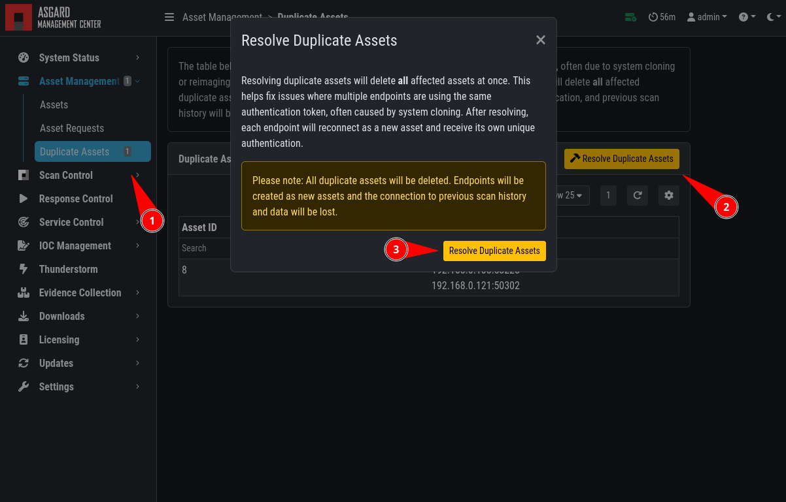

.. index:: Agent Debugging

Agent Debugging
===============

This chapter contains debugging information for our ASGARD Agent.

SLES 11 Installation
~~~~~~~~~~~~~~~~~~~~

On older SLES (SUSE Linux Enterprise Server) versions, the installation
of the ASGARD Agent might fail with the following error:

.. code-block:: none

   error: Failed dependencies:
        rpmlib(FileDigests) <= 4.6.0-1 is needed by asgard2-agent-1-1.6.5.x86_64

To circumvent this error savely, you can just add the ``--nodeps`` flag to install
the package:

.. code-block:: console

   user@sles11:~$ sudo rpm -ivh --nodeps asgard2-agent-linux-amd64.rpm                 
      Preparing...                ########################################### [100%]
         1:asgard2-agent          ########################################### [100%]
   user@sles11:~$ 

Aurora Diagnostics Pack
~~~~~~~~~~~~~~~~~~~~~~~

If Aurora does not behave like it should, e.g. using more resources
than you expected, you can create a diagnostics pack for our support
to help in troubleshooting the issue. This can be conveniently done
using the playbook ``[Default] Create and Collect Aurora Agent Diagnostics Pack (Windows)``.

It can be run from ``Asset Management`` > ``Response Action`` (Play button)
or from ``Response Control`` > ``Tasks`` > ``Add Task`` or if needed
as a group task. The resulting ``diagnostics.zip`` can be downloaded
from the third step in the ``Playbook Result`` tab of the expanded task.

Duplicate Assets Remediation
~~~~~~~~~~~~~~~~~~~~~~~~~~~~

If you are seeing the ``Duplicate Assets`` view in your ``Asset Management``,
you need to fix the issue to avoid unwanted behavior of this asset.

   Troubleshooting Duplicate Assets

To fix the issue, you have two options:

- :ref:`troubleshooting/agent-debugging:delete the asset` in the Management Center

  * This approach is faster but also more "destructive", since this will
    delete your asset and with it the Scan/Task history of it. This step
    is not reversible

- :ref:`troubleshooting/agent-debugging:reinstall the agent` on all affected/duplicated endpoints

  * This approach is more time consuming, but also the cleanest solution.

Delete the Asset
^^^^^^^^^^^^^^^^

Follow the below steps to delete the correct asset:

- Write down the ``Asset ID`` shown in the "Duplicate Assets" section
- Search for the ID in your "Assets" section
- Select the Asset and click "Delete Asset"
- Confirm your action

.. only:: html

   .. raw:: html

      <video width="640" controls>
        <source src="../_static/videos/mc_duplicate_asset_delete.webm" type="video/webm">
        Your browser does not support the video tag.
      </video>

After the asset was deleted, all duplicate assets will reconnect
after a few minutes and show up as individual "Asset Requests".

Reinstall the Agent
^^^^^^^^^^^^^^^^^^^

Follow the below steps to reinstall the ASGARD agent on your endpoints.

- First you need to uninstall the ASGARD agent. Please follow the instructions
  in :ref:`administration/uninstall:uninstall asgard agents`.

- Next you need to delete the configuration files, make sure that the following
  folder is deleted before installing a new agent:

  * Windows: ``C:\Windows\System32\asgard2-agent\``
  * Linux: ``/var/lib/asgard2-agent/``

- Finally you need install the ASGARD agent again, please follow the instructions
  in :ref:`administration/agent:asgard agent deployment`.
