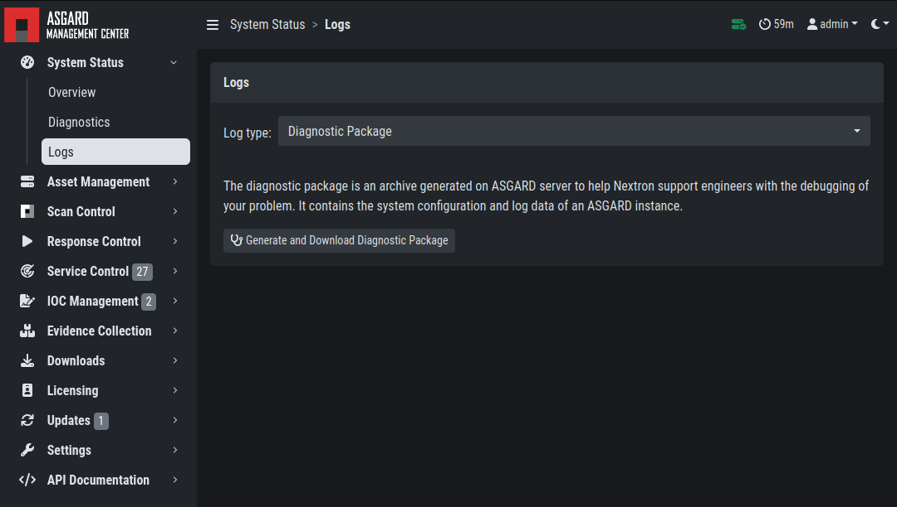

.. index:: Diagnostic Pack

Diagnostic Pack
===============

The diagnostic package is an archive generated on ASGARD server to help
Nextron support engineers with the debugging of your problem. It contains
the system configuration and log data of an ASGARD instance. 

You can generate a Diagnostic Package in ``Systems Status`` > ``Logs`` >
``Diagnostics Package``. 

The package can have a size that cannot be shared via Email. In this case you can either

1. ask us for an upload link (secure file sharing) or
2. remove big log files from the package (e.g. the file ``/var/lib/asgard-management-center/log/agent-access.log``
   is often responsible for 97% of the package size)
