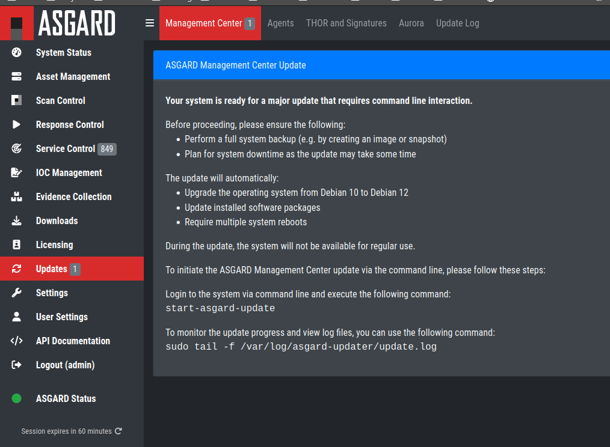

.. index:: Management Center Major Upgrade

Upgrade
=======

This chapter guides you through the upgrade process of
your Management Center version 2.17.1 to version 3.x.

It is important to follow the steps carefully. We advise you
to create a snapshot of the Management Center itself before
starting your upgrade.

If you are using a Master ASGARD in your environment, we advise
you to upgrade it first.

Preparation
^^^^^^^^^^^

To prepare for your upgrade, we compiled a list of tasks you
should follow:

.. list-table:: 
    :header-rows: 1

    * - Task
      - Description
    * - Snapshot of your Management Center
      - For disaster recovery
    * - Management Center running version 2.17.1
      - Prerequisite for the Major Upgrade
    * - Connection to our new update servers
      - New update server infrastructure

For details regarding some of the above tasks, see the next section
in this manual.

With the new version of your Management Center, we also
made changes to our update servers. Please make sure
that all your components can reach the following servers:

.. list-table:: 
    :header-rows: 1

    * - Server
      - Port
      - Description
    * - update3.nextron-systems.com
      - tcp/443
      - Old update server
    * - update-301.nextron-systems.com
      - tcp/443
      - New update Server

The old update server is needed to fetch the updater and
other prerequisites. The new update server is needed to upgrade
your servers to Debian 12 and also to install any new packages,
which are needed for your Management Center v3.

You can find the corresponding IP-Addresses to the above
FQDNs here: https://www.nextron-systems.com/hosts/.

Management Center running version 2.17.1
~~~~~~~~~~~~~~~~~~~~~~~~~~~~~~~~~~~~~~~~

To check if your Management Center is running on the correct version
you can navigate to ``Settings`` and ``Updates``. The page should
looks like this:

   Update Section

Performing the upgrade
^^^^^^^^^^^^^^^^^^^^^^

In this section we will perform the actual upgrade
of the Management Center.

Management Center Upgrade
~~~~~~~~~~~~~~~~~~~~~~~~~

To start your upgrade, connect to your Management Center via
SSH. We will utilize ``asgard-updater`` to perform the
upgrade. First we need to check if a newer version of the
``asgard-updater`` is available. If you get the highlighted
output, you have already the newest version installed (the
version might differ from the output here):

.. code-block:: console
    :emphasize-lines: 6

    nextron@asgard:~$ sudo apt update
    nextron@asgard:~$ sudo apt install asgard-updater
    Reading package lists... Done
    Building dependency tree       
    Reading state information... Done
    asgard-updater is already the newest version (1.0.15).
    0 upgraded, 0 newly installed, 0 to remove and 0 not upgraded.

You can now run the ``asgard-updater`` with the following command:

.. code-block:: console

    nextron@asgard:~$ start-asgard-update

The server running your Management Center will now restart
multiple times. It is important to not interrupt the upgrade
process and let the server do all the tasks. You can, however, 
see if any errors occurred during the upgrade or just observe
at what stage the upgrade is.

Run the following command to see the status of your upgrade:

.. code-block:: console

    nextron@asgard:~$ sudo tail -f /var/log/asgard-updater/update.log

.. note::
    Since the upgrade is downloading many packages of the debian
    base system, the process will take a while. The web interface
    of your Management Center might be available throughout the
    upgrade, but we still advise to use it until the upgrade is
    finished.

The update is finished if you are seeing the following lines:

.. code-block:: console

    nextron@asgard:~$ sudo tail -f /var/log/asgard-updater/update.log
    2024-01-16T14:20:54.253032+01:00 asgard asgard-updater[667]: Upgrade finished. Deactivating service...
    2024-01-16T14:20:54.259176+01:00 asgard asgard-updater[667]: Removed "/etc/systemd/system/multi-user.target.wants/asgard-updater.service".

Your upgrade is now finished, and you can use your Management Center
with the newest version.