.. role:: raw-html-m2r(raw)
   :format: html

Administration
==============

License Management
------------------

Login to ASGARD, navigate to ``Licensing``, click 
``Upload ASGARD Management Center License`` and upload a valid license. 

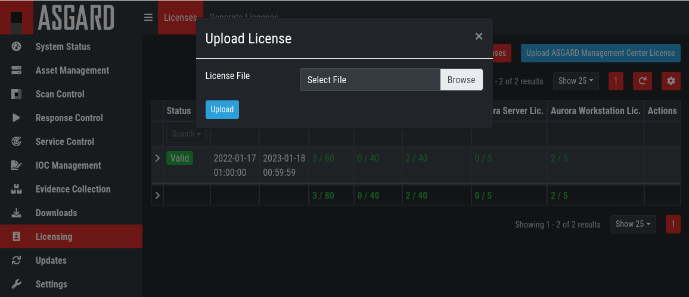

   Install a license

After uploading, the license details are displayed.

System Status
-------------

Status Overview
^^^^^^^^^^^^^^^

The initial system status page provides a summary of the
most important system components. 

It also includes the current resource consumption (disk,
CPU and memory) and lists the currently installed ASGARD
software version along with available versions of THOR.
Additionally, the connection status to the update servers,
MASTER ASGARD and Cockpit are shown with a graph that shows
asset connections and asset streams.

.. note::
   The THOR version numbers may be missing in a new installation.
   THOR is not included in the installed packages. THOR is downloaded
   automatically after the installation and should show up not
   later than one hour after installation. 

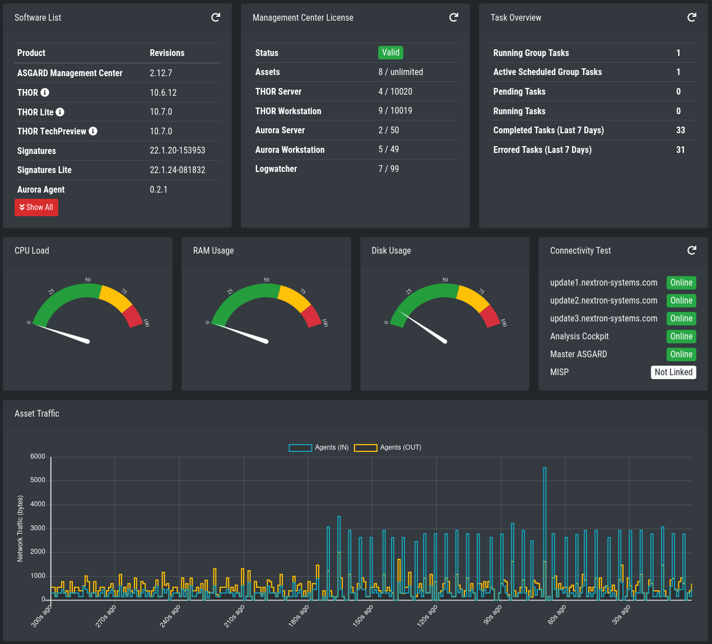

   Overview Top Half

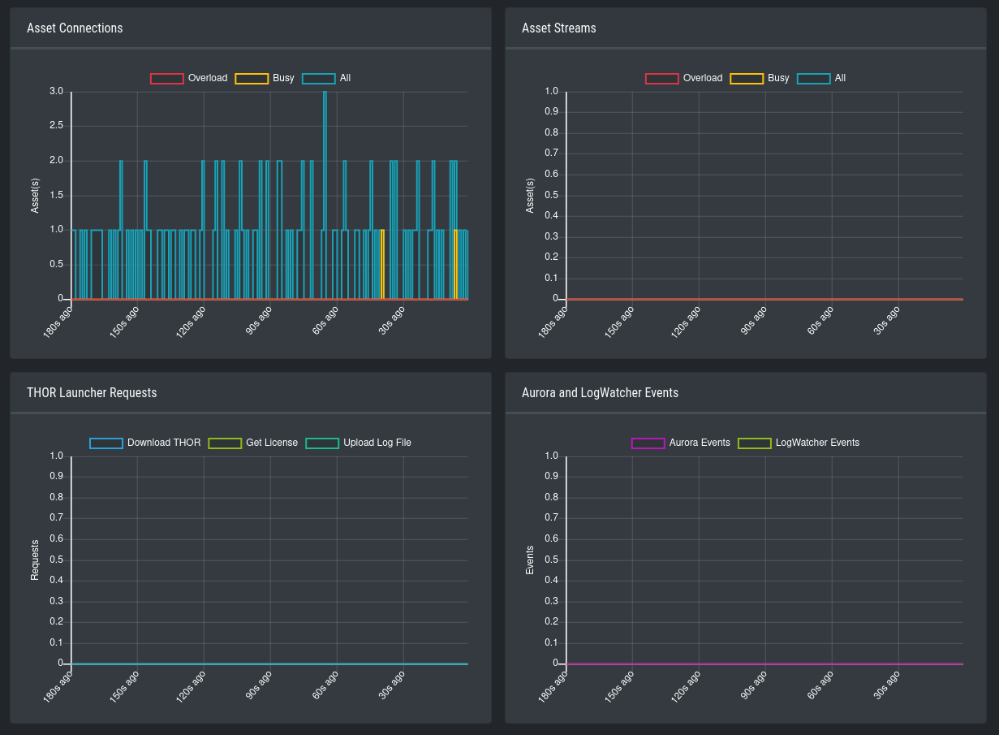

   Overview Bottom Half

Diagnostics
^^^^^^^^^^^

The diagnostics sub menu shows the periodically performed checks
and their status. Clicking the magnifying glass icon shows details
of the performed check. If a check failed it gives a detailed error
message and hints on which steps typically help in resolving the issue.

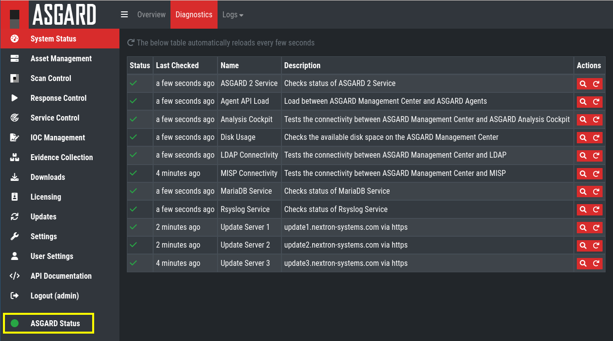

   Overview Over Periodic Diagnostic Checks

The traffic light on the left menu always shows if any of those checks
failed by showing a warning or error (i.e. yellow or red light) and
you can click the status to view the diagnostics page as a pop-up.

Logs
^^^^

The logs section shows the latest and most relevant logs.
Complete logs can be found at ``/var/lib/nextron/asgard2/log``.

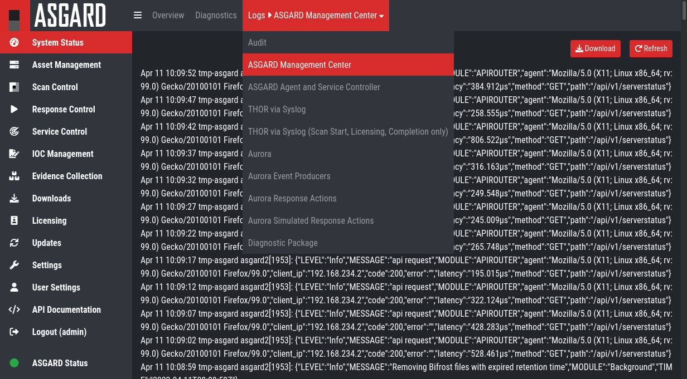

   Logs Section

Available logs and their content:

- Audit: Containing user login/-off, changes done over the UI.
- ASGARD Management Center: Overall status of the MC, general errors and warnings.
- ASGARD Agent and Service Controller: Status of the agents deployed on assets.
- THOR via Syslog: Received syslog events of THOR scans. Partial results if a scan did not complete.
- Aurora: All Aurora events:
- Aurora Event Producers: The top 10 of event producing processes per endpoint.
- Aurora Response Actions: Only response action events of Aurora:
- Aurora Simulated Response Actions: Only simulated response action events of Aurora.
- LogWatcher: All LogWatcher events.
- Diagnostic Pack: Button for generating and downloading a diagnostic pack that may be asked for by support.

ASGARD Agent Deployment
-----------------------

In order to register a new endpoint to the ASGARD Management Center,
download and install the ASGARD Agent on the system you want to register. 

The ASGARD Agent can be directly downloaded from the ASGARD login
screen through the button ``Download Agent Installers``. A list
of available agents for various operating systems appears. 

.. figure:: ../images/login-screen.png
   :alt: Download Agent Installers from Login Screen

   Download Agent Installers from Login Screen

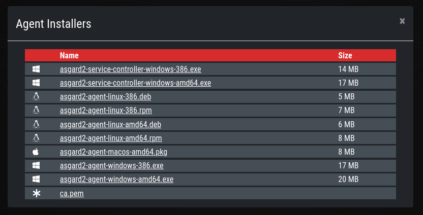

   Agents Overview

After the installation, the endpoints will connect to ASGARD, register
automatically and appear in the Asset Management Section in the tab
``Requests``. Please allow two or three minutes for systems to show
up. The agents use the hostname to connect to ASGARD, ensure that
your endpoints can resolve and reach the ASGARD hostname.

.. note::
   Full administrative privileges are required for the ASGARD agent
   and THOR to operate properly.

In the requests tab, select the agents you want ASGARD to manage and
click ``Accept``. After that, the endpoint shows up in the asset tab
and is now ready to be managed or scanned.

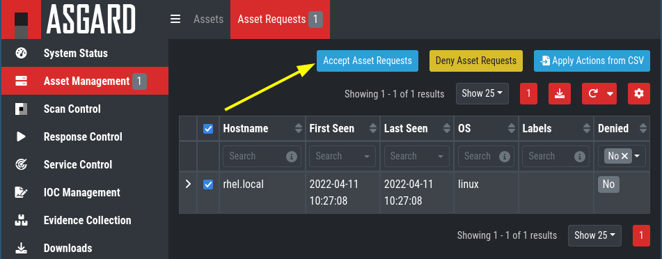

   Accepting ASGARD Agent Requests

A registered agent will poll to the ASGARD Management Center at a given
interval between 10 seconds and 600 seconds – depending on the number of
connected endpoints (see :ref:`usage/commandline:Performance Tuning` for
details). If ASGARD has scheduled a task for the endpoint (for example:
run THOR scan) it will be executed directly after the poll.

Windows Agent Deployment
^^^^^^^^^^^^^^^^^^^^^^^^

Since the Agent Installer for Windows is a normal ``.exe`` file and not a
``.msi`` file, you need to write your own scripts to deploy the agent via
your management system of choice. We have written an example script in 
PowerShell, which should work for most of the tools. Please see the section
:ref:`usage/appendix:Installing ASGARD Agent via Powershell Script` and
:ref:`usage/appendix:deploy asgard agents via sccm`.

Alternatively, if you want to deploy the ASGARD Agent manually, you can
just execute the installer by hand.

Linux Agent Deployment
^^^^^^^^^^^^^^^^^^^^^^

To deploy the ASGARD Agent on a linux system, you can use the following
commands:

.. code-block:: console
   :caption: Debian based systems

   user@unix:~/Downloads$ sudo dpkg -i asgard2-agent-linux-amd64.deb

.. code-block:: console
   :caption: RHEL, CentOS and Fedora

   user@unix:~/Downloads$ sudo rpm -i asgard2-agent-linux-amd64.rpm

You will be able to deploy your agents via most of the common linux tools,
just make sure that the installer is being installed with administrative
priileges.

macOS Agent Deployment
^^^^^^^^^^^^^^^^^^^^^^

Starting with macOS Big Sur (v11.0), Apple requires software developers
to notarize applications.

Due to the nature of the ``asgard2-agent`` installer, which is generated on
installation time and making it unique for each new installation, it's
currently not possible to notarize the installer.

This document aims to describe possible workarounds intended to be a
reference for IT Administrators or IT packaging teams to bypass Apple
verifications and install the personalized asgard2-agents on their macOS
Big Sur (or newer) workstations.

.. warning::
   Executing any of the workarounds described in this document puts your
   system at risk for a short period of time. This document will deactivate
   global security mechanisms of the operating system, which are intended to
   protect the integrity of the system.

Please always keep in mind to check your systems after performing any of
the described actions to ensure that all security mechanisms are in
place and are re-activated after performing the described actions.

Please follow the below steps to install the ASGARD Agent on macOS.

1. Open a new terminal session

2. Deactivate macOS Gatekeeper

   * ``sudo spctl --master-disable``

3. Close the terminal and open a new terminal session

4. Install asgard2-agent

   * ``sudo installer -pkg /path/to/asgard2-agent-macos-amd64.pkg -target /``

5. Close the terminal and open a new terminal session

6. Reactivate macOS Gatekeeper

   * ``sudo spctl --master-enable``

.. warning:: 
   Make sure to activate the macOS Gatekeeper once you are done:

   ``sudo spctl --master-enable``

You can verify the state of the macOS Gatekeeper with:

.. code-block:: console

   MacBook-Pro:~ nextron$ spctl --status
   assessments enabled

On a system with activated Gatekeeper, the output has to be ``assessments enabled``.

macOS Full Disk Access
~~~~~~~~~~~~~~~~~~~~~~

Since macOS version 13 (Ventura) the ASGARD Agent needs full disk access
to function properly. After you have deployed the ASGARD Agent, you need
to grant the service the required access permissions. Please keep in mind
that administrative privileges on the machine are needed to perform this
change.

To do this, navigate on your Mac to ``System Settings`` > ``Privacy &
Security`` > ``Full Disk Access``:

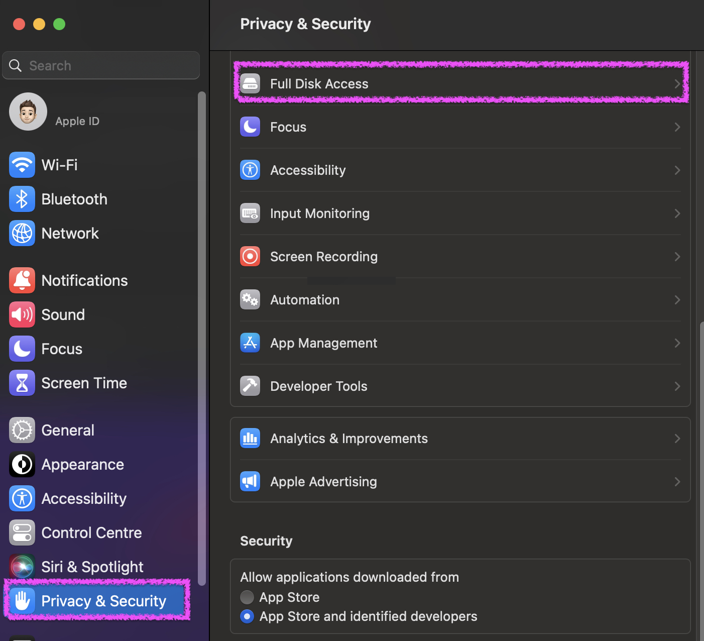

You need to enable the ``asgard2-agent-service`` slider:

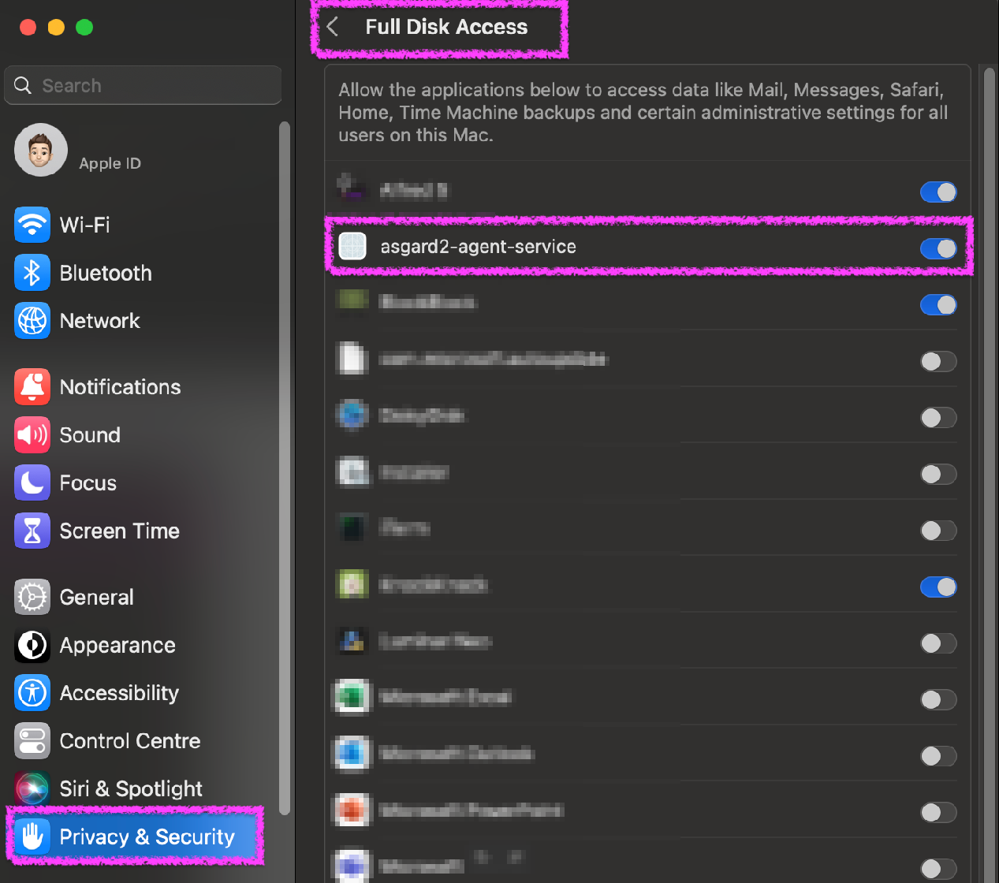

.. note:: 
   There is no workaround to this step, since it is an integral
   part of the security design of Apple devices. If you are having trouble
   with THOR scans via ASGARD on macOS, please check if the ``Full Disk
   Access`` permission for the ASGARD agent was granted. Since macOS version
   10.14 (Mojave), you need to grant the same permissions if you want to
   scan removable volumes.

Asset Management
----------------

In the ``Asset Management`` view you can see all the connected ASGARD
agents. New assets will be placed under ``Asset Requests`` and need a
manual approval before being able to connect to your ASGARD (for auto
accept see :ref:`usage/administration:Advanced`).

If the ``Duplicate Assets`` view is visible, you should try to remediate
the issues in a timely manner, since this might cause unwanted side
effects on the duplicate hosts.

.. warning::
   Assets in the ``Duplicate Assets`` view indicate, that one or more
   agents are running on multiple endpoints. This might be caused by
   cloning a system with an already installed ASGARD 2 Agent. Undesirable
   side effects of duplicate assets are alternating hostnames and tasks
   that fail immediately.

For remediation please see :ref:`usage/troubleshooting:Duplicate Assets Remediation`.

Asset Overview
^^^^^^^^^^^^^^

Management of all endpoints registered with ASGARD can be performed
in Asset Management. The assets will be presented as a table with an
individual ASGARD ID, their IP addresses and host names.

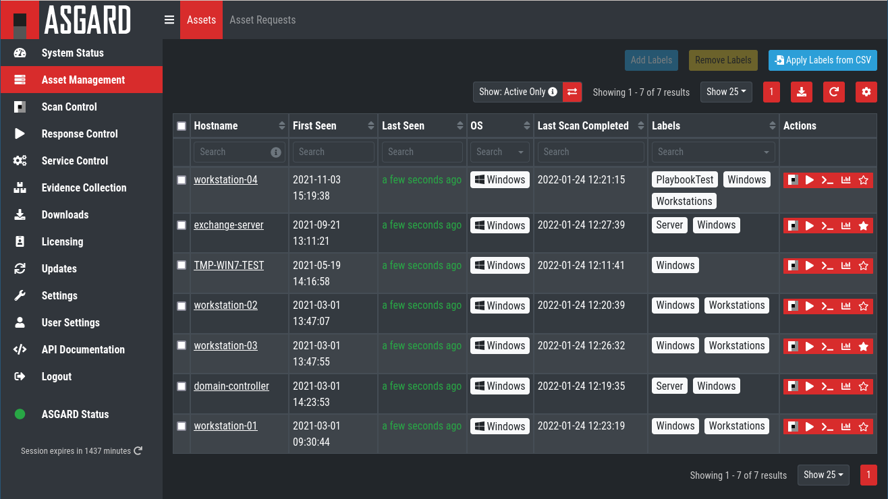

   Asset View

By clicking the control buttons in the Actions column, you can start
a new scan, run a response playbook, open a command line or switch
the endpoints ping rate to a few seconds instead of a maximum of 10 minutes. 

   Available Actions (left to right): Run Scan, Run Task,
   Connect To Remote Console, Show Timeline, Enable/Disable Fast Poll Mode

.. note::

    * The internal ping between the ASGARD agent and ASGARD is based on HTTPS not ICMP
    * Depending on the user's role some of the control buttons may be disabled
    * The ``Run Scan`` button might be greyed out in new installations - this is
      because ASGARD did not download the THOR packages yet. You can either wait for a
      few minutes, or see the chapter :ref:`usage/administration:updates of thor and thor signatures`,
      to trigger a download manually.

Column Visibility
^^^^^^^^^^^^^^^^^

Users can select various columns and adjust their view according to their
needs by clicking the gear wheel in the top right corner of any table.

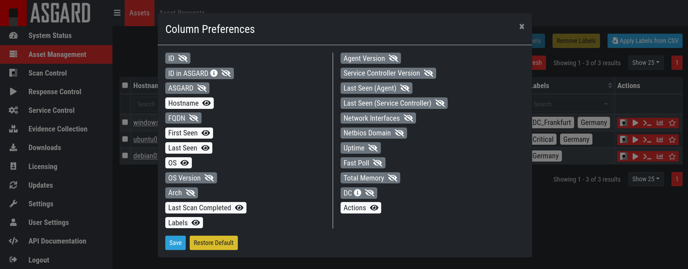

   Available columns in Asset Management

Asset Labels
^^^^^^^^^^^^

Labels are used to group assets. These groups can then be used in scans or tasks. 

You can add multiple labels to an asset or a group of assets. This is done by
selecting the particular assets in the left column, typing the label name
(e.g. New_Label) and clicking the blue ``Add Labels`` button. 

.. note::
   Don't use labels with white space characters as it could cause issues in
   syncs with Analysis Cockpit, exports / imports or other underlying legacy functions. 

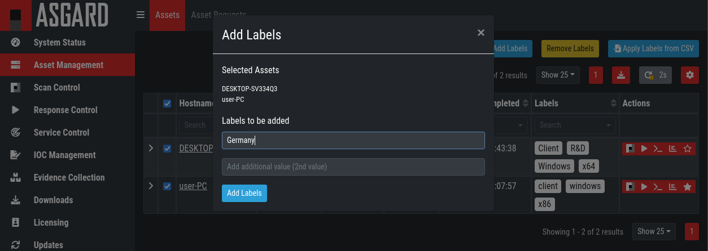

   Add labels

In order to remove labels, select your assets, click the yellow ``Remove Labels``
button and type the name of the label you want to remove for these assets.

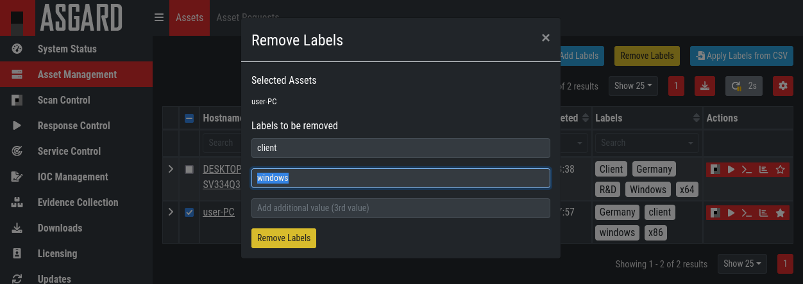

   Remove labels

The asset management section has extensive filtering capabilities, e.g.
it is easy to select only Linux endpoints that have been online today
and have a particular label assigned. 

Export Asset List 
~~~~~~~~~~~~~~~~~

The Import/Export Section allows you to export your assets to a CSV formatted file. 

Import Labels
~~~~~~~~~~~~~

The import function allows you to add or remove labels on assets based on columns in
the previously generated CSV formatted file. 

The import function processes the values in the columns ``Add Labels ...`` and ``Remove Labels ...``
only. In order to change labels, use the already exported list, add values in these
columns and re-import it by using the ``Apply Labels from CSV`` button.
Separate multiple labels with comma. Leading or ending white space characters
will be stripped from the labels. 

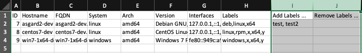

   Asset Labeling via CSV

Asset Query
^^^^^^^^^^^

You can search for Assets in your ASGARD with the Asset Query. This allows
you to write more complex queries to search for assets. Additionally, this
helps you to be more flexible with your scan/response tasks, since you can
just specify a query and don't have to set labels first. A good example of
this might be if you are scanning a specific subnet every week, and a new
agent is being deployed in this subnet. You don't have to think of all the
labels or troubleshoot why scans are not being deployed. One example you
could achieve this is the following example query:

``system = "linux" and interfaces = "172.16.50.0/24"``

This would run the task on all linux systems in the subnet 172.16.50.0/24.

The following operators are available:

.. csv-table::
     :file: ../csv/asgard-query-operators.csv
     :widths: 30, 70
     :delim: ;
     :header-rows: 1

You can create simple or complex queries this way. You can group/separate queries with brackets:

``(system = "linux" and interfaces = "172.28.30.0/24") or (system = "windows" and interfaces = "172.28.50.0/24")``

``(system = "linux" and interfaces = "172.28.30.0/24" and labels = "my-label") or labels = "robot-test"``

The following keys for the asset query are available:

.. csv-table::
     :file: ../csv/asgard-query-fields.csv
     :widths: 50, 50
     :delim: ;
     :header-rows: 1

.. hint:: 
   You can see which query-name a field has by enabling the column in your asset view
   and clicking into the query text field:

   .. figure:: ../images/asgard_asset_query_fieldnames.png

Asset Migration
^^^^^^^^^^^^^^^

You can move an asset from one ASGARD to another via the Maintenance Module of Response
Control. To do this, navigate to ``Asset Management`` and select the assets you want to
migrate. Alternatively you can navigate to ``Response Control`` and add a new task.
You can now Click the ``Add Task`` button to open the Task Menu. Choose the ``Maintenance``
Module and then the ``Move asset to another ASGARD`` Type. You have to upload an agent
installer from the ASGARD you want to migrate the asset to.

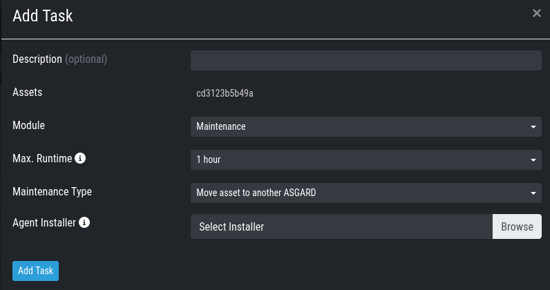

.. note::
   The target OS or Arch of the installer doesn't matter, we will only use the installers configuration data.

Delete Assets
^^^^^^^^^^^^^

Deleting Assets will remove the assets from the ``Active Only`` asset view and will
invalidate the authentication for these assets.

To delete an asset, go to the ``Asset Management`` View and mark the assets you want
to delete. Click the ``Delete Assets`` Button on the top right corner. Confirm that
you want to delete the asset.

To see all the deleted assets, change your view from ``Active Only`` to ``Deleted Only``.

.. warning::
   Deleted assets can no longer communicate with the ASGARD. Please use with caution.

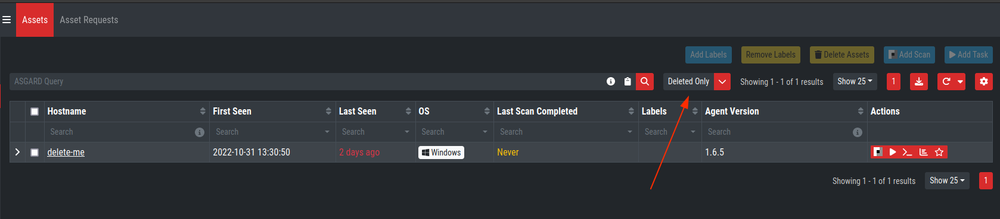

   Deleted Assets View

Scan Control
------------

The Scan Control in your ASGARD allows you to run different kind of Scans on one
or multiple assets. Additionally, you can create Scan Templates to use with new
Scans, so the different options don't need to be configured for every new scan.
False-Positive Filters can be set to exclude certain files from scan results,
or even whole directories can be excluded.

Your ASGARD will also take care of THOR scans which stopped (e.g. the asset
rebooted or lost connection to your ASGARD during a scan), so that a scan
will not fail if the asset is temporarily offline.

Managing Scan Templates
^^^^^^^^^^^^^^^^^^^^^^^

Scan templates are the most convenient way to make use of THOR's rich set of
scan options. Starting with ``ASGARD 1.10``, it is possible to define scan parameters
for THOR 10 and store them in different templates for later use in single scans
and grouped scans. 

Imagine you want to use dedicated scan options for different system groups (e.g.
Linux Servers, Domain Controllers, Workstations, etc.) and make sure to use exactly
the same set of scan options every time you scan a particular group of systems.
With ASGARD you can now add a scan template for every group.

A popular use case for scan templates is providing additional resource control – for
example telling THOR to set the lowest process priority for itself and never
use more than 50% of CPU. 

Please keep in mind, that we have already optimized THOR to use the most relevant
scan options for a particular system (based on type, numbers of CPUs and system resources)
and a comprehensive resource control is enabled by default. 

For more details please refer to the `THOR manual <https://thor-manual.nextron-systems.com/en/latest/>`_.
Only use the scan templates if you want to deviate from the default for a reason.

Scan templates are protected from being modified by ASGARD users without the
"Manage Scan Templates"-permission and can also be restricted from being used
by ASGARD users in case the flag "ForceStandardArgs" is set for this user.
(See section :ref:`usage/administration:User Management` for details).

By clicking the ``Import Scan Template`` button you can import a previously exported scan template.

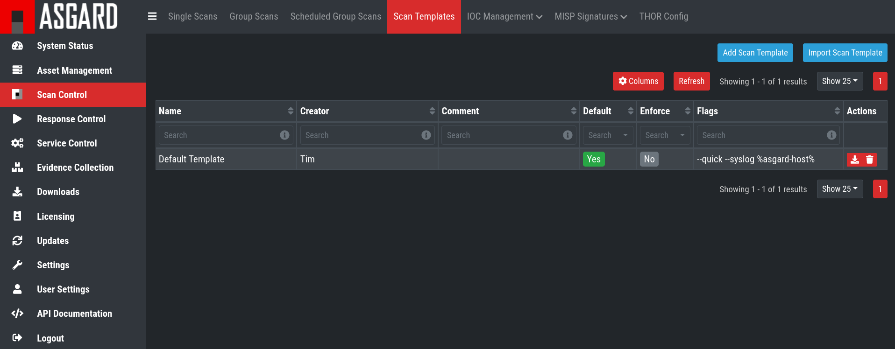

   Scan Templates Overview

In order to create a scan template, navigate to ``Scan Control`` > ``Scan Templates``
and click the ``Add Scan Template`` button. The ``Add Scan Template`` dialogue appears.
The current THOR scanner version is chosen for you by default but can be changed if needed.

After choosing or changing a scanner you will find the most frequently used options on
the top of this page in the "Favorite Flags" category. View all THOR options by
clicking on the other categories or quickly search for known flags in the search bar.
By clicking on the star symbols you can also edit your personal favorites. 

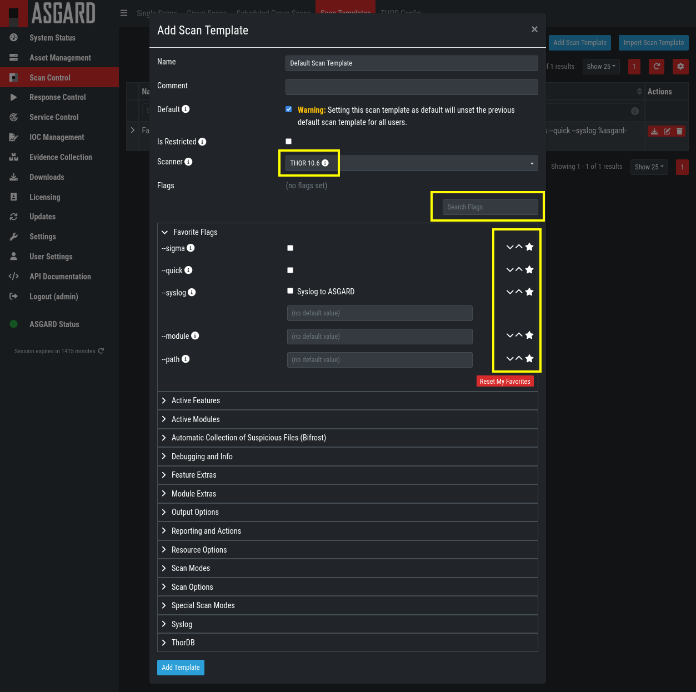

   Scan Flags

By checking the "Default" box, you can make this scan template the default template
for every new scan. There can only be one default template at a time and selecting
the box will uncheck a previous default, if set.
Checking the "Restricted" flag will make the template restricted, meaning only a
restricted set of users can use the template for scans. The set of users consists
of all users who do not have the "ForceStandardArgs" restriction set. (By default
this are all users who are not member of the group "Operator Level 1").
After clicking the "Add Template" button on the bottom of the template page, an
overview of all existing scan templates is shown. 

Scan a Single System
^^^^^^^^^^^^^^^^^^^^

Create a Single Scan
~~~~~~~~~~~~~~~~~~~~

The creation of a scan is performed within the Asset Management. There is a
button for each asset to create a new scan and to show all past scans. 

Just click on the "THOR" button in the Action column in the Asset Management view.

.. figure:: ../images/scan-control-scan-creation.png
   :alt: Scan Control - Scan Creation

   Scan Control - Scan Creation

Within this form, you can choose the maximum runtime, module, scanner, scan flags,
signatures and template can be selected.

After the desired parameters have been set, the scan can be started by clicking the ``Add Scan`` button.

Create a Single Scan for multiple Assets
~~~~~~~~~~~~~~~~~~~~~~~~~~~~~~~~~~~~~~~~

If you want to run a Single Scan - instead of a Group Scan - on multiple Assets,
you can do this by navigating to the ``Asset Management`` View and select the
assets you want to scan.

Click the ``Add Scan`` button in the top right corner and fill in the scan options.
This will create a Single Scan for each asset.

.. figure:: ../images/asset-management-multiple-single-scan.png
   :alt: Scan Control - Multiple Single Scans

   Scan Control - Multiple Single Scans

Stopping a Single Scan
~~~~~~~~~~~~~~~~~~~~~~

To stop a single scan, navigate to the "Single Scans" tab in Scan Control
section and click the "stop" (square) button for the scan you want to stop.

.. figure:: ../images/stopping-a-single-scan.png
   :alt: Stopping Single Scans

   Stopping a Single Scan

Download Scan Results 
~~~~~~~~~~~~~~~~~~~~~

After the scan completion, you can download the scan results via the
download button in the actions column.

The download button has the following options: 

* Download Scan Result as TXT (the THOR text log file)
* Download Scan Result as JSON (only available if it was started with the ``--json`` flag)
* Download HTML Report (as \*.gz compressed file; available for successful scans only)
* Show HTML Report (opens another tab with the HTML report)

.. figure:: ../images/download-scan-results.png
   :alt: Scan Control - Download Scan Results

   Scan Control - Download Scan Results

Scan Groups of Systems
^^^^^^^^^^^^^^^^^^^^^^

Create Grouped Scans
~~~~~~~~~~~~~~~~~~~~

A scan for a group of systems can be created in the ``Scan Control`` > ``Group Scans``
tab. Click the ``Add Group Scan`` button in the upper right corner.

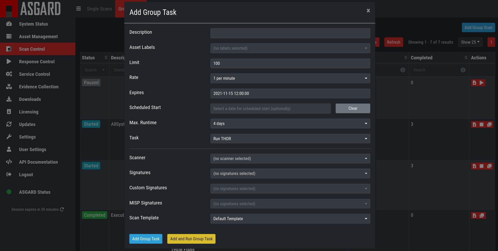

   Scan Control – Create Group Scan

As with the single scans, various parameters can be set. Aside from the already
mentioned parameters, the following parameters can be set:

.. list-table::
   :header-rows: 1
   :widths: 20, 80

   * - Parameter
     - Value
   * - **Description**
     - Freely selectable name for the group scan.
   * - **Scan Target**
     - Here you can define which assets will be affected by the group scan.
       You can either use the ``Simple`` target option, which uses labels,
       or you can use the ``Advanced`` target options, which makes use of
       labels or asset queries. Leaving this option empty will scan all assets.
   * - **Limit**
     - ASGARD will not send additional scans to the agents when the client
       limit is reached. Therefore you need to set a limit higher than the
       number of hosts you want to scan or enter ``0`` for no limit. If
       you are using MASTER ASGARD, this limit is applied on each single selected ASGARD.
   * - **Rate**
     - The number of scans per minute that are issued by ASGARD. This is
       where the network load can be controlled. Additionally, it is recommended
       to use this parameter in virtualized and oversubscribed environments in
       order to limit the number of parallel scans on your endpoints.
   * - **Expires**
     - After this time frame, no scan orders will be issued to the connected agents. 
   * - **Scheduled Start**
     - Select a date for a scheduled start of the scan.

After the group scan has been ``Saved`` or ``Saved and Started``, you will
automatically be forwarded to the list of grouped scans. 

List of all Group Scans
~~~~~~~~~~~~~~~~~~~~~~~

The list of all group scans contains, among other items, the unique Scan-ID and the name.

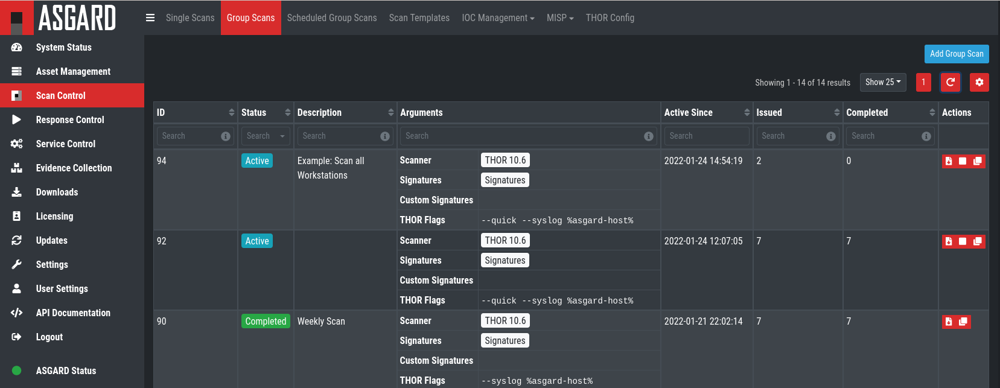

   Scan Control – Group Scans – List

In addition, information can be found about the chosen scanner, the chosen parameters,
the start and completion times and the affected assets (defined by labels).
Additional columns can be added by clicking on "Column Visibility".

The Status field can have the following values:

.. list-table::
   :header-rows: 1
   :widths: 20, 80

   * - Status
     - Value
   * - **Paused**
     - The group scan has not yet started. Either click play or wait
       for the scheduled start date (the job will start in a 5 minute window around the scheduled time).
   * - **Active**
     - Scan is started, ASGARD will issue scans with the given parameters.
   * - **Inactive**
     - No additional scan jobs are being issued. All single scans that are currently running will continue to do so.
   * - **Completed**
     - The group scan is completed. No further scan jobs will be issued.

Starting a Group Scan
~~~~~~~~~~~~~~~~~~~~~

A group scan can be started by clicking on the "play" button in the
"Actions" column of a group scan. Subsequently, the scan will be listed as "Started".

Starting a Scheduled Group Scan
~~~~~~~~~~~~~~~~~~~~~~~~~~~~~~~

The Scheduled Group Scan section shows all scans that are to run on a
frequent basis along with their periodicity. All group scans that have
been started through the scheduler will show up on top of the Group Scan
section the moment they are started. New scheduled tasks can be created
by clicking the ``Add Scheduled Group Scan`` button.

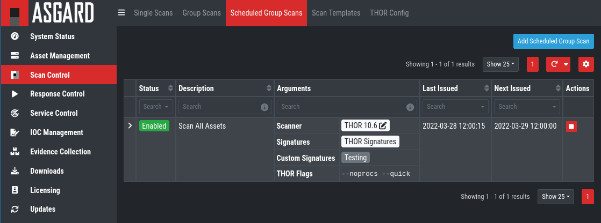

   Scan Control – Scheduled Group Scan 

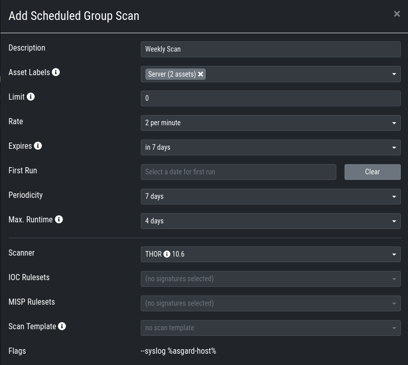

   Scan Control – New Scheduled Group Scan 

Details of a Group Scan
~~~~~~~~~~~~~~~~~~~~~~~

Further information about a group scan can be observed from the detail
page of the group scan. Click the scan you are interested in and the details section will appear.

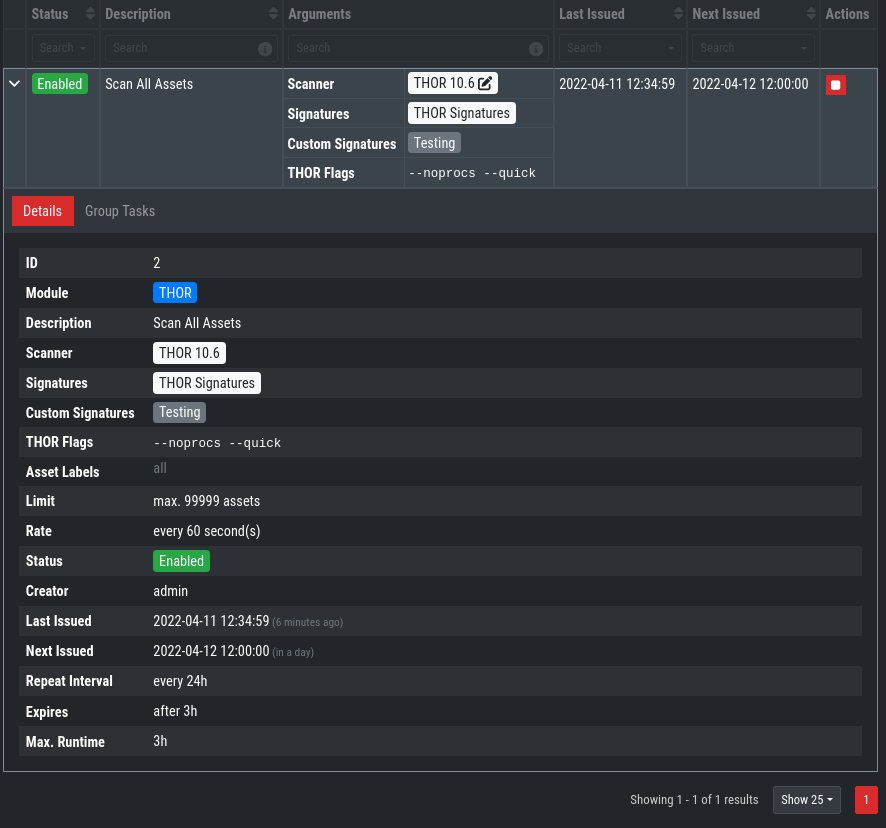

   Scan Control – Group Scans – Details

Aside from information about the group scan in the "Details" tab, there
is a graph that shows the number of assets started and how many assets
have already completed the scan in the "Charts" tab. In the "Tasks"
tab you get information about the scanned assets.

THOR Excludes and False-Positive Filters
^^^^^^^^^^^^^^^^^^^^^^^^^^^^^^^^^^^^^^^^

In THOR you can define `directory and file excludes <https://thor-manual.nextron-systems.com/en/latest/usage/configuration.html#files-and-directories>`_
and `false positive filters <https://thor-manual.nextron-systems.com/en/latest/usage/configuration.html#false-positives>`_.
With ASGARD 2.13+ these features can be globally defined in ASGARD at ``Scan Control`` > ``THOR Config``.

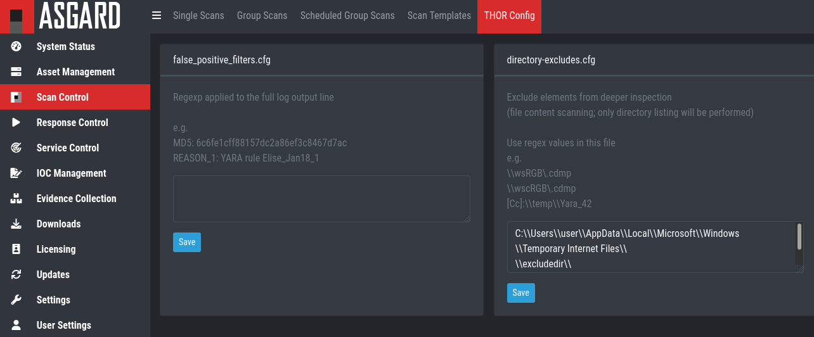

   Scan Control - Global Directory Exclude and FP Filtering

.. warning::
   Be careful not to use too broad filters or excludes as this might
   cripple THOR's detection capabilities, if done incorrectly.

Syslog Forwarding
^^^^^^^^^^^^^^^^^

Syslog Forwarding is selected by default, with the ``%asgard-host%``
target, if you create a new THOR scan task. This is a new feature
in ASGARD which has a few advantages and why you should consider
using it:

* You see live statistics of your THOR scans
* You see at which stage the THOR scan is
* You can see which module is being executed
* You will see the last scanned element (helpful if a scan is stuck)
* If a scan is being stopped by an outside process, no logs are
  available (more information further down)
* You can use :ref:`usage/administration:rsyslog forwarding` to forward
  log lines immediately to the Cockpit/your SIEM

A normal flow of information for a THOR scan looks like this:

* New scan is being created on the ASGARD
* Agent checks in a asks if any tasks are available
* ASGARD assigns the newly created THOR scan task to the asset
* Asset is downloading THOR from the ASGARD and starts scanning
* THOR finished the scan and the Asset is forwarding the scan result
  as a whole to the ASGARD

This means that your scan results take a while until you see them
in your ASGARD, since the results will be uploaded to the ASGARD
**after** the scan has finished. This also means if an outside process
(e.g. Antivirus or EDR) killed THOR during the scan, you will not have
any results in your ASGARD and have to troubleshoot why the scan failed,
mainly by running THOR in debugging mode manually on the endpoint.

To configure syslog forwarding of logs, you can set the ``--syslog`` flag
during scans. You have multiple options as to where you can send the logs.

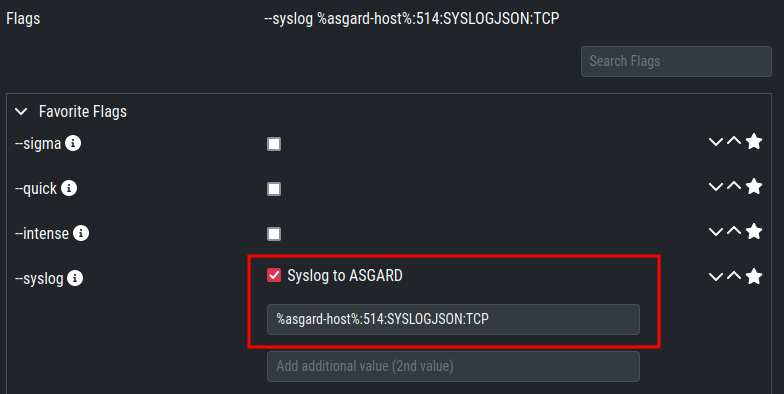

The ``--syslog`` value is constructed of the following arguments. Please
keep in mind that the fields need to be in the correct order. Values are
separated with the colon sign ``:``

.. list-table::
   :header-rows: 1

   * - Pos.
     - Field
     - Description
     - Possible Values
   * - 1
     - Server
     - The receiving server, ``%asgard-host%`` is the ASGARD which issued the Scan for the Agent
     - FQDN or IP of remote host
   * - 2
     - Port
     - The listening port on the remote system - **optional**, default is ``514``
     - 1 - 65535
   * - 3
     - Format
     - The log format - **optional**, default is ``DEFAULT``
     - \- DEFAULT [1]_
     
       \- CEF
       
       \- JSON
       
       \- SYSLOGJSON
       
       \- SYSLOGKV
   * - 4
     - Socket
     - The socket type - **optional**, default is ``UDP``
     - \- UDP

       \- TCP

       \- TCPTLS

.. [1] This is the default log format of THOR.

.. hint:: 
   The syslog listener on the ASGARD is running on port UDP/514.

Examples:

* ``172.16.20.10:514:SYSLOGKV:TCP``
* ``rsyslog-forwarder.dom.int:514:JSON:TCP``
* ``arcsight.dom.int:514:CEF:UDP``

If you choose to use the ``--syslog`` flag, please make sure that the
necessary ports are allowed within your network/firewall. If you decide
to forward your logs via ASGARD to a SIEM, please have a look at
:ref:`usage/administration:Rsyslog Forwarding`.

Response Control
----------------

The Response Control is used to execute tasks on your agents. Those
tasks can be:

* Run Playbook (pre-defined or custom)
* Run Interrogate (collect system information)
* Open Remote Console
* Maintenance

  - Upgrade Agent
  - Upgrade Service Controller
  - Configure the asset's proxy
  - Move asset to another ASGARD

Opening a Remote Shell on an endpoint
^^^^^^^^^^^^^^^^^^^^^^^^^^^^^^^^^^^^^

In order to open a remote shell on an endpoint, open the Asset
Management section and click the "command line" button in the Actions column.

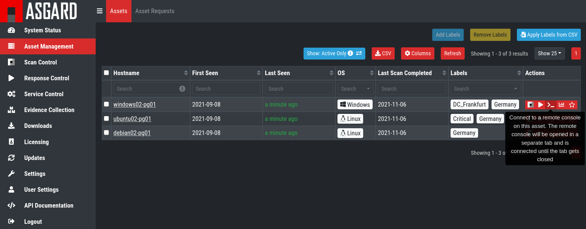

   Opening a Remote Shell from the Asset View

Depending on your configuration it may take between 10 seconds and 10
minutes for the remote shell to open. Please note that all actions
within the remote shell are recorded and can be audited. All shells
open with root or system privileges.

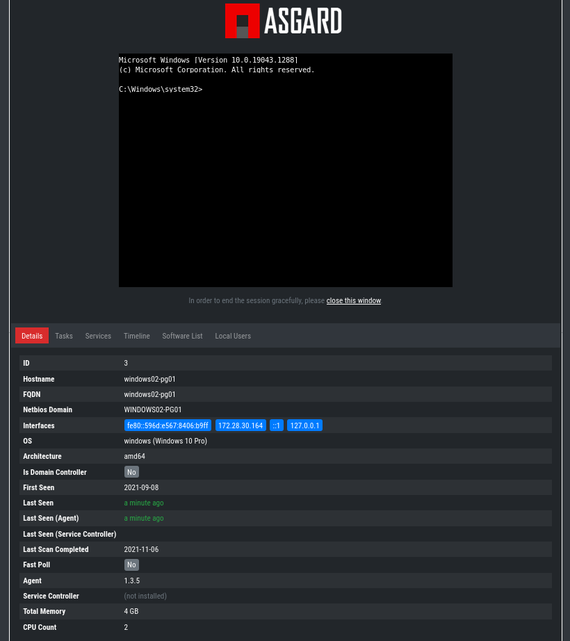

   Remote Shell

In order to replay a remote console session, navigate to ``Response Control``,
expand the task that represents your session, select the ``Console Log`` tab
and click the play button in the bottom row.

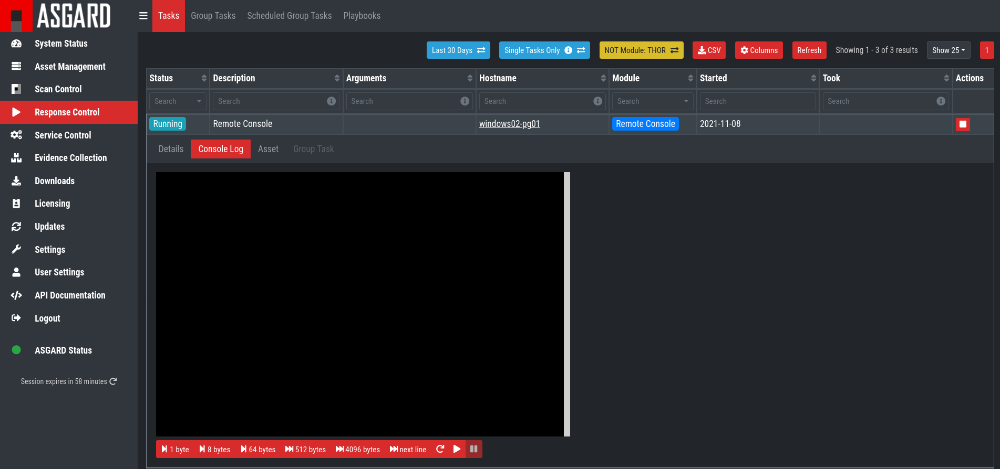

   Replay Remote Shell Session

ASGARD users can only see their own remote shell session. Only users with
the ``RemoteConsoleProtocol`` permission are able to replay all sessions from all users.

Response Control with Pre-Defined Playbooks
^^^^^^^^^^^^^^^^^^^^^^^^^^^^^^^^^^^^^^^^^^^

In addition to controlling THOR scans, ASGARD Management Center contains
extensive response functions. Through ASGARD, you can start or stop processes,
modify and delete files or registry entries, quarantine endpoints, collect
triage packages and execute literally any command on connected systems.
All with one click and executed on one endpoint or groups of endpoints.

It is also possible to download specific suspicious files. You can transfer
a suspicious file to the ASGARD Management Center and analyze it in a Sandbox. 

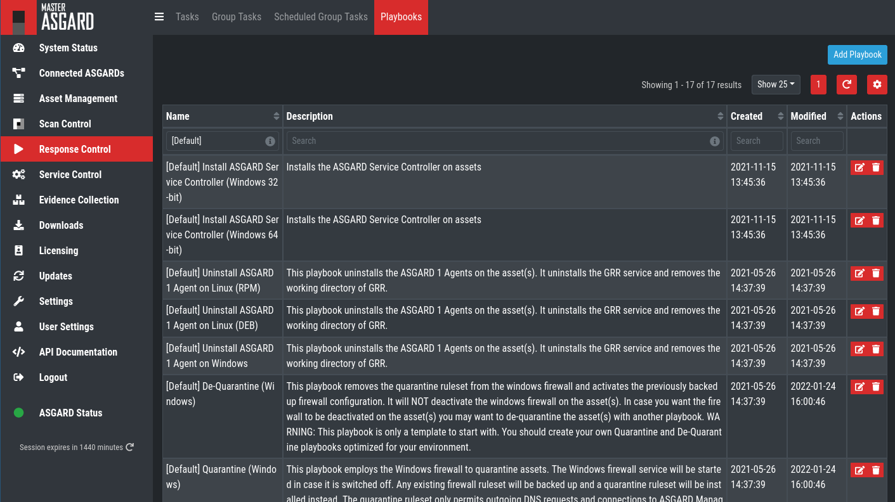

   Built-in Playbooks

To execute a predefined response action on a single endpoint, navigate
to the Asset Management view and click the "play" button in the Actions
Column. This will lead you to a dialogue where you can select the desired action. 

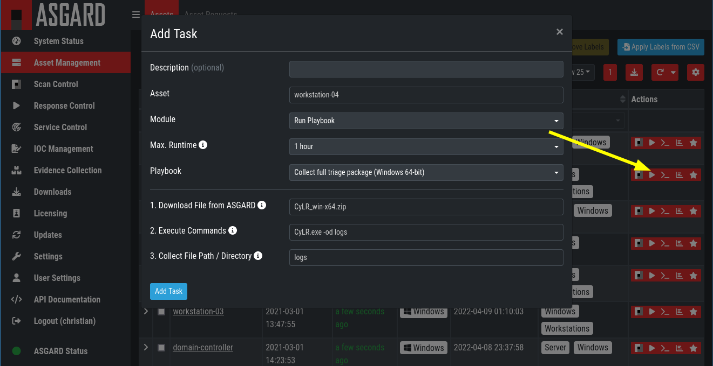

   Execute Playbook on Single Endpoint

In this example, we collect a full triage package.

ASGARD ships with pre-defined playbooks for the following tasks:

* Collect ASGARD Agent Log
* Create and Collect Aurora Agent Diagnostics Pack (Windows only)
* Collect full triage pack (Windows only)
* Isolate endpoint (Windows only)
* Collect system memory
* Collect file / directory
* Collect directory
* Collect Aurora diagnostics pack
* Execute command and collect stdout and stderr

Nextron provides additional playbooks via ASGARD updates.

.. warning::
    The collection of memory can set the systems under high load and
    impacts the systems response times during the transmission of
    collected files. Consider all settings carefully! Also be aware
    that memory dumps may fail due to kernel incompatibilities or
    conflicting security mechanisms. Memory dumps have been successfully
    tested on all supported Windows operating systems with various patch
    levels. The memory collection on Linux systems depends on kernel
    settings and loaded modules, thus we cannot guarantee a successful
    collection. Additionally, memory dumps require temporary free
    disk space on the system drive and consume a significant amount
    of disk space  on ASGARD as well. The ASGARD agent checks if there
    is enough memory on the  system drive and adds a 50% safety buffer.
    If there is not enough free disk  space, the memory dump will fail.  

Response Control for Groups of Systems
^^^^^^^^^^^^^^^^^^^^^^^^^^^^^^^^^^^^^^

Response functions for groups of systems can be defined in the ``Group Tasks``
tab or the ``New Scheduled Group Task`` tab.

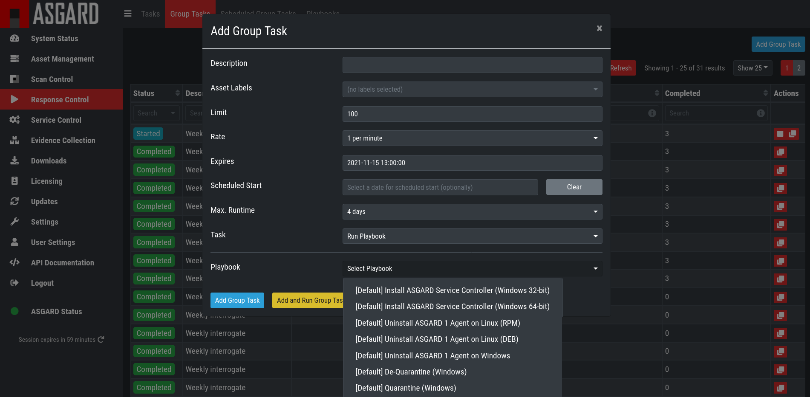

   Execute Playbook on Group of Endpoints

Response Control with Custom Playbooks
^^^^^^^^^^^^^^^^^^^^^^^^^^^^^^^^^^^^^^

You can add your own custom playbook by clicking the ``Add Playbook`` button in the 
``Response Control`` > ``Playbooks`` tab. 

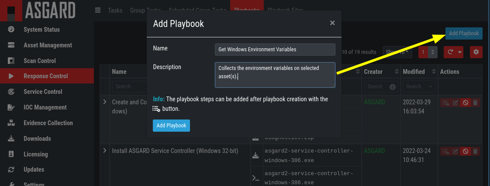

   Add Custom Playbook

This lets you define a name and a description for your playbook. After clicking
the ``Add Playbook`` button, click on the ``Edit steps of this playbook`` action. 

.. figure:: ../images/custom-playbook-edit-steps.png
   :alt: Playbook Action Items

   Playbook Action Items

This opens the side pane in which single playbook steps
can be added using the ``Add Step`` button.

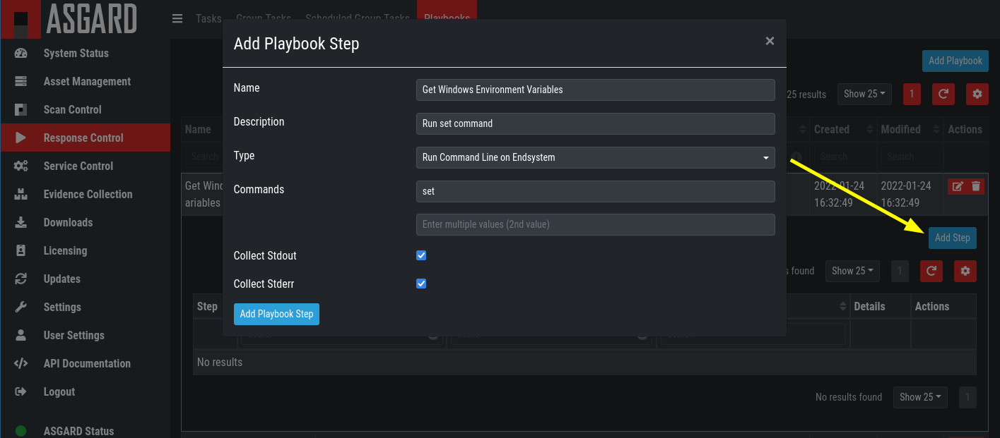

   Add Playbook Entry

If you need custom files for your playbook (scripts, configurations, binaries, etc.)
you can select local files to be uploaded to ASGARD during the creation of the playbook
step (by selecting "Upload New File" in the file drop-down). You can manage these
files at ``Response Control`` > ``Playbook Files`` and upload or update files using
the ``Upload Playbook File`` button.

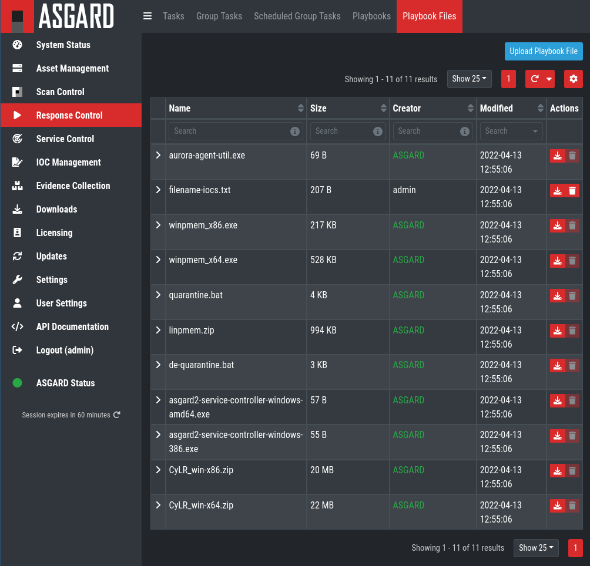

   Manage Playbook Files

You can have up to 16 steps in each playbook that are executed sequentially. Every
step can be either "download something from ASGARD to the endpoint", "execute a
command line" or "upload something from the endpoint to ASGARD". If you run a
command line the stdout and stderr are reported back to ASGARD. 

Change the Asset(s) Proxy
^^^^^^^^^^^^^^^^^^^^^^^^^

You can change the Proxy Settings on your Assets via the Response Control.
To do this, select the asset(s) and click ``Add Task`` in the top right corner.
Next, set the Module to ``Maintenance`` and the Maintenance Type to
``Configure the asset's proxy``. You can now set your proxy. Multiple proxies
can be set, though only one FQDN/IP-Address per field can be set.

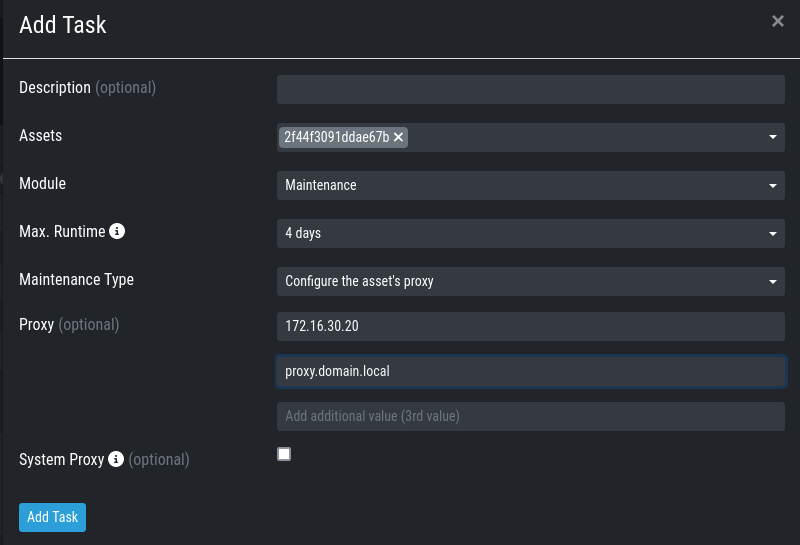

   Change/Set an assets Proxy

Service Control
---------------

Service Control is ASGARD's way of deploying real-time services on endpoints.
Currently there exist the Aurora and the LogWatcher service. To use any of those
two, the service controller has to be installed on an asset.

Service Controller Installation
^^^^^^^^^^^^^^^^^^^^^^^^^^^^^^^

To install asgard2-service-controller on an asset you need to install the asgard2-agent
first. If you already have installed asgard2-agent on an asset and accepted it in ASGARD,
you can use the **"Install ASGARD Service Controller"** playbook to deploy the service
controller on an asset or you can manually download and execute the asgard2-service-controller
installer from the ASGARD downloads page.

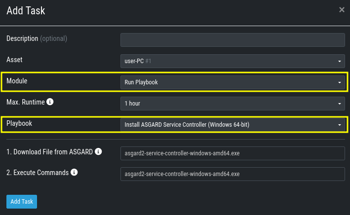

   Install Service Controller

Service Controller Update
^^^^^^^^^^^^^^^^^^^^^^^^^

If an ASGARD update comes with a new service controller version, you need to update
the service controller on the already rolled-out assets. You can do this using an
"Update Agent" task. For a single asset the task can be run in ``Asset Management`` >
``Assets`` > ``Run Task`` (play button action) or analogous as a (scheduled) group task
under ``Response Control`` > ``(Scheduled) Group Tasks`` > ``Add (Scheduled) Group Task``.

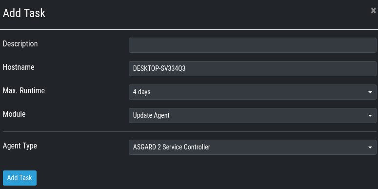

   Update Service Controller

.. note::
    If you don't see the **Update Agent** module, you need to enable **Show Advanced Tasks** in ``Settings`` > ``Advanced``

Sigma
^^^^^

LogWatcher, as well as Aurora, are using Sigma in order to define their detections.
The Sigma rule management is shared between the two services. But each service has
its own configuration that defines which rules are actually used on the assets.

What is Sigma
~~~~~~~~~~~~~

From the `project website <https://github.com/SigmaHQ/sigma>`_:

.. highlights::

   `Sigma is a generic and open signature format that allows you to
   describe relevant log events in a straightforward manner. The rule
   format is very flexible, easy to write and applicable to any type
   of log file. The main purpose of this project is to provide a
   structured form in which researchers or analysts can describe their
   once developed detection methods and make them shareable with others.`

   `Sigma is for log files what` `Snort <https://www.snort.org/>`_ `is for network traffic and`
   `YARA <https://github.com/VirusTotal/yara>`_ `is for files.`

Creating a Ruleset
~~~~~~~~~~~~~~~~~~

Rulesets are used to group rules to manageable units. As an asset
can only have one service configuration, rulesets are used to determine
which rules are used in which service configuration. There exist default
rulesets for high and critical Sigma rules. If you want to create a
custom ruleset go to ``Service Control`` > ``Sigma`` > ``Rulesets`` > ``Create Ruleset``.

.. figure:: ../images/sc-create-ruleset.png
   :alt: Create a Ruleset

   Create a Ruleset

If you have chosen that new Sigma rules should be added automatically
they are added now. If you didn't you now need to add the desired rules
manually by going to ``Service Control`` > ``Sigma`` > ``Rules``. Choose
the rules that should be added to this ruleset by selecting the checkboxes
and then ``Add to Ruleset``. A rule can be assigned to multiple rulesets.

.. figure:: ../images/sc-add-to-ruleset.png
   :alt: Add a Rule to Rulesets

   Add a Rule to Rulesets

.. note::
    You need to commit and push your changes after editing a ruleset.
    ASGARD has to restart the service controller to read new configurations.
    In order to prevent multiple restarts in the case of a user performing
    several configuration changes in succession, the user has to initiate
    the reloading of the new configuration by going to ``Service Control`` >
    ``Sigma`` > ``Rulesets`` and performing the **Compile ruleset** action
    (gear wheels). The need for compiling is indicated in the *Uncompiled Changes* column.

    .. figure:: ../images/sc-uncommitted-changes.png
       :alt: Uncompiled Changes Indicator
    
       Uncompiled Changes Indicator

Choosing which Rules to activate
~~~~~~~~~~~~~~~~~~~~~~~~~~~~~~~~

It is not advised to enable all available rules on an asset. We suggest
to start with all "critical" and then advance to all "high" rules. We
already provide a default ruleset for those two levels for you to use.
"Medium" rules should not be enabled in bulk or "low"/"informational"
at all . Single medium rules, which increase an organization's detection
coverage and do not trigger a bigger number of false positives can be added
to the active configuration, but should be tested rule by rule.

In order to easily add rules to a ruleset you can use the column filters
to select the desired rules and add the bulk to a ruleset. As an example
you can add all rules of level "critical" to a ruleset:

    .. figure:: ../images/sc-choose-rules1.png
       :alt: Add all critical rules to a ruleset
    
       Add All Critical Rules to a Ruleset

Another great way to pivot the Sigma rule database is the usage of MITRE ATT&CK® IDs.

    .. figure:: ../images/sc-choose-rules2.png
       :alt: Search by MITRE ATT&CK® ID
    
       Search by MITRE ATT&CK® ID

Or you can just search the title or description field of the rules. You can also search
the rule itself using the "Rule" column. (the "Rule" column is not shown by default and
has to be added using the gear wheel button).

    .. figure:: ../images/sc-choose-rules3.png
       :alt: Search by Rule Title or Description
    
       Search by Rule Title or Description

False Positive Tuning of Sigma Rules
~~~~~~~~~~~~~~~~~~~~~~~~~~~~~~~~~~~~

Not every environment is the same. It is expected that some rules will trigger false
positive matches in your environment. You have
multiple options to tackle that issue.

1. If it is a general false positive, probably not only occurring in your environment,
   consider reporting it at as a `Github issue <https://github.com/SigmaHQ/sigma/issues>`_
   or `e-mail to us (rules@nextron-systems.com) <mailto:rules@nextron-systems.com>`_. We
   will take care of the tuning for you and your peers.
2. If the false positive is specific to your environment you can tune single Sigma rules
   at ``Service Control`` > ``Sigma`` > ``Rules``, filter for the rule in question and
   choose the "Edit false positive filters of this rule" action. Here you can do simple
   rule tunings on your own. By clicking the ``Add False Positive Filter`` button you can
   add single lines that filter the event for false positives (i.e. they are OR-connected
   meaning: "Do not match the event if any of those lines matches). They are applied on top
   of the rule logic and persist automatic rule updates.

    .. figure:: ../images/sigma-rules-fp-tuning.png
       :alt: Example of the false positive tuning of a Sigma rule
    
       Example of the false positive tuning of a Sigma rule

    To see the resulting rule you can click the "Show Preview" button or look at the
    "Compiled Rule" row in the rule's drop down menu.

    If you want to review the tuned rules: To filter for all rules containing a custom
    false positive tuning, you have to add the "Filters" column to your view (gear wheels
    icon) and show all non-empty rows by using the ``NOT -`` column filter.

3. If the rule is adding too much noise and tuning is not sensible, you can remove the
   rule from the ruleset for a subset of your machines (maybe you need to define and use
   a separate ruleset for that use-case) or you can disable the rule altogether. This
   is done using the ``Disable this rule`` action of the rule. Disabling the rule affects the rule in all rulesets.

After tuning a rule, the rulesets using that rule have to be re-compiled at ``Service Control`` > ``Sigma`` > ``Rulesets``.
       
Adding Custom Rules
~~~~~~~~~~~~~~~~~~~

Custom rules can be added using the sigma format complying with the
`specification <https://github.com/SigmaHQ/sigma/wiki/Specification>`_. You can
upload single files or a ZIP compressed archive. This can be done at
``Service Control`` > ``Sigma`` > ``Rules`` > ``Upload Rules``.

    .. figure:: ../images/sc-custom-rule.png
       :alt: Adding Custom Rules
    
       Adding Custom Rules

Rule and Response Updates
~~~~~~~~~~~~~~~~~~~~~~~~~

If new rules or rule updates are provides by the Aurora signatures, the updates
have to be applied by the user manually in order to be affecting Aurora agents
managed by ASGARD. An indicator is shown in the WebUI and the rules changes can
be reviewed and applied at ``Service Control`` > ``Sigma`` > ``Rule Updates``. 

    .. figure:: ../images/sigma-rule-updates.png
       :alt: Sigma Rule Updates for Aurora
    
       Sigma Rule Updates for Aurora

Clicking on the ``Update`` button in the "Update Available" column opens a diff
view in which the changes are shown and where the user can apply or discard the
changes. If you do not need to review each single change, you can apply all
changes using the ``Update All Rules`` button.

Analogous the updates of response actions can be viewed and applied at
``Service Control`` > ``Sigma`` > ``Response Updates``.

How to activate Responses
~~~~~~~~~~~~~~~~~~~~~~~~~
As a fail safe and for administration purposes, responses are generally
only simulated if not explicitly set to active.
This has to be done on different levels:

- Service configuration level
- Ruleset configuration level (on updates)
- Ruleset rule level

If on one level a rule is simulated, it will not execute the response
actions but only generate a log line that describes the action that
would have been performed. You can see an overview of the state of all
responses in the ``Service Control`` > ``Aurora`` > ``Configurations`` menu.

    .. figure:: ../images/sc-aurora-configuration-response-overview.png
       :alt: Aurora Configuration Response Action Overview
    
       Aurora Configuration Response Action Overview

(1) indicates whether responses are activated on configuration level. Edit the configuration to change it.
(2) indicates how many rules are only simulated in that ruleset (or in sum).
(3) indicates  how many rules have active responses in that ruleset (or in sum)

To change the status of a response in the ruleset click the ruleset link.
You can view all simulated or all active responses. Use the checkbox and
the button in the upper right to switch the response status of the rules
between active and simulated.

    .. figure:: ../images/sc-aurora-ruleset-responses.png
       :alt: Response Configuration in Rulesets
    
       Response Configuration in Rulesets

In addition the default response mode of a ruleset is important for the
behavior of response updates. It can be seen at ``Service Control`` >
``Sigma`` > ``Rulesets`` in the "Default Response Mode" column.

    .. figure:: ../images/sigma-ruleset-default-response-mode.png
       :alt: Ruleset Default Response Mode
    
       Ruleset Default Response Mode

If "Simulation" is selected, response actions of new and updated rules
will be put in simulation mode. If "Active" is selected, new rules will
automatically be put in active mode and updated rules will not change
their current response mode.

Aurora
^^^^^^

- Aurora is a lightweight endpoint agent that applies Sigma rules and IOCs on local event streams.
- It uses Event Tracing for Windows (ETW) to subscribe to certain event channels.
- It extends the Sigma standard with so-called "response actions" that can get executed after a rule match
- It supports multiple output channels: the Windows Eventlog, a log file and remote UDP targets

Its documentation can be found at `aurora-agent-manual.nextron-systems.com <https://aurora-agent-manual.nextron-systems.com/en/latest/index.html>`_.

Aurora Overview
~~~~~~~~~~~~~~~
Under ``Service Control`` > ``Aurora`` > ``Asset View (Deployed)`` the overview
of all assets with installed Aurora is shown. Clicking on the entry opens a
drop-down menu with details and additional information.

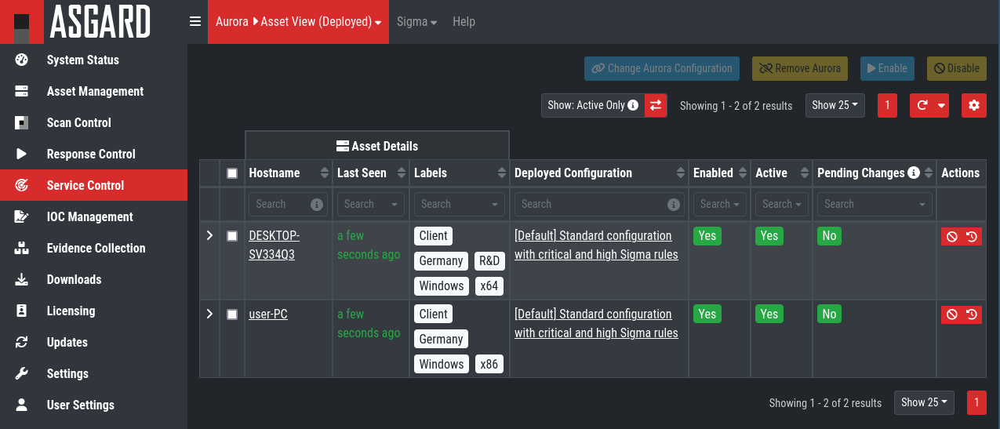

   Aurora Asset View

Deploy Aurora on Asset
~~~~~~~~~~~~~~~~~~~~~~

Analogous you can see an overview of all assets without Aurora installed under
``Service Control`` > ``Aurora`` > ``Asset View (Not Deployed)`` and install
Aurora using the ``Deploy Aurora`` button.

Change Service for an Asset
~~~~~~~~~~~~~~~~~~~~~~~~~~~
To change the Aurora configuration of an asset, navigate to ``Service Control``
> ``Aurora`` > ``Asset View (Deployed)``, select the asset's checkbox and choose
> ``Change Aurora Configuration``. Then choose the desired service configuration
> by clicking ``Assign and Restart``.

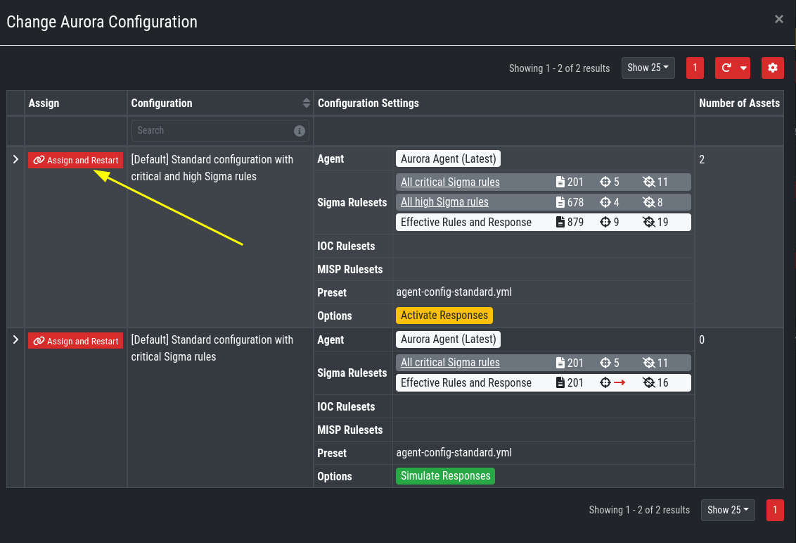

   Change Aurora Service Configuration

If you want to enable or disable the Aurora service on an asset, select it
with the checkbox and use the ``Enable`` or ``Disable`` button or select
the play or stop action icon on single assets.

Creating a Custom Aurora Service Configuration
~~~~~~~~~~~~~~~~~~~~~~~~~~~~~~~~~~~~~~~~~~~~~~

Go to ``Service Control`` > ``Aurora`` > ``Configurations`` > ``Add Configuration``,
enter a name and add the rulesets that should apply for this service configuration.
No rulesets is a viable option, if you only want to use the non-sigma matching modules.
You don't need to edit any other option as sane defaults are given.

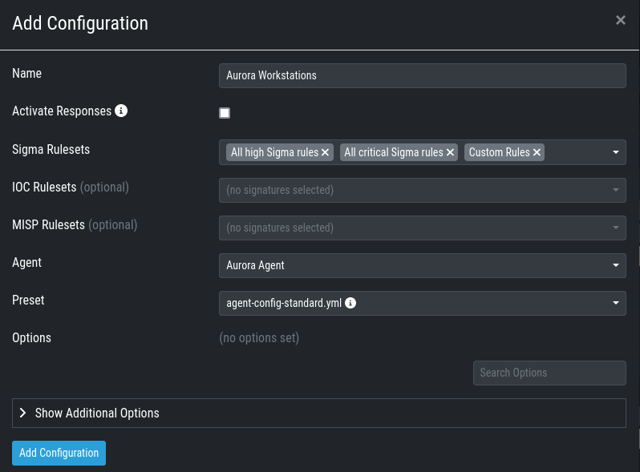

   Create a Custom Aurora Configuration

Process Excludes
~~~~~~~~~~~~~~~~~~

If Aurora uses too much CPU cycles, the most common reason is a heavy event
producer on the system (e.g. anti virus or communication software). In order
to analyze the issue and define process exclusions, go to ``Service Control`` >
``Aurora`` > ``Process Excludes``

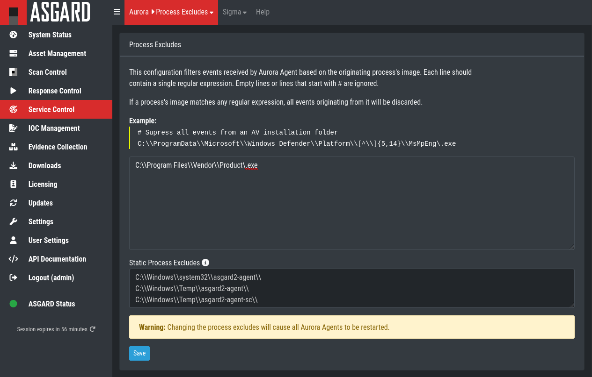

   Define Aurora Process Exclusion

An overview over the top event producing processes is given on the bottom
of the section. Another possibility is to
:ref:`collect diagnostic packs of systems<usage/troubleshooting:Aurora Diagnostics Pack>`
in question and look in the ``status.txt`` at the event statistics by process.

False Positive Filters
~~~~~~~~~~~~~~~~~~~~~~
If needed, false positives can be globally filtered on all Aurora agents
at ``Service Control`` > ``Aurora`` > ``False Positive Filters``. It is
recommended to filter false positives at ``Service Control`` > ``Sigma`` >
``Rules`` and filter the false positives on a rule level using the "edit false
positive" action (funnel icon). For more details see
:ref:`usage/administration:False Positive Tuning of Sigma Rules`. If this is
not possible, because you need a quick fix and multiple rules are affected,
the global false positive filter can help.

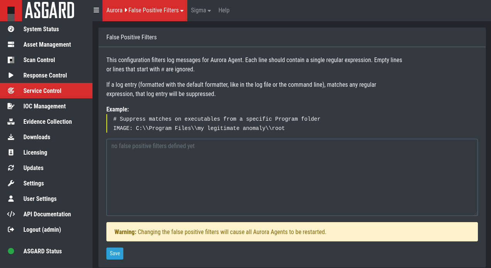

   Define Global Aurora False Positive Filters

.. warning::
   A too permissive filter will greatly reduce Aurora's detection and response capabilities.

Response Action Logs
~~~~~~~~~~~~~~~~~~~~
You can view an overview and the logs of the Aurora response and simulated
response actions under ``Service Control`` > ``Aurora`` > ``Response Action Logs``.

.. figure:: ../images/aurora-response-action-logs.png
   :alt: Aurora Response Action Logs

   Aurora Response Action Logs

Best Practices for Managing Aurora
~~~~~~~~~~~~~~~~~~~~~~~~~~~~~~~~~~

1. Install the ASGARD agent on the asset (see :ref:`usage/administration:ASGARD Agent Deployment`)
2. Install the ASGARD service controller on the asset (see :ref:`usage/administration:Service Controller Installation`)
3. Deploy the Aurora Service on the asset using the ``[Default] Standard configuration with critical and high Sigma rules``
4. configuration (see :ref:`usage/administration:Deploy Aurora on Asset`)

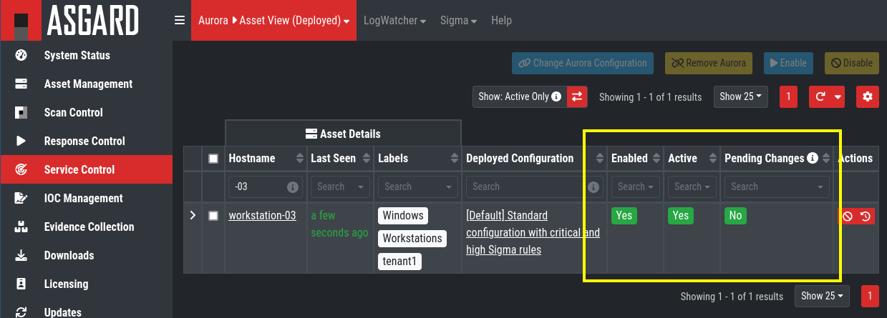

   Aurora Service Successfully Deployed

If you want to enable the blocking capabilities of Aurora, we suggest
to enable our included responses:

1. See the overview at ``Service Control`` > ``Aurora`` > ``Configurations``.
   The ``Effective Rules and Response`` row shows how many responses are active.
   By default no responses are active. See :ref:`usage/administration:How to activate Responses`
   on how to activate responses.
2. Do not directly activate the responses in production environments. Monitor
   your environment for at least a month with simulated responses to verify
   that no false positive matches occur.
3. In larger environments use different configurations and rulesets for different
   environments. As an example you can test changes to the configuration in a
   test environment, before adapting the changes for the production environment.

You can test the response functionality by entering the command

.. code-block:: doscon

   C:\Users\user>rundll32.exe AuroraFunctionTest.dll StartW

on the command line of an asset. As a result you should see following
message in the ``Service Control`` > ``Aurora`` > ``Response Action Logs``:

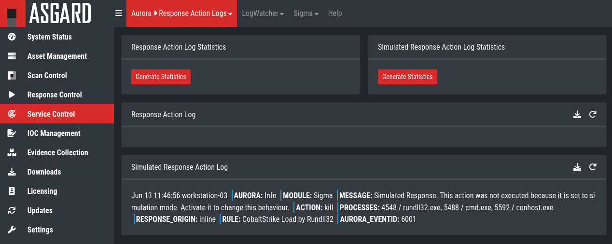

   Aurora Simulated Response Action 

More tests are available from the
`Function Tests section of the Aurora manual <https://aurora-agent-manual.nextron-systems.com/en/latest/usage/function-tests.html>`_.
Those tests only generate detection events but no responses. If your ASGARD Management
Center is connected to an Analysis Cockpit, you can see the detection events at ``Events`` >
``Aurora Events`` or in the Windows EventLog of the asset.

LogWatcher Service
^^^^^^^^^^^^^^^^^^

The LogWatcher real-time service monitors the Windows Event Log using
predefined rules in the Sigma format and creates an alert that is forwarded
to ASGARD Analysis Cockpit if a match was found. The LogWatcher service is no
longer shown by default on newly installed ASGARDs. To enable it go to ``Settings`` >
``Advanced`` and enable the ``Show LogWatcher`` checkbox.

Prerequisites
~~~~~~~~~~~~~

In order to make full use of ASGARD LogWatcher you need a Windows Audit Policy
and Sysmon, both with a reasonable configuration, in place. We expect organizations
to take care of providing a sane configuration by their own. This section helps
in giving starting points, if needed.

Windows Audit Policy
""""""""""""""""""""

The default audit policy of Windows is not suitable for security monitoring
and needs to be configured. There are Microsoft recommendations available
`online <https://docs.microsoft.com/en-us/windows-server/identity/ad-ds/plan/security-best-practices/audit-policy-recommendations>`_.

Also auditing the command line for process creation events should be enabled.
Documentation for that task is available `here <https://docs.microsoft.com/en-us/windows-server/identity/ad-ds/manage/component-updates/command-line-process-auditing>`_.

Sysmon Configuration Template
"""""""""""""""""""""""""""""

There are some best practice configurations available. See them as a
good starting point to develop your own configuration. If you do not
have a Sysmon configuration yet, there are several options we suggest:

1. The Nextron Systems fork of SwiftOnSecurity's `sysmon-config <https://github.com/Neo23x0/sysmon-config>`_
2. The `SwiftOnSecurity sysmon-config <https://github.com/SwiftOnSecurity/sysmon-config>`_
3. Olaf Hartong's `sysmon-modular <https://github.com/olafhartong/sysmon-modular>`_

In general we suggest our own configuration, as we test our rules with
it and include changes from the upstream configuration. But depending
on your preferences, either of those listed configurations is a good
starting point for writing your own configuration.

.. warning::
    Do not deploy those configurations to your production environment
    without prior testing.

    It is expected that some tools you use will be the source of huge
    log volume and should be tuned in the configuration depending your environment.

Sysmon Installation
"""""""""""""""""""

`Sysmon <https://docs.microsoft.com/en-us/sysinternals/downloads/sysmon>`_
is part of Microsoft Sysinternals and therefore has to be installed as a
third party tool. The preferred way to distribute Sysmon and its configuration
is using your organization's device management. If you do not have access to one,
you can use ASGARD's playbook feature to distribute Sysmon and update its
configuration. Documentation which describes the playbook creation and that
offers maintenance scripts can be found in our `asgard-playbooks repository <https://github.com/NextronSystems/asgard-playbooks>`_.

Operation
~~~~~~~~~
This chapter explains how to configure LogWatcher using Sigma rules.

LogWatcher Overview
"""""""""""""""""""

Under ``Service Control`` > ``LogWatcher`` > ``Asset View (Deployed)``
the overview of all assets with an installed LogWatcher is shown.
Clicking on the entry opens a drop-down menu with details and additional information.

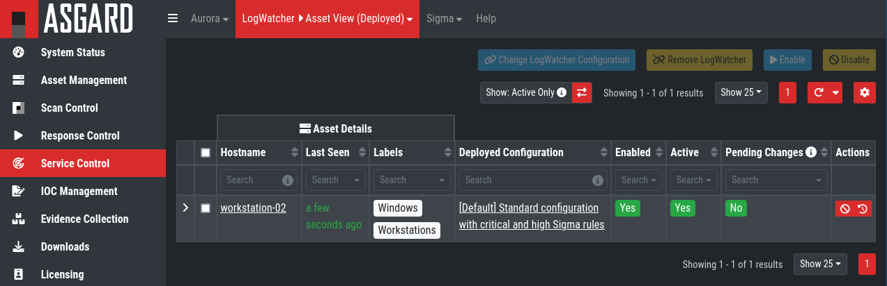

   LogWatcher Asset View

Analogous you can see an overview of all assets without an installed
LogWatcher under ``Service Control`` > ``LogWatcher`` > ``Asset View (Not Deployed)``.

Enable Service for an Asset
"""""""""""""""""""""""""""
To enable the LogWatcher service for an asset, navigate to ``Service Control`` >
``LogWatcher`` > ``Asset View``, select the asset's checkbox and choose
``Assign Configuration``. Then choose the desired service configuration
by clicking ``Assign``.

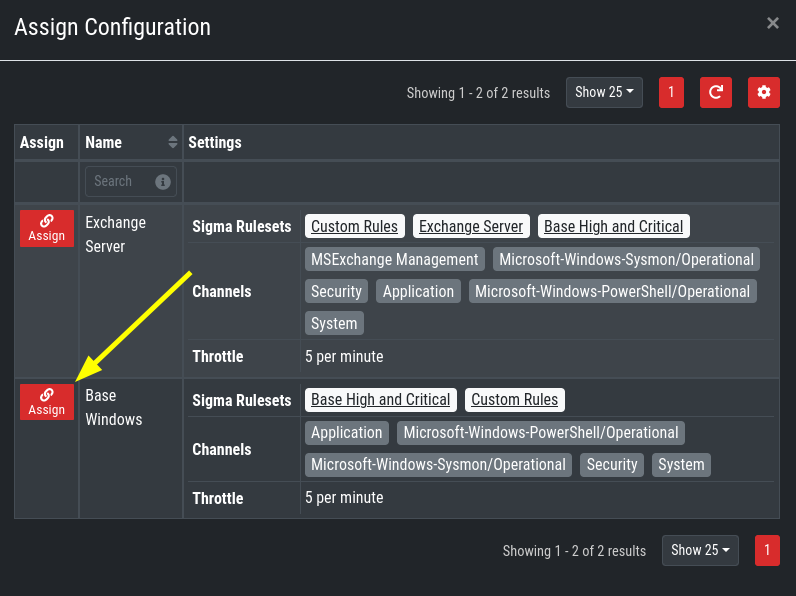

   Enable a Service Configuration

Creating a Custom Logwatcher Service Configuration
""""""""""""""""""""""""""""""""""""""""""""""""""

A service configuration is used to group assets of similar type and
assign them a set of rules (in form of rulesets). 

Go to ``Service Control`` > ``LogWatcher`` > ``Configurations`` >
``Add Configuration``, enter a name and add the rulesets that
should apply for this service configuration (i.e. group of assets).

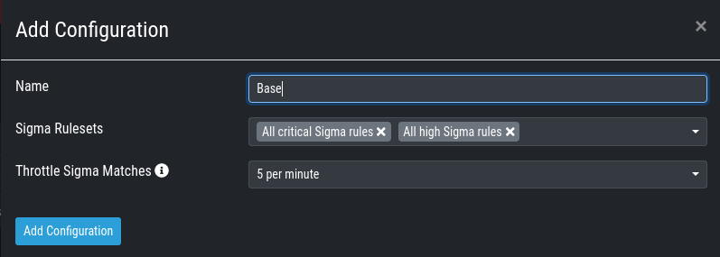

   Create a Service Configuration

If you have not configured a ruleset yet, you need to do so beforehand.

IOC Management
--------------

Integrating Custom IOCs
^^^^^^^^^^^^^^^^^^^^^^^

The menu ``IOC Management`` gives you the opportunity to easily integrate custom signatures into your scans. 

In order to create your own custom IOC Group, navigate to ``IOC Management`` > ``IOCs``
and click ``Add IOC Group`` in the upper right corner. Select a name and optionally a description for your IOC Group.

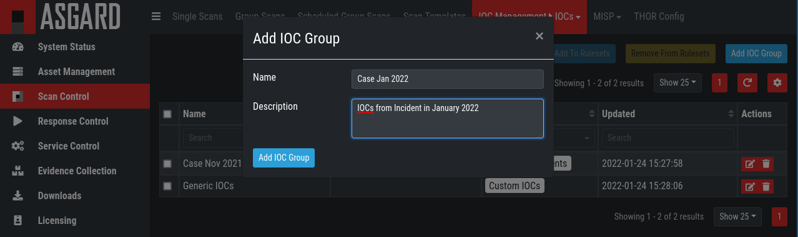

   Add IOC Group

To add IOCs to this group, use the ``Show and edit IOCs in this IOC group``
action. A side pane opens where you can click the ``Import IOCs`` button
to import your own signatures in any of THOR's IOC formats as files (e.g.
files for keyword IOCs, YARA files and SIGMA files). Refer to the  
`THOR manual (custom signatures) <https://thor-manual.nextron-systems.com/en/latest/usage/custom-signatures.html>`_
for a complete list and file formats. Browse to the file you want
to add and click upload. This adds your IOC file to the default ruleset. 

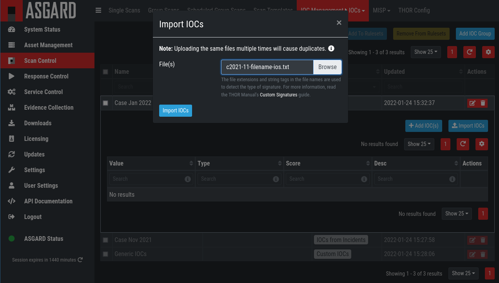

   Imported IOCs Overview

However, you can also click the ``Add IOC(s)`` button to add some IOCs
interactively. Select the type, score and description, enter some values
and click the ``Add IOC`` button.

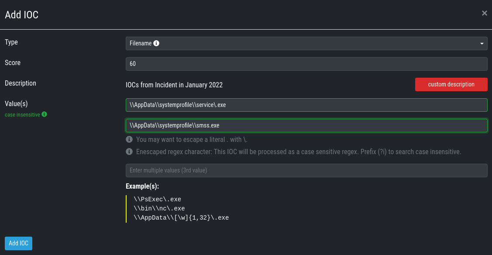

   Add IOCs

You can add those IOC Groups to IOC Rulesets which can be created in
the ``IOC Management`` > ``IOC Rulesets`` tab by clicking the  ``Add Ruleset``
button in the upper right corner. Select name and description and click the 
``Add Ruleset`` button.

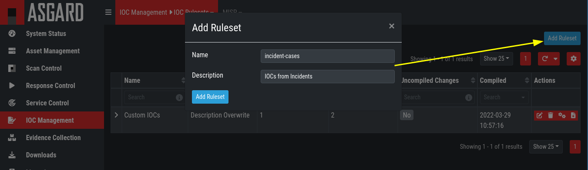

   Add Ruleset

After that, click on an entry in the table to expand it. There you
get information about all IOC Groups which have been added to this
ruleset. Additionally you can add or remove selected IOC Groups in
``IOC Management: IOCs`` by clicking one of the three buttons shown below.

   Buttons to Add/Remove IOC Groups

Scan only with Custom IOCs
^^^^^^^^^^^^^^^^^^^^^^^^^^

Those rulesets can be selected in the "IOC Rulesets" field while
creating a new scan job. If a ruleset is selected, the scan will
include all custom IOCs included in IOC Groups which have been
added to this ruleset. You can also select more than one ruleset.

The THOR scan would be performed with the default settings and the
custom ruleset, the default signatures would not be applied.

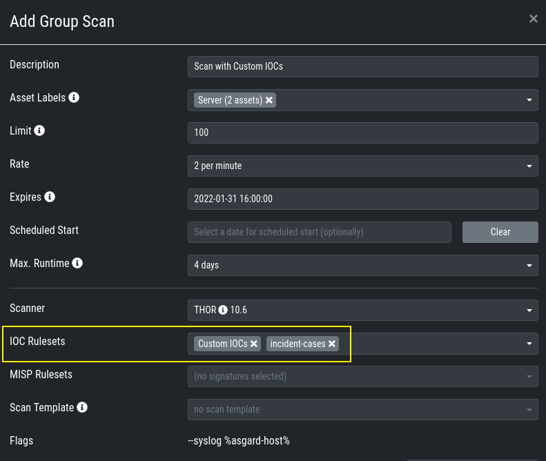

   Select Ruleset while creating a scan job

.. note::
   To scan exclusively with the custom ruleset, the flag 
   ``--customonly`` must be set. Please see
   `THOR Flags <https://thor-manual.nextron-systems.com/en/latest/usage/flags.html#feature-extras>`_
   for more information.

Integrating IOCs through MISP
^^^^^^^^^^^^^^^^^^^^^^^^^^^^^

.. note::
   In order to use MISP events and their IOCs for scanning, you
   need to link your ASGARD with a MISP first. Please see
   :ref:`usage/administration:link misp` for reference.

ASGARD provides an easy to use interface for integrating IOCs from
a connected MISP into THOR scans. In order to add rules from a MISP,
navigate to ``IOC Management`` > ``MISP`` > ``MISP Events``, select
the IOCs and add them to the desired ruleset by using the button in
the upper right corner. 

There is no default ruleset for MISP. You must create at least one
ruleset (see tab "MISP Rulesets") before you can add MISP rules.

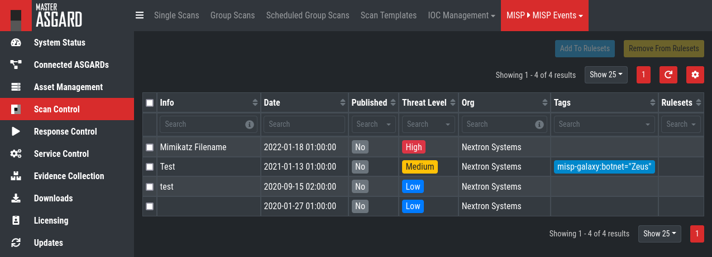

   MISP events 

To create a new ruleset, click ``Add MISP Ruleset`` in the
``IOC Management`` > ``MISP`` > ``MISP Rulesets`` tab. Select a name
and the type of IOCs you want to use in this ruleset. By default, all
types are selected, but there may be reasons for deselecting certain
categories. For example, filename IOCs tend to cause false positives
and may be deselected for that reason. The picture below shows the
dialogue for adding a MISP ruleset. Enable ``Auto Compile`` in order
to automatically compile new MISP events into the ruleset, when they arrive.

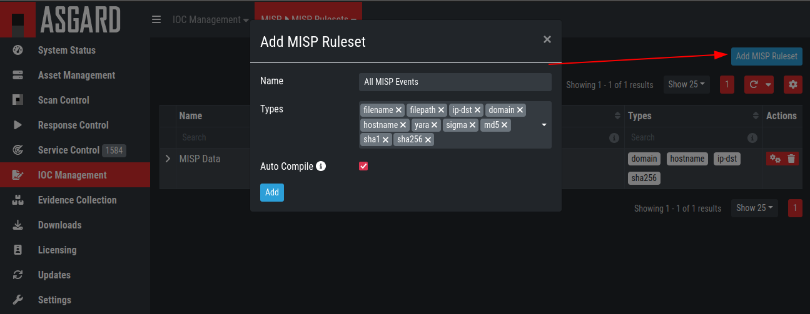

   Adding a new MISP ruleset

In order to use a MISP ruleset in a scan, add the ruleset in the
``MISP Signatures`` field when creating your scan.

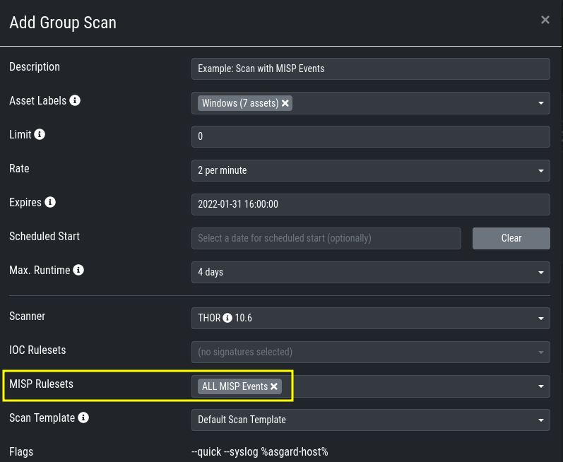

   Adding a MISP Ruleset to a Scan 

MISP Attributes used by ASGARD
~~~~~~~~~~~~~~~~~~~~~~~~~~~~~~

Since not all the information and attributes in a MISP event are
relevant to ASGARD and the THOR scanner, we provide a list of
attributes which will be used by ASGARD:

   * hostname
   * ip-dst
   * domain
   * domain-ip>hostname
   * domain-ip>ip-dst
   * domain-ip>domain
   * filename
   * filepath
   * file>filename
   * file>filepath
   * file>md5
   * file>sha1
   * file>sha256
   * md5
   * sha1
   * sha256
   * yara
   * yara>yara
   * sigma

.. warning:: 
   Only attributes with the flag ``IDS`` set to ``true`` will be used
   by ASGARD. Please make sure that the flag is set if you are
   intending to use certain events/attributes.

Evidence Collection 
-------------------

Collected Evidences
^^^^^^^^^^^^^^^^^^^

ASGARD provides two forms of collected evidence: 

1. Playbook output (file or memory collection, command output)
2. Sample quarantine (sent by THOR via Bifrost protocol during the scan)

All collected evidence can be downloaded in the ``Collected Evidence`` section.

.. figure:: ../images/collected-evidence-list.png
   :alt: Collected Evidence List

   Collected Evidence List

Bifrost Quarantine
^^^^^^^^^^^^^^^^^^

If Bifrost is used with your THOR scans, all collected samples show up here.
You will need the "ResponseControl" permission in order to view or download
the samples. See section :ref:`usage/administration:Roles` and
:ref:`usage/administration:Rights` for details.

.. figure:: ../images/bifrost-collections.png
   :alt: Bifrost Collections

   Bifrost Collections

Generate Download Links
-----------------------

The ``Downloads`` section lets you create and download a full
THOR package including scanner, custom IOCs and MISP rulesets
along with a valid license for a specific host. This package can
then be used for systems that cannot be equipped with an ASGARD
agent for some reason. For example, this can be used on air gapped
networks. Copy the package to a flash drive or CD ROM and use it
where needed.

You can choose to disable the download token altogether using
``Disable Download Token``. If disabled, anyone with network
access can download and issue licenses, which may lead to
unwanted exhaustion of the ASGARD license pool. You can reset
the download token by disabling and then re-enabling it using ``New Download Token``.

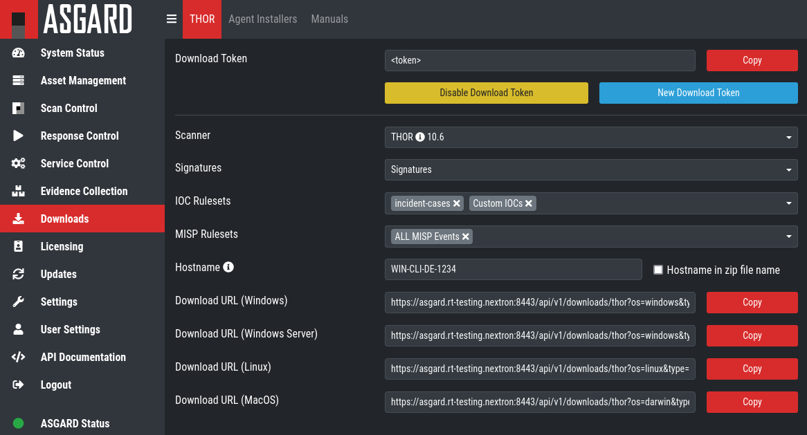

   Download THOR package and license workstation named 'WIN-CLI-DE-1234'

While selecting different options in the form, the download link changes.

After you have generated a download token and have selected the
correct scanner, operating system and target hostname (not FQDN),
you can copy the download link and use it to retrieve a full
scanner package including a license file for that host. These download
links can be sent to administrators or team members that don't have
access to ASGARD management center. Remember that the recipients of
that link still need to be able to reach ASGARD's web server port
(443/tcp). The token can be used to download THOR or a THOR license
without an ASGARD account. Attention: If you disable the token,
anybody can download THOR from this ASGARD or can generate licenses.

.. note::
   The scanner package will not contain a license file if you don't
   set a hostname in the ``Target Hostname`` field. If you have an
   Incident Response license, you must provide it separately.

Use Case 1 - Share th URL without Hostname
^^^^^^^^^^^^^^^^^^^^^^^^^^^^^^^^^^^^^^^^^^

You can generate download links without an included license by
leaving the `hostname` field empty. A valid license (e.g. "Incident Response")
must be  placed in the program folder after the download and extraction. 

Use Case 2 - Share th URL with Hostname
^^^^^^^^^^^^^^^^^^^^^^^^^^^^^^^^^^^^^^^

By including the hostname in the form, a license will be generated
and included in the download package You can copy the final download
link and send it to anyone, who can use this link to download a
package and run scans on a host with that name.

You or the recipient can change the name in that URL to make it
usable on other systems.

Note that you may have to adjust the `type` field to get the correct
license type (`client` for workstations, `server` for servers) and
the THOR version (`win`, `linux`, `osx`) to generate a correct URL. 

.. code-block:: bash
   
   .../thor?os=windows&type=server&scanner=thor10%40latest&hostname=mywinserver...
   .../thor?os=windows&type=workstation&scanner=thor10%40latest&hostname=mywinwks1...
   .../thor?os=linux&type=server&scanner=thor10%40latest&hostname=mylinuxsrv1...

Use Case 3 - Use the URL in Scripts
^^^^^^^^^^^^^^^^^^^^^^^^^^^^^^^^^^^

By default, the generated download link is protected with a
token that makes it impossible to download a package or
generate a license without knowing that token. This token
is specific to every ASGARD instance.  

You can use that URL in Bash or PowerShell scripts to automate
scans on systems without an installed ASGARD agent. 

.. code-block:: powershell 

   $Type = "server"
   $Download_Url = "https://asgard2.nextron:8443/api/v1/downloads/thor?os=windows&type=$($Type)&scanner=thor10%4010.6&signatures=signatures&hostname=$($Hostname)&token=$($Token)"

Licensing
---------

ASGARD requires an Issuer-License in order to scan systems.
The Issuer-License contains the number of asset-, server- and
workstation systems that can be scanned with ASGARD Management
Center as well as the Aurora or LogWatcher service licenses.

ASGARD will automatically issue a valid single-license for a
particular system during its initial THOR scan. 

The screenshot below shows the licensing section of an ASGARD.

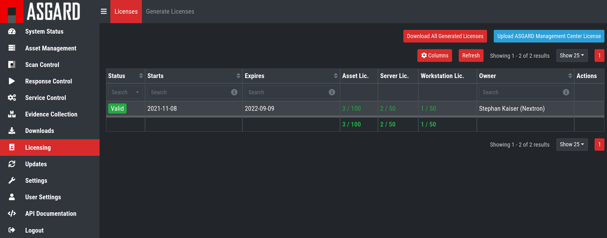

   ASGARD licensing

In addition, ASGARD can create single-licenses that can be used
for agent-less scanning. In this case the license is generated
and downloaded through the Web frontend. 

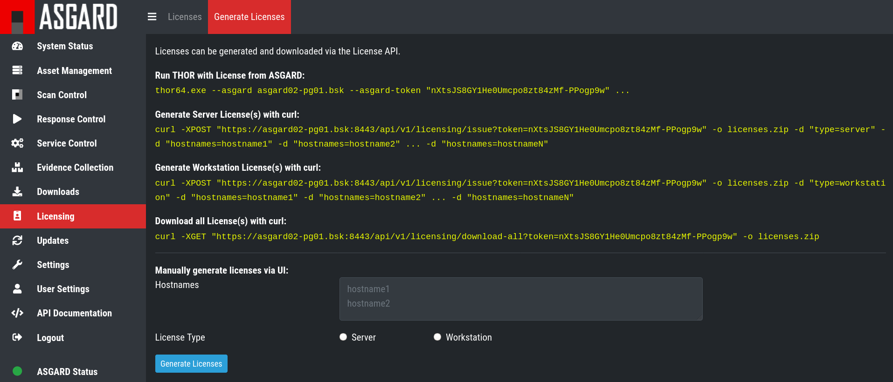

   Generate licenses

The following systems require a workstation license in order to be scanned: 

* Windows 7 / 8 / 10 / 11
* Mac OS

The following systems require a server license in order to be scanned:

* All Microsoft Windows server systems
* All Linux systems

The licenses are hostname based except for asset licenses. Asset
licenses are issued for each accepted asset as soon as a response
action is performed (playbook or remote console access).

Updates
-------

ASGARD Updates
^^^^^^^^^^^^^^

ASGARD will search for ASGARD updates on a daily basis. Available
updates will automatically be shown in the section ``Updates``. 

As soon as an ASGARD update is available, a button ``Upgrade from ... to ...``
appears. Clicking this button will start the update process. The
ASGARD service will be restarted and the user will be forced to
re-login. Generally update MASTER ASGARD before the connected ASGARDs.

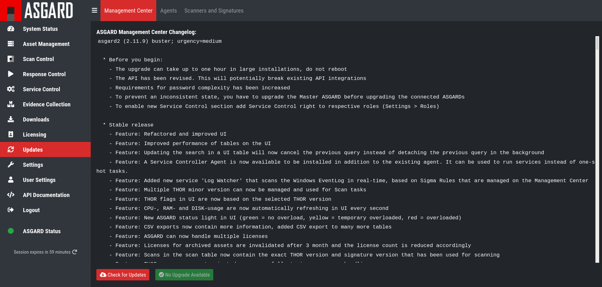

   Updating ASGARD

Updates of THOR and THOR Signatures
^^^^^^^^^^^^^^^^^^^^^^^^^^^^^^^^^^^

By default, ASGARD will search for signature updates and THOR
updates on an hourly basis. These updates will be set to active
automatically. Therefore, a triggered scan will always employ the
current THOR version and current signature version. You may disable
or modify the automatic THOR and Signature updates by deleting or
modifying the entries in this section.

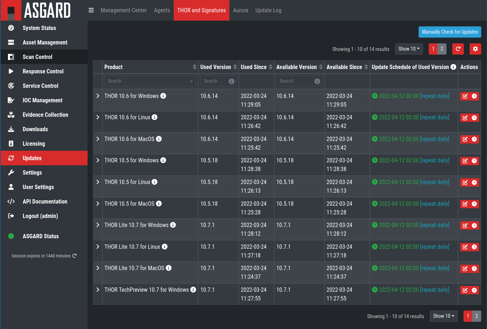

   Automatic Scanner and Signature Updates

It is possible to intentionally scan with an old scanner version by
clicking on the pencil icon and selecting the respective version
from the drop-down menu. 

Please be aware, that this is a global setting and will affect all scans!

.. figure:: ../images/select-scanner-version-manually.png
   :alt: Selecting a Scanner Version manually

   Selecting a Scanner Version manually

.. hint:: 
   You can trigger a Manual Check and download new THOR packages by clicking
   ``Manually Check for Updates``. This can also be used in new ASGARD 
   installations, as sometimes it takes a while until ASGARD does this automatically.

Agent Updates
^^^^^^^^^^^^^

If an asset or an agent can be update, there will be a notice
shown in the ``Updates`` > ``Agents`` tab.

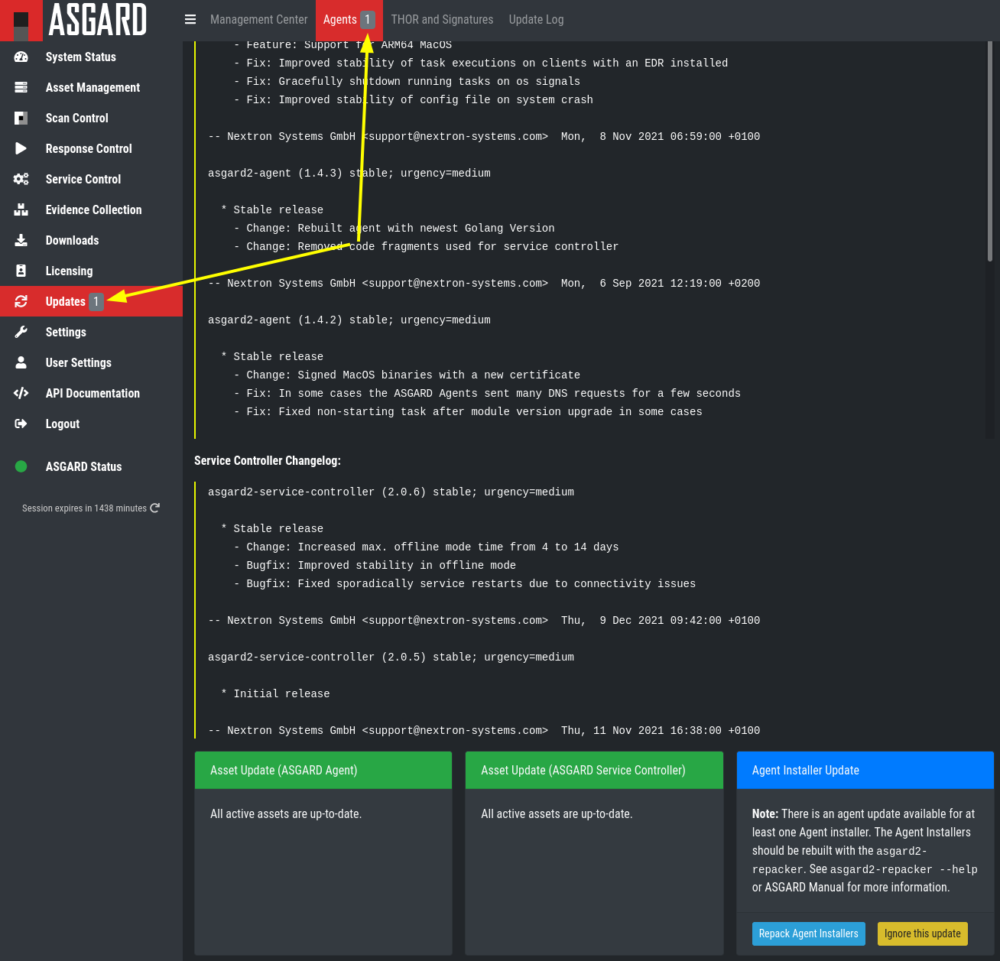

   Update Agent

User Management
---------------

Access user management via ``Settings`` > ``Users``. This section
allows administrators to add or edit user accounts.

The field ``2FA`` in the overview indicates if a
user has ``Two Factor Authentication`` enabled or not.

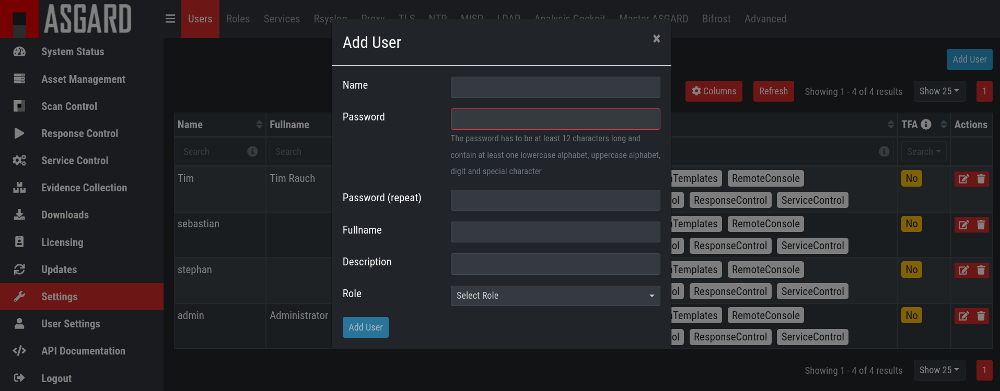

   Add User Account

Editing a user account does not require a password although
the fields are shown in the dialogue. An initial password
has to be provided for user creation, though.

Access the user roles in ``Settings`` > ``Roles``. 

You can download a list of all users in CSV format.

Roles
^^^^^

By default, ASGARD ships with the following pre-configured
user roles. The pre-configured roles can be modified or
deleted. The ASGARD role model is fully configurable.

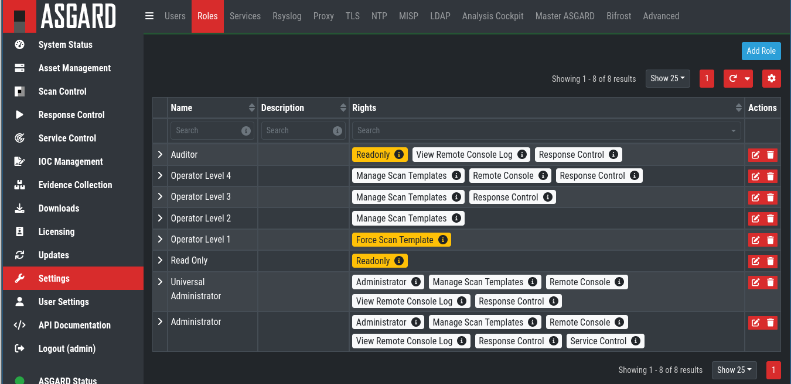

   User Roles – Factory Defaults 

Note that all users except users with the right ``Readonly`` have the right to run scans on endpoints. 

The following section describes these predefined rights and restrictions that each role can have.

Rights
^^^^^^

.. list-table:: 
   :header-rows: 1
   :widths: 30, 70

   * - Role
     - Permissions
   * - Administrator
     - Unrestricted
   * - Manage Scan Templates
     - Allows scan templates management
   * - Remote Console
     - Connect to endpoints via remote console
   * - View Remote Console Log
     - Review the recordings of all remote console sessions
   * - Response Control
     - Run playbooks, including playbooks for evidence collection, to kill processes or isolate an endpoint
   * - Service Control
     - User can manage services on endpoint, e.g. Aurora or LogWatcher

Restrictions 
^^^^^^^^^^^^

.. list-table:: 
   :header-rows: 1
   :widths: 30, 70

   * - Role
     - Restrictions
   * - Force Scan Template [2]_
     - Force user to use predefined scan templates that are not restricted
   * - No Inactive Assets [2]_
     - Cannot view inactive assets in asset management.
   * - No Task Start [2]_
     - Cannot start scans or task (playbooks)
   * - Readonly [2]_
     - Can't change anything, can't run scans or response tasks. Used to generate read-only API keys

.. [2] Restricted Roles have a yellow font in the UI

LDAP Configuration
^^^^^^^^^^^^^^^^^^

In order to configure LDAP, navigate to ``Settings`` > ``LDAP``.
In the left column you can test and configure the LDAP connection itself.
In the right column, the mapping of LDAP groups to ASGARD groups
(and its associated permissions) is defined.

First check if your LDAP server is reachable by ASGARD by clicking "Test Connection".

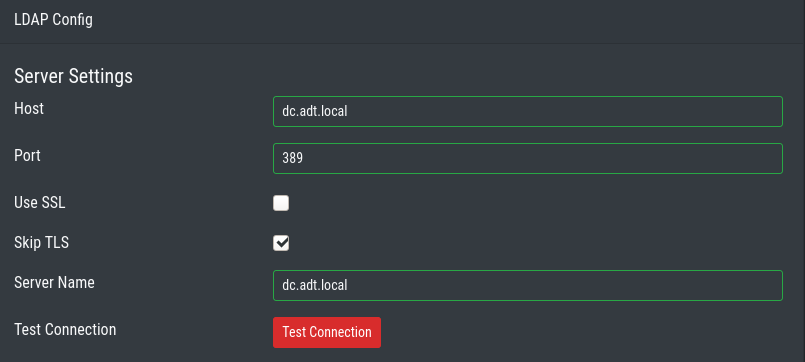

   Configure the LDAP Server

Then check the bind user you want to use for ASGARD. Read
permissions on the bind user are sufficient. To find out
the distinguished name you can use an LDAP browser or query
using the PowerShell AD module command ``Get-ADUser <username>``.

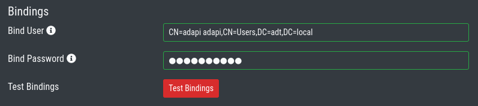

   Configure the LDAP Bind User

Next configure the LDAP filters used to identify the groups and
users and their preferred attributes in your LDAP structure.
A default for LDAP and AD in a flat structure is given in the
**"Use recommended filters"** drop-down menu, but you can
adapt it to your liking. The test button shows you if a login
with that user would be successful and which groups ASGARD identified
and could be used for a mapping to ASGARD groups. 

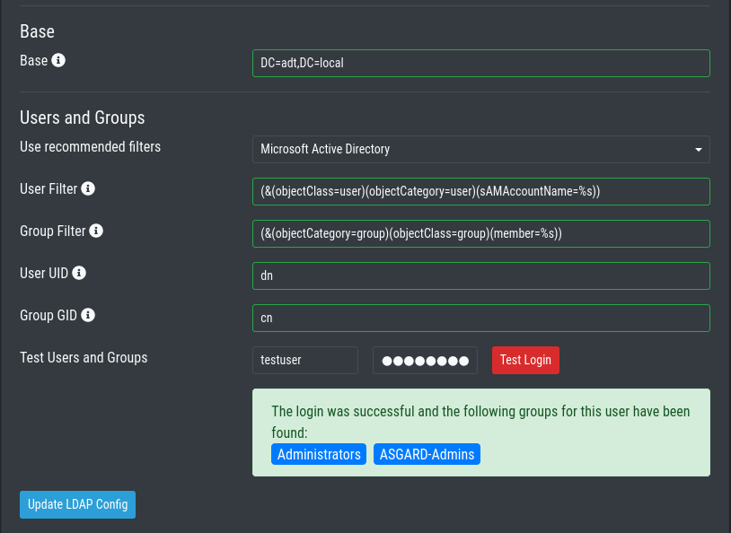

   Configure the LDAP User and Group Filters

If you need to adapt the recommended configuration or want to customize it,
we recommend an LDAP browser such as `ADExplorer <https://docs.microsoft.com/en-us/sysinternals/downloads/adexplorer>`_
from Sysinternals to browse your LDAP structure. As an example you could
use your organization's e-mail address as a user login name if you change the "User Filter"
to ``(&(objectClass=user)(objectCategory=user)(userPrincipalName=%s))``

.. note::
   You need to save the configuration by clicking ``Update LDAP Config``.
   Using the test buttons only uses the data in the forms, but does not
   save it, so that you can use it for testing purposes anytime,
   without changing your working configuration.

After the LDAP configuration is set up, you need to provide role mapping from LDAP groups to ASGARD groups.
This is done in the right column by using the ``Add LDAP Role`` feature.

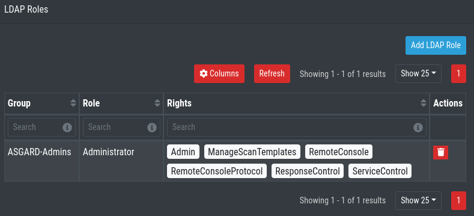

   LDAP Group to ASGARD Role Mapping

Additional Settings
-------------------

Rsyslog Forwarding
^^^^^^^^^^^^^^^^^^

Rsyslog forwarding can be configured in ``Settings`` > ``RSYSLOG``.
To add a forwarding configuration for local log sources, click ``Add Rsyslog Forwarding``.

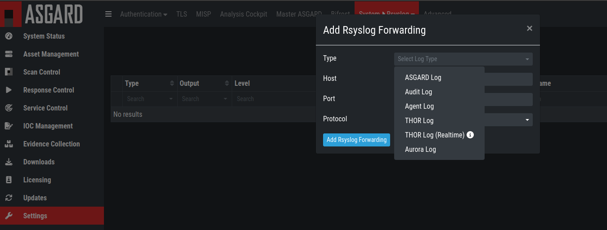

The following log sources can be forwarded individually:

.. list-table:: Available Log Sources 
   :header-rows: 1
   :widths: 25, 75

   * - Log
     - Description
   * - ASGARD Log
     - Everything related to the ASGARD service, processes, task and scan jobs
   * - ASGARD Audit Log
     - Detailed audit log of all user activity within the system
   * - Agent Log
     - All ASGARD agent activities
   * - THOR Log
     - THOR scan results
   * - Thor Log (Realtime)
     - The THOR (Realtime) logs are the same logs as THOR logs,
       except that they are collected via udp syslog instead of
       https. To forward THOR logs in realtime, you have to
       configure your scans to forward syslog to ASGARD, see
       :ref:`usage/administration:Syslog Forwarding`). Make
       sure the necessary firewall rules are in place to allow
       the asset to communicate with the ASGARD.
   * - Aurora Log
     - Aurora Logs

TLS Certificate Installation
^^^^^^^^^^^^^^^^^^^^^^^^^^^^

Instead of using the pre-installed self-signed TLS Certificate,
users can upload their own TLS Certificate for ASGARD. 

.. figure:: ../images/generate-csr.png
   :alt: Generate a Certificate Signing Request (CSR)

   Generate a Certificate Signing Request (CSR)

In order to achieve the best possible compatibility with the
most common browsers, we recommend using the system's FQDN
in both fields ``Common Name`` AND ``Hostnames``.

Please note that generating a CSR on the command line is not supported.   

The generated CSR can be used to generate a TLS Certificate.
Subsequently, this TLS Certificate can be uploaded in the ``Settings`` > ``TLS`` section.

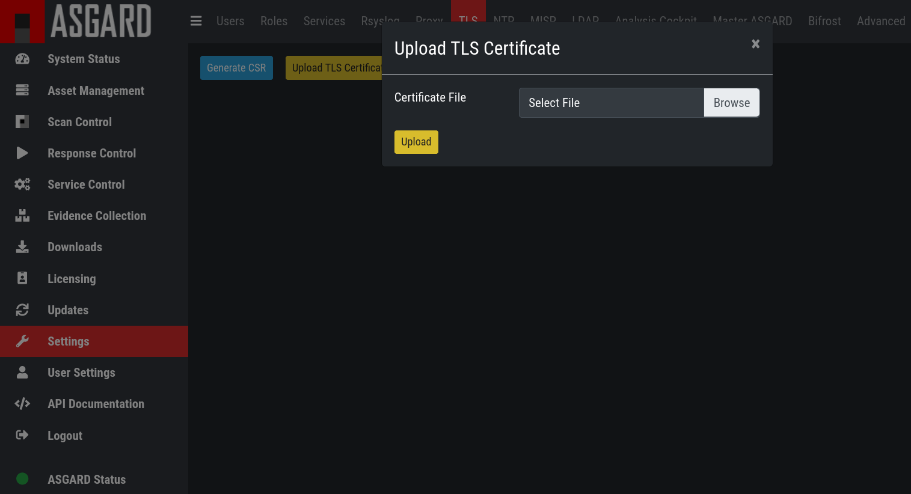

   Upload a TLS Certificate

.. note:: 
   Please see :ref:`usage/appendix:install tls certificates on asgard and master asgard`
   for a guide on how to sign the CSR and install it in your ASGARD.

Manage Services
^^^^^^^^^^^^^^^

The individual ASGARD services can be managed in ``Settings`` > ``Services``.
The services can be stopped or restarted with the respective buttons in the ``Actions`` column. 

.. figure:: ../images/manage-services.png
   :alt: Configuration of Services

   Manage Services

NTP Configuration
^^^^^^^^^^^^^^^^^

The current NTP configuration can be found in the NTP sub-section. 

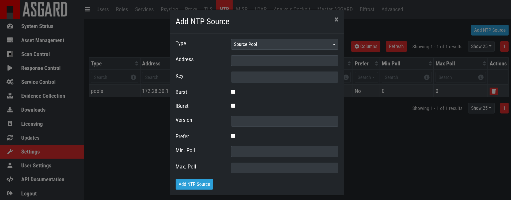

   NTP configuration

A Source Pool or Source Server can be removed by clicking the delete action.
To create a new Source Pool or Source Server, click ``Add NTP Source`` in
the upper right corner. 

Settings for Bifrost
^^^^^^^^^^^^^^^^^^^^

Bifrost allows you to automatically upload suspicious files to your
ASGARD during a THOR scan. If an Analysis Cockpit is connected,
these files get automatically forwarded to the Analysis Cockpit
in order to drop them into a connected Sandbox system. However,
the collected files will stay on ASGARD for the amount of time
specified in ``Retention time`` (0 days represent an indefinite amount of time). 

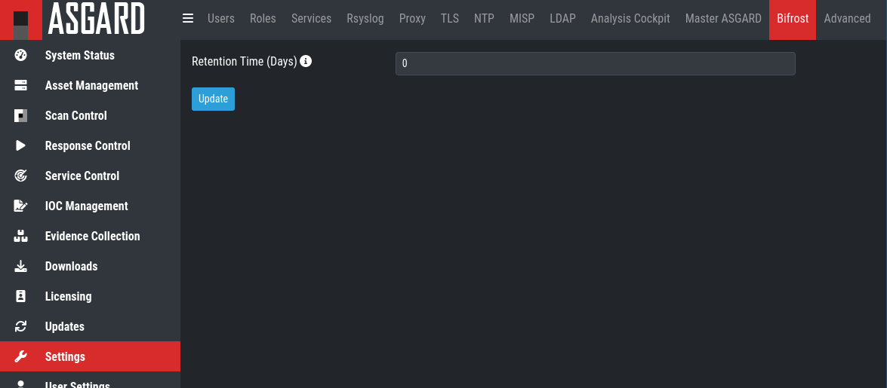

   Settings for Bifrost

The collected files can be downloaded in the ``Evidence Collection``
section. All files are zip archived and password protected with the password ``infected``.

In order to automatically collect suspicious files, you have to
create a scan with Bifrost enabled. Check the ``Send Suspicious Files to ASGARD``
option to send samples to the system set as ``bifrost2Server``. Use the placeholder 
``%asgard-host%`` to use the hostname of you ASGARD instance as the Bifrost server.

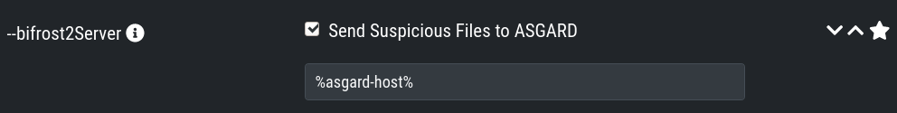

   Scan option for Bifrost 

This will collect all files with a score of 60 or higher and make
them available for download in ASGARDs ``Collected Files`` section.

For Details on how to automatically forward to a sandbox system please
refer to the `Analysis Cockpit Manual <https://analysis-cockpit-manual.nextron-systems.com/en/latest>`_ .

Link Analysis Cockpit
^^^^^^^^^^^^^^^^^^^^^

In order to connect to an Analysis Cockpit, enter the
respective hostname of the Analysis Cockpit (use the same
FQDN used during installation of the Analysis Cockpit) in
the field ``FQDN``, enter the one-time code, choose the
type and click ``Update Analysis Cockpit``. 

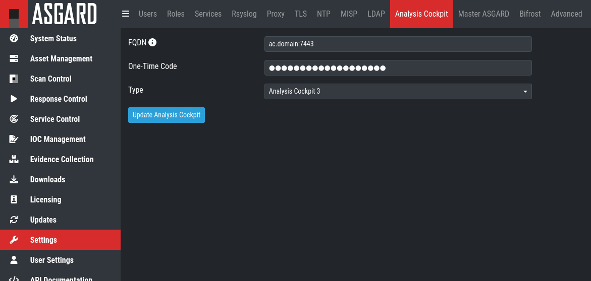

   Linking the Analysis Cockpit 

The Cockpit's API key can be found at ``Settings`` > ``ASGARDs`` > ``Connect ASGARD``.

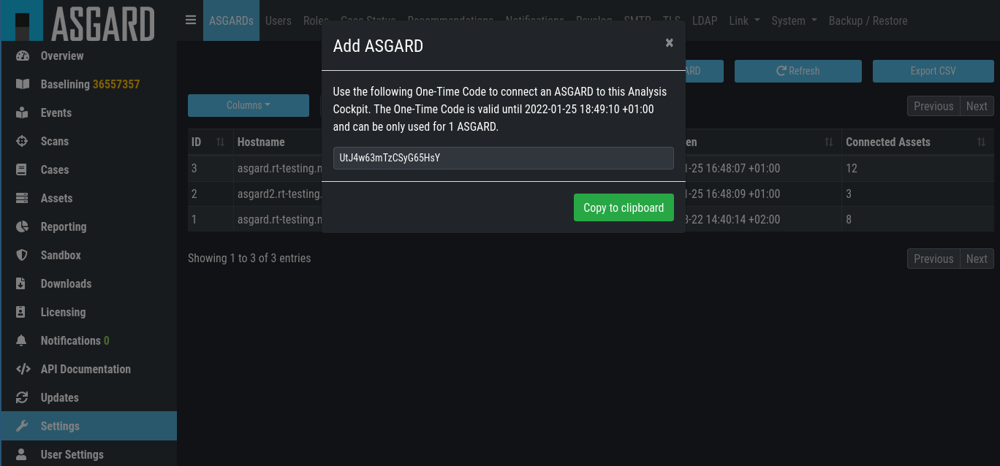

   Analysis Cockpit API Key

ASGARD must be able to connect to the Analysis Cockpit
on port 443/TCP for a successful integration. Once connected,
the Cockpit will show up in ASGARDs ``System Status`` > ``Overview``
section together with the other connectivity tests. 

Please wait up to five minutes for the status to
change on ASGARD's system status page. It will change from ``Not linked`` to ``Online``.

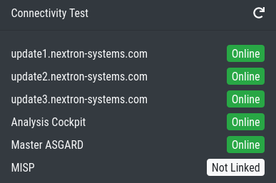

   Cockpit connectivity status

Link MISP
^^^^^^^^^

In order to connect to a MISP with your ASGARD Management Center,
navigate to ``Settings`` > ``MISP``. Insert the MISP's address,
along with the API Key and click ``Test and Link MISP``.

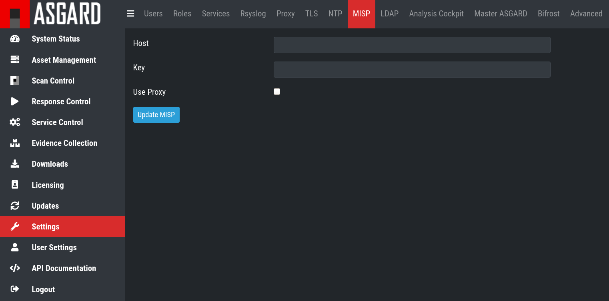

   Linking a MISP to ASGARD

The MISP connectivity status is shown in the ``Overview`` section.
Please allow five minutes for the connection status to indicate the
correct status, and also MISP rules to be downloaded and shown in
``IOC Management`` > ``MISP`` > ``MISP Events``.

   MISP connectivity status

Change Proxy Settings
^^^^^^^^^^^^^^^^^^^^^

In this dialogue, you can add or modify ASGARDs proxy
configuration. Please note, you need to restart the ASGARD
service (Tab ``Services``) afterwards. 

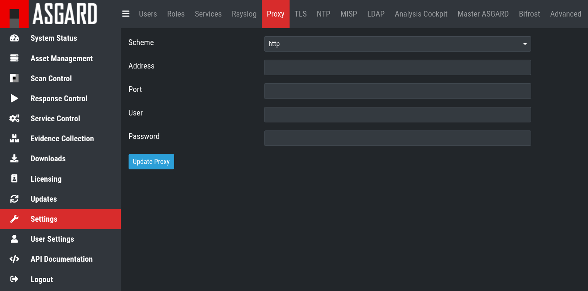

   Change Proxy Settings

.. warning::
   This will also overwrite any changes made to the file
   ``/etc/apt/apt.conf.d/proxy`` on your system. If you
   changed the file before installation of your ASGARD
   services (:ref:`usage/setup:changing proxy configuration`),
   you can safely go ahead and change your proxy settings.

Link MASTER ASGARD
^^^^^^^^^^^^^^^^^^

In order to control your ASGARD with a MASTER ASGARD,
you must generate a One-Time Code and use it in the "Add ASGARD"
dialogue within the MASTER ASGARD frontend. 

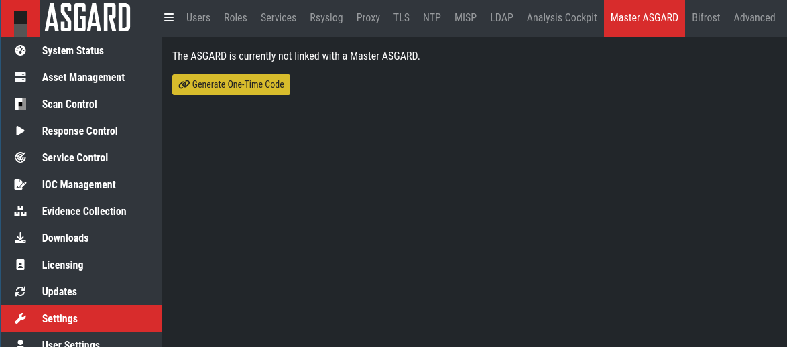

   Link MASTER ASGARD

Advanced
^^^^^^^^

The Advanced tab lets you specify additional global settings.
The session timeout for web-based UI can be configured. Default
is one hour. If ``Show Advanced Tasks`` is set, ASGARD will
show system maintenance jobs (e.g. update ASGARD Agent on endpoints)
within the response control section. 

Inactive assets can be hidden in the Asset Management Section
by setting a suitable threshold for ``Hide inactive Assets``. 

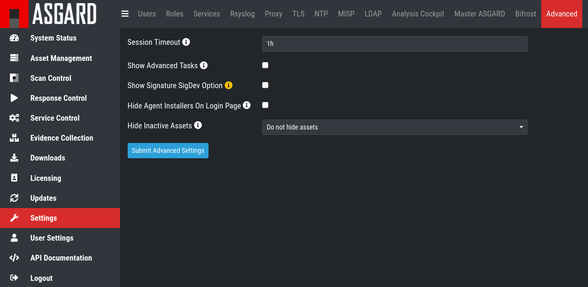

   Advanced Settings

User Settings
-------------

The following settings will only affect the currently logged in user.

Changing your password
^^^^^^^^^^^^^^^^^^^^^^

To change your password, navigate to the ``User Settings`` section.

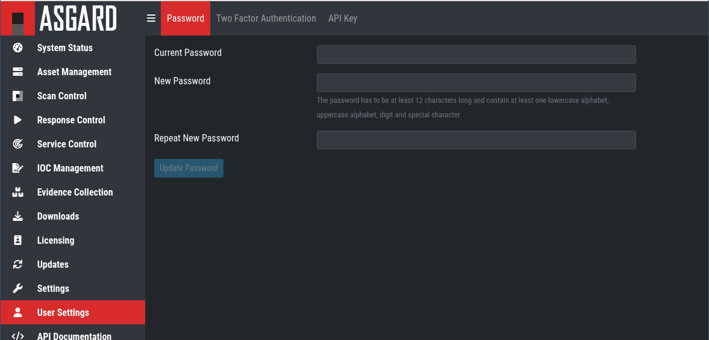

   Changing your password

Two Factor Authentication
^^^^^^^^^^^^^^^^^^^^^^^^^

We are currently using the ``Time-based One-time Password (TOTP)``
algorithm for two factor authentication. We recommend
one of the following mobile apps for 2FA:

   - Google Authenticator
   - Microsoft Authenticator
   - Twilio Authy
   - iOS built-in Password Manager (iOS 15 or newer)

Enable Two Factor Authentication
~~~~~~~~~~~~~~~~~~~~~~~~~~~~~~~~

To enable Two Factor Authentication, navigate to ``User Settings`` >
``Two Factor Authentication``. If 2FA is not enabled, you
will see the option to ``Use Two Factor Authentication``.

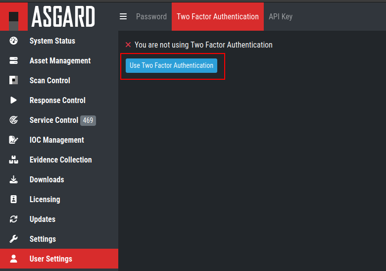

After clicking the button, you will be presented with a QR
code for your authenticator app of your choice.
Alternatively, you can use the secret key. You will need
to verify the 6-digit token and click ``Validate Two Factor Authentication``
to enable 2FA.

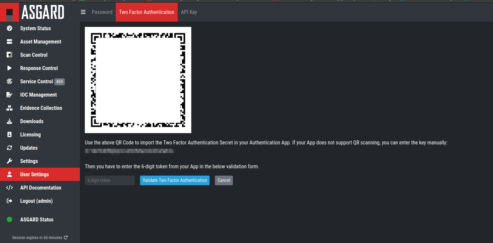

.. note:: 
   You will be logged out of your current session if the validation was successful.

Disable Two Factor Authentication
~~~~~~~~~~~~~~~~~~~~~~~~~~~~~~~~~

To disable 2FA, navigate to ``User Settings`` > ``Two Factor Authentication``
and click ``Deactivate Two Factor Authentication``.

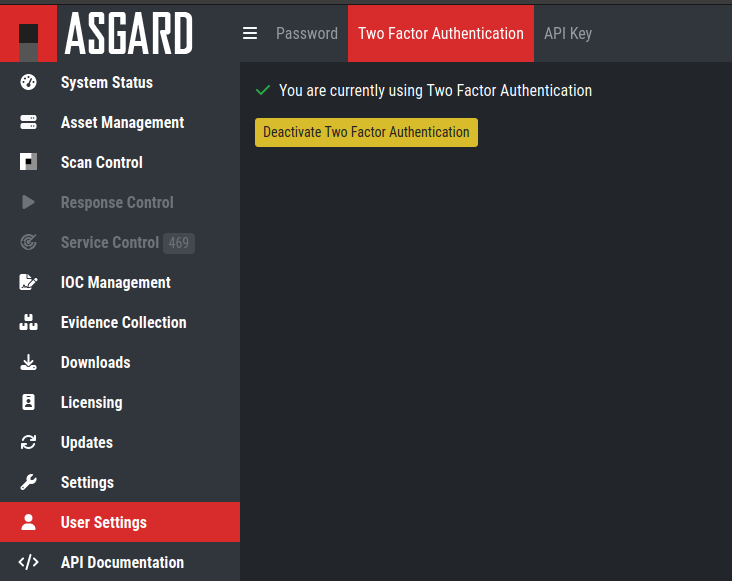

.. note:: 
   If a user is unable to log into ASGARD to disable their own 2FA,
   follow the instructions at :ref:`usage/troubleshooting:reset two factor authentication for a specific user`

API Key
^^^^^^^

To generate an API Key, navigate to ``User Settings`` > ``API Key``.

This page allows you to set an API key. If an API key was previously set,
a new key will be generated. You will only be able to see your new API key
once after it has been generated.

.. note:: 
   Currently an API key always has the access rights of the
   user context in which it has been generated. If you want to create a
   restricted API key, add a new restricted user and generate an API key
   in the new user's context.

.. warning:: 
   The API key has the same rights as your user. Do not use your
   API key as token for license generation and license / THOR download.
   Instead, use the download token from the ``Downloads`` menu
   (:ref:`usage/administration:generate download links`).

Uninstall ASGARD Agents 
-----------------------

The following listings contain commands to uninstall ASGARD Agents on endpoints. 

.. note::
   The commands contain names used by the default installer packages.
   In cases in which you've generated custom installer packages with
   a custom service and binary name, adjust the commands accordingly. 

Uninstall ASGARD Agents on Windows
^^^^^^^^^^^^^^^^^^^^^^^^^^^^^^^^^^

You need administrative privileges to remove the ASGARD Agent from Windows.
Open a command prompt with administrative privileges and run the following commands:

.. code-block:: doscon
   :linenos:

   C:\Windows\system32>sc stop asgard2-agent
   C:\Windows\system32>sc delete asgard2-agent
   C:\Windows\system32>sc stop asgard2-agent_sc
   C:\Windows\system32>sc delete asgard2-agent_sc
   C:\Windows\system32>rmdir /S /Q C:\Windows\System32\asgard2-agent
   C:\Windows\system32>rmdir /S /Q C:\ProgramData\thor

.. note::
   Line 3 and 4 are only necessary if the new service controller (on ASGARD 2.11+) has been installed. 

Uninstall ASGARD Agents on Linux
^^^^^^^^^^^^^^^^^^^^^^^^^^^^^^^^

RPMs via ``yum``

.. code-block:: console 

   user@host:~$ sudo yum remove asgard2-agent
   user@host:~$ sudo rm -r /var/lib/thor

DEBs via ``dpkg``

.. code-block:: console 

   user@host:~$ sudo dpkg -P asgard2-agent
   user@host:~$ sudo rm -r /var/lib/thor

Manual uninstall

.. code-block:: console

   root@host:~# /usr/sbin/asgard2-agent-amd64 stop
   root@host:~# /usr/sbin/asgard2-agent-amd64 uninstall
   root@host:~# rm -r /usr/sbin/asgard2-agent-amd64
   root@host:~# rm -r /var/tmp/nextron/asgard2-agent
   root@host:~# rm -r /var/lib/nextron/asgard2-agent
   root@host:~# rm -r /var/lib/thor

Uninstall ASGARD Agents on macOS
^^^^^^^^^^^^^^^^^^^^^^^^^^^^^^^^

.. code-block:: console 

   user@mac:~$ sudo /var/lib/asgard2-agent/asgard2-agent --uninstall
   user@mac:~$ sudo rm -r /var/lib/asgard2-agent/asgard2-agent
   user@mac:~$ sudo rm -r /var/lib/thor

Uninstall ASGARD Service Controller
----------------------------------- 

.. note::
   The command contains names used by the default installer packages.
   In cases in which you've generated custom installer packages with
   a custom service and binary name, adjust the commands accordingly. 

If you want to uninstall the ASGARD Service Controller and Agent,
see section :ref:`usage/administration:Uninstall ASGARD Agents`.

If you only want to uninstall the ASGARD Service Controller execute:

.. code-block:: doscon

    C:\Windows\system32>C:\Windows\System32\asgard2-agent\asgard2-agent_sc.exe -uninstall
