.. role:: raw-html-m2r(raw)
   :format: html

Manage ASGARD Using the Web GUI
===============================

License Management
------------------

Login to ASGARD, navigate to ``Licensing`` and upload a valid license. 

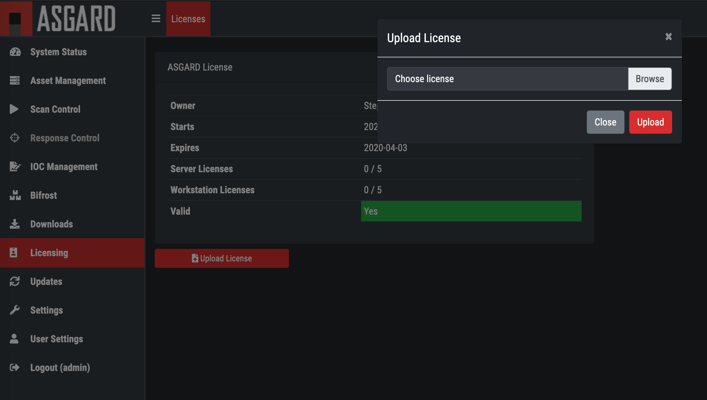

   Install a license

After uploading, the license details are displayed.

System Status
-------------

The initial system status page provides a summary of the most important system components. 

It also includes the current resource consumption (disk, CPU and memory) and lists the currently installed ASGARD software version along with available versions of THOR. Additionally, the connection status to the update servers, Master ASGARD and Cockpit are shown with a graph that shows asset connections and asset streams.

Note: The THOR version numbers may be missing in a new installation. THOR is not included in the installed packages. THOR is downloaded automatically after the installation and should show up not later than one hour after installation. 

.. figure:: ../images/image28.png
   :target: ../_images/image28.png
   :alt: image-20200608152043704

   Overview

The logs section shows the latest and most relevant logs. Complete logs can be found at ``/var/lib/nextron/asgard2/log``

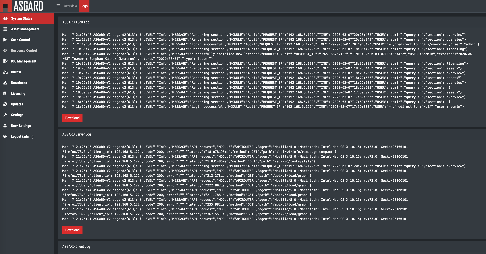

   Logs Section

ASGARD Agent Deployment
-----------------------

In order to register a new endpoint to the ASGARD Management Center, download and install the ASGARD agent on the system you want to register. 

The ASGARD agent can be downloaded from ASGARD directly through the button ``Download ASGARD Agent``. A list of available agents for various operating systems appears. 

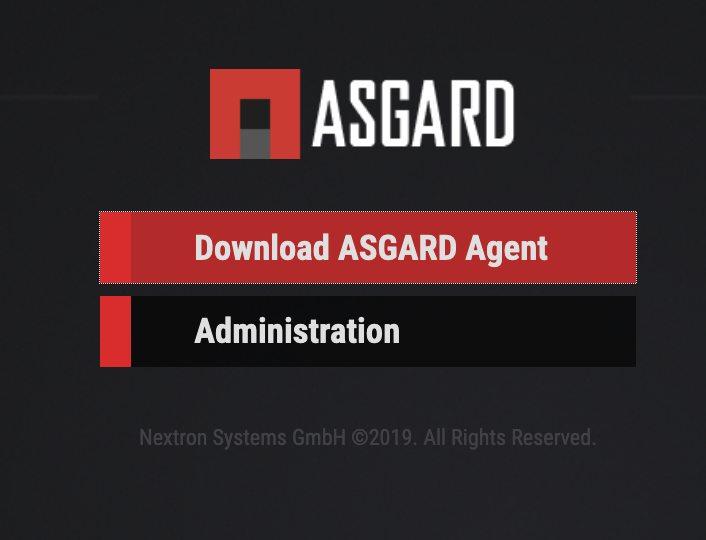

   Download ASGARD Agent

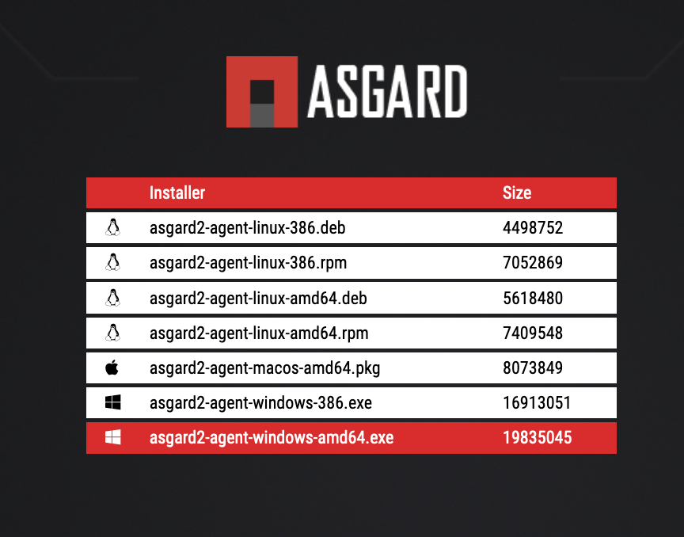

   Agents Overview

After installation, the endpoints will connect to ASGARD, register automatically and appear in the Asset Management Section in the tab ``Requests``. Please allow two or three minutes for systems to show up. The agents use the hostname to connect to ASGARD, ensure that your endpoints can resolve and reach the ASGARD hostname.

In the requests tab, select the agents you want ASGARD to manage and click ``Accept``. After that, the endpoint shows up in the asset tab and is now ready to be managed or scanned.

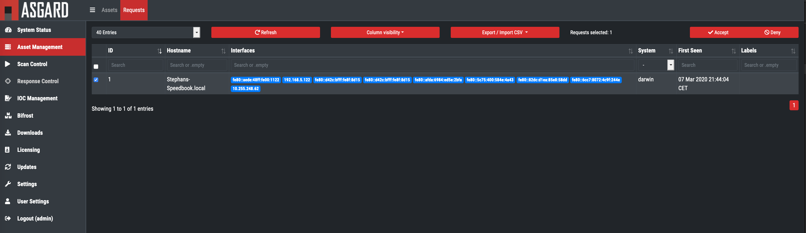

   Accepting ASGARD Agent Requests

A registered agent will poll to the ASGARD Management Center at a given interval between 10 seconds and 600 seconds – depending on the number of connected endpoints (see chapter 7.1 Performance Tuning for details). If ASGARD has scheduled a task for the endpoint (for example: run THOR scan) it will be executed directly after the poll.

Asset Management
----------------

Overview
^^^^^^^^

Management of all endpoints registered with ASGARD can be performed in Asset Management. The assets will be presented as a table with an individual ASGARD ID, their IP addresses and host names.

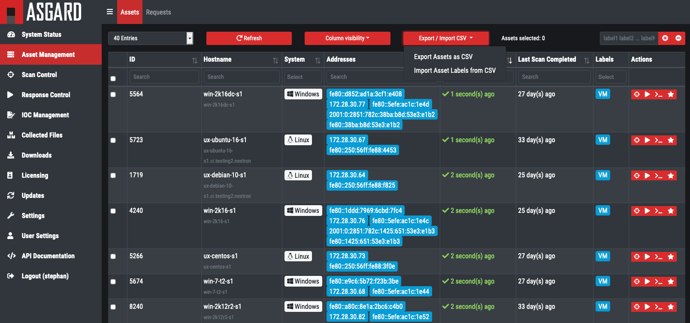

   Asset View

By clicking the control buttons in the Actions column, you can start a new scan, run a response playbook, open a command line or switch the endpoints ping rate to 10 seconds instead of 10 minutes. 

   Run Playbook, Run Scan, Start Remote Console, Decrease/Increase Endpoint Ping Rate

Please note that this is an internal ping between the ASGARD agent and ASGARD. This must not be confused with ICMP!

Please note: You will need the "Universal Administrator" role in order to see all control buttons.

Asset Labels
^^^^^^^^^^^^

You can add multiple Labels to an asset or a group of assets. This is done by selecting the particular assets in the left column, typing your label name (e.g. New_Label) and clicking the red `(+)` button in the upper right corner. 

.. figure:: ../images/image36.png
   :target: ../_images/image36.png
   :alt: image-20200608153144459

   Asset List with Labels

In order to remove labels, select your assets, type the name of the label you want to remove for these assets and click the `(x)` button. 

The asset management section has powerful filtering capabilities. E.g. only display Linux assets that have been online today and are assigned a particular label. 

The Import/Export Section allows you to export your assets to a .csv file. The import function is aimed to change labels through an import of a list. When importing this file only the values in the "ADD LABELS" and "REMOVE LABELS" columns are used. In order to change labels, use the already exported list, add values in these columns and re-import it. 

Scan Control
------------

Managing Scan Templates
^^^^^^^^^^^^^^^^^^^^^^^

Scan templates are the most convenient way to make use of THOR's rich set of scan options. Starting with ASGARD 1.10., it is possible to define scan parameters for THOR 10 and store them in different templates for later use in single scans and grouped scans. 

Imagine you want to use dedicated scan options for different system groups (e.g. Linux Servers, Domain Controllers, Workstations, etc.) and make sure to use exactly the same set of scan options every time you scan a particular group of systems. With ASGSARD you can now add a scan template for every group. 

A popular use case for scan templates is providing additional resource control – for example telling THOR to set the lowest process priority for itself and never use more that 50% of a single CPU. 

Please keep in mind, that we have already optimized THOR to use the most relevant scan options for a particular system (based on type, numbers of CPUs and system resources) and a comprehensive resource control is enabled by default. 

For more details please refer to the THOR manual. Only use the scan templates if you want to deviate from the default for a reason.

Scan templates are protected from being modified by ASGARD users without the "Manage Scan Templates" - permission and can also be restricted from being used by ASGARD users in case the flag "ForceStandardArgs" is set for this user. (see user management section for details).

In order to create a scan template, navigate to "Scan Control" > "Scan Templates" and click the "Add" button. The "Add Scan Template" dialogue appears. You will find the most frequently used options on the top of this page. You can view all THOR options by clicking on the "Collapse / Expand" button.

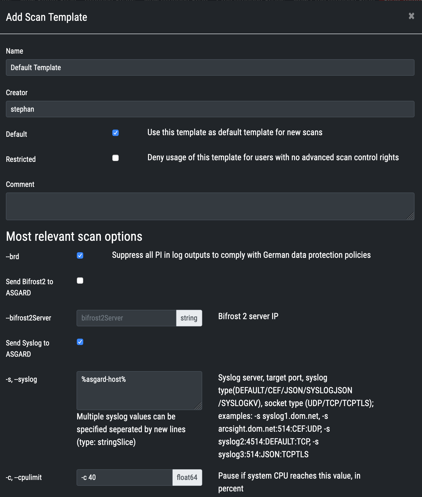

   Managing Scan Templates

By checking the "Default" box, you can make this scan template the default template for every new scan. Checking the "Restricted" box restricts this scan template from being used by any ASGARD user with the "ForceStandardArgs" restriction set. After clicking the "Add" button on the bottom of the template page, an overview of all existing scan templates is shown. 

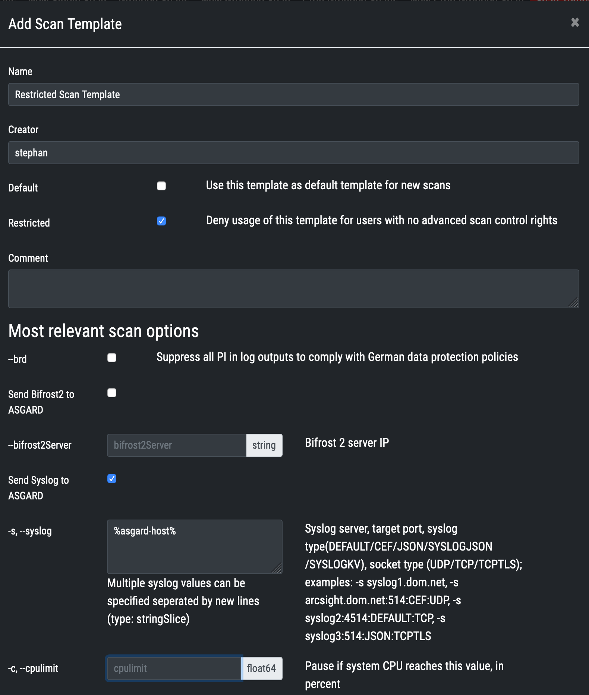

   Restricting Scan Templates

.. figure:: ../images/image40.png
   :target: ../_images/image40.png
   :alt: image-20200608153256353

   Scan Templates Overview

Scan a Single System
^^^^^^^^^^^^^^^^^^^^

Create a Single Scan
~~~~~~~~~~~~~~~~~~~~

The creation of a scan is performed within the Asset Management. There is a button for each asset to create a new scan and to show all past scans. 

Just click on the "crosshair" button in the Action column in the Asset Management view. It takes you to the scan control section.

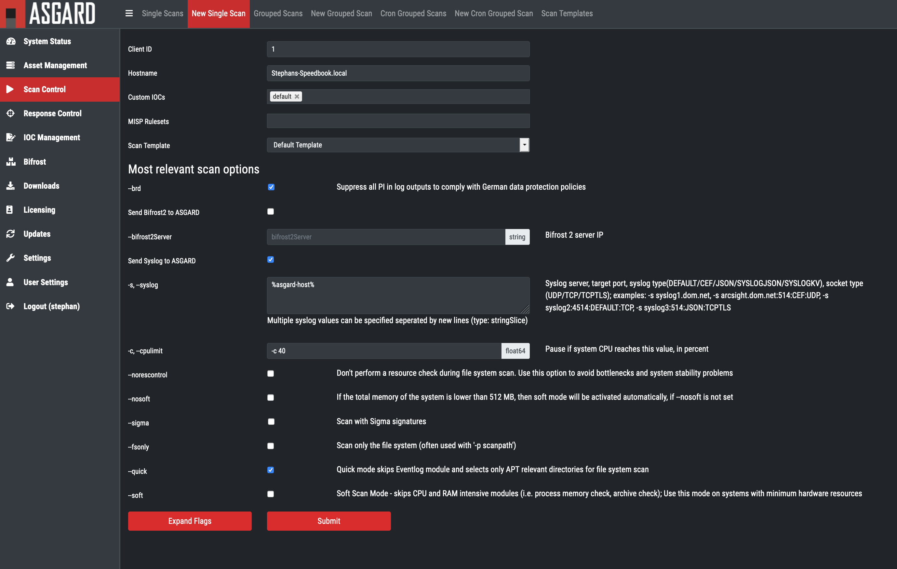

   Scan Control - Scan Creation

Within this form, you can choose the scan flags and custom signatures can be selected.

After the desired parameters have been set, the scan can be started by clicking the ``Submit`` button.

Stopping a Single Scan
~~~~~~~~~~~~~~~~~~~~~~

To stop a single scan, navigate to the "Single Scans" tab in Scan Control section and click the button for the scan you want to stop.

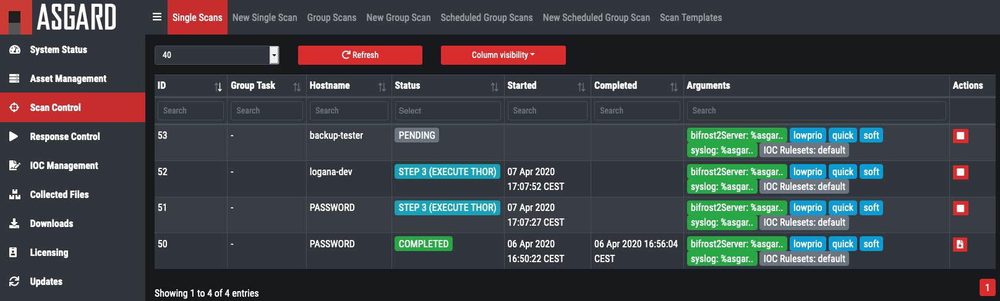

   Stopping a single Scan

Scan Groups of Systems
^^^^^^^^^^^^^^^^^^^^^^

Create Grouped Scans
~~~~~~~~~~~~~~~~~~~~

A scan for a group of systems can be created in the Scan Control section.

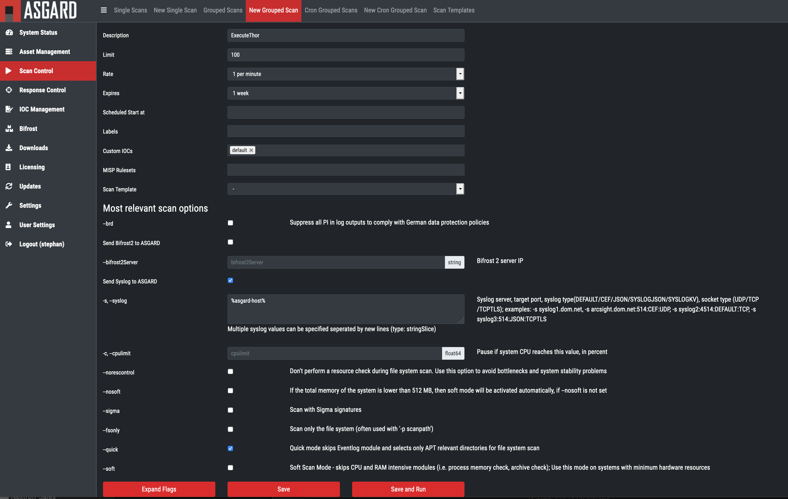

   Scan Control – Create Group Scan

As with the single scans, various parameters can be set. Aside from the already mentioned parameters, the following parameters can be set:

**Description**

Freely selectable name for the group scan.

**Limit** 

ASGARD will not send additional scans to the agents when the client limit is reached.

**Rate**

The number of scans per minute that a scan should run. This is where the network load can be controlled. Additionally, it is recommended to use this parameter in virtualized and oversubscribed environments in order to limit the number of parallel scans on your endpoints.

**Expires**

After this time frame, no scan orders will be issued to the connected agents. 

**Labels**

Here you can define which assets will be affected by the group scan. In case more than one label is chosen: An asset must have at least one chosen label attached to it to be affected by the scan. If no label is selected, all known assets will be scanned.

**Custom** **IOCs**

If you have provided custom IOCs in the IOC Management section, they can be selected here. 

After the group scan has been saved or saved and started, you will automatically be forwarded to the list of grouped scans. 

List of all Group Scans
~~~~~~~~~~~~~~~~~~~~~~~

The list of all group scans contains, among other items, the unique Scan-ID and the name.

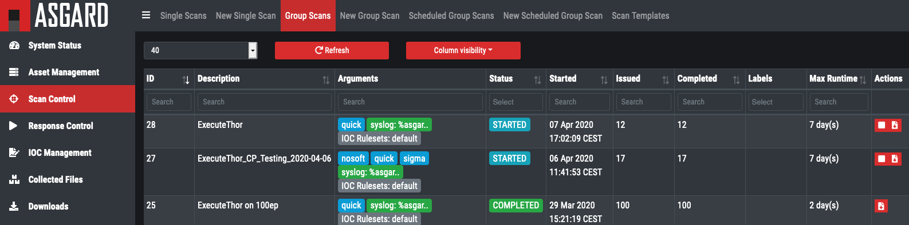

   Scan Control – Group Scans – List

In addition, information can be found about the chosen scanner, the chosen parameters, the start and completion times and the affected assets (defined by labels). Additional columns can be added by clicking on "Column Visibility".

The Status field can have the following values: 

**Started:** Scan is started, ASGARD will issue scans with the given parameters

**Stopped:** No additional scan jobs are being issued. All single scans that are currently running will continue to do so.

**Completed:** The group scan is completed. No further scan jobs will be issued.

Starting a Group Scan
~~~~~~~~~~~~~~~~~~~~~

A group scan can be started by clicking on the "play" button in the "Actions" column of a group scan.

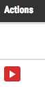

   Scan Control – Group Scan – Start Button

Subsequently, the scan will be listed as "Started".

Starting a Scheduled Group Scan
~~~~~~~~~~~~~~~~~~~~~~~~~~~~~~~

Scans that are to run on a frequent basis can be created in the "New Scheduled Grouped Scan" tab.

.. figure:: ../images/image48.png
   :target: ../_images/image48.png
   :alt: image-20200608154442195

   Scan Control – New Scheduled Group Scan 

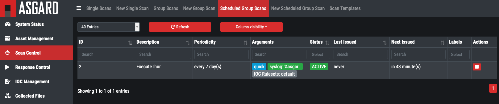

   Scan Control – Scheduled Group Scan 

The Scheduled Group Scan section shows all schedules along with their periodicity. All group scans that have been started through the scheduler will show up on top of the Group Scan section the moment they are started. 

Details of a Group Scan
~~~~~~~~~~~~~~~~~~~~~~~

Further information about a group scan can be observed from the detail page of the group scan. Click the scan you are interested in and the details section will appear.

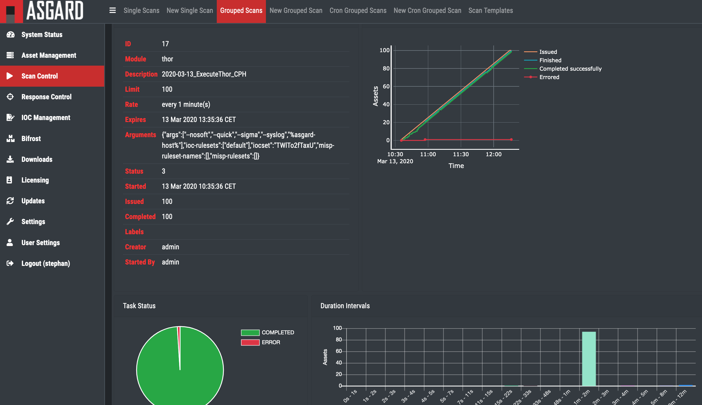

   Scan Control – Group Scans – Details

Aside from information about the group scan, there is a graph that shows the number of assets started and how many assets have already completed the scan.

Response Control
----------------

Opening a Remote Shell on an endpoint
^^^^^^^^^^^^^^^^^^^^^^^^^^^^^^^^^^^^^

In order to open a remote shell on an endpoint, open the Asset Management section and click the "command line" button in the Actions column.

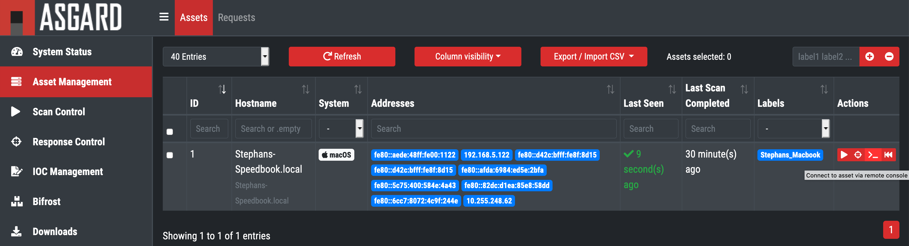

   Opening a Remote Shell from the Asset View

Depending on your configuration it may take between 10 seconds and 10 minutes for the remote shell to open. Please note that all actions within the remote shell are recorded and can be audited. All shells open with root privileges or system privileges.

.. figure:: ../images/image53.png
   :target: ../_images/image53.png
   :alt: image-20200608154959812

   Remote Shell on MacOS

In order to replay a remote console session, navigate to `Response Control`, select the task that represents your session and click the play button. 

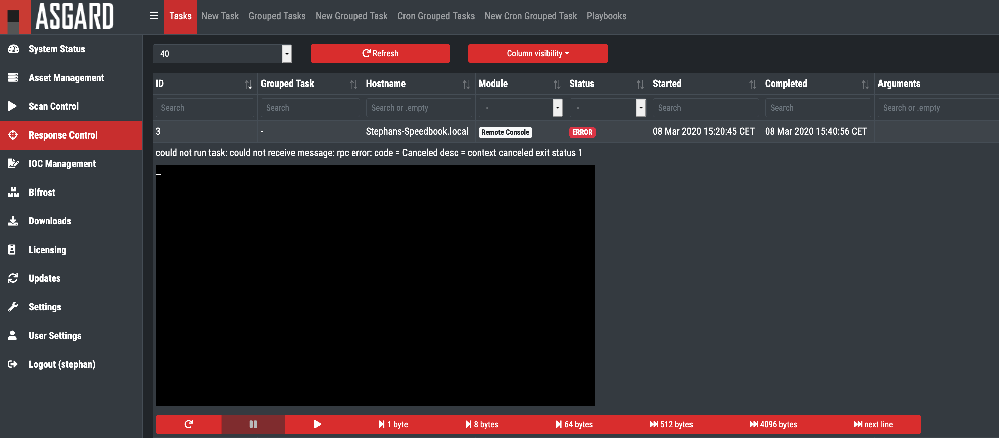

   Replay Remote Shell Session

ASGARD users can only see their own remote shell session. Only users with the `RemoteConsoleProtocol` permission are able to replay all sessions from all users.

Response Control with pre-defined playbooks
^^^^^^^^^^^^^^^^^^^^^^^^^^^^^^^^^^^^^^^^^^^

In addition to controlling THOR scans, ASGARD Management Center contains extensive response functions. Through ASGARD, you can start or stop processes, modify and delete files or registry entries, quarantine endpoints, collect triage packages and execute literally any command on connected systems. All with one click and executed on one endpoint or groups of endpoints.

It is also possible to download specific suspicious files. You can transfer a suspicious file to the ASGARD Management Center and analyze it in a Sandbox. 

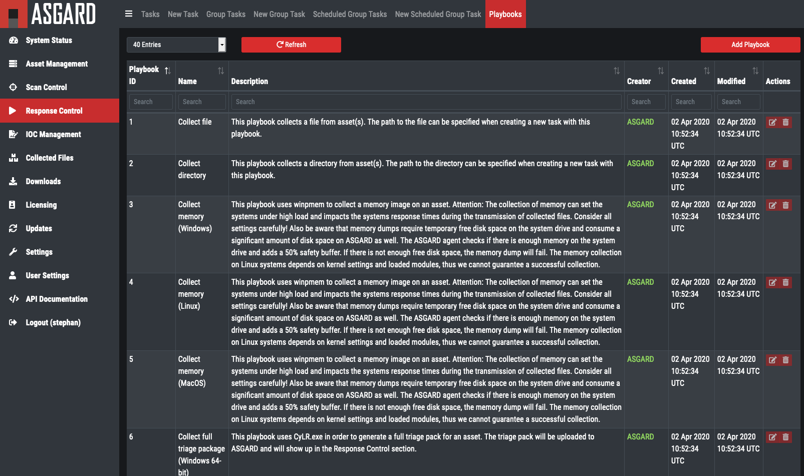

   Built-in Playbooks

To execute a predefined response action on a single endpoint, navigate to the Asset Management view and click the "play" button in the Actions Column. This will lead you to a dialogue where you can select the desired action. 

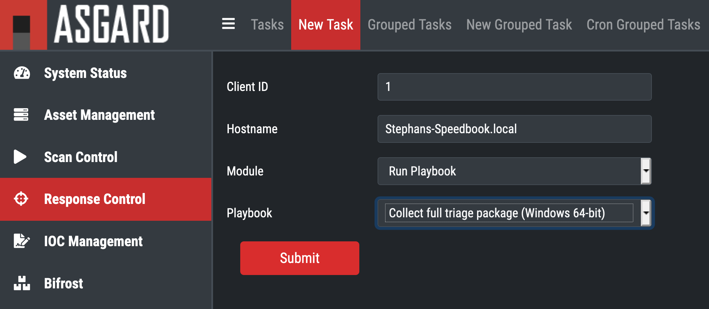

   Execute Playbook on Single Endpoint

In this example, we collect a full triage package.

ASGARD ships with pre-defined playbooks for the following tasks:

* Collect full triage pack (Windows only)
* Isolate endpoint (Windows only)
* Collect system memory
* Collect file
* Collect directory
* Execute command and collect stdout and stderr

Nextron provides additional playbooks via ASGARD updates.

**Caution !!!**  

The collection of memory can set the systems under  high load and impacts the systems response times during the transmission of  collected files. Consider all settings carefully!   Also be aware that memory dumps may fail due to  kernel incompatibilities or conflicting security mechanisms. Memory dumps  have been successfully tested on all supported Windows operating systems with  various patch levels. The memory collection on Linux systems depends on  kernel settings and loaded modules, thus we cannot guarantee a successful  collection.   Additionally, memory dumps require temporary free  disk space on the system drive and consume a significant amount of disk space  on ASGARD as well. The ASGARD agent checks if there is enough memory on the  system drive and adds a 50% safety buffer. If there is not enough free disk  space, the memory dump will fail.  

Response Control for Groups of Systems
^^^^^^^^^^^^^^^^^^^^^^^^^^^^^^^^^^^^^^

Response functions for groups of systems can be defined in the ``New Group Tasks`` tab or the ``New Scheduled Group Task`` tab.

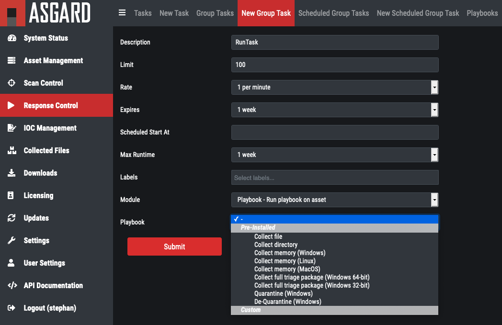

   Execute Playbook on Group of Endpoints

Response Control with custom playbooks
^^^^^^^^^^^^^^^^^^^^^^^^^^^^^^^^^^^^^^

You can add your own custom playbook by clicking the ``Add Playbook`` button in the ``Response Control`` section. 

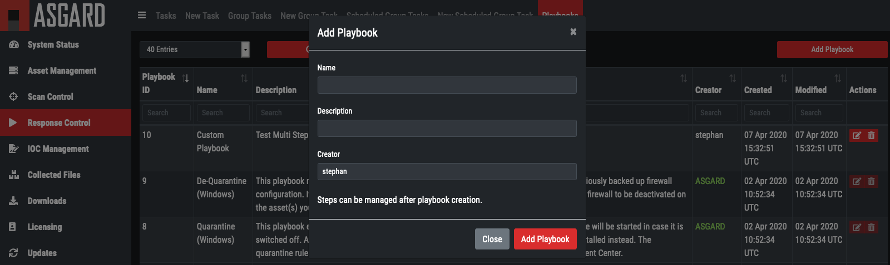

   Add Custom Playbook

This lets you define a name and a description for your playbook. After clicking the ``Add Playbook`` button, click on your new playbook and start adding entries.

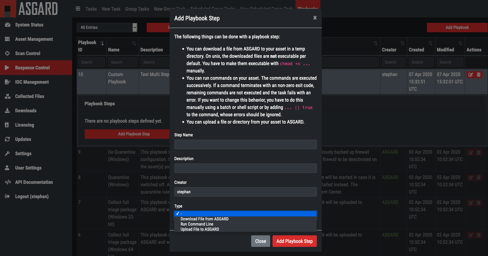

   Add Playbook Entry

You can have up to 16 entries in each playbook that are executed in a row. Every entry can be either "download something from ASGARD to the endpoint", "execute a command line" or "Upload something from the endpoint to ASGARD". If you run a command line the stdout and stderr are reported back to ASGARD. 

Evidence Collection 
-------------------

ASGARD provides two forms of collected evidence: 

1. Playbook output (file or memory collection, command output)
2. Sample quarantine (sent by THOR via Bifrost protocol during the scan)

All collected evidence can be downloaded in the "Collected Evidence" section.

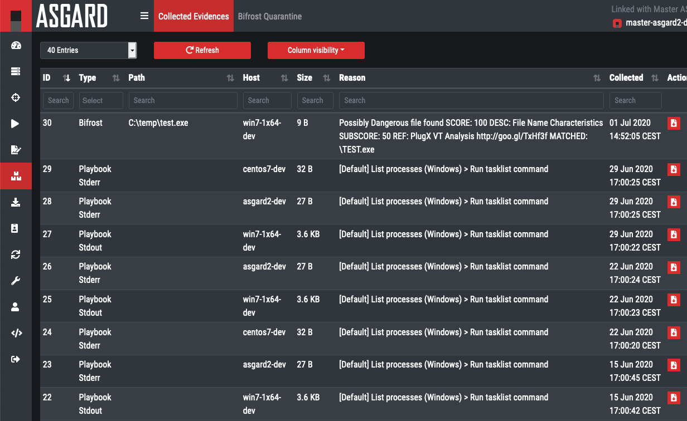

   Collected Evidence List

IOC Management
--------------

Integrating Custom IOCs
^^^^^^^^^^^^^^^^^^^^^^^

The section IOC management gives you the opportunity to easily integrate custom signatures into your scans. 

You may upload your own signatures in any of THOR’s IOC formats (e.g. files for keyword IOCs, YARA Files and SIGMA files). Refer to the THOR manual for a complete list and file formats. 

In order to create your own custom ruleset, navigate to ``IOC Management`` and click ``Upload IOC`` in the IOCs tab. 

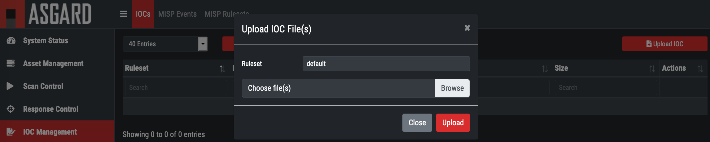

   Uploading IOC files to the default ruleset

Browse to the file you want to add and click upload. This adds your IOC file to the default ruleset. The default ruleset is executed with every scan job, unless you remove the default ruleset within your scan templates or at every scan start. No further configuration is required. 

Even existing scheduled scans that are executed on a frequent basis will start using the default ruleset once it is created. Merely modify the default ruleset; the modified rules will come into effect immediately after you hit the "Upload" button.

**Note:** In case that you don’t want the default IOC ruleset to be included in every scan: Remove it from your scan templates and/or from the new ``New Group Scan`` dialogue in the ``Custom IOCs`` field. See picture below. 

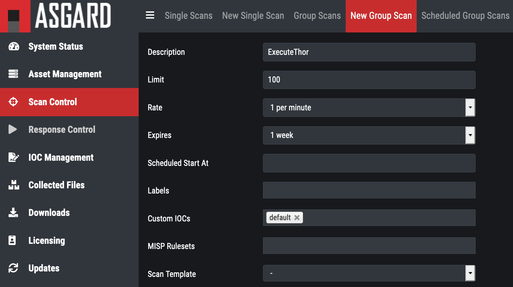

   Removing the default IOC ruleset from scans 

In the event you don’t want to add specific IOCs to the default ruleset, just remove "default" in the "Upload IOC File(s)" dialogue and select the name of the ruleset you want to add the IOC files to. If the ruleset doesn’t exist it will be created. These rulesets must be selected manually for every scan job – otherwise they will not be used in the scan.

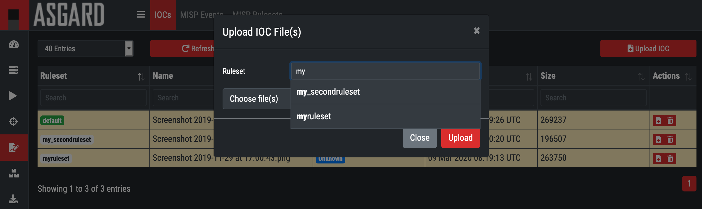

   Uploading IOC files to other rulesets

Please note, ASGARD does not provide a syntax check for your IOC files. Should THOR be unable to parse your IOC files for the scan, THOR will skip the particular file with syntax issues and send an error message in the scan log. All other files with correct syntax will be used for scanning. THOR will report files that can be parsed and are used for scanning in the scan log. 

Integrating IOCs through MISP
^^^^^^^^^^^^^^^^^^^^^^^^^^^^^

ASGARD provides an easy to use interface for integrating IOCs from a connected MISP into THOR scans. In order to add rules from a MISP, navigate to ``IOC Management``, select the IOCs in the ``MISP events`` tab and add them to the desired ruleset by using the button in the upper right corner. 

Contrary to the custom IOC handling, there is no default ruleset for MISP. You must create at least one ruleset (see tab "MISP Rulesets") before you can add MISP rules.

The figure below illustrates how to use filters and select all known rules for Emotet. These could then be added to your specific Emotet ruleset if you wish.

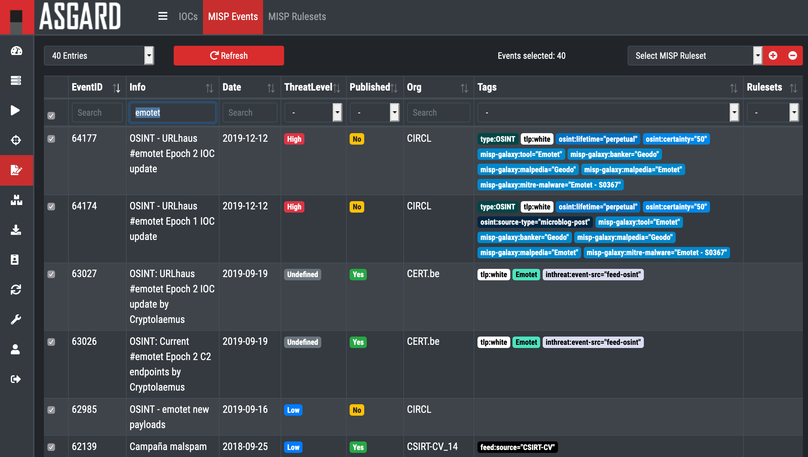

   Filtering and selecting MISP events 

Of course, your Emotet ruleset would have to be created in advance. In order to do that, click ``Add Ruleset`` in the ``MISP Rulesets`` tab. Select a name and the type of IOCs you want to use in this ruleset. By default, all types are selected, but there may be reasons for deselecting certain categories. For example, filename IOCs tend to cause false positives and may be deselected for that reason. The picture below shows the dialogue for adding a MISP ruleset.

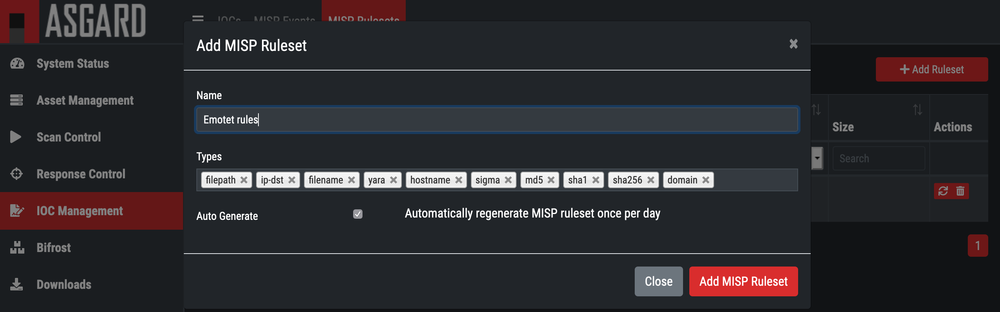

   Adding a new MISP ruleset

In order to use a MISP ruleset in a scan: add the ruleset in the ``MISP Rulesets`` field when creating your scan.

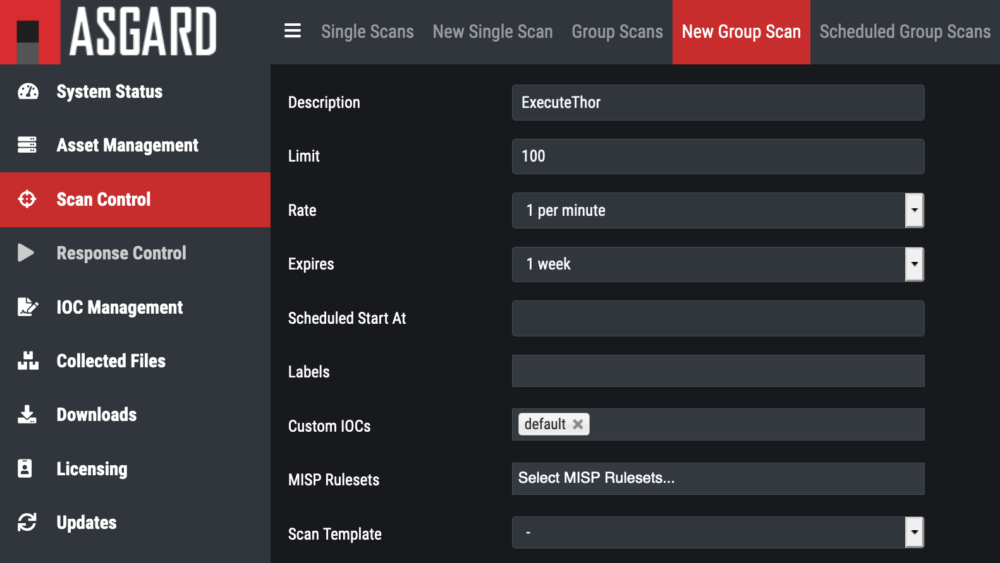

   Adding a MISP Ruleset to a Scan 

Collected Files
---------------

If Bifrost is used with your THOR scans, all collected samples show up here. You will need the "ResponseControl" permission in order to view or download the samples. See section ``User Roles`` within the ``User Management`` section for details.

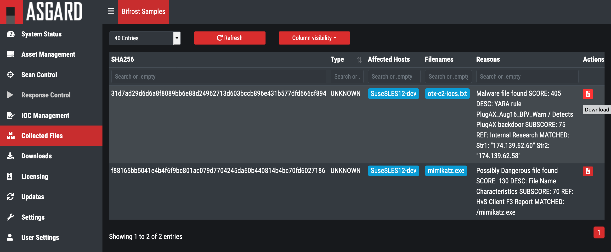

   Downloading samples from Bifrost collections 

Generate Download Links
-----------------------

The ``Downloads`` section lets you create and download a full THOR package including scanner, custom IOCs and MISP rulesets along with a valid license for a specific host. This package can then be used for systems that cannot be equipped with an ASGARD agent for some reason. For example, this can be used on air gapped networks. Copy the package to a USB stick or a CD ROM and use it where needed.

.. figure:: ../images/download-url1.png
   :target: ../_images/download-url1.png
   :alt: Generate THOR Package Download Link

   Download THOR package and license for Windows workstation named 'myhost123'

While selecting different options in the form, the download link changes.

After you have selected the correct scanner, operating system and target hostname (not FQDN), you can copy the download link and use it to retrieve a full scanner package including a license file for that host. These download links can be sent to administrators or team members that don’t have access to ASGARD management center. Remember that the recipients of that link still need to be able to reach ASGARD’s web server port (443/tcp). 

**Note:** The scanner package will not contain a license file if you don’t set a hostname in the ``Target Hostname`` field. If you have an Incident Response license, you must provide it separately.

Use Case 1 - Share th URL without Hostname
^^^^^^^^^^^^^^^^^^^^^^^^^^^^^^^^^^^^^^^^^^

You can generate download links without an included license by leaving the `hostname` field empty. A valid license (e.g. "Incident Response") must be  placed in the program folder after the download and extraction. 

Use Case 2 - Share th URL with Hostname
^^^^^^^^^^^^^^^^^^^^^^^^^^^^^^^^^^^^^^^

By including the hostname in the form, a license will be generated and included in the download package You can copy the final download link and send it to anyone, who can use this link to download a package and run scans on a host with that name.

You or the recipient can change the name in that URL to make it usable on other systems.

Note that you may have to adjust the `type` field to get the correct license type (`client` for workstations, `server` for servers) and the THOR version (`win`, `linux`, `osx`) to generate a correct URL. 

.. code:: bash
   
   .../thor10-win?hostname=mywinserver1&type=server...
   .../thor10-win?hostname=mywinwks1&type=client...
   .../thor10-linux?hostname=mylinuxsrv1&type=server...

Use Case 3 - Use the URL in Scripts
^^^^^^^^^^^^^^^^^^^^^^^^^^^^^^^^^^^

By default, the generated download link is protected with a token that makes it impossible to download a package or generate a license without knowing that token. This token is specific to every ASGARD instance.  

You can use that URL in Bash or PowerShell scripts to automate scans on systems without an installed ASGARD agent. 

.. code:: powershell 

   $Type = "server"
   $Download_Url = "https://asgard2.nextron:8443/api/v0/downloads/thor/thor10-win?hostname=$($Hostname)&type=$($Type)&iocs=%5B%22default%22%5D&misps=%5B%222%22%5D&token=fQku7OKvDal2SMub4pv2QJOCCDL9P7dh5h"

Licensing
---------

ASGARD requires an Issuer-License in order to scan systems. The Issuer-License contains the number of server- and workstation systems that can be scanned with ASGARD Management Center. 

ASGARD will automatically issue a valid single-license for a particular system during its initial THOR scan. 

In addition, ASGARD can create single-licenses that can be used for agentless scanning. In this case the license is generated and downloaded through the Web frontend. 

The screenshot below shows the licensing section of an ASGARD with the ability to issue five server licenses and 5 workstation licenses. One of the workstation licenses has already been issued.

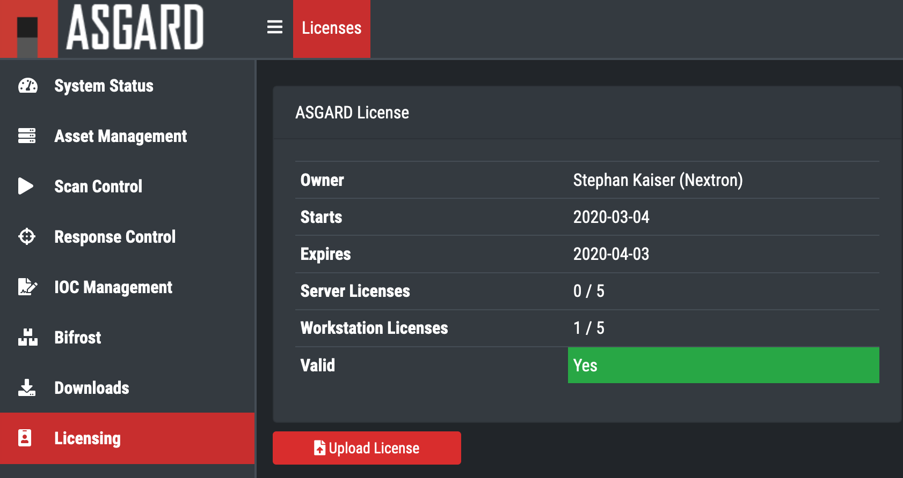

   ASGARD licensing

The following systems require a workstation license in order to be scanned: 

* Windows 7 / 8 / 10
* Mac OS

The following systems require a server license in order to be scanned:

* All Microsoft Windows server systems
* All Linux systems

Provide an existing THOR Incident Response License (optional)
^^^^^^^^^^^^^^^^^^^^^^^^^^^^^^^^^^^^^^^^^^^^^^^^^^^^^^^^^^^^^

In case you have an existing THOR Incident Response license and want to use it with ASGARD, just upload it through the web based UI. This will remove all endpoint count restrictions from ASGARD. You can scan as many endpoints as you like – regardless of the type (workstation / server). 

Updates
-------

ASGARD Updates
^^^^^^^^^^^^^^

ASGARD will search for ASGARD updates on a daily basis. Available updates will automatically be shown in the section "Updates". 

As soon as an ASGARD update is available, a button ``Install Update`` appears. Clicking this button will start the update process. The ASGARD service will be restarted and the user will be forced to re-login. 

.. figure:: ../images/image71-1592213251651.png
   :target: ../_images/image71-1592213251651.png
   :alt: image71

   Updating ASGARD

Updates of THOR and THOR Signatures
^^^^^^^^^^^^^^^^^^^^^^^^^^^^^^^^^^^

By default, ASGARD will search for signature updates and THOR updates on an hourly basis. These updates will be set to active automatically. Therefore, a triggered scan will always employ the current THOR version and current signature version. 

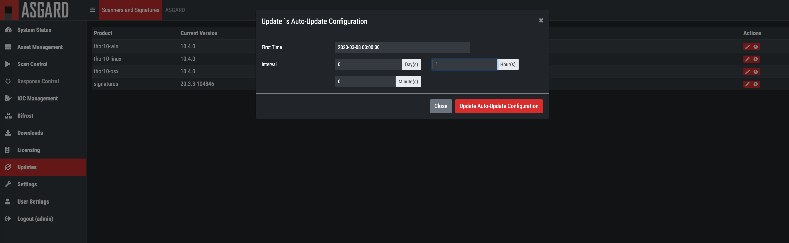

   Updates for THOR and Signatures

You may disable or modify the automatic THOR and Signature updates by deleting or modifying the entries in this section. 

It is possible to intentionally scan with an old scanner version by clicking on the pencil icon and selecting the respective version from the drop-down menu. 

Please be aware, that this is a global setting and will affect all scans!

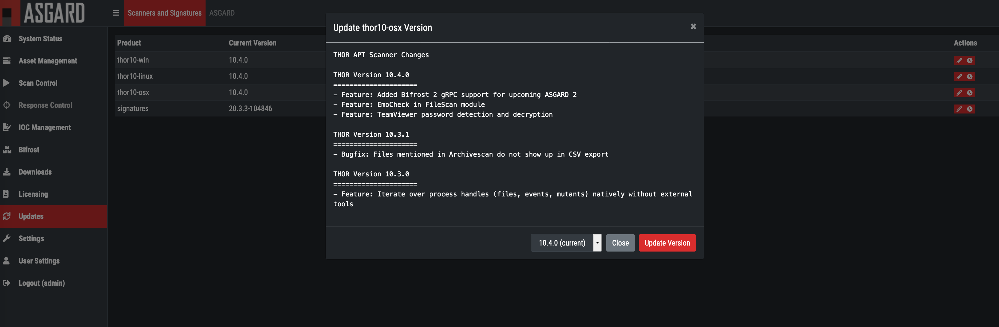

   Selecting a Scanner version manually 

Settings
--------

User Management
^^^^^^^^^^^^^^^

User Roles
~~~~~~~~~~

By default, ASGARD ships with the following pre-configured user roles. 

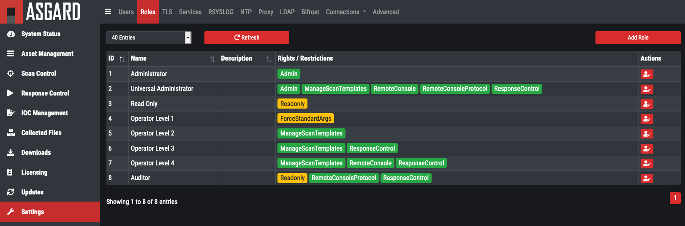

   User Roles – factory defaults 

The pre-configured roles can be modified or deleted. The ASGARD role model is fully configurable.

The following rights are available and can be added to a role.

.. figure:: ../images/image75-1592213406010.png
   :target: ../_images/image75-1592213406010.png
   :alt: image75

All rights comprise the right of starting and stopping scans. 

**Admin:** 

Users with the Admin permission are allowed to modify everything, but are not allowed to access the Response Control and the Bifrost sections. Additionally, the Admin permission does not allow to open remote shells on endpoints. 

The Admin permission allows to 

* create or modify users and roles
* add, generate, download licenses
* update ASGARD, THOR and scanners
* modify configurations in the Settings section

**Manage Scan Templates:** Users with this permission are able to manage scan templates. 

**Remote Console:** Users with this permission are allowed to open a remote console on all connected endpoints. 

**Remote Console Protocol:** Users with this permission are allowed to view all remote console sessions. Additionally, all permissions from Response Control and Scan Control are included.

**Response Control:** Users with this permission have full access to the response control section, are able to use "Evidence Collection", access the Bifrost section, but cannot open remote console sessions. The Response Control permission allows you to update the ASGARD agent on the endpoints.

Furthermore, roles can be given one or more restrictions. The following restrictions are available:

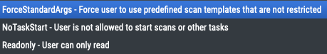

**ForceStandardArgs:** If this restriction is set, the user has the Scan Control permission but can only use unrestricted scan templates. 

**NoTaskStart:** Users with this restriction are not allowed to start scans or start tasks in the response control section.

**Read Only:** If this restriction is set the user only has read access to the functions he is allowed to use.

Configuring LDAP
~~~~~~~~~~~~~~~~

In order to configure LDAP, navigate to "Settings", LDAP tab and add LDAP server details. Then provide role mapping by clicking "Add LDAP Role".

.. figure:: ../images/image77-1592213527329.png
   :target: ../_images/image77-1592213527329.png
   :alt: image77

   Configure LDAP

All local users are disabled except for the built-in admin user when LDAP is configured.

Create a New User
~~~~~~~~~~~~~~~~~

You can manage all users that have access to ASGARD under Settings à Users. In order to create a new user, click the "Create User" button in the upper right corner of this section.

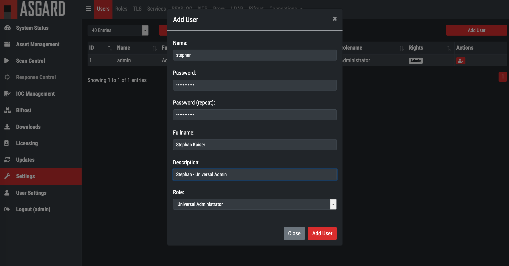

   User Management

**Note:** You must specify the user’s role when creating the user. 

Syslog Forwarding
^^^^^^^^^^^^^^^^^

In order to define syslog forwarding, navigate to the ``RSYSLOG`` tab in the ``Settings`` section and click ``Add RSYSLOG Forwarding``. 

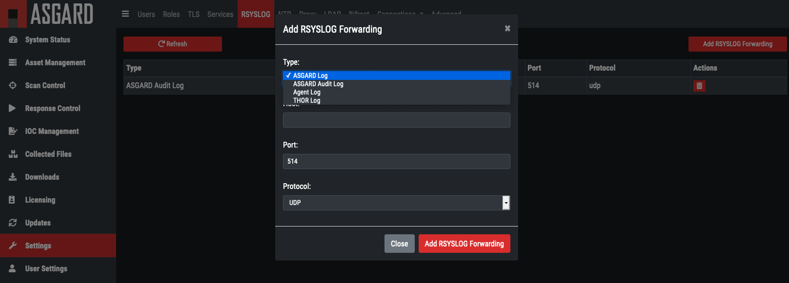

   Configure Syslog forwarding

The following log types can be forwarded individually:

**ASGARD Log:** Everything related to the ASGARD service, processes, jobs and scans.

**ASGARD Audit Log:** ASGARD features a powerful audit function that logs every mouse click in the system as well as all login related events to the audit log.

**Agent Log:** All ASGARD agent activities are logged to the agent log.

**THOR Log:** All THOR scan results. This is only available if the scan configuration contains syslog forwarding to ASGARD. 

Installing a TLS Certificate
^^^^^^^^^^^^^^^^^^^^^^^^^^^^

Instead of using a pre-installed self-signed TLS Certificate, you can use your own TLS Certificate for ASGARD. First of all, a Certificate Signing Request (CSR) is required. 

.. figure:: ../images/image80-1592213746875.png
   :target: ../_images/image80-1592213746875.png
   :alt: image80

   Generating a CSR

For best experience with Google Chrome, we recommend entering the system’s FQDN in both fields ``Common Name`` AND ``Hostnames``.

Please note: Generating the CSR on the command line  is not supported.   

This CSR can be used to generate a TLS Certificate. Subsequently, this TLS Certificate can be uploaded in the Settings section.

Manage Services
^^^^^^^^^^^^^^^

The individual ASGARD services can be managed within the sub-section ``Services``. These are presented in a table and can be stopped or restarted with the buttons in the ``Actions`` column. 

.. figure:: ../images/image81-1592213825369.png
   :target: ../_images/image81-1592213825369.png
   :alt: image81

   Manage Services

NTP Configuration
^^^^^^^^^^^^^^^^^

The current NTP configuration can be found in the NTP sub-section. 

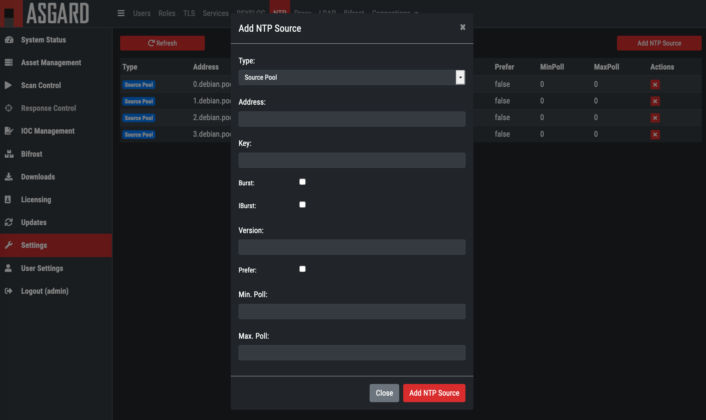

   Current NTP configuration

A Source Pool or Source Server can be removed by clicking the „X" button. To create a new Source Pool or Source Server, click ``Add NTP Source`` in the upper right corner. 

Settings for Bifrost
^^^^^^^^^^^^^^^^^^^^

Bifrost allows you to automatically download suspicious files to your ASGARD. If an Analysis Cockpit is connected, these files are automatically forwarded to the Analysis Cockpit in order to drop them into a connected Sandbox system. However, the collected files will stay on ASGARD for the amount of time specified in "Retention time" (0 days represent an indefinite amount of time). 

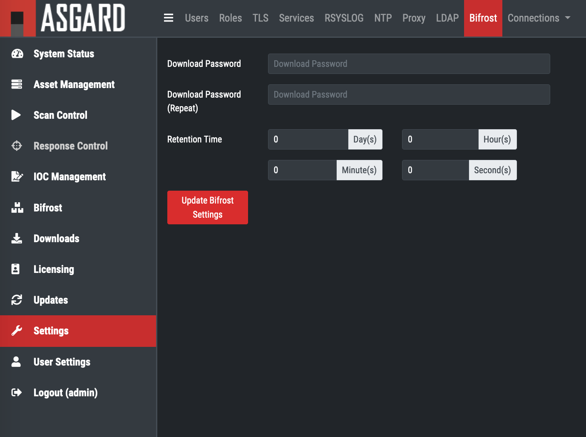

   Settings for Bifrost

The collected files can be downloaded in the ``Collected Files`` section. All files are zipped and password protected with the password specified under ``Download Password``. 

If no password is set, ASGARD will use the factory default password. The default password is: ``infected``

In order to automatically collect suspicious files, you must create a scan with the Bifrost option. Checking the ``Send Bifrost2 to ASGARD`` option will automatically add ``%asgard-host%`` as Bifrost Server.

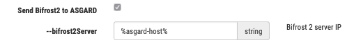

   Scan option for Bifrost 

This will collect all files with a minimum Score of 60 and make them available for download in ASGARDs ``Collected Files`` section. 

For Details on how to automatically forward to a sandbox system please refer to the Analysis Cockpit manual.

Link Analysis Cockpit
^^^^^^^^^^^^^^^^^^^^^

In order to connect to an Analysis Cockpit, enter the respective hostname or IP in the field ``Analysis Cockpit``, enter the Cockpit’s API key and click ``Connect``. 

.. figure:: ../images/image85-1592214126711.png
   :target: ../_images/image85-1592214126711.png
   :alt: image85

   Linking the Analysis Cockpit 

You may obtain the Cockpit’s API key in the upper right corner of the Cockpit’s Overview section.

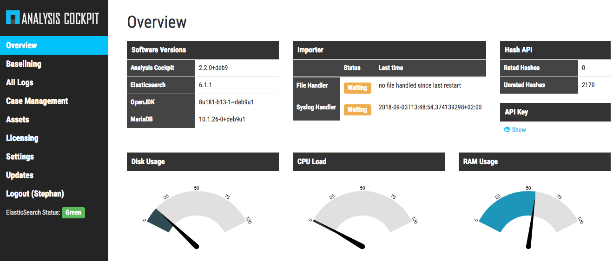

   Finding the Cockpit’s API key

ASGARD must be able to connect to the Analysis Cockpit on port 443/TCP for a successful integration. Once connected, the Cockpit will show up in ASGARDs overview section along with the "last synced date" (lower left corner). 

Please allow up to five minutes for the status to change on ASGARD’s System Status page. It will change from ``Not linked`` to ``Online``.

.. figure:: ../images/image87-1592214183046.png
   :target: ../_images/image87-1592214183046.png
   :alt: image87

   Cockpit connectivity status

Link MISP
^^^^^^^^^

In order to connect to a MISP navigate to the ``Settings section -> Connections -> Link MISP``.

Insert the MISP’s address along with the API Key and click ``Connect``.

.. figure:: ../images/image88-1592214236459.png
   :target: ../_images/image88-1592214236459.png
   :alt: image88

   Linking a MISP to ASGARD

The MISP connectivity status is shown in the ``Overview`` section. Please allow five minutes for the connection status to show green and MISP rules to show up in the ``IOC Management`` section.

.. figure:: ../images/image87-1592214329085.png
   :target: ../_images/image87-1592214329085.png
   :alt: image87

   MISP connectivity status

Change Proxy Settings
^^^^^^^^^^^^^^^^^^^^^

In this dialogue, you can add or modify ASGARDs proxy configuration. Please note, you need to restart the ASGARD service (Tab Services) afterwards. 

.. figure:: ../images/image89-1592214398237.png
   :target: ../_images/image89-1592214398237.png
   :alt: image89

   Change Proxy Settings

Link Master ASGARD
^^^^^^^^^^^^^^^^^^

In order to control your ASGARD with a Master ASGARD, you must generate a One-Time Code and use it in the "Add ASGARD" dialogue within the Master ASGARD frontend. 

.. figure:: ../images/image90-1592214434636.png
   :target: ../_images/image90-1592214434636.png
   :alt: image90

   Link Master ASGARD

Advanced
^^^^^^^^

The Advanced tab lets you specify additional global settings. The session timeout for web-based UI can be configured. Default is 24 hours. If ``Show Advanced Tasks`` is set, ASGARD will show system maintenance jobs (e.g. update ASGARD Agent on endpoints) within the response control section. 

Inactive assets can be hidden in the Asset Management Section by setting a suitable threshold for ``Hide inactive Assets``. 

Finally, the download for THOR packages can be protected with a token. If unprotected, anybody can request a THOR package with a valid license for a particular host just by sending a https request with the hostname included (for Details see chapter "4.9 Downloads"). This may lead to unwanted exhaustion of the ASGARD license pool. 

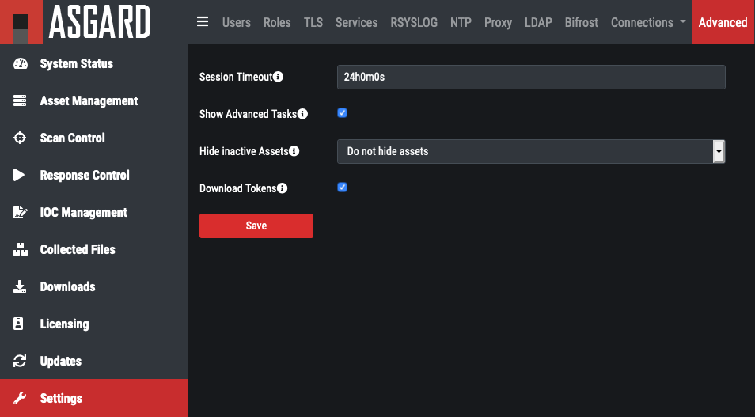

   Advanced Settings

User Settings
-------------

Changing your password
^^^^^^^^^^^^^^^^^^^^^^

To change your password, navigate to the ``User Settings`` section.

.. figure:: ../images/image92-1592777835879.png
   :target: ../_images/image92-1592777835879.png
   :alt: image92

   Changing your password

API Key
^^^^^^^

This section also allows you to set and modify an API key. 

Note that currently an API key always has the access rights of the user context in which it has been generated. If you want to create a restricted API key, add a new restricted user and generate an API key in the new user’s context.  
