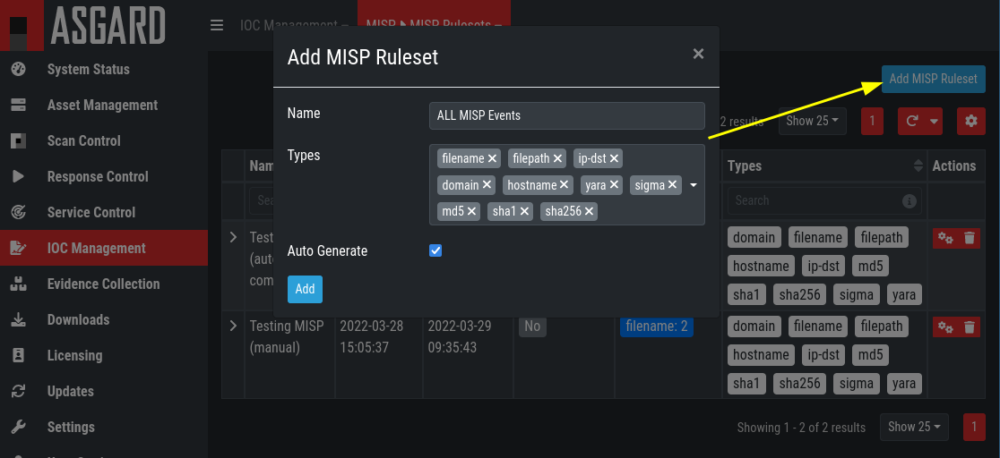
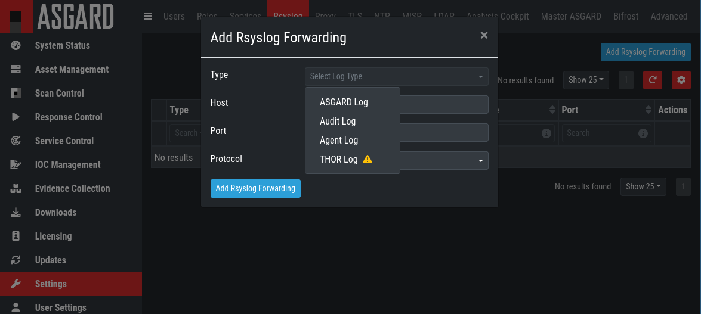

.. role:: raw-html-m2r(raw)
   :format: html

Administration
==============

License Management
------------------

Login to ASGARD, navigate to ``Licensing``, click 
``Upload ASGARD Management Center License`` and upload a valid license. 

.. figure:: ../images/install-a-license.png
   :target: ../_images/install-a-license.png
   :alt: image-20200608152010548

   Install a license

After uploading, the license details are displayed.

System Status
-------------

Status Overview
^^^^^^^^^^^^^^^

The initial system status page provides a summary of the most important system components. 

It also includes the current resource consumption (disk, CPU and memory) and lists the currently installed ASGARD software version along with available versions of THOR. Additionally, the connection status to the update servers, MASTER ASGARD and Cockpit are shown with a graph that shows asset connections and asset streams.

.. note::
   The THOR version numbers may be missing in a new installation. THOR is not included in the installed packages. THOR is downloaded automatically after the installation and should show up not later than one hour after installation. 

.. figure:: ../images/overview1.png
   :target: ../_images/overview1.png
   :alt: Overview Top Half

   Overview Top Half

.. figure:: ../images/overview2.png
   :target: ../_images/overview2.png
   :alt: Overview Bottom Half

   Overview Bottom Half

Diagnostics
^^^^^^^^^^^

The diagnostics sub menu shows the periodically performed checks and their status. Clicking the magnifying glass icon shows details of the performed check. If a check failed it gives a detailed error message and hints on which steps typically help in resolving the issue.

.. figure:: ../images/diagnostics.png
   :target: ../_images/diagnostics.png
   :alt: Overview Over Periodic Diagnostic Checks

   Overview Over Periodic Diagnostic Checks

The traffic light on the left menu always shows if any of those checks failed by showing a warning or error (i.e. yellow or red light) and you can click the status to view the diagnostics page as a pop-up.

Logs
^^^^

The logs section shows the latest and most relevant logs. Complete logs can be found at ``/var/lib/nextron/asgard2/log``.

.. figure:: ../images/logs-section.png
   :target: ../_images/logs-section.png
   :alt: Logs Section

   Logs Section

Available logs and their content:

- Audit: Containing user login/-off, changes done over the UI.
- ASGARD Management Center: Overall status of the MC, general errors and warnings.
- ASGARD Agent and Service Controller: Status of the agents deployed on assets.
- THOR via Syslog: Received syslog events of THOR scans. Partial results if a scan did not complete.
- Aurora: All Aurora events:
- Aurora Event Producers: The top 10 of event producing processes per endpoint.
- Aurora Response Actions: Only response action events of Aurora:
- Aurora Simulated Response Actions: Only simulated response action events of Aurora.
- LogWatcher: All LogWatcher events.
- Diagnostic Pack: Button for generating and downloading a diagnostic pack that may be asked for by support.

ASGARD Agent Deployment
-----------------------

In order to register a new endpoint to the ASGARD Management Center, download and install the ASGARD agent on the system you want to register. 

The ASGARD agent can be directly downloaded from the ASGARD login screen through the button ``Download Agent Installers``. A list of available agents for various operating systems appears. 

.. figure:: ../images/login-screen.png
   :target: ../_images/login-screen.png
   :alt: Download Agent Installers from Login Screen

   Download Agent Installers from Login Screen

.. figure:: ../images/agents-overview.png
   :target: ../_images/agents-overview.png
   :alt: image-20200608152828507

   Agents Overview

After installation, the endpoints will connect to ASGARD, register automatically and appear in the Asset Management Section in the tab ``Requests``. Please allow two or three minutes for systems to show up. The agents use the hostname to connect to ASGARD, ensure that your endpoints can resolve and reach the ASGARD hostname.

In the requests tab, select the agents you want ASGARD to manage and click ``Accept``. After that, the endpoint shows up in the asset tab and is now ready to be managed or scanned.

.. figure:: ../images/accepting-asgard-agent-requests.png
   :target: ../_images/accepting-asgard-agent-requests.png
   :alt: image-20200608152952182

   Accepting ASGARD Agent Requests

A registered agent will poll to the ASGARD Management Center at a given interval between 10 seconds and 600 seconds – depending on the number of connected endpoints (see :ref:`section Performance Tuning <usage/commandline:Performance Tuning>` for details). If ASGARD has scheduled a task for the endpoint (for example: run THOR scan) it will be executed directly after the poll.

Asset Management
----------------

Overview
^^^^^^^^

Management of all endpoints registered with ASGARD can be performed in Asset Management. The assets will be presented as a table with an individual ASGARD ID, their IP addresses and host names.

.. figure:: ../images/asset-view.png
   :target: ../_images/asset-view.png
   :alt: image-20200608153056012

   Asset View

By clicking the control buttons in the Actions column, you can start a new scan, run a response playbook, open a command line or switch the endpoints ping rate to a few seconds instead of a maximum of 10 minutes. 

.. figure:: ../images/available-actions.png
   :target: ../_images/available-actions.png
   :alt: Asset Actions

   Available Actions (left to right): Run Scan, Run Task, Connect To Remote Console, Show Timeline, Enable/Disbale Fast Poll Mode

.. note::

    * The internal ping between the ASGARD agent and ASGARD is based on HTTPS not ICMP
    * Depending on the user's role some of the control buttons may be disabled

Column Visibility
^^^^^^^^^^^^^^^^^

Users can select various columns and adjust their view according to their needs by clicking the gear wheel in the top right corner of any table.

.. figure:: ../images/available-columns-in-asset-management.png
   :target: ../_images/available-columns-in-asset-management.png
   :alt: Asset Columns

   Available columns in Asset Management

Asset Labels
^^^^^^^^^^^^

Labels are used to group assets. These groups can then be used in scans or tasks. 

You can add multiple labels to an asset or a group of assets. This is done by selecting the particular assets in the left column, typing the label name (e.g. New_Label) and clicking the blue ``Add Labels`` button. 

.. note::
   Don't use labels with white space characters as it could cause issues in syncs with Analysis Cockpit, exports / imports or other underlying legacy functions. 

.. figure:: ../images/add-labels.png
   :target: ../_images/add-labels.png
   :alt: Asset Labling

   Add labels

In order to remove labels, select your assets, click the yellow ``Remove Labels`` button and type the name of the label you want to remove for these assets.

.. figure:: ../images/remove-labels.png
   :target: ../_images/remove-labels.png
   :alt: Asset Labling

   Remove labels

The asset management section has extensive filtering capabilities, e.g. it is easy to select only Linux endpoints that have been online today and have a particular label assigned. 

Export Asset List 
~~~~~~~~~~~~~~~~~

The Import/Export Section allows you to export your assets to a .csv file. 

Import Labels
~~~~~~~~~~~~~

The import function allows you to add or remove labels on assets based on columns in that CSV file. 

The import function processes the values in the columns ``Add Labels ...`` and ``Remove Labels ...`` only. In order to change labels, use the already exported list, add values in these columns and re-import it by using the 
``Apply Labels from CSV`` button. Separate multiple labels with comma. Leading or ending white space characters will be stripped from the labels. 

.. figure:: ../images/asset-label-import.png
   :target: ../_images/asset-label-import.png
   :alt: Asset Labling via CSV

   Asset Labling via CSV

Scan Control
------------

Managing Scan Templates
^^^^^^^^^^^^^^^^^^^^^^^

Scan templates are the most convenient way to make use of THOR's rich set of scan options. Starting with ASGARD 1.10., it is possible to define scan parameters for THOR 10 and store them in different templates for later use in single scans and grouped scans. 

Imagine you want to use dedicated scan options for different system groups (e.g. Linux Servers, Domain Controllers, Workstations, etc.) and make sure to use exactly the same set of scan options every time you scan a particular group of systems. With ASGARD you can now add a scan template for every group.

A popular use case for scan templates is providing additional resource control – for example telling THOR to set the lowest process priority for itself and never use more than 50% of CPU. 

Please keep in mind, that we have already optimized THOR to use the most relevant scan options for a particular system (based on type, numbers of CPUs and system resources) and a comprehensive resource control is enabled by default. 

For more details please refer to the `THOR manual <https://thor-manual.nextron-systems.com/en/latest/>`_. Only use the scan templates if you want to deviate from the default for a reason.

Scan templates are protected from being modified by ASGARD users without the "Manage Scan Templates"-permission and can also be restricted from being used by ASGARD users in case the flag "ForceStandardArgs" is set for this user. (See section :ref:`User Management<usage/administration:User Management>` for details).

By clicking the ``Import Scan Template`` button you can import a previously exported scan template.

.. figure:: ../images/scan-templates-overview.png
   :target: ../_images/scan-templates-overview.png
   :alt: image-20200608153256353

   Scan Templates Overview

In order to create a scan template, navigate to ``Scan Control`` > ``Scan Templates`` and click the ``Add Scan Template`` button. The ``Add Scan Template`` dialogue appears. The current THOR scanner version is chosen for you by default but can be changed if needed.

After choosing or changing a scanner you will find the most frequently used options on the top of this page in the "Favorite Flags" category. View all THOR options by clicking on the other categories or quickly search for known flags in the search bar. By clicking on the star symbols you can also edit your personal favorites. 

.. figure:: ../images/scan-flags.png
   :target: ../_images/scan-flags.png
   :alt: image-20200608153228887

   Scan Flags

By checking the "Default" box, you can make this scan template the default template for every new scan. There can only be one default template at a time and selecting the box will uncheck a previous default, if set.
Checking the "Restricted" flag will make the template restricted, meaning only a restricted set of users can use the template for scans. The set of users consists of all users who do not have the "ForceStandardArgs" restriction set. (By default this are all users who are not member of the group "Operator Level 1").
After clicking the "Add Template" button on the bottom of the template page, an overview of all existing scan templates is shown. 

Scan a Single System
^^^^^^^^^^^^^^^^^^^^

Create a Single Scan
~~~~~~~~~~~~~~~~~~~~

The creation of a scan is performed within the Asset Management. There is a button for each asset to create a new scan and to show all past scans. 

Just click on the "THOR" button in the Action column in the Asset Management view.

.. figure:: ../images/scan-control-scan-creation.png
   :target: ../_images/scan-control-scan-creation.png
   :alt: image-20200608153403808

   Scan Control - Scan Creation

Within this form, you can choose the maximum runtime, module, scanner, scan flags, signatures and template can be selected.

After the desired parameters have been set, the scan can be started by clicking the ``Add Scan`` button.

Stopping a Single Scan
~~~~~~~~~~~~~~~~~~~~~~

To stop a single scan, navigate to the "Single Scans" tab in Scan Control section and click the "stop" (square) button for the scan you want to stop.

.. figure:: ../images/stopping-a-single-scan.png
   :target: ../_images/stopping-a-single-scan.png
   :alt: image-20200608153951250

   Stopping a Single Scan

Download Scan Results 
~~~~~~~~~~~~~~~~~~~~~

After the scan completion, you can download the scan results via the download button in the actions column.

The download button has the following options: 

* Download Scan Result as TXT (the THOR text log file)
* Download Scan Result as JSON (only available if it was started with the ``--json`` flag)
* Download HTML Report (as \*.gz compressed file; available for successful scans only)
* Show HTML Report (opens another tab with the HTML report)

.. figure:: ../images/download-scan-results.png
   :target: ../_images/download-scan-results.png
   :alt: Download Scan Results

   Scan Control - Download Scan Results

Scan Groups of Systems
^^^^^^^^^^^^^^^^^^^^^^

Create Grouped Scans
~~~~~~~~~~~~~~~~~~~~

A scan for a group of systems can be created in the "Scan Control > Group Scans" tab. Click the ``Add Group Scan`` button in the upper right corner.

.. figure:: ../images/scan-control-create-group-scan.png
   :target: ../_images/scan-control-create-group-scan.png
   :alt: image-20200608154115029

   Scan Control – Create Group Scan

As with the single scans, various parameters can be set. Aside from the already mentioned parameters, the following parameters can be set:

**Description**

Freely selectable name for the group scan.

**Asset Labels**

Here you can define which assets will be affected by the group scan. In case more than one label is chosen: An asset must have at least one chosen label attached to it to be affected by the scan. If no label is selected, all known assets will be scanned.

**Limit** 

ASGARD will not send additional scans to the agents when the client limit is reached. Therefore you need to set a limit higher than the number of hosts you want to scan or enter ``0`` for no limit. If you are using MASTER ASGARD, this limit is applied on each single selected ASGARD.

**Rate**

The number of scans per minute that are issued by ASGARD. This is where the network load can be controlled. Additionally, it is recommended to use this parameter in virtualized and oversubscribed environments in order to limit the number of parallel scans on your endpoints.

**Expires**

After this time frame, no scan orders will be issued to the connected agents. 

**Scheduled Start**

Select a date for a scheduled start of the scan.

After the group scan has been saved or saved and started, you will automatically be forwarded to the list of grouped scans. 

List of all Group Scans
~~~~~~~~~~~~~~~~~~~~~~~

The list of all group scans contains, among other items, the unique Scan-ID and the name.

.. figure:: ../images/scan-control-group-scans-list.png
   :target: ../_images/scan-control-group-scans-list.png
   :alt: image-20200608154224747

   Scan Control – Group Scans – List

In addition, information can be found about the chosen scanner, the chosen parameters, the start and completion times and the affected assets (defined by labels). Additional columns can be added by clicking on "Column Visibility".

The Status field can have the following values: 

**Paused:** The group scan has not yet started. Either click play or wait for the scheduled start date (the job will start in a 5 minute window around the scheduled time).

**Active:** Scan is started, ASGARD will issue scans with the given parameters.

**Inactive:** No additional scan jobs are being issued. All single scans that are currently running will continue to do so.

**Completed:** The group scan is completed. No further scan jobs will be issued.

Starting a Group Scan
~~~~~~~~~~~~~~~~~~~~~

A group scan can be started by clicking on the "play" button in the "Actions" column of a group scan. Subsequently, the scan will be listed as "Started".

Starting a Scheduled Group Scan
~~~~~~~~~~~~~~~~~~~~~~~~~~~~~~~

The Scheduled Group Scan section shows all scans that are to run on a frequent basis along with their periodicity. All group scans that have been started through the scheduler will show up on top of the Group Scan section the moment they are started. New scheduled tasks can be created by clicking the ``Add Scheduled Group Scan`` button.

.. figure:: ../images/scan-control-scheduled-group-scan.png
   :target: ../_images/scan-control-scheduled-group-scan.png
   :alt: image-20200608154452406

   Scan Control – Scheduled Group Scan 

.. figure:: ../images/scan-control-new-scheduled-group-scan.png
   :target: ../_images/scan-control-new-scheduled-group-scan.png
   :alt: image-20200608154442195

   Scan Control – New Scheduled Group Scan 

Details of a Group Scan
~~~~~~~~~~~~~~~~~~~~~~~

Further information about a group scan can be observed from the detail page of the group scan. Click the scan you are interested in and the details section will appear.

.. figure:: ../images/scan-control-group-scans-details.png
   :target: ../_images/scan-control-group-scans-details.png
   :alt: image-20200608154545029

   Scan Control – Group Scans – Details

Aside from information about the group scan in the "Details" tab, there is a graph that shows the number of assets started and how many assets have already completed the scan in the "Charts" tab. In the "Tasks" tab you get information about the scanned assets.

THOR Excludes and False-Positive Filters
^^^^^^^^^^^^^^^^^^^^^^^^^^^^^^^^^^^^^^^^

In THOR you can define `directory and file excludes <https://thor-manual.nextron-systems.com/en/latest/usage/configuration.html#files-and-directories>`_ and `false positive filters <https://thor-manual.nextron-systems.com/en/latest/usage/configuration.html#false-positives>`_. With ASGARD 2.13+ these features can be globally defined in ASGARD at ``Scan Control`` > ``THOR Config``.

.. figure:: ../images/scan-exclude-and-fp.png
   :target: ../_images/scan-exclude-and-fp.png
   :alt: Scan Control - Global Directory Exclude and FP Filtering

   Scan Control - Global Directory Exclude and FP Filtering

.. warning::
   Be careful not to use too broad filters or excludes as this might cripple THOR's detection capabilities, if
   done incorrectly.

Response Control
----------------

Opening a Remote Shell on an endpoint
^^^^^^^^^^^^^^^^^^^^^^^^^^^^^^^^^^^^^

In order to open a remote shell on an endpoint, open the Asset Management section and click the "command line" button in the Actions column.

.. figure:: ../images/opening-a-remote-shell-from-the-asset-view.png
   :target: ../_images/opening-a-remote-shell-from-the-asset-view.png
   :alt: image-20200608154926650

   Opening a Remote Shell from the Asset View

Depending on your configuration it may take between 10 seconds and 10 minutes for the remote shell to open. Please note that all actions within the remote shell are recorded and can be audited. All shells open with root or system privileges.

.. figure:: ../images/remote-shell.png
   :target: ../_images/remote-shell.png
   :alt: image-20200608154959812

   Remote Shell

In order to replay a remote console session, navigate to ``Response Control``, expand the task that represents your session, select the ``Console Log`` tab and click the play button in the bottom row.

.. figure:: ../images/replay-remote-shell-session.png
   :target: ../_images/replay-remote-shell-session.png
   :alt: image-20200608155013219

   Replay Remote Shell Session

ASGARD users can only see their own remote shell session. Only users with the ``RemoteConsoleProtocol`` permission are able to replay all sessions from all users.

Response Control with Pre-Defined Playbooks
^^^^^^^^^^^^^^^^^^^^^^^^^^^^^^^^^^^^^^^^^^^

In addition to controlling THOR scans, ASGARD Management Center contains extensive response functions. Through ASGARD, you can start or stop processes, modify and delete files or registry entries, quarantine endpoints, collect triage packages and execute literally any command on connected systems. All with one click and executed on one endpoint or groups of endpoints.

It is also possible to download specific suspicious files. You can transfer a suspicious file to the ASGARD Management Center and analyze it in a Sandbox. 

.. figure:: ../images/built-in-playbooks.png
   :target: ../_images/built-in-playbooks.png
   :alt: image-20200608155058550

   Built-in Playbooks

To execute a predefined response action on a single endpoint, navigate to the Asset Management view and click the "play" button in the Actions Column. This will lead you to a dialogue where you can select the desired action. 

.. figure:: ../images/execute-playbook-on-single-endpoint.png
   :target: ../_images/execute-playbook-on-single-endpoint.png
   :alt: image-20200608155132686

   Execute Playbook on Single Endpoint

In this example, we collect a full triage package.

ASGARD ships with pre-defined playbooks for the following tasks:

* Collect full triage pack (Windows only)
* Isolate endpoint (Windows only)
* Collect system memory
* Collect file / directory
* Collect directory
* Collect Aurora diagnostics pack
* Execute command and collect stdout and stderr

Nextron provides additional playbooks via ASGARD updates.

.. warning::
    The collection of memory can set the systems under  high load and impacts the systems response times during the transmission of  collected files. Consider all settings carefully!   Also be aware that memory dumps may fail due to  kernel incompatibilities or conflicting security mechanisms. Memory dumps  have been successfully tested on all supported Windows operating systems with  various patch levels. The memory collection on Linux systems depends on  kernel settings and loaded modules, thus we cannot guarantee a successful  collection.   Additionally, memory dumps require temporary free  disk space on the system drive and consume a significant amount of disk space  on ASGARD as well. The ASGARD agent checks if there is enough memory on the  system drive and adds a 50% safety buffer. If there is not enough free disk  space, the memory dump will fail.  

Response Control for Groups of Systems
^^^^^^^^^^^^^^^^^^^^^^^^^^^^^^^^^^^^^^

Response functions for groups of systems can be defined in the ``Group Tasks`` tab or the ``New Scheduled Group Task`` tab.

.. figure:: ../images/execute-playbook-on-group-of-endpoints.png
   :target: ../_images/execute-playbook-on-group-of-endpoints.png
   :alt: image-20200608155449158

   Execute Playbook on Group of Endpoints

Response Control with Custom Playbooks
^^^^^^^^^^^^^^^^^^^^^^^^^^^^^^^^^^^^^^

You can add your own custom playbook by clicking the ``Add Playbook`` button in the 
``Response Control`` > ``Playbooks`` tab. 

.. figure:: ../images/add-custom-playbook.png
   :target: ../_images/add-custom-playbook.png
   :alt: image-20200608160106096

   Add Custom Playbook

This lets you define a name and a description for your playbook. After clicking the ``Add Playbook`` button, 
click on the ``Edit steps of this playbook`` action. 

.. figure:: ../images/custom-playbook-edit-steps.png
   :target: ../_images/custom-playbook-edit-steps.png
   :alt: Playbook Action Items

   Playbook Action Items

This opens the side pane in which single playbook steps
can be added using the ``Add Step`` button.

.. figure:: ../images/add-playbook-entry.png
   :target: ../_images/add-playbook-entry.png
   :alt: image-20200608160150424

   Add Playbook Entry

If you need custom files for your playbook (scripts, configurations, binaries, etc.) you can select local files to be uploaded to ASGARD during the creation of the playbook step (by selecting "Upload New File" in the file drop-down). You can manage these files at ``Response Control`` > ``Playbook Files`` and upload or update files using the ``Upload Playbook File`` button.

.. figure:: ../images/playbook-files.png
   :target: ../_images/playbook-files.png
   :alt: Manage Playbook Files

   Manage Playbook Files

You can have up to 16 steps in each playbook that are executed sequentially. Every step can be either "download something from ASGARD to the endpoint", "execute a command line" or "upload something from the endpoint to ASGARD". If you run a command line the stdout and stderr are reported back to ASGARD. 

Service Control
---------------

Service Control is ASGARD's way of deploying real-time services on endpoints. Currently there exist the Aurora and the LogWatcher service. To use any of those two, the service controller has to be installed on an asset.

Service Controller Installation
^^^^^^^^^^^^^^^^^^^^^^^^^^^^^^^

To install asgard2-service-controller on an asset you need to install the asgard2-agent first. If you already have installed asgard2-agent on an asset and accepted it in ASGARD, you can use the **"Install ASGARD Service Controller"** playbook to deploy the service controller on an asset or you can manually download and execute the asgard2-service-controller installer from the ASGARD downloads page.

.. figure:: ../images/sc-install.png
   :target: ../_images/sc-install.png
   :alt: Install Service Controller

   Install Service Controller

Service Controller Update
^^^^^^^^^^^^^^^^^^^^^^^^^

If an ASGARD update comes with a new service controller version, you need to update the service controller on the already rolled-out assets. You can do this using an "Update Agent" task. For a single asset the task can be run in ``Asset Management`` > ``Assets`` > ``Run Task`` (play button action) or analogous as a (scheduled) group task under ``Response Control`` > ``(Scheduled) Group Tasks`` > ``Add (Scheduled) Group Task``.

.. figure:: ../images/sc-update.png
   :target: ../_images/sc-update.png
   :alt: Update Service Controller

   Update Service Controller

.. note::
    If you don't see the **Update Agent** module, you need to enable **Show Advanced Tasks** in ``Settings`` > ``Advanced``

Sigma
^^^^^

LogWatcher, as well as Aurora, are using Sigma in order to define their detections. The Sigma rule management is shared between the two services. But each service has its own configuration that defines which rules are actually used on the assets.

What is Sigma
~~~~~~~~~~~~~

From the `project website <https://github.com/SigmaHQ/sigma>`_:

    Sigma is a generic and open signature format that allows you to describe relevant log events in a straightforward manner. The rule format is very flexible, easy to write and applicable to any type of log file. The main purpose of this project is to provide a structured form in which researchers or analysts can describe their once developed detection methods and make them shareable with others.

    Sigma is for log files what `Snort <https://www.snort.org/>`_ is for network traffic and `YARA <https://github.com/VirusTotal/yara>`_ is for files.

Creating a Ruleset
~~~~~~~~~~~~~~~~~~

Rulesets are used to group rules to manageable units. As an asset can only have one service configuration, rulesets are used to determine which rules are used in which service configuration. There exist default rulesets for high and critical Sigma rules. If you want to create a custom ruleset go to ``Service Control`` > ``Sigma`` > ``Rulesets`` > ``Create Ruleset``.

.. figure:: ../images/sc-create-ruleset.png
   :target: ../_images/sc-create-ruleset.png
   :alt: Create a Ruleset

   Create a Ruleset

If you have chosen that new Sigma rules should be added automatically they are added now. If you didn't you now need to add the desired rules manually by going to ``Service Control`` > ``Sigma`` > ``Rules``. Choose the rules that should be added to this ruleset by selecting the checkboxes and then ``Add to Ruleset``. A rule can be assigned to multiple rulesets.

.. figure:: ../images/sc-add-to-ruleset.png
   :target: ../_images/sc-add-to-ruleset.png
   :alt: Add a Rule to Rulesets

   Add a Rule to Rulesets

.. note::
    You need to commit and push your changes after editing a ruleset. ASGARD has to restart the service controller to read new configurations. In order to prevent multiple restarts in the case of a user performing several configuration changes in succession, the user has to initiate the reloading of the new configuration by going to ``Service Control`` > ``Sigma`` > ``Rulesets`` and performing the **Compile ruleset** action (gear wheels). The need for compiling is indicated in the *Uncompiled Changes* column.

    .. figure:: ../images/sc-uncommitted-changes.png
       :target: ../_images/sc-uncommitted-changes.png
       :alt: Uncompiled Changes Indicator
    
       Uncompiled Changes Indicator

Choosing which Rules to activate
~~~~~~~~~~~~~~~~~~~~~~~~~~~~~~~~

It is not advised to enable all available rules on an asset. We suggest to start with all "critical" and then advance to all "high" rules. We already provide a default ruleset for those two levels for you to use. "Medium" rules should not be enabled in bulk or "low"/"informational" at all . Single medium rules, which increase an organisation's detection coverage and do not trigger a bigger number of false positives can be added to the active configuration, but should be tested rule by rule.

In order to easily add rules to a ruleset you can use the column filters to select the desired rules and add the bulk to a ruleset. As an example you can add all rules of level "critical" to a ruleset:

    .. figure:: ../images/sc-choose-rules1.png
       :target: ../_images/sc-choose-rules1.png
       :alt: Add all critical rules to a ruleset
    
       Add All Critical Rules to a Ruleset

Another great way to pivot the Sigma rule database is the usage of MITRE ATT&CK® IDs.

    .. figure:: ../images/sc-choose-rules2.png
       :target: ../_images/sc-choose-rules2.png
       :alt: Search by MITRE ATT&CK® ID
    
       Search by MITRE ATT&CK® ID

Or you can just search the title or description field of the rules. You can also search the rule itself using the "Rule" column. (the "Rule" column is not shown by default and has to be added using the gear wheel button).

    .. figure:: ../images/sc-choose-rules3.png
       :target: ../_images/sc-choose-rules3.png
       :alt: Search by Rule Title or Description
    
       Search by Rule Title or Description
       
Adding Custom Rules
~~~~~~~~~~~~~~~~~~~

Custom rules can be added using the sigma format complying with the `specification <https://github.com/SigmaHQ/sigma/wiki/Specification>`_. You can upload single files or a ZIP compressed archive. This can be done at ``Service Control`` > ``Sigma`` > ``Rules`` > ``Upload Rules``.

    .. figure:: ../images/sc-custom-rule.png
       :target: ../_images/sc-custom-rule.png
       :alt: Adding Custom Rules
    
       Adding Custom Rules

Rule and Response Updates
~~~~~~~~~~~~~~~~~~~~~~~~~

If new rules or rule updates are provides by the Aurora signatures, the updates have to be applied by the user manually in order to be affecting Aurora agents managed by ASGARD. An indicator is shown in the WebUI and the rules changes can be reviewed and applied at ``Service Control`` > ``Sigma`` > ``Rule Updates``. 

    .. figure:: ../images/sigma-rule-updates.png
       :target: ../_images/sigma-rule-updates.png
       :alt: Sigma Rule Updates for Aurora
    
       Sigma Rule Updates for Aurora

Clicking on the ``Update`` button in the "Update Available" column opens a diff view in which the changes are shown and where the user can apply or discard the changes. If you do not need to review each single change, you can apply all changes using the ``Update All Rules`` button.

Analogous the updates of response actions can be viewed and applied at ``Service Control`` > ``Sigma`` > ``Response Updates``.

How to activate Responses
~~~~~~~~~~~~~~~~~~~~~~~~~
As a fail safe and for administration purposes, responses are generally only simulated if not explicitly set to active.
This has to be done on different levels:

- Service configuration level
- Ruleset configuration level (on updates)
- Ruleset rule level

If on one level a rule is simulated, it will not execute the response actions but only generate a log line that describes the action that would have been performed. You can see an overview of the state of all responses in the ``Service Control`` > ``Aurora`` > ``Configurations`` menu.

    .. figure:: ../images/sc-aurora-configuration-response-overview.png
       :target: ../_images/sc-aurora-configuration-response-overview.png
       :alt: Aurora Configuration Response Action Overview
    
       Aurora Configuration Response Action Overview

(1) indicates whether responses are activated on configuration level. Edit the configuration to change it.
(2) indicates how many rules are only simulated in that ruleset (or in sum).
(3) indicates  how many rules have active responses in that ruleset (or in sum)

To change the status of a response in the ruleset click the ruleset link. You can view all simulated or all active responses. Us the checkbox and the button in the upper right to switch the response status of the rules between active and simulated.

    .. figure:: ../images/sc-aurora-ruleset-responses.png
       :target: ../_images/sc-aurora-ruleset-responses.png
       :alt: Response Configuration in Rulesets
    
       Response Configuration in Rulesets

In addition the default response mode of a ruleset is important for the behaviour of response updates. It can be seen at ``Service Control`` > ``Sigma`` > ``Rulesets`` in the "Default Response Mode" column.

    .. figure:: ../images/sigma-ruleset-default-response-mode.png
       :target: ../_images/sigma-ruleset-default-response-mode.png
       :alt: Ruleset Default Response Mode
    
       Ruleset Default Response Mode

If "Simulation" is selected, response actions of new and updated rules will be put in simulation mode. If "Active" is selected, new rules will automatically be put in active mode and updated rules will not change their current response mode.

Aurora
^^^^^^

- Aurora is a lightweight endpoint agent that applies Sigma rules and IOCs on local event streams.
- It uses Event Tracing for Windows (ETW) to subscribe to certain event channels.
- It extends the Sigma standard with so-called "response actions" that can get executed after a rule match
- It supports multiple output channels: the Windows Eventlog, a log file and remote UDP targets

Its documentation can be found at `aurora-agent-manual.nextron-systems.com <https://aurora-agent-manual.nextron-systems.com/en/latest/index.html>`_.

Overview
~~~~~~~~
Under ``Service Control`` > ``Aurora`` > ``Asset View (Deployed)`` the overview of all assets with installed Aurora is shown. Clicking on the entry opens a drop-down menu with details and additional information.

.. figure:: ../images/sc-aurora-asset-view.png
   :target: ../_images/sc-aurora-asset-view.png
   :alt: Aurora Asset View

   Aurora Asset View

Deploy Aurora on Asset
~~~~~~~~~~~~~~~~~~~~~~

Analogous you can see an overview of all assets without Aurora installed under ``Service Control`` > ``Aurora`` > ``Asset View (Not Deployed)`` and install Aurora using the ``Deploy Aurora`` button.

Change Service for an Asset
~~~~~~~~~~~~~~~~~~~~~~~~~~~
To change the Aurora configuration of an asset, navigate to ``Service Control`` > ``Aurora`` > ``Asset View (Deployed)``, select the asset's checkbox and choose ``Change Aurora Configuration``. Then choose the desired service configuration by clicking ``Assign and Restart``.

.. figure:: ../images/sc-aurora-assign-configuration.png
   :target: ../_images/sc-aurora-assign-configuration.png
   :alt: Change Aurora Service Configuration

   Change Aurora Service Configuration

If you want to enable or disable the Aurora service on an asset, select it with the checkbox and use the ``Enable`` or ``Disable`` button or select the play or stop action icon on single assets.

Creating a Custom Service Configuration
~~~~~~~~~~~~~~~~~~~~~~~~~~~~~~~~~~~~~~~
Go to ``Service Control`` > ``Aurora`` > ``Configurations`` > ``Add Configuration``, enter a name and add the rulesets that should apply for this service configuration. No rulesets is a viable option, if you only want to use the non-sigma matching modules. You don't need to edit any other option as sane defaults are given.

.. figure:: ../images/sc-aurora-custom-configuration.png
   :target: ../_images/sc-aurora-custom-configuration.png
   :alt: Create a Custom Aurora Configuration

   Create a Custom Aurora Configuration

Process Excludes
~~~~~~~~~~~~~~~~~~

If Aurora uses too much CPU cycles, the most common reason is a heavy event producer on the system (e.g. anti virus or communication software). In order to analyse the issue and define process exclusions, go to ``Service Control`` > ``Aurora`` > ``Process Excludes``

.. figure:: ../images/aurora-process-exclusion.png
   :target: ../_images/aurora-process-exclusion.png
   :alt: Define Aurora Process Exclusion

   Define Aurora Process Exclusion

An overview over the top event producing processes is given on the bottom of the section. Another possibility is to :ref:`collect diagnostic packs of systems<usage/debugging:Aurora Diagnostics Pack>` in question and look in the ``status.txt`` at the event statistics by process.

False Positive Filters
~~~~~~~~~~~~~~~~~~~~~~
If needed, false positives can be globally filtered on all Aurora agents at ``Service Control`` > ``Aurora`` > ``False Positive Filters``. It is recommended to filter false positives at ``Servce Control`` > ``Sigma`` > ``Rules`` and filter the false positives on a rule level using the "edit false positive" action (funnel icon). If this is not possible, because you need a quick fix and multiple rules are affected, the global false positive filter can help.

.. figure:: ../images/aurora-global-fp-filter.png
   :target: ../_images/aurora-global-fp-filter.png
   :alt: Define Global Aurora False Positive Filters

   Define Global Aurora False Positive Filters

.. warning::
   A too permissive filter will greatly reduce Aurora's detection and response capabilities.

Response Action Logs
~~~~~~~~~~~~~~~~~~~~
You can view an overview and the logs of the Aurora response and simulated response actions under ``Service Control`` > ``Aurora`` > ``Response Action Logs``.

.. figure:: ../images/aurora-response-action-logs.png
   :target: ../_images/aurora-response-action-logs.png
   :alt: Aurora Response Action Logs

   Aurora Response Action Logs

LogWatcher Service
^^^^^^^^^^^^^^^^^^

The LogWatcher real-time service monitors the Windows Event Log using predefined rules in the Sigma format and creates an alert that is forwarded to ASGARD Analysis Cockpit if a match was found. The LogWatcher service is no longer shown by default on newly installed ASGARDs. To enable it go to ``Settings`` > ``Advanced`` and enable the ``Show LogWatcher`` checkbox.

Prerequisites
~~~~~~~~~~~~~

In order to make full use of ASGARD LogWatcher you need a Windows Audit Policy and Sysmon, both with a reasonable configuration, in place. We expect organizations to take care of providing a sane configuration by their own. This section helps in giving starting points, if needed.

Windows Audit Policy
""""""""""""""""""""

The default audit policy of Windows is not suitable for security monitoring and needs to be configured. There are Microsoft recommendations available `online <https://docs.microsoft.com/en-us/windows-server/identity/ad-ds/plan/security-best-practices/audit-policy-recommendations>`_.

Also auditing the command line for process creation events should be enabled. Documentation for that task is available `here <https://docs.microsoft.com/en-us/windows-server/identity/ad-ds/manage/component-updates/command-line-process-auditing>`_.

Sysmon Configuration Template
"""""""""""""""""""""""""""""

There are some best practise configurations available. See them as a good starting point to develop your own configuration. If you do not have a Sysmon configuration yet, there are several options we suggest:

1. The Nextron Systems fork of SwiftOnSecurity's `sysmon-config <https://github.com/Neo23x0/sysmon-config>`_
2. The `SwiftOnSecurity sysmon-config <https://github.com/SwiftOnSecurity/sysmon-config>`_
3. Olaf Hartong's `sysmon-modular <https://github.com/olafhartong/sysmon-modular>`_

In general we suggest our own configuration, as we test our rules with it and include changes from the upstream configuration. But depending on your preferences, either of those listed configurations is a good starting point for writing your own configuration.

.. warning::
    Do not deploy those configurations to your production environment without prior testing.

    It is expected that some tools you use will be the source of huge log volume and should be tuned in the configuration depending your environment.

Sysmon Installation
"""""""""""""""""""

`Sysmon <https://docs.microsoft.com/en-us/sysinternals/downloads/sysmon>`_ is part of Microsoft Sysinternals and therefore has to be installed as a third party tool. The preferred way to distribute Sysmon and its configuration is using your organization's device management. If you do not have access to one, you can use ASGARD's playbook feature to distribute Sysmon and update its configuration. Documentation which describes the playbook creation and that offers maintenance scripts can be found in our `asgard-playpooks repository <https://github.com/NextronSystems/asgard-playbooks>`_.

Operation
~~~~~~~~~
This chapter explains how to configure LogWatcher using Sigma rules.

Overview
""""""""

Under ``Service Control`` > ``LogWatcher`` > ``Asset View (Deployed)`` the overview of all assets with an installed LogWatcher is shown. Clicking on the entry opens a drop-down menu with details and additional information.

.. figure:: ../images/sc-logwatcher-overview.png
   :target: ../_images/sc-logwatcher-overview.png
   :alt: LogWatcher Assets View

   LogWatcher Asset View

Analogous you can see an overview of all assets without an installed LogWatcher under ``Service Control`` > ``LogWatcher`` > ``Asset View (Not Deployed)``.

Enable Service for an Asset
"""""""""""""""""""""""""""
To enable the LogWatcher service for an asset, navigate to ``Service Control`` > ``LogWatcher`` > ``Asset View``, select the asset's checkbox and choose ``Assign Configuration``. Then choose the desired service configuration by clicking ``Assign``.

.. figure:: ../images/sc-logwatcher-change-configuration.png
   :target: ../_images/sc-logwatcher-change-configuration.png
   :alt: Enable a Service Configuration

   Enable a Service Configuration

Creating a Custom Service Configuration
"""""""""""""""""""""""""""""""""""""""

A service configuration is used to group assets of similar type and assign them a set of rules (in form of rulesets). 

Go to ``Service Control`` > ``LogWatcher`` > ``Configurations`` > ``Add Configuration``, enter a name and add the rulesets that should apply for this service configuration (i.e. group of assets).

.. figure:: ../images/sc-service-configuration.png
   :target: ../_images/sc-service-configuration.png
   :alt: Create a Service Configuration

   Create a Service Configuration

If you have not configured a ruleset yet, you need to do so beforehand.

IOC Management
--------------

Integrating Custom IOCs
^^^^^^^^^^^^^^^^^^^^^^^

The menu ``IOC Management`` gives you the opportunity to easily integrate custom signatures into your scans. 

In order to create your own custom IOC Group, navigate to ``IOC Management`` > ``IOCs``
and click ``Add IOC Group`` in the upper right corner. Select a name and optionally a description for your IOC Group.

.. figure:: ../images/add-ioc-group.png
   :target: ../_images/add-ioc-group.png
   :alt: image-20200608160335401

   Add IOC Group

To add IOCs to this group, use the ``Show and edit IOCs in this IOC group`` action. A side pane opens where you can click the ``Import IOCs`` button to import your own signatures in any of THOR’s IOC formats as files (e.g. files for keyword IOCs, YARA files and SIGMA files). Refer to the  
`THOR manual (custom signatures) <https://thor-manual.nextron-systems.com/en/latest/usage/custom-signatures.html>`_ for a complete list and file formats. Browse to the file you want to add and click upload. This adds your IOC file to the default ruleset. 

.. figure:: ../images/import-iocs.png
   :target: ../_images/import-iocs.png
   :alt: image-20200608160335401

   Imported IOCs Overview

However, you can also click the ``Add IOC(s)`` button to add some IOCs interactively. Select the type, score and description, enter some values and click the ``Add IOC`` button.

.. figure:: ../images/add-ioc.png
   :target: ../_images/add-ioc.png
   :alt: image-20200608160335401

   Add IOCs

You can add those IOC Groups to IOC Rulesets which can be created in the ``IOC Management`` > ``IOC Rulesets`` tab by clicking the 
``Add Ruleset`` button in the upper right corner. Select name and description and click the 
``Add Ruleset`` button.

.. figure:: ../images/add-ruleset.png
   :target: ../_images/add-ruleset.png
   :alt: image-20200608160335401

   Add Ruleset

After that, click on an entry in the table to expand it. There you get information about all IOC Groups which have been added to this ruleset. Additionally you can add or remove selected IOC Groups in ``IOC Management: IOCs`` by clicking one of the three buttons shown below.

.. figure:: ../images/add-remove-ioc-group.png
   :target: ../_images/add-remove-ioc-group.png
   :alt: image-20200608160335401

   Buttons to Add/Remove IOC Groups

Those rulesets can be selected in the "Custom Signature" field while creating a new scan job. If a ruleset is selected, the scan will include all custom IOCs included in IOC Groups which have been added to this ruleset. You can also select more than one ruleset.

.. figure:: ../images/select-ruleset.png
   :target: ../_images/select-ruleset.png
   :alt: image-20200608160335401

   Select Ruleset while creating a scan job

Integrating IOCs through MISP
^^^^^^^^^^^^^^^^^^^^^^^^^^^^^

ASGARD provides an easy to use interface for integrating IOCs from a connected MISP into THOR scans. In order to add rules from a MISP, navigate to ``IOC Management`` > ``MISP`` > ``MISP Events``, select the IOCs and add them to the desired ruleset by using the button in the upper right corner. 

There is no default ruleset for MISP. You must create at least one ruleset (see tab "MISP Rulesets") before you can add MISP rules.

.. figure:: ../images/misp-events.png
   :target: ../_images/misp-events.png
   :alt: image-20200608160546503

   MISP events 

In order to create a ruleset, click ``Add MISP Ruleset`` in the ``IOC Management`` > ``MISP`` > ``MISP Rulsets`` tab. Select a name and the type of IOCs you want to use in this ruleset. By default, all types are selected, but there may be reasons for deselecting certain categories. For example, filename IOCs tend to cause false positives and may be deselected for that reason. The picture below shows the dialogue for adding a MISP ruleset. Enable **Auto Generate** in order to automatically compile new MISP events into the ruleset, when they arrive.

   Adding a new MISP ruleset

In order to use a MISP ruleset in a scan: Add the ruleset in the ``MISP Signatures`` field when creating your scan.

   Adding a MISP Ruleset to a Scan 

Evidence Collection 
-------------------

Collected Evidences
^^^^^^^^^^^^^^^^^^^

ASGARD provides two forms of collected evidence: 

1. Playbook output (file or memory collection, command output)
2. Sample quarantine (sent by THOR via Bifrost protocol during the scan)

All collected evidence can be downloaded in the ``Collected Evidence`` section.

.. figure:: ../images/collected-evidence-list.png
   :target: ../_images/collected-evidence-list.png
   :alt: Collected Evidence List

   Collected Evidence List

Bifrost Quarantine
^^^^^^^^^^^^^^^^^^

If Bifrost is used with your THOR scans, all collected samples show up here. You will need the "ResponseControl" permission in order to view or download the samples. See section :ref:`Roles<usage/administration:Roles>` and :ref:`Rights<usage/administration:Rights>` for details.

.. figure:: ../images/bifrost-collections.png
   :target: ../_images/bifrost-collections.png
   :alt: image-20200608160703244

   Bifrost Collections 

Generate Download Links
-----------------------

The ``Downloads`` section lets you create and download a full THOR package including scanner, custom IOCs and MISP rulesets along with a valid license for a specific host. This package can then be used for systems that cannot be equipped with an ASGARD agent for some reason. For example, this can be used on air gapped networks. Copy the package to a flash drive or CD ROM and use it where needed.

You can choose to disable the download token altogether using ``Disable Download Token``. If disabled, anyone with network access can download and issue licenses, which may lead to unwanted exhaustion of the ASGARD license pool. You can reset the download token by disabling and then re-enabling it using ``New Download Token``.

.. figure:: ../images/download-thor-package.png
   :target: ../_images/download-thor-package.png
   :alt: Generate THOR Package Download Link

   Download THOR package and license workstation named 'WIN-CLI-DE-1234'

While selecting different options in the form, the download link changes.

After you have generated a download token and have selected the correct scanner, operating system and target hostname (not FQDN), you can copy the download link and use it to retrieve a full scanner package including a license file for that host. These download links can be sent to administrators or team members that don’t have access to ASGARD management center. Remember that the recipients of that link still need to be able to reach ASGARD's web server port (443/tcp). The token can be used to download THOR or a THOR license without an ASGARD account. Attention: If you disable the token, anybody can download THOR from this ASGARD or can generate licenses.

.. note::
   The scanner package will not contain a license file if you don’t set a hostname in the ``Target Hostname`` field. If you have an Incident Response license, you must provide it separately.

Use Case 1 - Share th URL without Hostname
^^^^^^^^^^^^^^^^^^^^^^^^^^^^^^^^^^^^^^^^^^

You can generate download links without an included license by leaving the `hostname` field empty. A valid license (e.g. "Incident Response") must be  placed in the program folder after the download and extraction. 

Use Case 2 - Share th URL with Hostname
^^^^^^^^^^^^^^^^^^^^^^^^^^^^^^^^^^^^^^^

By including the hostname in the form, a license will be generated and included in the download package You can copy the final download link and send it to anyone, who can use this link to download a package and run scans on a host with that name.

You or the recipient can change the name in that URL to make it usable on other systems.

Note that you may have to adjust the `type` field to get the correct license type (`client` for workstations, `server` for servers) and the THOR version (`win`, `linux`, `osx`) to generate a correct URL. 

.. code:: bash
   
   .../thor?os=windows&type=server&scanner=thor10%40latest&hostname=mywinserver...
   .../thor?os=windows&type=workstation&scanner=thor10%40latest&hostname=mywinwks1...
   .../thor?os=linux&type=server&scanner=thor10%40latest&hostname=mylinuxsrv1...

Use Case 3 - Use the URL in Scripts
^^^^^^^^^^^^^^^^^^^^^^^^^^^^^^^^^^^

By default, the generated download link is protected with a token that makes it impossible to download a package or generate a license without knowing that token. This token is specific to every ASGARD instance.  

You can use that URL in Bash or PowerShell scripts to automate scans on systems without an installed ASGARD agent. 

.. code:: powershell 

   $Type = "server"
   $Download_Url = "https://asgard2.nextron:8443/api/v1/downloads/thor?os=windows&type=$($Type)&scanner=thor10%4010.6&signatures=signatures&hostname=$($Hostname)&token=$($Token)"

Licensing
---------

ASGARD requires an Issuer-License in order to scan systems. The Issuer-License contains the number of asset-, server- and workstation systems that can be scanned with ASGARD Management Center as well as the Aurora or LogWatcher service licenses.

ASGARD will automatically issue a valid single-license for a particular system during its initial THOR scan. 

The screenshot below shows the licensing section of an ASGARD.

.. figure:: ../images/asgard-licensing.png
   :target: ../_images/asgard-licensing.png
   :alt: image70

   ASGARD licensing

In addition, ASGARD can create single-licenses that can be used for agentless scanning. In this case the license is generated and downloaded through the Web frontend. 

.. figure:: ../images/generate-licenses.png
   :target: ../_images/generate-licenses.png
   :alt: image70

   Generate licenses

The following systems require a workstation license in order to be scanned: 

* Windows 7 / 8 / 10 / 11
* Mac OS

The following systems require a server license in order to be scanned:

* All Microsoft Windows server systems
* All Linux systems

Provide an THOR Incident Response License (optional)
^^^^^^^^^^^^^^^^^^^^^^^^^^^^^^^^^^^^^^^^^^^^^^^^^^^^

In case you have an THOR Incident Response license and want to use it with ASGARD, just upload it through the web based UI. This will remove all endpoint count restrictions from ASGARD. You can scan as many endpoints as you like – regardless of the type (workstation / server). 

Updates
-------

ASGARD Updates
^^^^^^^^^^^^^^

ASGARD will search for ASGARD updates on a daily basis. Available updates will automatically be shown in the section ``Updates``. 

As soon as an ASGARD update is available, a button ``Upgrade from ... to ...`` appears. Clicking this button will start the update process. The ASGARD service will be restarted and the user will be forced to re-login. Generally update MASTER ASGARD before the connected ASGARDs.

.. figure:: ../images/updating-asgard.png
   :target: ../_images/updating-asgard.png
   :alt: image71

   Updating ASGARD

Updates of THOR and THOR Signatures
^^^^^^^^^^^^^^^^^^^^^^^^^^^^^^^^^^^

By default, ASGARD will search for signature updates and THOR updates on an hourly basis. These updates will be set to active automatically. Therefore, a triggered scan will always employ the current THOR version and current signature version. You may disable or modify the automatic THOR and Signature updates by deleting or modifying the entries in this section.

.. figure:: ../images/automatic-scanner-and-signature-updates.png
   :target: ../_images/automatic-scanner-and-signature-updates.png
   :alt: image73

   Automatic Scanner and Signature Updates

It is possible to intentionally scan with an old scanner version by clicking on the pencil icon and selecting the respective version from the drop-down menu. 

Please be aware, that this is a global setting and will affect all scans!

.. figure:: ../images/select-scanner-version-manually.png
   :target: ../_images/select-scanner-version-manually.png
   :alt: Selecting a Scanner Version manually

   Selecting a Scanner Version manually

Agent Updates
^^^^^^^^^^^^^

If an asset or an agent can be update, there will be a notice shown in the ``Updates`` > ``Agents`` tab.

.. figure:: ../images/update-agent.png
   :target: ../_images/update-agent.png
   :alt: image73

   Update Agent

User Management
---------------

Access user management via ``Settings`` > ``Users``. This section allows administrators to add or edit user accounts.

.. figure:: ../images/add-user-account.png
   :target: ../_images/add-user-account.png
   :alt: Add User

   Add User Account

Editing a user account does not require a password although the fields are shown in the dialogue. An initial password has to be provided for user creation, though.

Access the user roles in ``Settings`` > ``Roles``. 

Roles
^^^^^

By default, ASGARD ships with the following pre-configured user roles. The pre-configured roles can be modified or deleted. The ASGARD role model is fully configurable.

.. figure:: ../images/user-roles-factory-default.png
   :target: ../_images/user-roles-factory-default.png
   :alt: ASGARD User Roles

   User Roles – Factory Defaults 

Note that all users except users with the right ``Readonly`` have the right to run scans on endpoints. 

The following section describes these predefined rights and restrictions that each role can have.

Rights
^^^^^^

.. list-table:: 
   :header-rows: 1

   * - Administrator
   * - Unrestricted

.. list-table:: 
   :header-rows: 1

   * - Manage Scan Templates
   * - Allows scan templates management

.. list-table:: 
   :header-rows: 1

   * - Remote Console
   * - Connect to endsystems via remote console

.. list-table:: 
   :header-rows: 1

   * - View Remote Console Log
   * - Review the recordings of all remote console sessions

.. list-table:: 
   :header-rows: 1

   * - Response Control
   * - Run playbooks, including playbooks for evidence collection, to kill processes or isolate an endpoint

.. list-table:: 
   :header-rows: 1

   * - Service Control
   * - User can manage services on endpoint, e.g. Aurora or LogWatcher

Restrictions 
^^^^^^^^^^^^

.. list-table:: 
   :header-rows: 1

   * - Force Scan Template
   * - Force user to use predefined scan templates that are not restricted

.. list-table:: 
   :header-rows: 1

   * - No Inactive Assets
   * - Cannot view inactive assets in asset management.

.. list-table:: 
   :header-rows: 1

   * - No Task Start
   * - Cannot start scans or task (playbooks)

.. list-table:: 
   :header-rows: 1

   * - Readonly
   * - Can't change anything, can't run scans or response tasks. Used to generate read-only API keys

LDAP Configuration
^^^^^^^^^^^^^^^^^^

In order to configure LDAP, navigate to ``Settings`` > ``LDAP``. In the left column you can test and configure the LDAP connection itself.
In the right column, the mapping of LDAP groups to ASGARD groups (and its associated permissions) is defined.

First check if your LDAP server is reachable by ASGARD by clicking "Test Connection".

.. figure:: ../images/ldap-server.png
   :target: ../_images/ldap-server.png
   :alt: Configure the LDAP Server

   Configure the LDAP Server

Then check the bind user you want to use for ASGARD. Read permissions on the bind user are sufficient.
To find out the distinguished name you can use an LDAP browser or query using the PowerShell AD module command ``Get-ADUser <username>``.

.. figure:: ../images/ldap-bind.png
   :target: ../_images/ldap-bind.png
   :alt: Configure the LDAP Bind User

   Configure the LDAP Bind User

Next configure the LDAP filters used to identify the groups and users and their preferred attributes in your LDAP structure.
A default for LDAP and AD in a flat structure is given in the **"Use recommended filters"** drop-down menu, but you can
adapt it to your liking. The test button shows you if a login with that user would be successful and which groups ASGARD identified
and could be used for a mapping to ASGARD groups. 

.. figure:: ../images/ldap-filter.png
   :target: ../_images/ldap-filter.png
   :alt: Configure the LDAP User and Group Filters

   Configure the LDAP User and Group Filters

If you need to adapt the recommended configuration or want to customize it, we recommend an LDAP browser such as `ADExplorer <https://docs.microsoft.com/en-us/sysinternals/downloads/adexplorer>`_ from Sysinternals
to browse your LDAP structure. As an example you could use your organisation's e-mail address as a user login name if you change the "User Filter"
to ``(&(objectClass=user)(objectCategory=user)(userPrincipalName=%s))``

.. note::
   You need to save the configuration by clicking ``Update LDAP Config``.
   Using the test buttons only uses the data in the forms, but does not save it, so that you can use it for testing purposes anytime, without changing your working configuration.

After the LDAP configuration is set up, you need to provide role mapping from LDAP groups to ASGARD groups.
This is done in the right column by using the ``Add LDAP Role`` feature.

.. figure:: ../images/ldap-role.png
   :target: ../_images/ldap-role.png
   :alt: LDAP Group to ASGARD Role Mapping

   LDAP Group to ASGARD Role Mapping

.. note::
    Enabling LDAP authentication disables personal API keys, password changes and 2FA for all user accounts except **admin**. (LDAP users cannot use said features).

Other Settings
--------------

Syslog Forwarding
^^^^^^^^^^^^^^^^^

Syslog forwarding can be configured in ``Settings`` > ``RSYSLOG``. To add a forwarding for local log source click ``Add Rsyslog Forwarding``. 

   Configure Syslog Forwarding

The following log sources can be forwarded individually:

.. list-table:: Available Log Sources 
   :header-rows: 1

   * - Log
     - Description
   * - ASGARD Log
     - Everything related to the ASGARD service, processes, task and scan jobs
   * - ASGARD Audit Log
     - Detailed audit log of all user activity within the system
   * - Agent Log
     - All ASGARD agent activities
   * - THOR Log
     - THOR scan results (available if scan config has ``Send Syslog to ASGARD`` enabled) 

TLS Certificate Installation
^^^^^^^^^^^^^^^^^^^^^^^^^^^^

Instead of using the pre-installed self-signed TLS Certificate, users can upload their own TLS Certificate for ASGARD. 

.. figure:: ../images/generate-csr.png
   :target: ../_images/generate-csr.png
   :alt: image80

   Generate a Certificate Signing Request (CSR)

In order to achieve the best possible compatibility with the most common browsers, we recommend using the system’s FQDN in both fields ``Common Name`` AND ``Hostnames``.

Please note that generating a CSR on the command line is not supported.   

The generated CSR can be used to generate a TLS Certificate. Subsequently, this TLS Certificate can be uploaded in the ``Settings`` > ``TLS`` section.

.. figure:: ../images/upload-tls-certificate.png
   :target: ../_images/upload-tls-certificate.png
   :alt: image80

   Upload a TLS Certificate

Manage Services
^^^^^^^^^^^^^^^

The individual ASGARD services can be managed in ``Settings`` > ``Services``. The services can be stopped or restarted with the respective buttons in the ``Actions`` column. 

.. figure:: ../images/manage-services.png
   :target: ../_images/manage-services.png
   :alt: Configuration of Services

   Manage Services

NTP Configuration
^^^^^^^^^^^^^^^^^

The current NTP configuration can be found in the NTP sub-section. 

.. figure:: ../images/ntp-configuration.png
   :target: ../_images/ntp-configuration.png
   :alt: NTP Configuration

   NTP configuration

A Source Pool or Source Server can be removed by clicking the delete action. To create a new Source Pool or Source Server, click ``Add NTP Source`` in the upper right corner. 

Settings for Bifrost
^^^^^^^^^^^^^^^^^^^^

Bifrost allows you to automatically upload suspicious files to your ASGARD during a THOR scan. If an Analysis Cockpit is connected, these files get automatically forwarded to the Analysis Cockpit in order to drop them into a connected Sandbox system. However, the collected files will stay on ASGARD for the amount of time specified in ``Retention time`` (0 days represent an indefinite amount of time). 

.. figure:: ../images/settings-for-bifrost.png
   :target: ../_images/settings-for-bifrost.png
   :alt: image83

   Settings for Bifrost

The collected files can be downloaded in the ``Evidence Collection`` section. All files are zip archived and password protected with the password ``infected``.

In order to automatically collect suspicious files, you have to create a scan with Bifrost enabled. Check the ``Send Suspicious Files to ASGARD`` option to send samples to the system set as ``bifrost2Server``. Use the placeholder 
``%asgard-host%`` to use the hostname of you ASGARD instance as the Bifrost server.

.. figure:: ../images/scan-option-for-bifrost.png
   :target: ../_images/scan-option-for-bifrost.png
   :alt: Bifrost Options

   Scan option for Bifrost 

This will collect all files with a score of 60 or higher and make them available for download in ASGARDs ``Collected Files`` section.

For Details on how to automatically forward to a sandbox system please refer to the Analysis Cockpit manual.

Link Analysis Cockpit
^^^^^^^^^^^^^^^^^^^^^

In order to connect to an Analysis Cockpit, enter the respective hostname of the Analysis Cockpit (use the same FQDN used during installation of the Analysis Cockpit) in the field ``FQDN``, enter the one-time code, choose the type and click ``Update Analysis Cockpit``. 

.. figure:: ../images/linking-the-analysis-cockpit.png
   :target: ../_images/linking-the-analysis-cockpit.png
   :alt: image85

   Linking the Analysis Cockpit 

The Cockpit's API key can be found at ``Settings`` > ``ASGARDs`` > ``Connect ASGARD``.

.. figure:: ../images/settings-ac.png
   :target: ../_images/settings-ac.png
   :alt: Analysis Cockpit API Key

   Analysis Cockpit API Key

ASGARD must be able to connect to the Analysis Cockpit on port 443/TCP for a successful integration. Once connected, the Cockpit will show up in ASGARDs ``System Status`` > ``Overview`` section together with the other connectivity tests. 

Please wait up to five minutes for the status to change on ASGARD's system status page. It will change from ``Not linked`` to ``Online``.

.. figure:: ../images/connectivity-status.png
   :target: ../_images/connectivity-status.png
   :alt: image87

   Cockpit connectivity status

Link MISP
^^^^^^^^^

In order to connect to a MISP navigate to the ``Settings > Link MISP`` tab.

Insert the MISP's address along with the API Key and click ``Connect``.

.. figure:: ../images/linking-a-misp-to-asgard.png
   :target: ../_images/linking-a-misp-to-asgard.png
   :alt: image88

   Linking a MISP to ASGARD

The MISP connectivity status is shown in the ``Overview`` section. Please allow five minutes for the connection status to show green and MISP rules to show up in the ``IOC Management`` > ``MISP`` > ``MISP Events`` section.

.. figure:: ../images/connectivity-status.png
   :target: ../_images/connectivity-status.png
   :alt: image87

   MISP connectivity status

Change Proxy Settings
^^^^^^^^^^^^^^^^^^^^^

In this dialogue, you can add or modify ASGARDs proxy configuration. Please note, you need to restart the ASGARD service (Tab Services) afterwards. 

.. figure:: ../images/change-proxy-settings.png
   :target: ../_images/change-proxy-settings.png
   :alt: image89

   Change Proxy Settings

Link MASTER ASGARD
^^^^^^^^^^^^^^^^^^

In order to control your ASGARD with a MASTER ASGARD, you must generate a One-Time Code and use it in the "Add ASGARD" dialogue within the MASTER ASGARD frontend. 

.. figure:: ../images/link-master-asgard.png
   :target: ../_images/link-master-asgard.png
   :alt: image90

   Link MASTER ASGARD

Advanced
^^^^^^^^

The Advanced tab lets you specify additional global settings. The session timeout for web-based UI can be configured. Default is one hour. If ``Show Advanced Tasks`` is set, ASGARD will show system maintenance jobs (e.g. update ASGARD Agent on endpoints) within the response control section. 

Inactive assets can be hidden in the Asset Management Section by setting a suitable threshold for ``Hide inactive Assets``. 

.. figure:: ../images/advanced-settings.png
   :target: ../_images/advanced-settings.png
   :alt: image91

   Advanced Settings

User Settings
-------------

Changing your password
^^^^^^^^^^^^^^^^^^^^^^

To change your password, navigate to the ``User Settings`` section.

.. figure:: ../images/changing-your-password.png
   :target: ../_images/changing-your-password.png
   :alt: image92

   Changing your password

API Key
^^^^^^^

This section also allows you to set and modify an API key. 

Note that currently an API key always has the access rights of the user context in which it has been generated. If you want to create a restricted API key, add a new restricted user and generate an API key in the new user's context.  

Uninstall ASGARD Agents 
-----------------------

The following listings contain commands to uninstall ASGARD Agents on endpoints. 

.. note::
   The commands contain names used by the default installer packages. In cases in which you've generated custom installer packages with a custom service and binary name, adjust the commands accordingly. 

Uninstall ASGARD Agents on Windows
^^^^^^^^^^^^^^^^^^^^^^^^^^^^^^^^^^

.. code:: batch

   sc stop asgard2-agent
   sc delete asgard2-agent
   sc stop asgard2-agent_sc
   sc delete asgard2-agent_sc
   del /F /Q C:\Windows\System32\asgard2-agent

.. note::
   Line 3 and 4 are only necessary if the new service controller (on ASGARD 2.11+) has been installed. 

Uninstall ASGARD Agents on Linux
^^^^^^^^^^^^^^^^^^^^^^^^^^^^^^^^

RPMs via ``yum``

.. code:: bash 

   yum remove 'asgard2-agent*'

DPKGs via ``apt-get`` 

.. code:: bash 

   apt-get remove 'asgard2-agent*'

Manual uninstall

.. code:: bash

   /usr/sbin/asgard2-agent-amd64 stop
   /usr/sbin/asgard2-agent-amd64 uninstall
   rm -rf /usr/sbin/asgard2-agent-amd64
   rm -rf /var/tmp/nextron/asgard2-agent
   rm -rf /var/lib/nextron/asgard2-agent

Uninstall ASGARD Agents on macOS
^^^^^^^^^^^^^^^^^^^^^^^^^^^^^^^^

.. code:: bash 

   sudo /var/lib/asgard2-agent/asgard2-agent --uninstall
   sudo rm -rf /var/lib/asgard2-agent/asgard2-agent

Uninstall ASGARD Service Controller
----------------------------------- 

.. note::
   The command contains names used by the default installer packages. In cases in which you've generated custom installer packages with a custom service and binary name, adjust the commands accordingly. 

If you want to uninstall the ASGARD Service Controller and Agent, see section :ref:`Uninstall ASGARD Agents<usage/administration:Uninstall ASGARD Agents>`.

If you only want to uninstall the ASGARD Service Controller execute:

.. code:: winbatch

    C:\Windows\System32\asgard2-agent\asgard2-agent_sc.exe -uninstall
