Appendix
========

Installing ASGARD Agent via Powershell Script
---------------------------------------------

You can find a simple script to install the ASGARD Agent via
Powershell. Place the installer and script in the same folder.
Change the script as needed.

.. code-block:: powershell
   :linenos:

   # Setting vars
   $scriptpath = $MyInvocation.MyCommand.Path
   $dir = Split-Path $scriptpath
   $installer = "asgard2-agent-windows-amd64.exe"
   $servicename = "asgard2-agent"

   # Checking if ASGARD Agent is already installed
   if (Get-Service -Name $servicename -ErrorAction SilentlyContinue) {
   	Write-Host "ASGARD Agent already installed, exiting"
   	exit 0
   } else {
   	Write-Host "ASGARD Agent not found, trying to install..."

   	# Install ASGARD Agent
   	Start-Process -Wait -FilePath "$dir\$installer" -WorkingDirectory $dir -WindowStyle Hidden -PassThru

   	# Timeout just to make sure the service is up and running
   	Timeout /T 15
   
   	# Checking service to see if agent was installed
   	if (Get-Service -Name $servicename -ErrorAction SilentlyContinue) {
   		Write-Host "Installed ASGARD Agent successfully"
   		exit 0
   	} else {
   		$Host.UI.WriteErrorLine("Could not install ASGARD Agent")
   		exit 1
   	}
   }

Deploy ASGARD Agents via SCCM
-----------------------------

To deploy the ASGARD Agent (or any other .exe installer) via SCCM, you
have to write a Powershell script with a few conditions to mark an
installation correctly as successful or failed.

Please refer to Microsoft's `Create applications in Configuration Manager <https://learn.microsoft.com/en-us/mem/configmgr/apps/deploy-use/create-applications#about-custom-script-detection-methods>`_ .

.. code-block:: powershell
   :linenos:

   # Get current directory
   $scriptpath = $MyInvocation.MyCommand.Path
   $dir = Split-Path $scriptpath

   # Run the installer
   $installer = "asgard2-agent-windows-amd64.exe"
   Start-Process -Wait -FilePath "$dir\$installer" -WorkingDirectory $dir -WindowStyle Hidden -PassThru

   # Timeout just to make sure the service is up and running
   Timeout /T 15

   # If the service exists, the script writes console output and exits with code 0
   # If the service does not exist, the script writes an error output and exits with code 1
   # See https://learn.microsoft.com/en-us/mem/configmgr/apps/deploy-use/create-applications#about-custom-script-detection-methods
   
   $servicename = "asgard2-agent"
   if (Get-Service -Name $servicename -ErrorAction SilentlyContinue) {
      Write-Host "ASGARD Agent installed"
      exit 0
   } else {
      $Host.UI.WriteErrorLine("ASGARD Agent not installed")
      exit 1
   }

.. warning::
   This is just an example script which should work with SCCM.
   If you encounter any problems, refer to the link provided
   above for additional information.

SCCM Applications can also use a script to detect the Deployment.
You can use this part of the script to detect if the installation was successful:

.. code-block:: powershell
   :linenos:

   $servicename = "asgard2-agent"
   if (Get-Service -Name $servicename -ErrorAction SilentlyContinue) {
      Write-Host "ASGARD Agent installed"
      exit 0
   } else {
      $Host.UI.WriteErrorLine("ASGARD Agent not installed")
      exit 1
   }

Broken file and folder permissions
----------------------------------

The ASGARD Agent folder has in a normal installation specific
permissions set. The ASGARD Agent checks regularly
for broken permissions and tries to fix them. If for some reason this
process fails, you have to check and change the permissions manually.

.. code-block:: none

   2023/03/31 12:02:35 ASGARD_THOR: Error: failed to repair permissions: set security info: Access is denied.

To do this we wrote a little PowerShell script which can help you with
this process. Please test the script before you deploy it in your
environment. To do this, you can leave the ``-WhatIf`` flag to see what
the script would do if the permissions are broken. If you are content
with the potential changes, remove the ``-WhatIf`` arguments. The script
needs administrative permissions.

.. code-block:: powershell
   :linenos:
   :emphasize-lines: 7, 15, 23

   $asgardAgent = "C:\Windows\System32\asgard2-agent"
   $asgardAgentTemp = "C:\Windows\Temp\asgard2-agent"
   if (Get-Item -Path $asgardAgent | Get-Acl | where {$_.Access.IsInherited -eq $false}) {
       Write-Host "ASGARD Agent folder permission broken. Trying to fix: $asgardAgent"
       # Set the new Access Rule to inherit permissions
       $newAcl = Get-Acl -Path $asgardAgent
       $newAcl.SetAccessRuleProtection($false, $true)
       Set-Acl $asgardAgent -AclObject $newAcl -WhatIf
   }
   if (Get-Item -Path $asgardAgentTemp | Get-Acl | where {$_.Access.IsInherited -eq $false}) {
       Write-Host "ASGARD Agent folder permission broken. Trying to fix: $asgardAgentTemp"
       # Set the new Access Rule to inherit permissions
       $newAcl = Get-Acl -Path $asgardAgentTemp
       $newAcl.SetAccessRuleProtection($false, $true)
       Set-Acl $asgardAgentTemp -AclObject $newAcl -WhatIf
   }
   get-childitem -path $asgardAgent -Recurse -Depth 1 | Get-Acl | where {$_.Access.IsInherited -eq $false} | % {
       $fullPath = Convert-Path $_.Path
       Write-Host "ASGARD Agent folder permission broken. Trying to fix: $fullPath"
       # Set the new Access Rule to inherit permissions
       $newAcl = Get-Acl -Path $_.Path
       $newAcl.SetAccessRuleProtection($false, $true)
       Set-Acl $_.Path -AclObject $newAcl -WhatIf
   }

.. tip:: 
   After you changed the permissions of the asgard2-agent folder,
   the agent might correct the permissions again and set them accordingly.
   Only use this script if the agent is showing errors that permissions
   can not be set.

Installing ASGARD Agent on a Golden Image
-----------------------------------------

If you want to implement the ASGARD Agent into your Golden Image, you
can do this by following the steps in this section. Make sure to download
the right Agent Installer package from your ASGARD.

You have two options to deploy an Agent on your Golden Image, with the
first one being the easier method.

Offline Installation
^^^^^^^^^^^^^^^^^^^^

.. note:: 
   Before continuing, make sure the host can't reach your ASGARD.

In this method we make sure that the host system, which is being prepared
for the Golden Image, is either offline or can't reach the ASGARD. Go ahead
and install your ASGARD agent as you do normally. Once the installation is
done, you can stop the ``asgard2-agent`` service.

Windows (administrative command prompt):

.. code-block:: doscon

   C:\Windows\system32>sc stop asgard2-agent

Linux:

.. code-block:: console

   user@golden:~$ sudo systemctl stop asgard2-agent.service

You ASGARD Agent should be ready now. You have to make sure that the Agent
is not communicating with your ASGARD during the whole process. If the agent
is for some reason communicating with the ASGARD and creating an Asset 
Request, make sure that you stop the ``asgard2-agent`` service again and
inspect the following file:

* Windows: ``C:\Windows\System32\asgard2-agent\asgard2-agent.yaml``
* Linux: ``/var/lib/asgard2-agent/asgard2-agent.yaml``

The file should not contain the marked lines in the next example. If both lines
exist, make sure you delete them and save the file. Make also sure to deny the
Asset Request in your ASGARD to avoid confusion:

.. code-block:: yaml
   :linenos:
   :emphasize-lines: 2-3

   host: yourasgard.domain.local:443
   token: +uW6HrF3kxmLNZYqKTKuZt [...]
   registered: true
   proxy: []
   system_proxy: false
   labels: []
   write_log: false

.. warning:: 
   Your Golden Image will not work if the two lines in the ``asgard2-agent.yaml``
   file exist, it instead will create a ``Duplicate Asset``. So make sure that
   they are not present when you are creating the Golden Image!

Online Installation
^^^^^^^^^^^^^^^^^^^

If for some reason you can not prevent your host, which is being used for
the Golden Image, to communicate with your ASGARD, then follow the next
steps. Go ahead and install your ASGARD agent as you do normally. Once the
installation is done, you can stop the ``asgard2-agent`` service.

Windows (administrative command prompt):

.. code-block:: doscon

   C:\Windows\system32>sc stop asgard2-agent

Linux:

.. code-block:: console

   user@golden:~$ sudo systemctl stop asgard2-agent.service

Once the service is stopped, we have to alter the configuration file of the
agent. This is necessary because your agent will have communicated with your
ASGARD by now, thus having generated an ``token``, which should be unique.
If you would create your Golden Image now, you would have the
systems, installed with the Golden Image, appear as ``Duplicate Asset`` (see
:ref:`usage/troubleshooting:duplicate assets remediation`).

Open the ``asgard2-agent.yaml`` file and delete the marked lines in our example.

* Windows: ``C:\Windows\System32\asgard2-agent\asgard2-agent.yaml``
* Linux: ``/var/lib/asgard2-agent/asgard2-agent.yaml``

.. code-block:: yaml
   :linenos:
   :emphasize-lines: 2-3

   host: yourasgard.domain.local:443
   token: +uW6HrF3kxmLNZYqKTKuZt [...]
   registered: true
   proxy: []
   system_proxy: false
   labels: []
   write_log: false

After you deleted the two lines and saved the file, your host is ready. Make
sure those two lines are not present, as well as your ``asgard2-agent`` service
is still not running. We delete the ``token`` because it is unique to ASGARD.
If two agents are presenting the same token, they will be flagged as duplicate
assets. The ``registered`` value tells the agent if it has to send a new asset
request or not. Once it is set to ``true`` it would not send a new request.

.. hint::
   Make sure to deny the Asset Request, which we just created while installing
   the agent on our host, in ASGARD. This is to avoid confusion down the road.

Install TLS certificates on ASGARD and MASTER ASGARD
----------------------------------------------------

There are several methods to sign the ASGARD generated CSR
request. This section describes the two most common procedures.

Use Case 1 - CSR Signing with a Microsoft Based CA
^^^^^^^^^^^^^^^^^^^^^^^^^^^^^^^^^^^^^^^^^^^^^^^^^^

Open the Certificate Authority snap-in within Windows Server

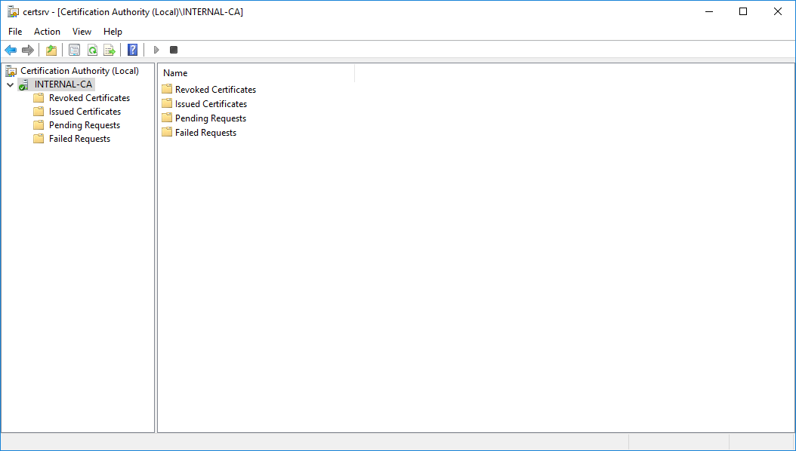

   certsrv – Microsoft Certification Authority Main Page

Right click your CA >> All Tasks >> Submit new request

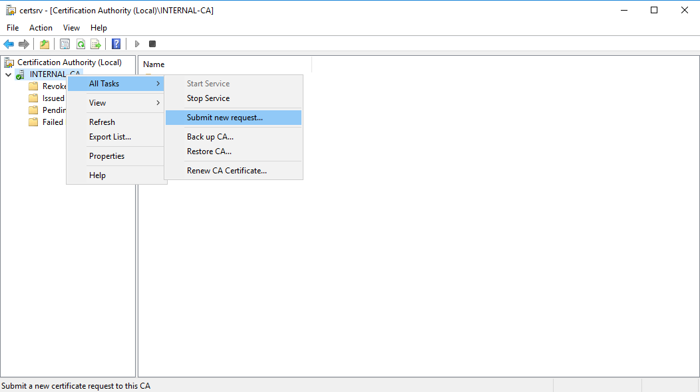

   certsrv – Submit new request 

Locate and open the signing request file we've saved in previous steps

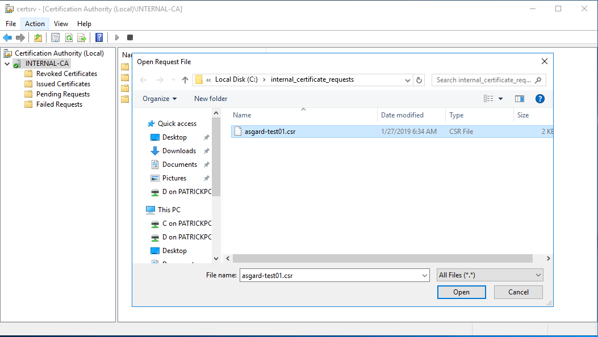

   certsrv – Locate the CSR to be signed

Navigate to the "Pending Requests" within your CA snap-in and right
click the imported CSR >> All Tasks >> Issue

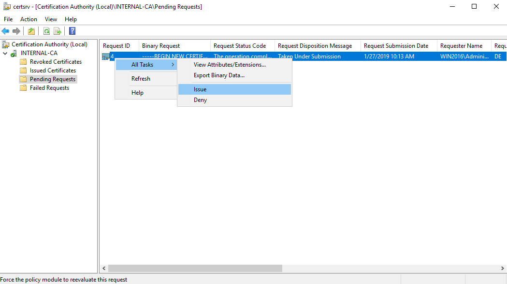

   certsrv – Issue the certificate

Once the certificate has been issued, it will be located under "Issued Certificates"

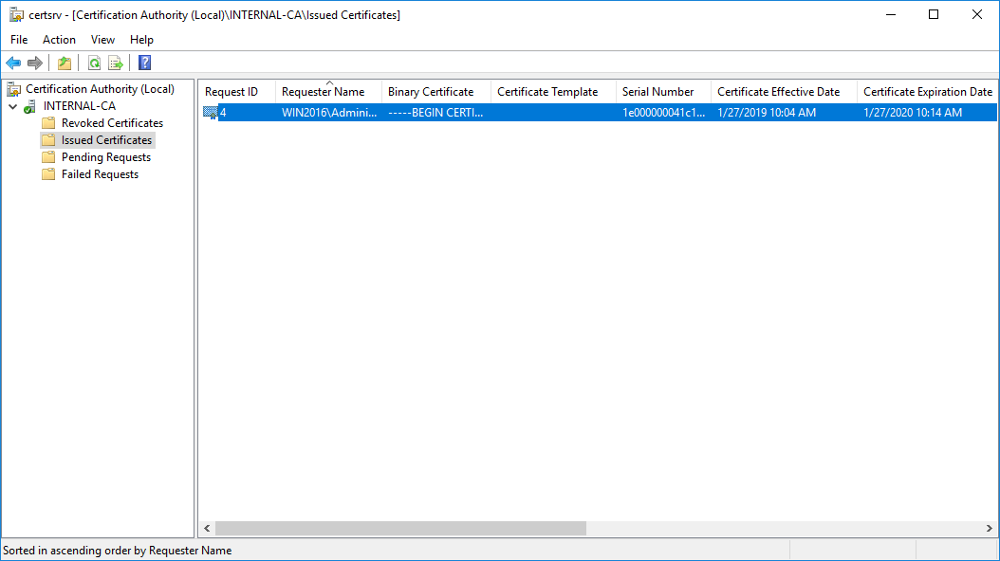

   certsrv – Locate issued certificate

Right click on the issued certificate and click open

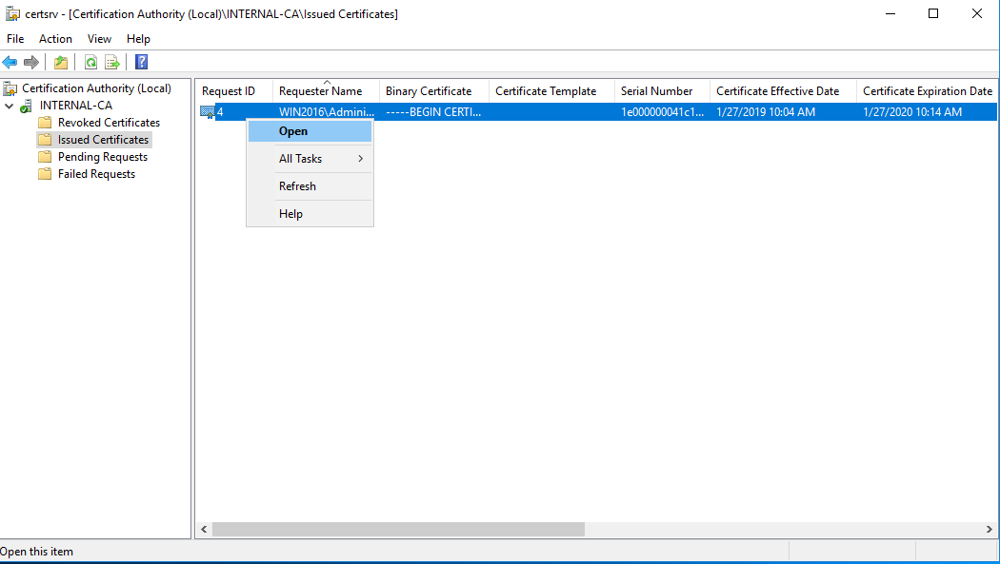

   certsrv – Export certificate

Inspect the information of the Certificate and continue to the next step, if the presented data is correct.

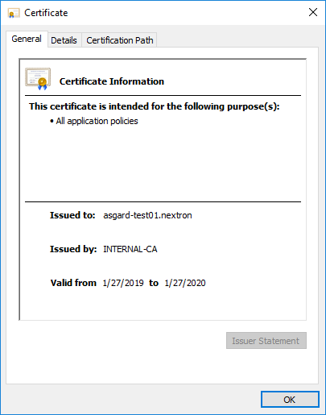

   certsrv – Export certificate

Check that the generated certificate has a status of OK

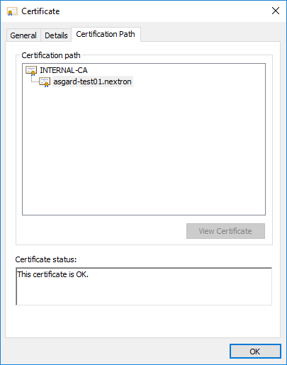

   certsrv – Export certificate

Navigate to the Details tab and click "Copy to File…"

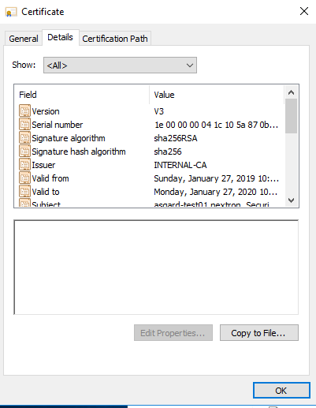

   certsrv – Export certificate

On the Certificate Export Wizard – click Next 

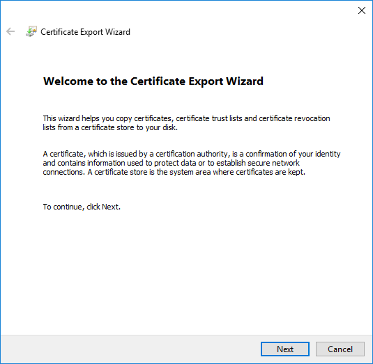

   certsrv – Export certificate

Select Base-64 encoded X.509(.CER) and click Next

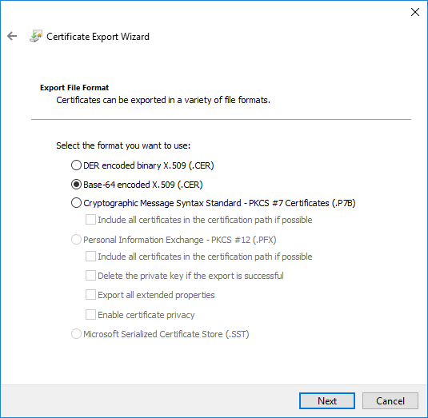

   certsrv – Export certificate

Choose an output location and click Next

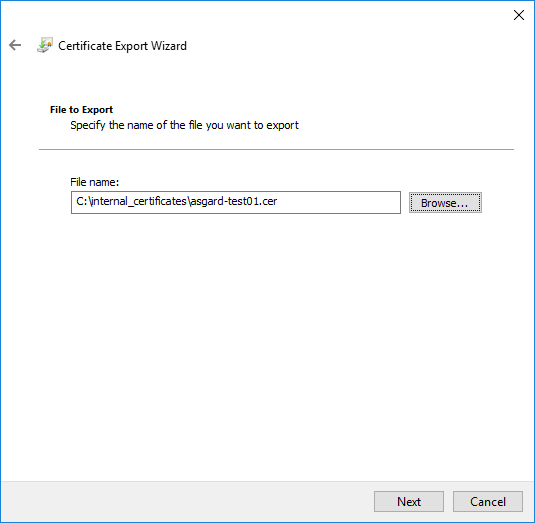

   certsrv – Export certificate

Click Finish - Once the confirmation message box pops up, click OK

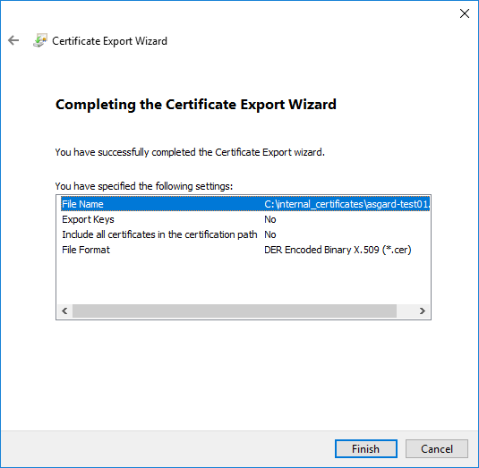

   certsrv – Export certificate

Navigate to Settings >> TLS.

On the bottom of the page click ``Upload TLS Certificate`` and select the
exported certificate from the previous step.

.. figure:: ../images/upload-tls-certificate.png
   :alt: ASGARD Certificate Import

   ASGARD Certificate Import

If all steps were followed, a message box should pop up indicating
that the certificate was successfully installed.

Navigate to Settings >> Services and restart the ``ASGARD 2 Service`` by clicking ``Restart`` button.
                                
.. figure:: ../images/asgard-service-restart.png
   :alt: ASGARD service restart

   ASGARD service restart

Please take into consideration that it could take a few minutes until the ASGARD Service is restarted successfully.

After the service has been successfully restarted, the installed certificate is shown in the browser.

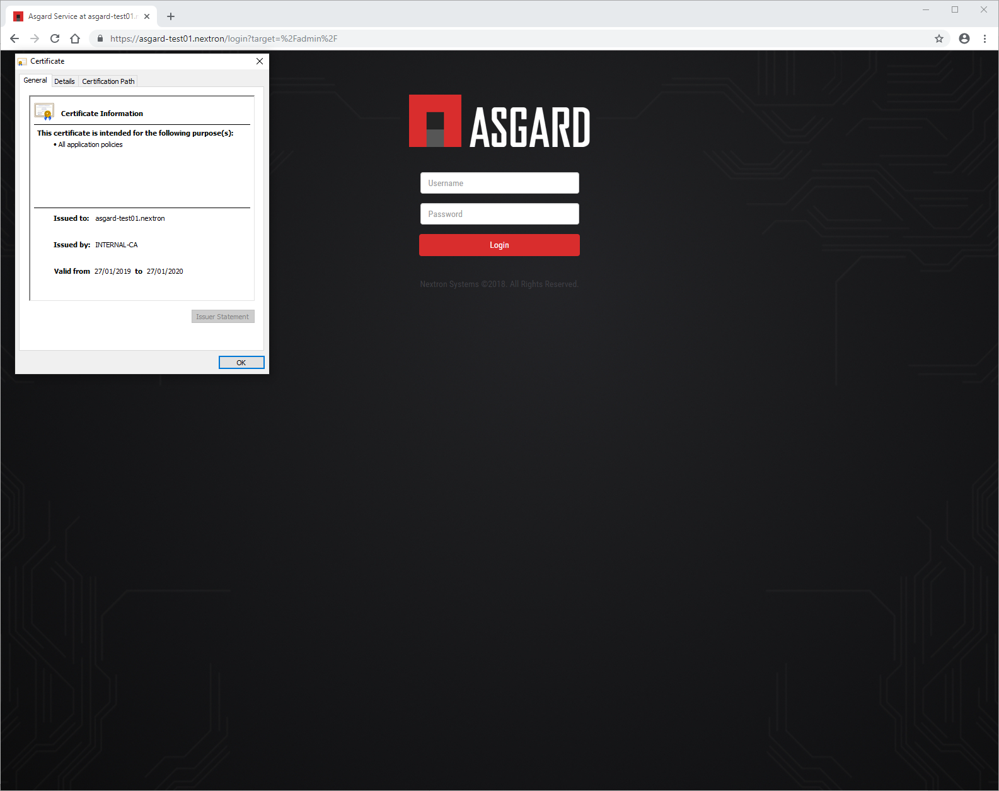

   ASGARD certificate installation check

Use Case 2 - CSR Signing with an OpenSSL Based CA
^^^^^^^^^^^^^^^^^^^^^^^^^^^^^^^^^^^^^^^^^^^^^^^^^

.. warning:: 
   In order to avoid security warnings [1]_ on some browsers, the CA signing
   process needs to ensure to copy all Subject Alternative Name (SAN) from the CSR to the signed Certificate.

.. [1]
   These security warnings are a result of an incomplete signing process,
   where requested attributes from the CSR are not included in the signed certificates
   (subjectAltName).

There are two ways of doing this while singing the CSR via openssl. 

**The first method** of including all extensions from the CSR to the new certificate,
is via the ``openssl.cnf`` file, by uncommenting the ``copy_extensions`` attribute.

The location of the ``openssl.cnf`` file depends on your system. On our test system, this
file was located at ``/etc/pki/tls/openssl.cnf``.

.. warning:: 
   Please make sure to comment the line out again once you are done with singing
   your CSR.

Example:

.. code-block:: none
   :lineno-start: 80
   :linenos:
   :emphasize-lines: 27

   ####################################################################
    [ CA_default ]

    dir             = ./demoCA                # Where everything is kept
    certs           = $dir/certs              # Where the issued certs are kept
    crl_dir         = $dir/crl                # Where the issued crl are kept
    database        = $dir/index.txt          # database index file.
    #unique_subject = no                      # Set to 'no' to allow creation of
                                              # several certs with same subject.
    new_certs_dir   = $dir/newcerts           # default place for new certs.

    certificate     = $dir/cacert.pem         # The CA certificate
    serial          = $dir/serial             # The current serial number
    crlnumber       = $dir/crlnumber          # the current crl number
                                              # must be commented out to leave a V1 CRL
    crl             = $dir/crl.pem            # The current CRL
    private_key     = $dir/private/cakey.pem  # The private key

    x509_extensions = usr_cert                # The extensions to add to the cert

    # Comment out the following two lines for the "traditional"
    # (and highly broken) format.
    name_opt        = ca_default              # Subject Name options
    cert_opt        = ca_default              # Certificate field options

    # Extension copying option: use with caution.
    copy_extensions = copy

    [...]

**The second method** of including all extensions from the CSR to the new certificate,
is via an extension file (for example ``asgard-test01.ext``) containing all your subjectAltName entries.
This tells openssl to use a extension for signing the CSR. In our case the extension contains a list of
``subjectAltName`` values.

To do this, place a file with your subjectAltName entries in the same folder of your CSR. The contents of this file
look something like the following example. Values after ``subjectAltName =`` should be equal to the
values of your CSR:

.. code-block:: console

   root@ca:~# cat asgard-test01.ext
   subjectAltName = DNS:asgard-test01.nextron, IP Address:172.28.28.101

The content should be identical to the values you set in your CSR. You can
inspect those with the following command:

.. code-block:: console
   :emphasize-lines: 17

   root@ca:~# openssl req -in asgard-test01.csr -noout -text                                                                                                                [31/146]
   Certificate Request:                                                                                                                                                                          
    Data:                                                                                                                                                                                     
        Version: 1 (0x0)                                                                                                                                                                      
        Subject: C = DE, ST = Hesse, O = Nextron, OU = Security IT, CN = asgard-test01.nextron                                                                                                                                            
        Subject Public Key Info:                                                                                                                                                              
            Public Key Algorithm: rsaEncryption                                                                                                                                               
                Public-Key: (4096 bit)                                                                                                                                                        
                Modulus:                                                                                                                                                                      
                    00:cb:74:c9:ed:4e:4d:db:39:7b:e0:dc:bb:55:d6:                                                                                                                             
                    [...]
                    c2:9f:69
                Exponent: 65537 (0x10001)
        Attributes:
            Requested Extensions:
                X509v3 Subject Alternative Name: 
                    DNS:asgard-test01.nextron, IP Address:172.28.28.101

Prepare the CA certificate, CA private key and the certificate signing request (and optionally your extension
file, if you chose method 2).

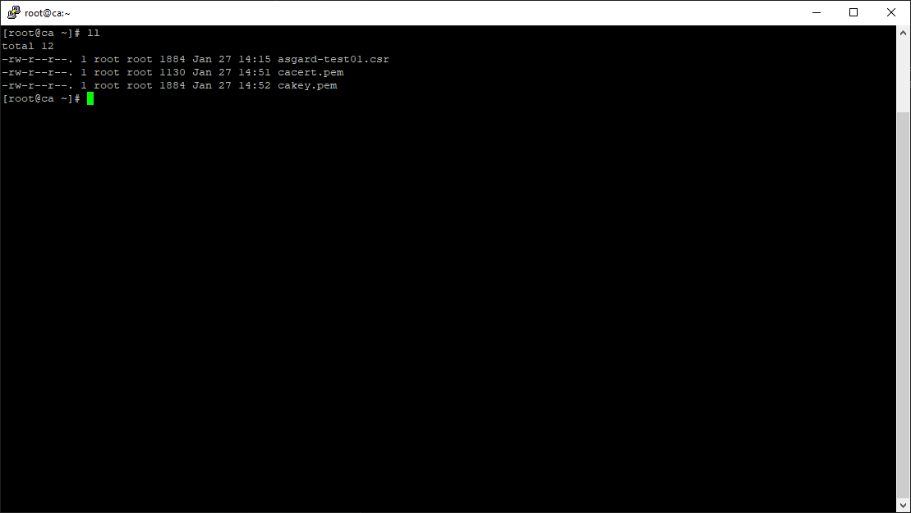

   CSR and signing Certificates preparation

Execute/adapt the following command depending on the method you chose before:

**First method**:

.. code-block:: console

   root@ca:~# openssl ca -cert cacert.pem -keyfile cakey.pem -in asgard-test01.csr -out asgard-test01.crt -days 3650
   Using configuration from /etc/pki/tls/openssl.conf
   Enter pass phrase for cakey.pem:

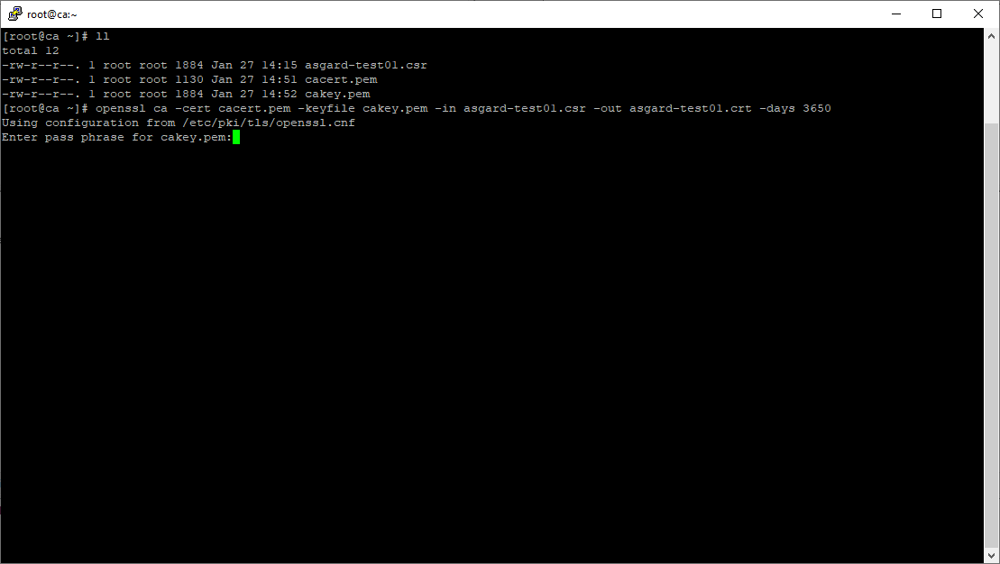

   Certificate signing command

**Second method**:

.. code-block:: console
   :emphasize-lines: 19

   root@ca:~# openssl ca -cert cacert.pem -keyfile cakey.pem -in asgard-test01.csr -out asgard-test01.crt -days 3650 -extfile asgard-test01.ext
   Using configuration from /etc/pki/tls/openssl.conf
   Enter pass phrase for cakey.pem:
   Check that the request matches the signature
   Signature ok
   Certificate Details:
           Serial Number: 1 (0x1)
           Validity
               Not Before: Feb 23 09:58:10 2023 GMT
               Not After : Feb 20 09:58:10 2033 GMT
           Subject:
               countryName               = DE
               stateOrProvinceName       = Hesse
               organizationName          = Nextron
               organizationalUnitName    = Security IT
               commonName                = asgard-test01.nextron
           X509v3 extensions:
               X509v3 Subject Alternative Name: 
                   DNS:asgard-test01.nextron IP Address:172.28.28.101
   Certificate is to be certified until Feb 20 09:58:10 2033 GMT (3650 days)

Enter the passphrase for your CA's private key

   Signing procedure

Confirm that the data contained in the CSR is accurate and confirm the signing of the request to the CA.

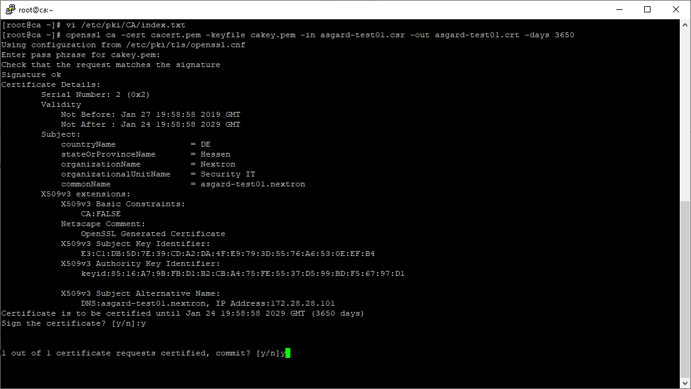

   Signing procedure – Checking data is accurate

Once confirmed commit the changes to your local DB.

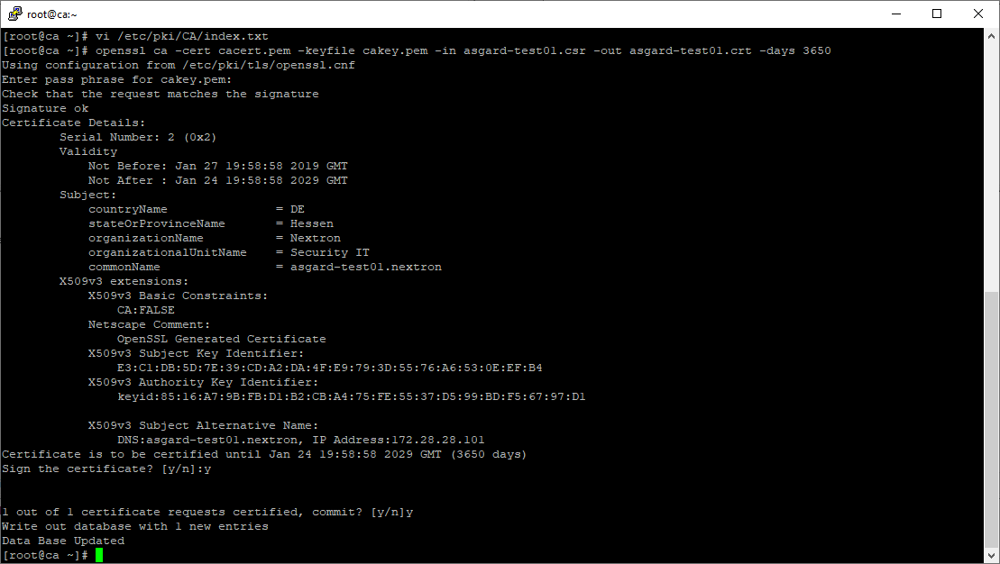

   Signing procedure – Committing changes

As a result, the signed certificate will be available with the indicated filename.

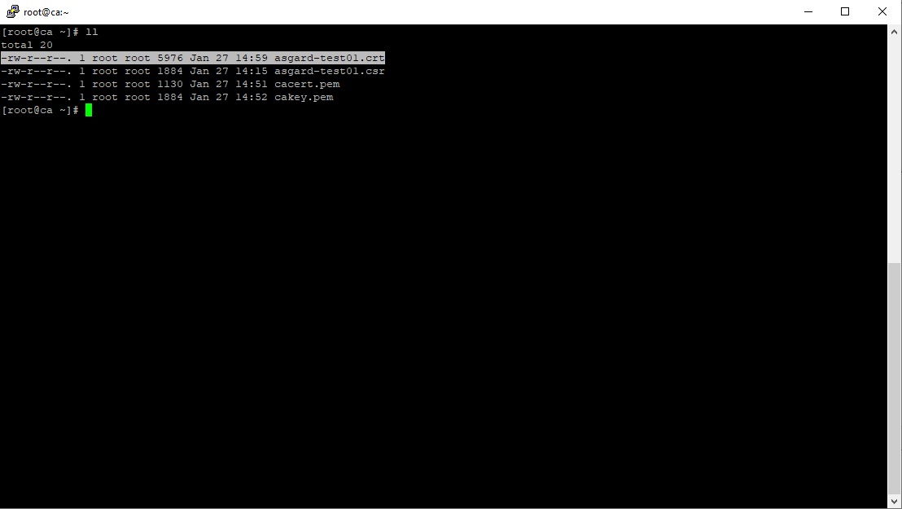

   Signing procedure – Locating the generated certificate

As a last step, the generated certificate can be imported
following the :ref:`usage/administration:tls certificate installation` steps.

Agent Migration from ASGARD v1 to v2
------------------------------------

This document will guide customers with an existing ASGARD
version 1.x to perform an agent migration to ASGARD version 2.x.

The new release of ASGARD Management Center brings not only
a redesigned interface, but also major changes in the architecture
and usability, making it faster, more robust and easier to use.

Prerequisites
^^^^^^^^^^^^^

You need to prepare some data prior to starting the migration.

Account Data and Network Access
~~~~~~~~~~~~~~~~~~~~~~~~~~~~~~~

Ensure you have access and credentials to the following systems, as well as connectivity as follows:

* **ASGARD Management Center version 1**
   * Administrative Web User
   * Credentials for the ssh user: bsk
* **ASGARD Management Center version 2**
   * Administrative Web User
   * Credentials for the ssh user: nextron
* **Connectivity between ASGARD 1 and ASGARD 2**
   * Required only if new agents are transferred via SCP
* **Client/Server System(s) connected to ASGARD v1 needs connectivity to ASGARD v2**
* **Access to a new update server**
   * update1.nextron-systems.com
   * update2.nextron-systems.com
   * update3.nextron-systems.com

For a detailed and up to date list of our update and
licensing servers, please visit https://www.nextron-systems.com/hosts/.

Migration
^^^^^^^^^

Identify the agents you want to migrate and perform the following actions on each of the them.

Identify the system to be migrated
~~~~~~~~~~~~~~~~~~~~~~~~~~~~~~~~~~

Connect to your ASGARD Management Center version 1.x and identify the system you plan to migrate.

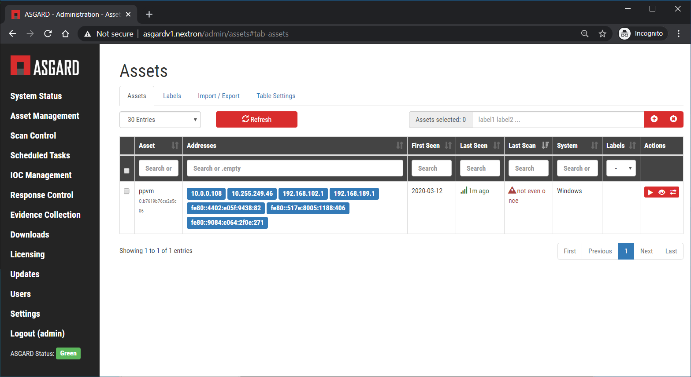

   Overview of Assets

Transfer the new ASGARD Windows agent to the ASGARD version 1.x Server
~~~~~~~~~~~~~~~~~~~~~~~~~~~~~~~~~~~~~~~~~~~~~~~~~~~~~~~~~~~~~~~~~~~~~~

Connect to your new ASGARD version 2.x server over SSH and transfer
the new windows agent to the old ASGARD version 1.x server.

This step will allow the old ASGARD version 1.x server to distribute the new agent.

.. note::
   In this step you require the password of your ASGARD version
   1.x and your ASGARD version 2.x

Connect to ASGARD version 2 over SSH
""""""""""""""""""""""""""""""""""""

.. code-block:: console

   user@unix:~$ ssh nextron@asgard-v2.domain
   nextron@asgard-v2.domain's password:  
   nextron@asgard-v2:~$

Copy the new agent(s) to ASGARD version 1.x
"""""""""""""""""""""""""""""""""""""""""""

You will find all new agents under ``/var/lib/nextron/asgard2/installer``\ ,
this example will cover a migration of a windows x64 system. Please see
the following chapters for Linux/macOS hosts.

.. code-block:: console

   nextron@asgard-v2:~$ sudo su -
   [sudo] password for nextron: 
   root@asgard-v2:~# cd /var/lib/nextron/asgard2/installer/
   root@asgard-v2:~# scp asgard2-agent-windows-amd64.exe bsk@asgard-v1.domain:
   bsk@asgard-v1.domain's password: 
   asgard2-agent-windows-amd64.exe                                100% 8380KB 116.9MB/s   00:00
   root@asgard-v2:~# 

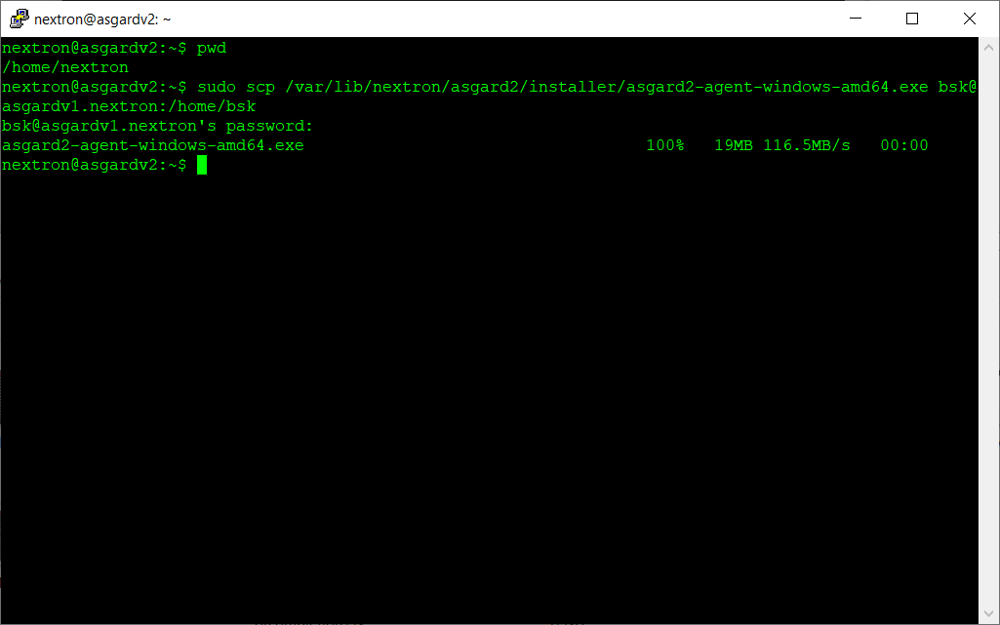

   New agent distribution to old ASGARD v1.x Server

Check that the new agent has been transferred to the old ASGARD version 1.x Server
""""""""""""""""""""""""""""""""""""""""""""""""""""""""""""""""""""""""""""""""""

.. code-block:: console

   user@unix:~$ ssh bsk@asgard-v1.domain
   bsk@asgard-v1.domain's password:  
   bsk@asgard-v1:~$ ls -l
   total 8380
   -r--r--r-- 1 bsk bsk 8580773 Feb 23 09:14 asgard2-agent-windows-amd64.exe
   bsk@asgard-v1:~$ chmod 744 asgard2-agent-windows-amd64.exe
   bsk@asgard-v1:~$ ls -l
   total 8380
   -rwxr--r-- 1 bsk bsk 8580773 Feb 23 09:14 asgard2-agent-windows-amd64.exe

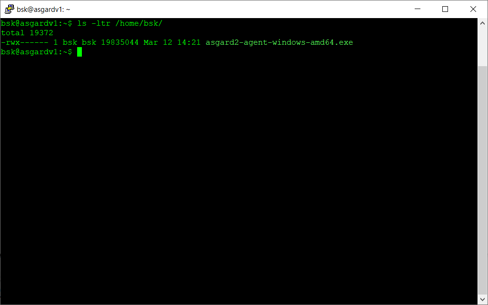

   Listing of agents on ASGARD version 1.x

.. _Sign the new agents:

Sign the new agents
"""""""""""""""""""

.. code-block:: console

   bsk@asgard-v1:~$ sudo grr_config_updater upload_exe --file asgard2-agent-windows-amd64.exe --dest_path aff4:/asgard-v1.domain/asgard2-agent-windows-amd64.exe --platform windows --arch amd64
   
Please modify the ``aff4:/`` part of the command above to reflect your hostname.

``aff4:/<your-host-fqdn>/asgard2-agent-windows-amd64.exe``

.. figure:: ../images/migrate4.png
   :alt: Signing of executable(s)

   Signing of executable(s)

.. note::
   Remember to save the ``--dest_path``. In our case it is ``aff4:/asgardv1.nextron/asgard2-agent-windows-amd64.exe``

Switch to Advanced Mode within GRR
""""""""""""""""""""""""""""""""""

Open your ASGARD version 1.x web interface and navigate to the
``Response Control`` view. You will be prompted for a username and password,
use the same login information as you use to log into ASGARD.

Once you reach the Response Control Section (GRR) please navigate
to the top right corner (settings gear) and switch to the
Advanced Mode. Apply the settings.

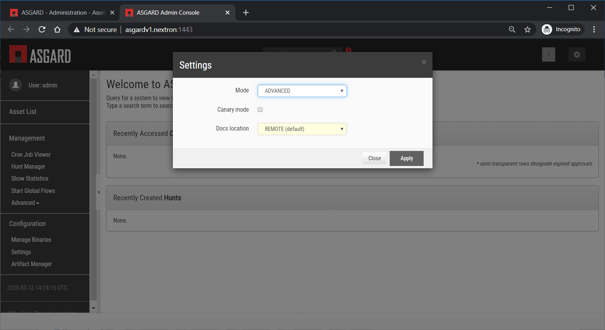

   GRR Advanced Mode

Asset Selection
"""""""""""""""

Navigate to the ``Asset List`` section on the left menu and select
the asset you want to migrate. A click on the asset will select it.

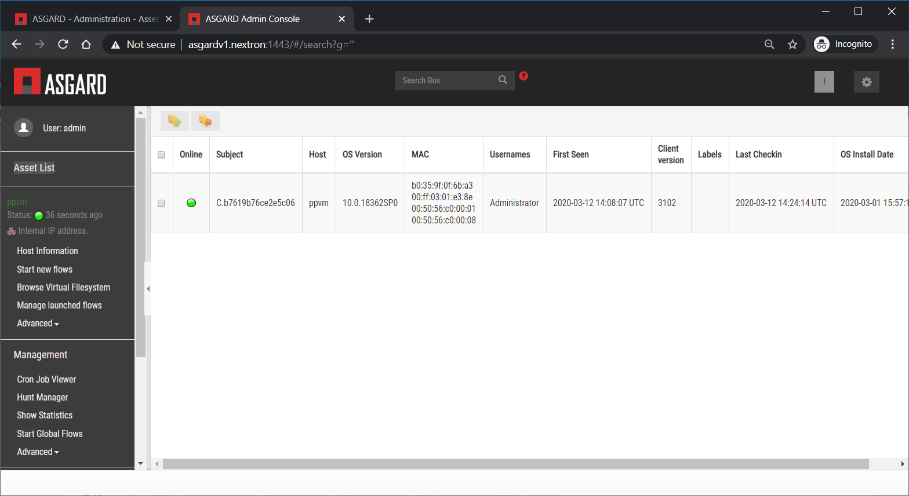

   Asset List view

Once the asset has been selected (clicking on it), navigate to the ``Start new flows`` section, located on the left menu.

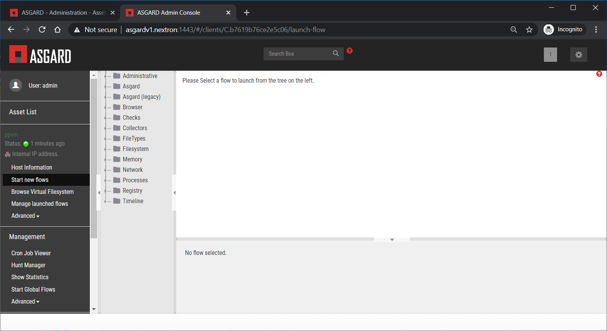

   Start new flow

Install the new ASGARD2 Agent
"""""""""""""""""""""""""""""

In order to install the new agent, we will need to expand
the ``Administrative`` folder and select ``Launch Binary``.

We will be requested to put in a binary, please use the
binary name we gathered/created in step 
:ref:`usage/appendix:Sign the new agents`
and click Launch.

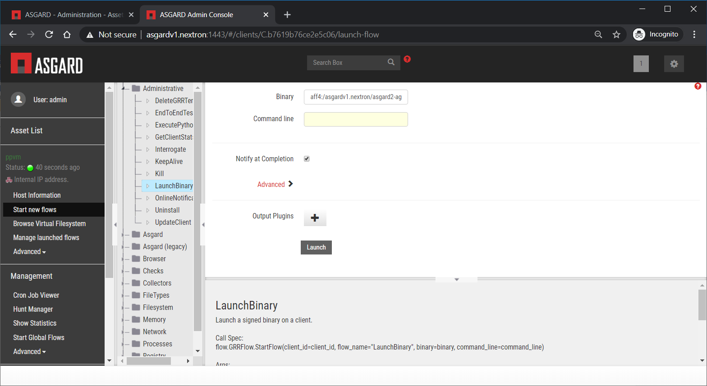

   Launch Binary

The used binary name was extracted from step :ref:`usage/appendix:Sign the new agents`.
In this example ``aff4:/asgardv1.nextron/asgard2-agent-windows-amd64.exe``

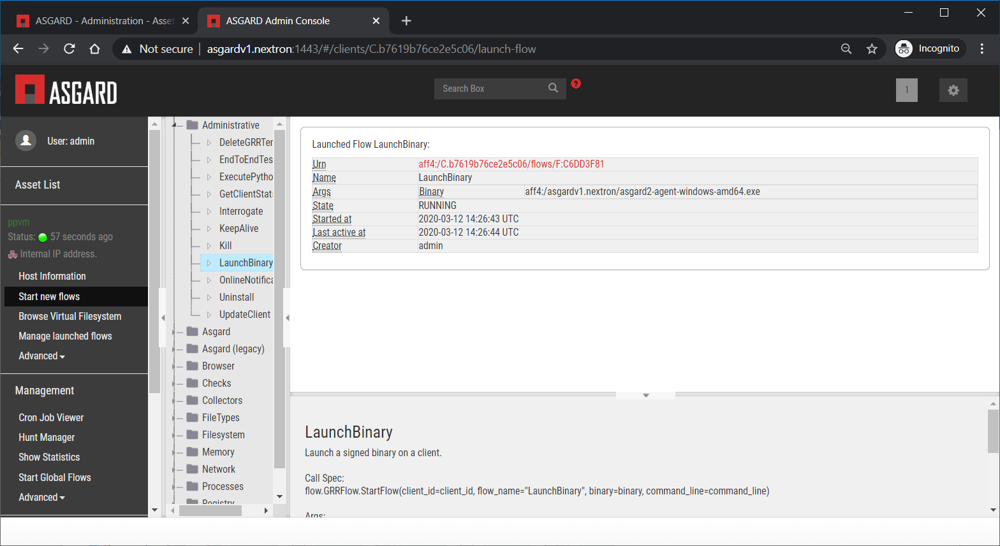

   Confirmation after launching the binary

After approximately 10 minutes, the binary will be executed and
installed on the selected system. The status can be retrieved by
navigating to the ``Manage launched flows`` section on the left menu.

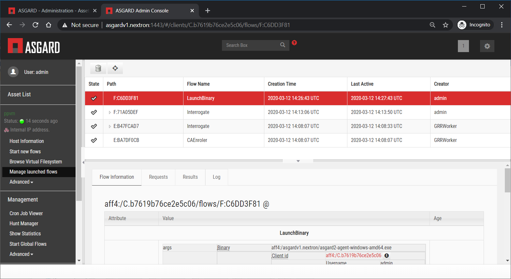

   Manage launched flows

Linux Hosts
"""""""""""

For migrating Linux hosts please create a shell script and follow the above procedure to deploy it.

An example shell script for Debian based systems could look like this:

.. code-block:: bash
   :linenos:

   #!/bin/bash
   cd /tmp
   wget -O agent-linux.deb --no-check-certificate https://asgardv2:8443/agent-installers?asgard2-agent-linux-amd64.deb
   dpkg -i /tmp/agent-linux.deb
   rm -f /tmp/agent-linux.deb

Save this script in your ASGARD v1.x and sign/upload it to GRR as
described in section :ref:`usage/appendix:Sign the new agents`
, afterwards you will be able to launch a HUNT to your connected Linux Systems. 

.. note:: 
   Please bear in mind that the above script will work only for
   Ubuntu/Debian systems and needs to be adapted for ``Redhat/CentOS systems``.

MacOS Hosts
"""""""""""

For migrating macOS hosts please create a shell script and follow the above procedure to deploy it.

An example shell script for macOS based systems could look like this:

.. code-block:: bash
   :linenos:

   #!/bin/bash
   cd /tmp
   curl -o agent-darwin.pkg -k "https://asgardv2.bsk:8443/agent-installers?asgard2-agent-macos-amd64.pkg"
   sudo installer -pkg /tmp/agent-darwin.pkg -target /
   rm -f /tmp/agent-darwin.pkg

Save this script in your ASGARDv1 and sign/upload it to GRR as
described in section :ref:`usage/appendix:Sign the new agents`,
afterwards you will be able to launch a HUNT to your connected ``macOS Systems``. 

Migration check and completion
^^^^^^^^^^^^^^^^^^^^^^^^^^^^^^

After the above steps have been executed, the agent should be
reporting to the new ASGARD version 2.x server.

At this moment the system will have 2 agents installed, the
agent reporting to ASGARD version 1.x and the agent reporting
to ASGARD version 2.x

Accept the agent request
~~~~~~~~~~~~~~~~~~~~~~~~

Once a new agent is reporting to ASGARD version 2.x it will
automatically create a request to be part of the same. We need
to accept that request.

Log into ASGARD version 2.x and navigate to the Asset Management – Requests.

.. figure:: ../images/asset-management-requests.png
   :alt: Asset Management (Requests)

   Asset Management (Requests)

Select the migrated system and click on the top right on Accept.
This should place the system in the ``Assets`` tab.

.. figure:: ../images/asset-management-assets-view.png
   :alt: Asset Management (Assets View)

   Asset Management (Assets View)

Frequently Asked Questions
^^^^^^^^^^^^^^^^^^^^^^^^^^

This section will cover frequent questions regarding the migration.

Will there be any problem running both agents (v1, v2) at the same time?
~~~~~~~~~~~~~~~~~~~~~~~~~~~~~~~~~~~~~~~~~~~~~~~~~~~~~~~~~~~~~~~~~~~~~~~~

There are no known issues running both agents at the same time.
The new ASGARD v2 agent is more lightweight and has better performance.
The expected RAM utilization in idle mode demonstrated in our tests puts
the new agent in a very good position, consuming only 1 MB.

Will I need more resources for my new ASGARD v2 server?
~~~~~~~~~~~~~~~~~~~~~~~~~~~~~~~~~~~~~~~~~~~~~~~~~~~~~~~

Please refer to :ref:`usage/requirements:hardware requirements` for specific sizing.
The overall tests performed highlight that both, server and agents, have better
performance, which will allow more agents to be  management per ASGARD (compared to version 1).

Can I import my memory dumps and file collections made on ASGARD v1?
~~~~~~~~~~~~~~~~~~~~~~~~~~~~~~~~~~~~~~~~~~~~~~~~~~~~~~~~~~~~~~~~~~~~

Unfortunately, importing memory dumps and/or file collections made on ASGARD v1 is not possible.

ASGARD Agent macOS Notarization
-------------------------------

Introduction
^^^^^^^^^^^^

Starting with macOS Big Sur (v11.0), Apple requires software developers
to notarize applications.

Due to the nature of the ``asgard2-agent`` installer, which is generated on
installation time, thus making it unique for each new installation, it's
currently not possible to notarize the installer.

This document aims to describe possible workarounds intended to be a
reference for IT Administrators or IT packaging teams to bypass Apple
verifications and install the personalized asgard2-agents on their macOS
Big Sur workstations.

Considerations
^^^^^^^^^^^^^^

Executing any of the workarounds described in this document puts your
system at risk for a short period of time. This document will deactivate
global security mechanisms of the operating system, which intended to protect
the integrity of the system.

Please always keep in mind to check your systems after performing any of
the described actions to ensure that all security mechanisms are in
place and are re-activated after performing the described actions.

Install asgard2-agent Using the Command-Line
^^^^^^^^^^^^^^^^^^^^^^^^^^^^^^^^^^^^^^^^^^^^

This section describes the installation of the asgard2-agent using the command line

1. Download the asgard2-agent from the ASGARD Management Center Agent
   Download page for macOS (.pkg extension). This page can be located
   under the following URL:
   
   * :samp:`https://<ASGARD-FQDN>:8443/agent-installers`

2. Open a new terminal session

3. Deactivate macOS (Gatekeeper)

   * ``sudo spctl --master-disable``

4. Close the terminal and open a new terminal session

5. Install asgard2-agent

   * ``sudo installer -pkg /path/to/asgard2-agent-macos-amd64.pkg -target /``

6. Close the terminal and open a new terminal session

7. Reactivate macOS Gatekeeper

   * ``sudo spctl --master-enable``

.. warning:: 
   Make sure to activate the macOS Gatekeeper once you are done:

   ``sudo spctl --master-enable``

Optional: Check the State of the Gatekeeper Protection
~~~~~~~~~~~~~~~~~~~~~~~~~~~~~~~~~~~~~~~~~~~~~~~~~~~~~~

You can verify the state of the macOS Gatekeeper with:

.. code-block:: console

   MacBook-Pro:~ nextron$ spctl --status
   assessments enabled

On a system with activated Gatekeeper, the output has to be ``assessments enabled``.
